# 1. DevOps

A hands-on DevOps course.

A reveal.js presention written to accompany this course can found at [https://nemonik.github.io/hands-on-DevOps/](https://nemonik.github.io/hands-on-DevOps/).

This course will
- Discuss DevOps,
- Have you spin up a DevOps toolchain and development environment, and then
- Author two applications and their accompanying pipelines, the first a continuous integration (CI) and the second a continuous delivery (CD) pipeline.

We will be spending most of the course hands-on working with the tools and in the Unix command line making methods and repeated practices of DevOps happen, so as to grow an understanding of how DevOps actually works.

Don't fixate on the tools used, nor the apps we develop in the course of learning how and why.  How and why is far more important.  This course like DevOps is not about tools although we'll be using them. You'll spend far more time writing code.  (Or at least cutting-and-pasting code.) 

# 2. Author

- Michael Joseph Walsh [mjwalsh@mitre.org](mailto:mjwalsh@mitre.org), [walsh@nemonik.com](mailto:walsh@nemonik.com)

# 3. Thank you to

- Walter Hiranpat for running through course material prior to me teaching it.
- Eric McCann for assisting Walter and I work through Vagrant install issues on Microsoft Windows.
- My first class participants for "beta" testing my class.
- Jonathan Thomas for TA'ing my second class.
- David Trang for TA'ing my third and fourth class.
- Walter Hiranpat and David Trang for prepping the MITRE Institute classroom for my 8th class.
- Rony Xavier and Aaron Lippold for assiting me mature the InSpec section.

# 4. Copyright and license

See the License file at the root of the project.

# 5. Prerequisites

The following skills would be useful in following along, but aren't strictly necessary.

What you should bring:

- Managing Linux or Unix-like systems as we will living largely within the terminal.
- A basic understanding of Vagrant, Docker, and Ansible would be helpful.
- But mostly being a software engineer.

# 6. Table of contents

<!-- TOC -->

- [1. DevOps](#1-devops)
- [2. Author](#2-author)
- [3. Thank you to](#3-thank-you-to)
- [4. Copyright and license](#4-copyright-and-license)
- [5. Prerequisites](#5-prerequisites)
- [6. Table of contents](#6-table-of-contents)
- [7. DevOps unpacked](#7-devops-unpacked)
    - [7.1. What is DevOps?](#71-what-is-devops)
    - [7.2. What DevOps is not](#72-what-devops-is-not)
    - [7.3. DevOps is really about](#73-devops-is-really-about)
    - [7.4. How is it related to the Agile?](#74-how-is-it-related-to-the-agile)
    - [7.5. How do they differ?](#75-how-do-they-differ)
    - [7.6. Why?](#76-why)
    - [7.7. What are the principles of DevOps?](#77-what-are-the-principles-of-devops)
    - [7.8. How is this achieved?](#78-how-is-this-achieved)
    - [7.9. What is Continuous Integration (CI)?](#79-what-is-continuous-integration-ci)
    - [7.10. How?](#710-how)
    - [7.11. CI best practices](#711-ci-best-practices)
        - [7.11.1. Utilize a Configuration Management System](#7111-utilize-a-configuration-management-system)
        - [7.11.2. Automate the build](#7112-automate-the-build)
        - [7.11.3. Employ one or more CI services/orchestrators](#7113-employ-one-or-more-ci-servicesorchestrators)
        - [7.11.4. Make builds self-testing](#7114-make-builds-self-testing)
        - [7.11.5. Never commit broken](#7115-never-commit-broken)
        - [7.11.6. Developers are expected to pre-flight new code](#7116-developers-are-expected-to-pre-flight-new-code)
        - [7.11.7. The CI service/orchestrator provides feedback](#7117-the-ci-serviceorchestrator-provides-feedback)
    - [7.12. What is Continuous Delivery?](#712-what-is-continuous-delivery)
        - [7.12.1. Extending Continuous Integration (CI)](#7121-extending-continuous-integration-ci)
        - [7.12.2. Consistency](#7122-consistency)
    - [7.13. But wait. What's a pipeline?](#713-but-wait-whats-a-pipeline)
    - [7.14. How is a pipeline manifested?](#714-how-is-a-pipeline-manifested)
    - [7.15. What underlines all of this?](#715-what-underlines-all-of-this)
    - [7.16. But really why do we automate err. code?](#716-but-really-why-do-we-automate-err-code)
        - [7.16.1. Why do I mention Larry Wall?](#7161-why-do-i-mention-larry-wall)
        - [7.16.2. Laziness](#7162-laziness)
        - [7.16.3. Impatience](#7163-impatience)
        - [7.16.4. Hubris](#7164-hubris)
        - [7.16.5. We automate for](#7165-we-automate-for)
    - [7.17. Monitoring](#717-monitoring)
        - [7.17.1. The most important metric](#7171-the-most-important-metric)
        - [7.17.2. An understanding of performance](#7172-an-understanding-of-performance)
        - [7.17.3. Establish a baseline performance](#7173-establish-a-baseline-performance)
        - [7.17.4. Set reaction thresholds](#7174-set-reaction-thresholds)
        - [7.17.5. Reacting](#7175-reacting)
        - [7.17.6. Gaps in CI/CD](#7176-gaps-in-cicd)
        - [7.17.7. Eliminating waste](#7177-eliminating-waste)
    - [7.18. What is DevOps culture?](#718-what-is-devops-culture)
        - [7.18.1. We were taught the requisite skills as children](#7181-we-were-taught-the-requisite-skills-as-children)
        - [7.18.2. Maintaining relationships is your most important skill](#7182-maintaining-relationships-is-your-most-important-skill)
        - [7.18.3. Be quick... Be slow to...](#7183-be-quick-be-slow-to)
        - [7.18.4. The pressures of social media](#7184-the-pressures-of-social-media)
    - [7.19. Crawl, walk, run](#719-crawl-walk-run)
        - [7.19.1. Ultimately, DevOps is Goal](#7191-ultimately-devops-is-goal)
- [8. Reading list](#8-reading-list)
- [9. Now the hands-on part](#9-now-the-hands-on-part)
    - [9.1. Configuring environmental variables](#91-configuring-environmental-variables)
    - [9.2. VirtualBox](#92-virtualbox)
        - [9.2.1. Installing VirtualBox](#921-installing-virtualbox)
    - [9.3. Git Bash](#93-git-bash)
        - [9.3.1. Installing Git Bash](#931-installing-git-bash)
    - [9.4. Retrieve the course material](#94-retrieve-the-course-material)
    - [9.5. Infrastructure as code (IaC)](#95-infrastructure-as-code-iac)
        - [9.5.1. Vagrant](#951-vagrant)
            - [9.5.1.1. Vagrant documentation and source](#9511-vagrant-documentation-and-source)
            - [9.5.1.2. Installing Vagrant](#9512-installing-vagrant)
            - [9.5.1.3. Installing Vagrant plugins](#9513-installing-vagrant-plugins)
            - [9.5.1.4. The Vagrantfile explained](#9514-the-vagrantfile-explained)
                - [9.5.1.4.1. Modelines](#95141-modelines)
                - [9.5.1.4.2. Setting Software version for Ansible roles](#95142-setting-software-version-for-ansible-roles)
                - [9.5.1.4.3. Inserting Proxy setting via host environmental variables](#95143-inserting-proxy-setting-via-host-environmental-variables)
                - [9.5.1.4.4. Inserting enterprise CA certificates](#95144-inserting-enterprise-ca-certificates)
                - [9.5.1.4.5. Configuring the cache plugin to speed things along](#95145-configuring-the-cache-plugin-to-speed-things-along)
                - [9.5.1.4.6. Configuring the disksize plugin to increase the disk size](#95146-configuring-the-disksize-plugin-to-increase-the-disk-size)
                - [9.5.1.4.7. Requiring _vagrant-vbquest_ for Windows](#95147-requiring-_vagrant-vbquest_-for-windows)
                - [9.5.1.4.8. Configuring the *development* vagrant](#95148-configuring-the-development-vagrant)
                - [9.5.1.4.9. Configuring the *toolchain* vagrant](#95149-configuring-the-toolchain-vagrant)
        - [9.5.2. Ansible](#952-ansible)
            - [9.5.2.1. Inventory file](#9521-inventory-file)
            - [9.5.2.2. Playbooks](#9522-playbooks)
            - [9.5.2.3. Roles](#9523-roles)
    - [9.6. Docker image and containers](#96-docker-image-and-containers)
    - [9.7. Docker-compose](#97-docker-compose)
    - [9.8. Spinning up the _toolchain_ vagrant](#98-spinning-up-the-_toolchain_-vagrant)
        - [9.8.1. Taiga, an example of Agile project management software](#981-taiga-an-example-of-agile-project-management-software)
            - [9.8.1.1. Documentation, source, container image](#9811-documentation-source-container-image)
            - [9.8.1.2. URL, Username and password](#9812-url-username-and-password)
        - [9.8.2. GitLab CE, an example of configuration management software](#982-gitlab-ce-an-example-of-configuration-management-software)
            - [9.8.2.1. Documentation, source, container image](#9821-documentation-source-container-image)
            - [9.8.2.2. URL, Username and password](#9822-url-username-and-password)
            - [9.8.2.3. Allow requests to the local network from hooks and services](#9823-allow-requests-to-the-local-network-from-hooks-and-services)
            - [9.8.2.4. Do not default to Auto DevOps pipeline for all projects](#9824-do-not-default-to-auto-devops-pipeline-for-all-projects)
        - [9.8.3. Drone CI, an example of CI/CD orchestrator](#983-drone-ci-an-example-of-cicd-orchestrator)
            - [9.8.3.1. Documentation, source, container image](#9831-documentation-source-container-image)
            - [9.8.3.2. URL, Username and password](#9832-url-username-and-password)
        - [9.8.4. Once the *toolchain* vagrant is up](#984-once-the-toolchain-vagrant-is-up)
            - [9.8.4.1. Integrate GitLab with the PlantUML-Server](#9841-integrate-gitlab-with-the-plantuml-server)
            - [9.8.4.2. Integrate Drone CI with GitLab](#9842-integrate-drone-ci-with-gitlab)
            - [9.8.4.3. Optionally, add the *hands-on-DevOps* repository to the `toolchain`'s GitLab](#9843-optionally-add-the-hands-on-devops-repository-to-the-toolchains-gitlab)
        - [9.8.5. SonarQube, an example of a platform for the inspection of code quality](#985-sonarqube-an-example-of-a-platform-for-the-inspection-of-code-quality)
            - [9.8.5.1. Documentation, source, container image](#9851-documentation-source-container-image)
            - [9.8.5.2. URL, Username and password](#9852-url-username-and-password)
    - [9.9. Spin up the _development_ vagrant](#99-spin-up-the-_development_-vagrant)
    - [9.10. Golang _helloworld_ project](#910-golang-_helloworld_-project)
        - [9.10.1. Create the project's backlog](#9101-create-the-projects-backlog)
        - [9.10.2. Create the project in GitLab](#9102-create-the-project-in-gitlab)
        - [9.10.3. Setup the project on the _development_ Vagrant](#9103-setup-the-project-on-the-_development_-vagrant)
        - [9.10.4. Author the application](#9104-author-the-application)
        - [9.10.5. Align source code with Go coding standards](#9105-align-source-code-with-go-coding-standards)
        - [9.10.6. Lint your code](#9106-lint-your-code)
        - [9.10.7. Build the application](#9107-build-the-application)
        - [9.10.8. Run your application](#9108-run-your-application)
        - [9.10.9. Author the unit tests](#9109-author-the-unit-tests)
        - [9.10.10. Automated the build (i.e., write the Makefile)](#91010-automated-the-build-ie-write-the-makefile)
        - [9.10.11. Author Drone-based Continuous Integration](#91011-author-drone-based-continuous-integration)
            - [9.10.11.1. Configure Drone to execute your pipeline](#910111-configure-drone-to-execute-your-pipeline)
            - [9.10.11.2. Trigger the build](#910112-trigger-the-build)
        - [9.10.12. The completed source for *helloworld*](#91012-the-completed-source-for-helloworld)
    - [9.11. Golang *helloworld-web* project](#911-golang-helloworld-web-project)
        - [9.11.1. Create the project's backlog](#9111-create-the-projects-backlog)
        - [9.11.2. Create the project in GitLab](#9112-create-the-project-in-gitlab)
        - [9.11.3. Setup the project on the _development_ Vagrant](#9113-setup-the-project-on-the-_development_-vagrant)
        - [9.11.4. Author the application](#9114-author-the-application)
        - [9.11.5. Build and run the application](#9115-build-and-run-the-application)
        - [9.11.6. Run gometalinter.v2 on application](#9116-run-gometalinterv2-on-application)
        - [9.11.7. Fix the application](#9117-fix-the-application)
        - [9.11.8. Author unit tests](#9118-author-unit-tests)
        - [9.11.9. Perform static analysis (i.e., sonar-scanner) on the command line](#9119-perform-static-analysis-ie-sonar-scanner-on-the-command-line)
            - [9.11.9.1. Optionally, register your app in SonarQube](#91191-optionally-register-your-app-in-sonarqube)
            - [9.11.9.2. Install the SonarGo plugin](#91192-install-the-sonargo-plugin)
            - [9.11.9.3. Perform static analysis (run *sonar-scanner*) on the command line](#91193-perform-static-analysis-run-sonar-scanner-on-the-command-line)
        - [9.11.10. Automated the build (i.e., write the Makefile)](#91110-automated-the-build-ie-write-the-makefile)
        - [9.11.11. Dockerize the application](#91111-dockerize-the-application)
        - [9.11.12. Run the Docker container](#91112-run-the-docker-container)
            - [9.11.12.1. Option 1](#911121-option-1)
            - [9.11.12.2. Option 2](#911122-option-2)
        - [9.11.13. Push the container image to the private Docker registry](#91113-push-the-container-image-to-the-private-docker-registry)
        - [9.11.14. Configure Drone to execute your CI/CD pipeline](#91114-configure-drone-to-execute-your-cicd-pipeline)
        - [9.11.15. Add Static Analysis (*SonarQube*) step to pipeline](#91115-add-static-analysis-sonarqube-step-to-pipeline)
        - [9.11.16. Add the build step to the pipeline](#91116-add-the-build-step-to-the-pipeline)
        - [9.11.17. Add container image publish step to pipeline](#91117-add-container-image-publish-step-to-pipeline)
        - [9.11.18. Add container deploy step to pipeline](#91118-add-container-deploy-step-to-pipeline)
        - [9.11.19. Add complaince and policy automation (InSpec) test to the pipeline](#91119-add-complaince-and-policy-automation-inspec-test-to-the-pipeline)
            - [9.11.19.1. First author an InSpec test](#911191-first-author-an-inspec-test)
            - [9.11.19.2. Execute your test](#911192-execute-your-test)
            - [9.11.19.3. The results](#911193-the-results)
            - [9.11.19.4. Add InSpec to the pipeline](#911194-add-inspec-to-the-pipeline)
            - [9.11.19.5. Viewing the results in Heimdall-lite](#911195-viewing-the-results-in-heimdall-lite)
        - [9.11.20. Add automated funtional test to pipeline](#91120-add-automated-funtional-test-to-pipeline)
            - [9.11.20.1. Run the *helloworld-web* application](#911201-run-the-helloworld-web-application)
            - [9.11.20.2. Pull and run Selenium Firefox Standalone](#911202-pull-and-run-selenium-firefox-standalone)
            - [9.11.20.3. Create our test automation](#911203-create-our-test-automation)
            - [9.11.20.4. Add a *selenium* step to the pipeline](#911204-add-a-selenium-step-to-the-pipeline)
        - [9.11.21. Add DAST step (*OWASP ZAP*) to pipeline](#91121-add-dast-step-owasp-zap-to-pipeline)
        - [9.11.22. All the source for *helloworld-web*](#91122-all-the-source-for-helloworld-web)
    - [9.12. Microservices](#912-microservices)
        - [9.12.1. What's cloud-native?](#9121-whats-cloud-native)
            - [9.12.1.1. So, let's experiment with our little "microservice"](#91211-so-lets-experiment-with-our-little-microservice)
    - [9.13. Using what you've learned](#913-using-what-youve-learned)
    - [9.14. Shoo away your vagrants](#914-shoo-away-your-vagrants)
    - [9.15. That's it](#915-thats-it)

<!-- /TOC -->

# 7. DevOps unpacked

## 7.1. What is DevOps?

DevOps (a clipped compound of the words "development" and "operations") is a software development methodology with an emphasis on a more reliable release pipeline, automation, and stronger collaboration across all stakeholders with the goal of deploying working functionality into the hands of users (i.e., production) faster.

Yeah, that's the formal definition.  I've grown to prefer the axiom:

*You are what you **code**.*

For example,

1.  If you're a developer or software engineer, you're at least **coding** the application, its build automation, unit tests, and CI/CD (the combined practices of Continuouse Integrarion and Continuous Delivery) automation.
2.  If a tester, you're ***coding*** typically the functional test automation.
3.  If a security engineer, you're ***coding*** the compliance and policy test automation.
4.  If ops, you're ***coding*** the deployment and infrastructure configuration management automation.

And since all these disciplines are ***coding***, they're essentially using the same methods and repeated practices to ensure they're producing good code.  

And they're all collectively doing all this coding left in the delivery pipeline, collaborating and from this springs forth culture.

## 7.2. What DevOps is not

DevOps is not entirely about tools.

Or as I like to put it, "Its not about the tools."

DevOps will also not entirely stop all bugs nor all vulnerabilities from making it into production, but that's not really the point.


<sub>There are countless vendors out there, who want to sell you their crummy tool.</sub>

## 7.3. DevOps is really about

Providing the culture and delivery/release pipeline that once a bug or vulnerability is discovered, the concern can to be quickly remediated and functionality returned back to the user.

## 7.4. How is it related to the Agile?

Agile Software Development is an umbrella term for a set of methods and practices based on the [values](http://www.agilealliance.org/agile101/the-agile-manifesto/) and [principles](http://www.agilealliance.org/agile101/12-principles-behind-the-agile-manifesto/) expressed in the Agile Manifesto.

Agile Software Development shares the same goal, but DevOps extends Agile methods and practices by adding communication and collaboration between

  - development,
  - quality assurance, and
  - technology operations
  - to ensure software systems are delivered in a rapid, reliable, low-risk manner.

For Agile, solutions evolve through collaboration between self-organizing, cross-functional teams utilizing the appropriate practices for their context.

Again, in DevOps everyone is developing software, so it is my view DevOps builds on Agile.

## 7.5. How do they differ?

While Agile Software Development encourages collaboration between cross-functional teams, the focus in DevOps is on the

- inclusion of analysis,
- design,
- development, and
- quality assurance functionaries as stakeholders into the development effort.

## 7.6. Why?

In Agile Software Development, there is rarely an integration of these individuals outside the immediate application development team with members of technology operations (e.g., network engineers administrators, testers, cyber security engineers.)

## 7.7. What are the principles of DevOps?

As DevOps matures, several principles have emerged, namely the necessity for product teams to:

- Apply holistic thinking to solve problems,
- Develop and test against production-like environments,
- Deploy with repeatable, and reliable processes,
- Remove the drudgery through automation,
- Validate and monitor operational quality, and
- Provide rapid, automated feedback to the stakeholders

## 7.8. How is this achieved?

Achieved through the repeated practices of Continuous Integration (CI) and Continuous Delivery (CD) often conflated into simply "CI/CD".

After tools, this is what is commonly (albeit mistakenly) thought to be the totality of DevOps.

## 7.9. What is Continuous Integration (CI)?

It is a repeated Agile software development practice, lifted specifically from Extreme programming, where members of a development team frequently integrate their work in order to detect integration issues as quickly as possible thereby shifting discovery of issues "left" (i.e., early) in the software release.

## 7.10. How?

Each integration is orchestrated through a CI service/orchestrator (e.g., Jenkins CI, Drone CI, GitLab Runners, Concourse CI) that essentially assembles a build, runs unit and integration tests every time a predetermined trigger has been met; and then reports with immediate feedback.

## 7.11. CI best practices

### 7.11.1. Utilize a Configuration Management System

For the software's source code, where the mainline (i.e., master branch) is the most the most recent working version, past releases held in branches, and new features not yet merged into the mainline branch being worked on their own branches.

### 7.11.2. Automate the build

By accompanying build automation (e.g., Gradle, Apache Maven, Make) alongside the source code.

### 7.11.3. Employ one or more CI services/orchestrators

Perform source code analysis via automate formal code inspection and assessment.

### 7.11.4. Make builds self-testing

In other words, ingrain testing by including unit and integration tests (e.g., Spock, JUnit, Mockito, SOAPUI, go package *Testing*) with the source code so as to be executed by the build automation to be execute by the CI service.

### 7.11.5. Never commit broken

Or untested source code to the CMS mainline or otherwise risk breaking a build.

### 7.11.6. Developers are expected to pre-flight new code

Prior to committing source code in their own workspace.

### 7.11.7. The CI service/orchestrator provides feedback

On the success or fail of a build integration to all its stakeholders.

## 7.12. What is Continuous Delivery?

It is a repeated software development practice of providing a rapid, reliable, low-risk product delivery achieved through automating all facets of building, testing, and deploying software.

### 7.12.1. Extending Continuous Integration (CI)

With additional stages/steps aimed to provide ongoing validation that a newly assembled software build meets all desired requirements and thereby is releasable.

### 7.12.2. Consistency

Is achieved through delivering applications into production via individual repeatable pipelines of ingrained system configuration management and testing

## 7.13. But wait. What's a pipeline?

A pipeline automates the various stages/steps (e.g., Static Application Security Testing (SAST), build, unit testing, Dynamic Application Security Testing (DAST), secure configuration acceptance compliance, integration, function and non-functional testing, delivery, and deployment) to enforce quality conformance.

## 7.14. How is a pipeline manifested?

Each delivery pipeline is manifested as **Pipeline as Code** (i.e., software automation) accompanying software's source code in its version control repository.

## 7.15. What underlines all of this?

I'd argue, _a ubiquitous access to shared pools of configurable system resources and higher-level services that can be rapidly provisioned with minimal management effort_ without the repeated practices of DevOps will struggle.  Although, it is possible to DevOps on mainframes.

## 7.16. But really why do we automate err. code?

In 2001, I think Larry Wall in his 1st edition of *Programming Perl* book put it best with "We will encourage you to develop the three great virtues of a programmer:

laziness,

impatience, and

hubris."

The second edition of the same book provided definitions for these terms

### 7.16.1. Why do I mention Larry Wall?

Well...

> _Once you have established yourself as an icon in your field 
> it is important that you pay tribute  to some of the great legends that came before you. 
> This kind of gesture will create the illusion that you’re still humble 
> and serve as a preemptive strike against anyone who has noticed 
> what a callus and delusional ass you have become._
>
> The opening monolog to the Blue Man Group’s _I Feel Love_
> https://www.youtube.com/watch?v=8vBKI3ya-l0

I kid, but in all serious the sentimanet of this seminal book still holds true.

Let me explain.

### 7.16.2. Laziness

_The quality that makes you go to great effort to reduce overall energy expenditure. It makes you write labor-saving programs that other people will find useful, and document what you wrote so you don't have to answer so many questions about it. Hence, the first great virtue of a programmer._ (p.609)

### 7.16.3. Impatience

_The anger you feel when the computer is being lazy. This makes you write programs that don't just react to your needs, but actually anticipate them. Or at least pretend to. Hence, the second great virtue of a programmer._ (p.608)

### 7.16.4. Hubris

_Excessive pride, the sort of thing Zeus zaps you for. Also, the quality that makes you write (and maintain) programs that other people won't want to say bad things about. Hence, the third great virtue of a programmer._ (p.607)

### 7.16.5. We automate for

- Faster, coordinated, repeatable, and therefore more reliable deployments.
- Discover bugs sooner. Shifting their discovery left in the process.
- To accelerates the feedback loop between Dev and Ops.
- Reduce tribal knowledge, where one group or person holds the keys to how things get done. Yep, this is about making us all replaceable.
- Reduce shadow IT (i.e., hardware or software within an enterprise that is not supported by IT. Just waiting for its day to explode.)

## 7.17. Monitoring

Once deployed, the work is done, right?

A development team's work is not complete once a product leaves CI/CD and enters production; especially, under DevOps where the development teams include members of operations.

### 7.17.1. The most important metric

Is working software is the _primary_, but not the only, measure of progress.  The key to successful DevOps is knowing how well the methodology and the software it produces are performing.

### 7.17.2. An understanding of performance

Is achieved by collecting and analyzing data produced by environments used for CI/CD and production.

### 7.17.3. Establish a baseline performance

So, that improvements can be gauged and anomalies detected.

### 7.17.4. Set reaction thresholds

To formulate and prioritize reactions weighting factors, such as, the frequency at which an anomaly arises and who is impacted.

### 7.17.5. Reacting

A reaction could be as simple as operations instructing users through training to not do something that triggers the anomaly, or more ideally, result in an issue being entered into the product's backlog culminating in the development team delivering a fix into production.

### 7.17.6. Gaps in CI/CD

Monitoring will also inform development teams of gaps in CI/CD resulting in additional testing for the issue that triggered the necessity for the improvement.

### 7.17.7. Eliminating waste

Further, monitoring may result in the re-scoping of requirements, re-prioritizing of a backlog, or the deprecation of un-used features.

## 7.18. What is DevOps culture?

> **culture** noun  \ *ˈkəl-chər* \
> the set of shared attitudes, values, goals, and practices that characterizes an institution or
> organization

Now that everyone is a coder using the same tools, methods and repeated practices for their particular discipline you have the foundations of a ***culture***.

### 7.18.1. We were taught the requisite skills as children


### 7.18.2. Maintaining relationships is your most important skill


### 7.18.3. Be quick... Be slow to... 


### 7.18.4. The pressures of social media


## 7.19. Crawl, walk, run

### 7.19.1. Ultimately, DevOps is Goal

- With DevOps one does not simply hit the ground running.
- One must first crawl, walk and then ultimately run as you embrace the necessary culture change, methods and repeated practices.
- Collaboration and automation are expected continually improve so to achieve more frequent and more reliable releases.

# 8. Reading list

**AntiPatterns: Refactoring Software, Architectures, and Projects in Crisis**
William J. Brown, Raphael C. Malveau, Hays W. "Skip" McCormick,  and Thomas J. Mowbray
ISBN: 978-0-471-19713-3
Apr 1998

**Continuous Delivery: Reliable Software Releases through Build, Test, and Deployment Automation (Addison-Wesley Signature Series (Fowler))**
David Farley and Jez Humble
ISBN-13: 978-0321601919
August 2010

**The DevOps Handbook: How to Create World-Class Agility, Reliability, and Security in Technology Organizations**
Gene Kim Jez Humble,  Patrick Debois, and John Willis
ISBN-13: 978-1942788003
October 2016

**Accelerate: The Science of Lean Software and DevOps: Building and Scaling High Performing Technology Organizations**
Nicole Forsgren PhD, Jez Humble, and Gene Kim
ISBN-13: 978-1942788331
March 27, 2018

**Site Reliability Engineering: How Google Runs Production Systems 1st Edition**
Betsy Beyer, Chris Jones, Jennifer Petoff, and Niall Richard Murphy
ISBN-13: 978-1491929124
April 16, 2016
Also, available online at https://landing.google.com/sre/book/index.html

**Release It!: Design and Deploy Production-Ready Software 2nd Edition**
Michael T. Nygard
ISBN-13: 978-1680502398
January 18, 2018

**The SPEED of TRUST: The One Thing That Changes Everything**
Stephen M .R. Covey
ISBN-13: 978-1416549000
February 5, 2008
The gist of the book can be found at SlideShare https://www.slideshare.net/nileshchamoli/the-speed-of-trust-13205957

**How to Deal With Difficult People**
Ujjwal Sinha
Oct 25, 2014
The SlideShare can be found here https://www.slideshare.net/abhiujjwal/how-2-deal-wid-diiclt-ppl

# 9. Now the hands-on part

In this class you will spin up the following developent and toolchain environment.

**NOTE**
- If your web-based Git-repository manager is paired with a PlantUML server you will see a diagram rendered below otherwise you will only the PlantUML source code for the diagram. Don't worry the course's Ansible automation will spin up both a GitLab and PlantUML.
- This class makes use of **NOTE** sections to call out things that are important to know or will drop a few tidbits.  Reading these notes may save you some aggrevation.

```plantuml
@startuml
skinparam shadowing false

skinparam actor {
        BorderColor #0B5C92
        BackgroundColor none
        FontName "Yanone Kaffeesatz"
        FontStyle "Thin"
        FontSize 18
}

skinparam node {
        BorderColor #0B5C92
        BackgroundColor #ffffff
        FontName "Yanone Kaffeesatz"
        FontStyle "Thin"
        FontSize 15
}

skinparam rectangle {
        roundCorner 25
        BorderColor #0B5C92
        BackgroundColor #ffffff
        FontName "Yanone Kaffeesatz"
        FontStyle "Thin"
        FontSize 15
}

skinparam component {
        BorderColor #0B5C92
        BackgroundColor #e0e59a
        FontName "Yanone Kaffeesatz"
        FontStyle "Thin"
        FontSize 15
}


skinparam note {
        BorderColor #0B5C92
        BackgroundColor #FEFECE
        FontName "Yanone Kaffeesatz"
        FontStyle "Thin"
        FontSize 15
}

skinparam database {
        BorderColor #0B5C92
        BackgroundColor #e0e59a
        FontName "Yanone Kaffeesatz"
        FontStyle "Thin"
        FontSize 15
}

actor "You" as you

rectangle "Host"{
    
	rectangle "Toolchain Vagrant" {

		rectangle "Docker CE" as docker1 {
			rectangle "Taiga" {
				component "nemonik/taiga:4.0.0" as taiga
        component "sameersbn/postgresql:9.6-4" as taiga_postgresql
			}

			rectangle "GitLab" {
				component "nemonik/gitlab:11.5.1"" as gitlab
        component "sameersbn/postgresql:10" as gitlab_postgresql
        component "redis:4.0.9-1" as gitlab_redis
			}

			rectangle "Drone CI" {
        component "drone/server:0.8.9" as drone_server
        component "drone/agent:0.8.9" as drone_agent
        component "sameersbn/postgresql:9.6-4" as drone_postgresql
			}

			rectangle "SonarQube" {
				component "sonarqube:7.1" as sonarqube
			}
        
			rectangle "PlantUML Server" {
				component "plantuml/plantuml-server:latest" as plantuml_server
			}
    }
	}

	rectangle "Development Vagrant" {
    rectangle "Docker CE" as docker2 {
      component "helloworld" as helloworld
      component "helloworld-web" as helloworld_web
    }
	}
}

taiga -[#0B5C92]-> taiga_postgresql

gitlab -[#0B5C92]-> gitlab_postgresql
gitlab -[#0B5C92]-> gitlab_redis

drone_server -[#0B5C92]-> drone_agent
drone_server -[#0B5C92]-> drone_postgresql

you .[#0B5C92].> sonarqube
you .[#0B5C92].> gitlab
you .[#0B5C92].> taiga
you .[#0B5C92].> plantuml_server
you .[#0B5C92].> drone_server

you .[#0B5C92].> helloworld
you .[#0B5C92].> helloworld_web
@enduml
```



## 9.1. Configuring environmental variables

**On Mac OS X or \*NIX environments**

Example settings (Adjust for your environment.) can be set by running the BASH script in the root of the project, `set_env.sh`:

```bash
#!/usr/bin/env bash

# Copyright (C) 2019 Michael Joseph Walsh - All Rights Reserved
# You may use, distribute and modify this code under the
# terms of the the license.
#
# You should have received a copy of the license with
# this file. If not, please email <mjwalsh@nemonik.com>

# run in shell via
#
# ```
# . ./set_env.sh
# ```

export PROXY=http://gatekeeper.mitre.org:80
export proxy=$PROXY
export https_proxy=$PROXY
export http_proxy=$PROXY
export HTTP_PROXY=$PROXY
export ALL_PROXY=$PROXY
export NO_PROXY="127.0.0.1,localhost,.mitre.org,.local,$(echo 192.168.0.{1..255} | sed 's/ /,/g')"
#,172.30.1.1"
export no_proxy=${NO_PROXY}

export CA_CERTIFICATES=https://raw.githubusercontent.com/nemonik/hands-on-DevOps/master/certs/MITRE%20BA%20NPE%20CA-3(1).crt,https://raw.githubusercontent.com/nemonik/hands-on-DevOps/master/certs/MITRE%20BA%20ROOT.crt

export VAGRANT_ALLOW_PLUGIN_SOURCE_ERRORS=0
```

Execute in terminal session via

```
. ./set_env.sh
```

The alternative is `unset.sh` bash script that unsets all these values:

```
#!/usr/bin/env bash

# Copyright (C) 2019 Michael Joseph Walsh - All Rights Reserved
# You may use, distribute and modify this code under the
# terms of the the license.
#
# You should have received a copy of the license with
# this file. If not, please email <mjwalsh@nemonik.com>

# run in shell via
#
# ```
# . ./unset.sh
# ```

unset no_proxy
unset NO_PROXY
unset ALL_PROXY
unset PROXY
unset proxy
unset https_proxy
unset http_proxy
unset HTTP_PROXY
unset ca_certificates
unset CA_CERTIFICATES
```

Execute in terminal session via

```
. ./unset.sh
``` 

**On Windows**

Example settings (Adjust for your environment.):

1. In the Windows taskbar, enter `edit the system environment variables` into `Search Windows` and select the icon with the corresponding name. 
3. The `Systems Property` window will likely open in the background, so you will likely need to go find it and bring it forward.
4. In the `Systems Property`'s `Advanced` tab select `Environment Variables...` button.
5. In `Environment Variables` windows that opens, under `User variables for...`press `New ...` to  open a `New User Variable` window, enter each `Variable Name` and and its respective `Value` for each pair in the table below

| Variable Name                      | Value                                                            |
| ---------------------------------- | ---------------------------------------------------------------- |
| proxy                              | http://gatekeeper.mitre.org:80                                   |
| http_proxy                         | http://gatekeeper.mitre.org:80                                   |
| https_proxy                        | http://gatekeeper.mitre.org:80                                   |
| no_proxy                           | 127.0.0.1,localhost,.mitre.org,.local,192.168.0.10,192.168.0.11  |
| CA_CERTIFICATES                    | http://employeeshare.mitre.org/m/mjwalsh/transfer/MITRE%20BA%20ROOT.crt,http://employeeshare.mitre.org/m/mjwalsh/transfer/MITRE%20BA%20NPE%20CA-3%281%29.crt |
| VAGRANT_ALLOW_PLUGIN_SOURCE_ERRORS | 0                                                                |

**NOTE**

- The certificate URLs need to be encoded for parentheses to work.
- One Windows, you may inadvertantly cut-and-paste blank space characters (e.g., tabs, spaces) and the subsequent Ansible automation may fail.

## 9.2. VirtualBox

VirtualBox is a general-purpose full virtualizer for x86 hardware, targeted at server, desktop and embedded use.

### 9.2.1. Installing VirtualBox

For the class, it is assumed VirtualBox is installed, but below are the instructions for installing it on Windows 10.

1. Open your browser to <https://www.virtualbox.org/wiki/Downloads>
2. Click `Windows hosts` link under `VirtualBox 5.2.22 platform packages`.
3. Find and click the installer to install.

Then turn for Windows 10 turn off Hyper-V

1. Click Windows `Start` and then type `turn Windows features on or off` into the search bar.
2. Select the icon with the corresponding name. 
3. This will open the `Windows Features` page and then unselect the `Hyper-V` checkbox if it is enabled and then click `Okay`.

The same site has the Mac OS X download. The install is less involved.

## 9.3. Git Bash

Is `git` packaged for Windows with bash (a command-line shell) and a collection of other, separate *NIX utilities, such as, `ssh`, `scp`, `cat`, `find` and others compiled for Windows.

### 9.3.1. Installing Git Bash

If you are on Windows or on a lab computer, you'll need to install `git`.

1. Download from https://git-scm.com/download/win

2. Click the installer.

3. Click `next` until you reach the `Configuring the line ending conversions` page select `Checkout as, commit Unix-style line endings`.

4. Then `next`, `next`, `next`...

5. Don't open git-bash from the final window as it will not have the environmental variables set.  Go onto step-6.

6. On the Windows task bar, enter `git` into `Search Windows` then select `Git Bash`.  Use `Git Bash` instead of `Command` or `Powershell`.

## 9.4. Retrieve the course material

If you are reading this on paper and have nothing else, you only have a small portion of the class material. You will need to download the class project containing all the automation to spin up a DevOps toolchain and development, etc.

In a shell, for the purposes of the class, this means in `Git Bash`, clone the project from [https://github.com/nemonik/hands-on-DevOps.git](https://github.com/nemonik/hands-on-DevOps.git) via git like so:

```
git -c http.sslVerify=false clone https://github.com/nemonik/hands-on-DevOps.git
```

Output will resemble:

```
$ git -c http.sslVerify=false clone https://github.com/nemonik/hands-on-DevOps.git
Cloning into 'hands-on-DevOps'...
remote: Counting objects: 1184, done.
remote: Compressing objects: 100% (203/203), done.
remote: Total 1184 (delta 207), reused 411 (delta 178)
Receiving objects: 100% (1184/1184), 235.51 MiB | 21.53 MiB/s, done.
Resolving deltas: 100% (480/480), done.
```

## 9.5. Infrastructure as code (IaC)

This class uses Infrastructure as code (IaC) to set up the class environment (i.e., two virtual machines that will later be referred to as "vagrants".) IaC is the process of provisioning, and configuring (i.e., managing) computr systems through code, rather than directly manipulating the systems by hand (i.e., manual processes). 

This class uses Vagrant and Ansible IaC framewoorks and the following sections will unpack each.

### 9.5.1. Vagrant

This class uses Vagrant, a command line utility for managing the lifecycle of virtual machines as a vagrant in that the VMs are not meant to hang around in the same place for long.

Unless you want to pollute your machine with every imaginable programming language, framework and library version you'll find yourself often creating a virtual machine (VM) for each software project. Sometimes more than one. And if you're like me of the past you'll end up with a VirtualBox full of VMs. If you haven't gone about this the right way, you'll end up wondering what VM went with which project and now how did I create it? The anti-pattern around this problem is to write documentation. A better way that aligns with  DevOps repeatable practices is to create automation to provision and configure your development VMs. This is where Vagrant comes in as it is "a command line utility for managing the lifecycle of virtual machines."

#### 9.5.1.1. Vagrant documentation and source

Vagrant's documentation can be found at

<https://www.vagrantup.com/docs/index.html>

It's canonical (i.e., authoritative) source can be found at

<https://github.com/hashicorp/vagrant/>

Vagrant is written in Ruby. In fact, a Vagrantfile is written in a Ruby DSL.

#### 9.5.1.2. Installing Vagrant

1. Download the latest Vagrant release  

   <https://www.vagrantup.com/downloads.html>  

   Version 2.2.2 is verified to work on Windows and Mac OS X.  

   <https://releases.hashicorp.com/vagrant/2.2.2/vagrant_2.2.2_x86_64.msi>

2. Click on the installer once downloaded and follow along. The installer may stall calculating for a bit on Windows and for this same OS may bury modals you'll need to respond to in the Windows Task bar, so keep an eye out for that. The installer will automatically add the `vagrant` command to your system path so that it is available on the command line. If it is not found, the documentation advises to try logging out and logging back into your system. This is particularly necessary sometimes for Windows.  Windows will require a reboot, so remember to **come back and complete step-3**.

3. On Windows, copy the `vagrant_files/cacert.pem` into `C:\Hashicorp\vagrant\embedded` or when on Mac OS X copy it to `/opt/vagrant/embedded`.  On Windows use the File Explorer to replace the existing `cacert.pem` file. The replacement has MITRE's certificates necessary for the SSL inspection hell.

#### 9.5.1.3. Installing Vagrant plugins

Vagrant plugins extend the functionality of Vagrant, and you'll need a few of them for this course.

In the command line (in `Git Bash`, if on Windows) on the host

```
vagrant plugin install vagrant-ca-certificates
vagrant plugin install vagrant-cachier
vagrant plugin install vagrant-disksize
vagrant plugin install vagrant-proxyconf
vagrant plugin install vagrant-vbguest
```

Verify with

```
vagrant plugin list
```

Resembles this

```
vagrant-ca-certificates (1.3.0, global)
vagrant-cachier (1.2.1, global)
vagrant-disksize (0.1.3, global)
vagrant-proxyconf (1.5.2, global)
vagrant-vbguest (0.16.0, global)
```

#### 9.5.1.4. The Vagrantfile explained

The `Vagrantfile` found at the root of the project describes how to provision and configure one or more virtual machines.

Vagrant's own documentation puts it best:

> Vagrant is meant to run with one Vagrantfile per project, and the Vagrantfile is 
> supposed to be committed to version control. This allows other developers involved
> in the project to check out the code, run vagrant up, and be on their way. 
> Vagrantfiles are portable across every platform Vagrant supports.

If we were instead provisioning production Virtual Machines we'd alternatively use [Terraform](https://www.terraform.io/), a tool for building, changing, and versioning infrastructure

The following sub sections enumerate the various sections of the  `Vagrantfile` broken apart in order to discuss.

##### 9.5.1.4.1. Modelines

```ruby
# -*- mode: ruby -*-
# vi: set ft=ruby :
```

When authoring, tells your text editor (e.g. emacs or vim) to choose a specific editing mode for the Vagrantfile. Line one is a [modeline for emacs](http://www.gnu.org/software/emacs/manual/html_node/emacs/Choosing-Modes.html) and line two is a [modeline for vim](http://vim.wikia.com/wiki/Modeline_magic).

##### 9.5.1.4.2. Setting Software version for Ansible roles

```ruby
# Holds the version of software for the Ansible roles to install
software_versions = {
  drone_version: "0.8.9",  
  drone_cli_version: "1.0.1",
  golang_version: "1.11.2",
  gitlab_version: "11.5.1",
  ispec_rpm_version: "3.0.61/el/7/inspec-3.0.61-1.el7.x86_64.rpm",
  inspec_version: "3.0.61",
  inspec_rpm_version: "2.2.61/el/7/inspec-2.2.61-1.el7.x86_64",
  python_version: "2.7.15",
  registry_version: "2.5.2",
  plantuml_server_version: "latest",
  sonarqube_version: "7.1", # 7.4-community is different enough i will need to look into in order to patch
  sonar_scanner_cli_version: "3.2.0.1227",
  selenium_standalone_chrome_version: "3.141.59",
  selenium_standalone_firefox_version: "3.141.59",
  taiga_version: "4.0.0",
  zap2docker_stable_version: "2.7.0"
}
```

Contains all the version numbers for the software installed by the Ansible roles found in `ansible/roles`.

##### 9.5.1.4.3. Inserting Proxy setting via host environmental variables

The proxy setting section above uses the `vagrant-proxyconf` plugin to set vagrants (i.e., managed VMs) to use specified proxies by using http_proxy and no_proxy environment variable.

```ruby
Vagrant.configure('2') do |config|

  # Set proxy settings for all vagrants
  # 
  # Depends on install of vagrant-proxyconf plugin.
  #
  # To use:
  #
  # 1.  Install `vagrant plugin install vagrant-proxyconf`
  # 2.  Set environmental variables for `http_proxy`, `https_proxy`, `ftp_proxy`, and `no_proxy`
  # 
  #     For example:
  #
  #     ```
  #     export http_proxy=
  #     export https_proxy=
  #     export ftp_proxy=
  #     export no_proxy=
  #     ```  
  if (ENV['http_proxy'] || ENV['https_proxy'])
    if Vagrant.has_plugin?('vagrant-proxyconf')
      config.proxy.http = ENV['http_proxy']
      config.proxy.https = ENV['https_proxy']
      config.proxy.ftp = ENV['ftp_proxy']
      config.proxy.no_proxy = ENV['no_proxy']
      config.proxy.enabled = true
      puts "HTTP Proxy variables set. http_proxy = #{ config.proxy.http },  https_proxy = #{ config.proxy.https },  ftp_proxy = #{  config.proxy.ftp  }, no_proxy = #{ config.proxy.no_proxy }"
    else
      raise "Missing vagrant-proxyconf plugin.  Install via: vagrant plugin install vagrant-proxyconf"
    end
  else
    puts "No http_proxy or https_proxy environment variables are set."
    config.proxy.http = nil
    config.proxy.https = nil
    config.proxy.ftp = nil
    config.proxy.no_proxy = nil   
    config.proxy.enabled = false
  end 
```

##### 9.5.1.4.4. Inserting enterprise CA certificates

```ruby
  # To add Enterprise CA Certificates to all vagrants
  #
  # Depends on the install of the vagrant-ca-certificates plugin
  #
  # To use:
  #
  # 1.  Install `vagrant plugin install vagrant-ca-certificates`.
  # 2.  Set environement variable for `CA_CERTIFICATES` containing a comma separated list of certificate URLs.
  #
  #     For example:
  #
  #     ```
  #     export CA_CERTIFICATES=http://employeeshare.mitre.org/m/mjwalsh/transfer/MITRE%20BA%20ROOT.crt,http://employeeshare.mitre.org/m/mjwalsh/transfer/MITRE%20BA%20NPE%20CA-3%281%29.crt
  #     ```
  #
  #     The Root certificate *must* be denotes as the root certificat like so:
  #
  #     http://employeeshare.mitre.org/m/mjwalsh/transfer/MITRE%20BA%20ROOT.crt
  #
  if ENV['CA_CERTIFICATES']
    if Vagrant.has_plugin?('vagrant-ca-certificates')
      puts "CA Certificates set to #{ ENV['CA_CERTIFICATES'] }"
      config.ca_certificates.enabled = true
      config.ca_certificates.certs = ENV['CA_CERTIFICATES'].split(',')
    else
      raise "Missing vagrant-ca-certificates plugin.  Install via: vagrant plugin install vagrant-ca-certificates"
    end
  else
    puts "No CA_CERTIFICATES environment variable set."
    config.ca_certificates.certs = nil
    config.ca_certificates.enabled = false
  end
```

This section uses `vagrant-ca-certificates` to as the plugin's documentation puts it _configures the virtual machine to inject the specified certificates into the guest's root bundle. This is useful, for example, if your enterprise network has a firewall (or appliance) which utilizes SSL interception._ So, we aren't the only ones that have to deal with the havoc SSL interception brings to development.

##### 9.5.1.4.5. Configuring the cache plugin to speed things along

```ruby
  if Vagrant.has_plugin?("vagrant-cachier")
    # Configure cached packages to be shared between instances of the same base box.
    # More info on http://fgrehm.viewdocs.io/vagrant-cachier/usage
    config.cache.scope = :box
  else
    raise "Missing vagrant-cachier plugin.  Install via: vagrant plugin install vagrant-cachier"
  end
```

##### 9.5.1.4.6. Configuring the disksize plugin to increase the disk size

```ruby
  if !Vagrant.has_plugin?("vagrant-disksize")
    raise "Missing vagrant-disksize plugin.  Install via: vagrant plugin install vagrant-disksize"
  end
```

This section uses the `vagrant-disksize` plugin to to resize disks in VirtualBox.

##### 9.5.1.4.7. Requiring _vagrant-vbquest_ for Windows

```ruby
  if Vagrant::Util::Platform.windows? and !Vagrant.has_plugin?('vagrant-vbguest') 
     raise "Missing vagrant-vbguest plugin.  Install via: vagrant plugin install vagrant-vbguest"
  end
```

`vagrant-vbguest` automatically installs the host's VirtualBox Guest Additions on the guest system. Not needed on Mac OS X, but needed on Windows.

##### 9.5.1.4.8. Configuring the *development* vagrant

```ruby
  ## Provision development vagrant
  config.vm.define "development", primary: true do |development|
    development.vm.box = "centos/7" 
    development.disksize.size = "80GB"
    development.vm.network "private_network", ip: "192.168.0.10"
    development.vm.network :forwarded_port, guest: 22, host: 2222, id: 'ssh'
    development.vm.hostname = "development"
    development.vm.synced_folder ".", "/vagrant", type: "virtualbox"
    development.vm.provider :virtualbox do |virtualbox|
      virtualbox.name = "DevOps Class - development"
      virtualbox.customize ["guestproperty", "set", :id, "/VirtualBox/GuestAdd/VBoxService/--timesync-set-threshold", 10]
      virtualbox.memory = 2048
      virtualbox.cpus = 2
      virtualbox.gui = false

      development_docker_disk = './development_docker.vdi'

      unless File.exist?(development_docker_disk)
        virtualbox.customize ['createmedium', '--filename', development_docker_disk, '--size', 100 * 1024]
      end

      # the value of storage_system_bus depends on your platform
      storage_system_bus = "IDE" 

      # Provisions a drive for Docker storage
      virtualbox.customize ['storageattach', :id, '--storagectl', storage_system_bus, '--port', 1, '--device', 0, '--type', 'hdd', '--medium', development_docker_disk]
    end

    config.vm.provision "ansible_local" do |ansible|
      ansible.playbook = "ansible/development-playbook.yml"
      ansible.inventory_path = "hosts"
      ansible.limit = "development"
      ansible.install_mode = :default
      ansible.compatibility_mode = "2.0"
      ansible.verbose = 'vvvv' # true (equivalent to v), vvv, vvvv

      # Pass top-level variables into Ansible from Vagrant
      ansible.extra_vars = software_versions

      if development.proxy.enabled
        ansible.extra_vars[:http_proxy] = config.proxy.http
        ansible.extra_vars[:https_proxy] = config.proxy.https
        ansible.extra_vars[:ftp_proxy] = config.proxy.ftp
        ansible.extra_vars[:no_proxy] = config.proxy.no_proxy
      end

      if development.ca_certificates.enabled
        ansible.extra_vars[:CA_CERTIFICATES] = config.ca_certificates.certs
      end
    end
  end  
```

This section provisions and configures a `development` vagrant used for development

- The `config.vm.provision` block uses `ansible_local` to configure the `development` vagrant. I've written Ansible roles under `ansible/roles` to automate the configuration of the vagrants.

  - `toolchain.vm.box` loads the vagrant with this `centos/7` vagrant base box.  Vagrant curates a listing of base boxes here https://app.vagrantup.com/boxes/search
  - `dev.vm.synced_folder` mounts the class's project folder to `/vagrant` path in the vagrant.
  -  The `dev.vm.provider` section tells the hypervisor how to configure the vagrant (i.e., how much memory, how many procesors)
- `ansible_local` does not require one to have Ansible installed on the host. Vagrant handles installing it on the vagrant and executing the specified playbook. 
  - In this instance, I have `ansible.verbose` jacked to its highest setting providing loads of `development` logging.  If too much information about what is going on unnerves you changing this to `false` will disable verbose logging.

##### 9.5.1.4.9. Configuring the *toolchain* vagrant

```ruby
  ## Provision the pipeline vagrant
  config.vm.define "toolchain", autostart: false do |toolchain|
    toolchain.vm.box = "centos/7" 
    toolchain.disksize.size = "80GB"
    toolchain.vm.network "private_network", ip: "192.168.0.11"  
    toolchain.vm.network :forwarded_port, guest: 22, host: 2223, id: 'ssh'
    toolchain.vm.hostname = "toolchain"
    toolchain.vm.synced_folder ".", "/vagrant", type: "virtualbox"
    toolchain.vm.provider :virtualbox do |virtualbox|
      virtualbox.name = "DevOps Class - toolchain"
      virtualbox.customize ["guestproperty", "set", :id, "/VirtualBox/GuestAdd/VBoxService/--timesync-set-threshold", 10]
      virtualbox.customize ["modifyvm", :id, "--clipboard", "bidirectional"]
      virtualbox.customize ["modifyvm", :id, "--draganddrop", "bidirectional"]
      virtualbox.memory = 4096
      virtualbox.cpus = 4
      virtualbox.gui = false  

      toolchain_docker_disk = './toolchain_docker.vdi'

      unless File.exist?(toolchain_docker_disk)
        virtualbox.customize ['createmedium', '--filename', toolchain_docker_disk, '--size', 100 * 1024]
      end

      # the value of storage_system_bus depends on your platform
      storage_system_bus = "IDE" 

      # Provisions a drive for Docker storage
      virtualbox.customize ['storageattach', :id, '--storagectl', storage_system_bus, '--port', 1, '--device', 0, '--type', 'hdd', '--medium', toolchain_docker_disk]
    end

    config.vm.provision "ansible_local" do |ansible|
      ansible.playbook = "ansible/toolchain-playbook.yml"
      ansible.inventory_path = "hosts"
      ansible.limit = "toolchain"
      ansible.install_mode = :default
      ansible.compatibility_mode = "2.0"
      ansible.verbose = 'vvvv' # true (equivalent to v), vvv, vvvv

      # Pass top-level variables into Ansible from Vagrant
      ansible.extra_vars = software_versions

      if toolchain.proxy.enabled
        ansible.extra_vars[:http_proxy] = config.proxy.http
        ansible.extra_vars[:https_proxy] = config.proxy.https
        ansible.extra_vars[:ftp_proxy] = config.proxy.ftp
        ansible.extra_vars[:no_proxy] = config.proxy.no_proxy
      end

      if toolchain.ca_certificates.enabled
        ansible.extra_vars[:CA_CERTIFICATES] = config.ca_certificates.certs
      end
    end
  end
```

This section provisions and configures the `toolchain` vagrant. This is the beefy vagrant running GitLab. Drone CI, the private Docker registry, SonarQube, Selenium, Taiga...

### 9.5.2. Ansible

Ansible is a "configuration management" tool that automates software provisioning, configuration management, and application deployment.  Configuration management, deployment automation are two core repeated practices in DevOps, so for the purposes of the class Ansible addresses this concern in configuring the two vagrants.

Ansible was open source and then subsumed by Red Hat.

There are other "configuration management" tools, such as Chef and Puppet. There are of course even more, but they hold little or no market share (e.g., BOSH, Salt.)

#### 9.5.2.1. Inventory file

Since, Ansible will work against multiple systems in the infrastructure at the same time it does this via what it refers to as an inventory.

The project's inventory, `hosts` is located at the root of the project and contains:

```
controller  ansible_connection=local
development ansible_connection=local
toolchain   ansible_connection=local

[nodes]
development ansible_host=192.168.0.10
toolchain ansible_host=192.168.0.11

[developments]
development ansible_host=192.168.0.10

[toolchains]
toolchain ansible_host=192.168.0.11

# Used by Ansible roles to configure DNS server settings
[dns]
# My home network DNS
# ns1 ansible_host=10.0.1.1

# MITRE DNS
ns1 ansible_host=10.20.100.53
ns2 ansible_host=10.20.200.53

# Google DNS
#ns1 ansible_host=8.8.8.8
#ns2 ansible_host=8.8.4.4

# HAMP LAB DNS
# ns1 ansible_host=192.168.1.1
```

The inventory collects all the vagrants under a `[nodes]` group, and then defines each vagrant under their respective group either `[developments]` or `[toolchains]`.  

**NOTE**

- The inventory also defines a `[dns]` group. DNS (domain name service) hosts will vary between environment.  **Please configure, for your environment.**

#### 9.5.2.2. Playbooks

In Ansible one defines playbooks to manage configurations of and deployments to remote machines. The playbooks I'm using to configure the vagrants exist in `ansible/`. 

The `development` vagrant Ansible playbook (`ansible/development-playbook.yml`) contains:

```yaml
---
# Development Ansible playbook

# Copyright (C) 2019 Michael Joseph Walsh - All Rights Reserved
# You may use, distribute and modify this code under the
# terms of the the license.
#
# You should have received a copy of the license with
# this file. If not, please email <mjwalsh@nemonik.com>

- hosts: [developments]
  remote_user: vagrant
  roles:
    - common
    - docker
    - docker-compose
    - golang
    - golint
    - inspec
    - drone-cli
    - sonar-scanner-cli
```

The file is written in a YAML-based DSL (domain specific language.)

#### 9.5.2.3. Roles

The roles exist in `ansible/roles` and permi the sharing of bits of configuration content with other users. Roles can also be found in the [Ansible Galaxy](https://galaxy.ansible.com/), retrieved and placed into the `ansible/roles` folder to be used, but I wrote all the roles for the class.

A role, such as a Taiga role is comprised of many components (e.g., files, templates), but at its core is the main task. The main task for the `taiga` roles contains

```yaml
---
# tasks file for taiga

# Copyright (C) 2019 Michael Joseph Walsh - All Rights Reserved
# You may use, distribute and modify this code under the
# terms of the the license.
#
# You should have received a copy of the license with
# this file. If not, please email <mjwalsh@nemonik.com>

- name: "copy to taiga files to /home/{{ ansible_user_id }}/taiga"
  become: yes
  copy:
    src: files/
    dest: "/home/{{ ansible_user_id }}/taiga"
    owner: "{{ ansible_user_id }}"
    group: "{{ ansible_user_id }}"

- name: "template files into /home/{{ ansible_user_id }}/taiga"
  become: yes
  template:
    src: "{{ item.src }}"
    dest: "{{ item.dest }}"
    owner: "{{ ansible_user_id }}"
    group: "{{ ansible_user_id }}"   
  with_items:
    - { src: "templates/README.j2", dest: "/home/{{ ansible_user_id }}/taiga/README.MD" }
    - { src: "templates/Dockerfile.j2", dest: "/home/{{ ansible_user_id }}/taiga/Dockerfile" }
    - { src: "templates/dockerfile_build.j2", dest: "/home/{{ ansible_user_id }}/taiga/dockerfile_build.sh" }
    - { src: "templates/docker-compose.j2", dest: "/home/{{ ansible_user_id }}/taiga/docker-compose.yml" }

- name: "make /home/{{ ansible_user_id }}/taiga/dockerfile_build.sh executable"
  become: yes
  file: 
    path: "/home/{{ ansible_user_id }}/taiga/dockerfile_build.sh"
    mode: "u=rwx,g=r,o=r"  
    owner: "{{ ansible_user_id }}"
    group: "{{ ansible_user_id }}"

- name: ensure user 'default' with a 1001 uid and a primary group of 'ROOT' exists
  become: yes
  user:
    name: default
    uid: 1001
    group: root

- name: ensure ./volumes exist
  become: yes
  file:
    path: "{{ item.path }}"
    state: directory
    owner: "{{ item.owner }}"
    group: "{{ item.group }}"    
  with_items:
    - { path: "/home/{{ ansible_user_id }}/taiga/volumes/static/" , owner: root, group: root }
    - { path: "/home/{{ ansible_user_id }}/taiga/volumes/static/admin", owner: default, group: root }
    - { path: "/home/{{ ansible_user_id }}/taiga/volumes/media/", owner: root, group: root }    
    - { path: "/home/{{ ansible_user_id }}/taiga/volumes/media/user", owner: default, group: root }

- name: spin up taiga via docker-compose
  become: yes
  docker_service:
    build: yes
    debug: yes
    project_src: "/home/{{ ansible_user_id }}/taiga"
```

The `Taiga` role dependes on `docker-compose`, `docker`, and `common` having configured the vagrant.

## 9.6. Docker image and containers

So, what is Docker?   What are Containers?

Whats a container?

- Containers are a form of lightweight virtualization first existing in 1979’s Version 7 UNIX operating system when the chroot command was developed.
- Since chroot, containers have continued to evolve within the Linux kernel to decouple applications from the operating system and run them in an isolated manner. 
- A container is essentially an isolated processes running in user space.  
- The benefit over Virtual Machines in that multiple containers can run on the same machine (in case of this class, a vagrant) sharing the OS kernel with other containers.  Whereas a VM would require a full copy of an operating system in order to run the application.  This makes containers insanely light-weight.
- Container support has thrived and seen popular adoption across various operating systems outside of the Linux including Windows Containers and Window’s direct ability to run Linux containers from the Hyper-V isolation work done by Microsoft.
- The Open Container Initiative (OCI), formed in 2015 maintains open industry standards for containers that focus on Runtime Specification (runtime-spec) and its partner project, the Image Specification (image-spec).

What are container images?

A container image is a lightweight, self-contained, executable package that includes everything needed to run your application including runtime, system tools, system libraries, and settings.

More can be read on the topic at

<https://www.docker.com/what-container>

You will build a couple Docker images and spin up a containers in this class.

## 9.7. Docker-compose

And what is docker-compose?

Doceker-compose is a tool and domain specific language based on YAML used to define and run multi-container Docker applications.

What is YAML?  YAML bills itself as _a human-friendly data serialization standard for all programming languages._ YAML also follows in in the computing tradition of being a recursive acronym, _YAML Ain't Markup Language._  Many of the tools used in this course make use of YAML, so you will see plenty examples of it.

You will edit a `docker-compose.yml` file in this class in order to complete the configuration of one the key CI/CD tools.

## 9.8. Spinning up the _toolchain_ vagrant

In the command line of the host in the root of the class project, open `ansible/tool-chain-playbook.yml` and make sure the roles are as so:

```yaml
---
# Toolchain Ansible playbook

# Copyright (C) 2019 Michael Joseph Walsh - All Rights Reserved
# You may use, distribute and modify this code under the
# terms of the the license.
#
# You should have received a copy of the license with
# this file. If not, please email <mjwalsh@nemonik.com>

- hosts: toolchains
  remote_user: vagrant
  roles:
    - common
    - docker
    - docker-compose 
    - golang
    - golint
    - docker-registry

    # CI/CD Tools
    - taiga
    - gitlab
    - plantuml-server
    - drone
    - drone-cli
    - sonarqube
    - golang-container-image
    - inspec
    - python-container-image
    - golang-sonarqube-scanner-image
    - standalone-firefox-container-image
    - owasp-zap2docker-stable-image

#    - inspec-container-image
#    - standalone-chrome-container-image
#    - gnome-desktop
#    - firefox
#    - chrome
#    - openshift
```

Then enter into the command-line of the host at the root of the class project and enter into shell (I'll drop from time to time stating "into the shell" as it should understood.)

```bash
./up_toolchain.sh
```

Typically, all one has to do is type

```bash
vagrant up toolchain
```

but presently as of December 18th, 2018 there is an issue downstream with the`centos/7` box requiring one to work around.

You will see a good deal of output and on the Windows OS, it will pester you to approve certain things.  As a trust exercise blindly approve everything.

Once complete, open a secure shell (ssh) to the `toolchain` vagrant

```bash
vagrant ssh toolchain
```

The command line will open a prompt a bash shell on the vagrant

```bash
[vagrant@toolchain ~]$
```

On this vagrant will be running a number of DevOps tools.  This will take a while, so let's discuss what is being installed.  

**NOTE**

- It is very possible a network anomaly may result in Ansible failing, if you can determine the role the automation failed in, you could try re-running the role the failure occured in and the subsequent roles like so:
  ```
  ANSIBLE_ARGS='--tags "python-container-image,golang-sonarqube-scanner-image, standalone-firefox-container-image,owasp-zap2docker-stable-image"' vagrant provision toolchain
  ```
  Otherwise, re-run the automation from the start:
  ```
  vagrant up toolchain --provision
  ```
- Caution, it is easy to forget DevOps is as much about culture as it is about a methodology and repeated practices (often further mistakenly thought as "tools and automation"), so keep this in mind.  
- The tools, methodology and repeated practices exist to support the culture.
- Again, I'll drop from time to time stating "into the shell" when instruction you to enter things in the CLI as it should understood.

### 9.8.1. Taiga, an example of Agile project management software

Taiga is an Open Source project management platform for agile development.

There are many project management platforms for Agile.

Typically, Agile teams work using a visual task management tool such as a project board, task board or Kanban or Scrum visual management board. These boards can be implemented using a whiteboard or open space on a wall or in software. The board is at a minimum segmented into a few columns _To do_, _In process_, and _Done_, but the board can be tailored. I've personally seen boards for very large projects consume every bit of wallspace of a very large cavernous room, but as Lean-Agile has matured, teams have grown larger and more disparate, tools have emerged to provide a clear view into a project's management to all levels of concern (e.g., developers, managers, product owner, and the customer) answering:

- Are deadlines being achieved?
- Are team members overloaded?
- How much is complete?
- What's next?

Further, the Lean-Agile Software tools should provide the following capabilities:

- Dividing integration and development effort into multiple projects.
- Defining, allocating, and viewing resources and their workload across each product.
- Defining, maintaining, and prioritizing the accumulation of an individual product's requirements, features or technical tasks which, at a given moment, are known to be necessary and sufficient to complete a project's release.
- Facilitating the selection and assignment of individual requirements to resources, and the tracking of progress for a release.
- Permit collaboration with external third parties.

The 800lb Gorilla in this market segment is JIRA Software. Some of my co-workers hate it. It is part of the Atlassian suite providing provides collaboration software for teams with products including JIRA Software, Confluence, HipChat, Bitbucket, and Stash.

**NOTE**

- Lean-Agile Project Management software's primary purpose is to integrare people and really not much else.

#### 9.8.1.1. Documentation, source, container image

Taiga's documentation can be found at

It's canonical source can be found at

<https://github.com/taigaio/taiga-front-dist/>

dedicated to the front-end, and

<https://github.com/taigaio/taiga-back/>

dedicated to the back-end.

Taiga doesn't directly offer a Docker container image for, but I've authored an image that collapses both taiga-front-dist and -back onto one container behind an NGINX reverse proxy. 

#### 9.8.1.2. URL, Username and password

Once, stood up your instance of Taiga will reachable at

<http://192.168.0.11:8080/>

The default admin accont username and password are

**admin**  
**123123**

### 9.8.2. GitLab CE, an example of configuration management software

GitLab is installed on the `toolchain` vagrant, where it will be accessible at <http://192.168.0.11:10080/>.

GitLab Community Edition (CE) is an open source end-to-end software development platform with built-in version control, issue tracking, code review, and CI/CD.

For Agile teams to collaborate, a Configuration management (CM) is necessary to coordinate the development of new feature, changes, and experimentation. Also, a CM system (CMS) provides a history of changes, and thereby, the ability to roll back to a version known to be acceptable.

At a minimum, the following items will be placed under revision control in CM:

- Source code,
- If a database is needed, schema initialization and the migration between versions,
- Text documentation containing

  - a synopsis (i.e., project name, overview, etc.),
  - version description,
  - guidance covering

    - build,
    - unit testing, and
    - installation

  - a contributor enumeration,

  - license and/or ownership declaration with contacts, etc.,

A single CMS and the associated workflow (e.g., GitHub Workflow) can serve as the focal point for the entire enterprise thereby provide centralized version control if all documentation is authored in a lightweight markup language with plain text formatting syntax (e.g., Markdown, PlantUML).

A CMS must facilitate best practices, not limited to:

- A means for developers to copy and work off a complete repository thereby permitting

  - Private individual work to later be synchronized via exchanging sets of changes (i.e., patches) through a means described as "distributed version control", and
  - Pre-flight build and test of their source code in their own private workspace, so as to minimize the chance of committing broken or untested source code thereby encouraging
  - The committing of completed source code only.

- Granular commits that communicate the motivation for the commit (i.e., the what and why). For example, for a change these could be:

  - the inclusion of a new feature,
  - a bug fix,
  - the removal of dead code

- Reducing the risk breaking a build by

  - Utilize branching to separate different lines of development, and
  - Standardize on CMS workflows (e.g., GitHub Workflow),

- Make builds be self-testing (i.e., ingrain testing) by including unit and integration test with the source code so that it can be executed by

  - the build automation, and
  - the Continuous Integration service.

- Trigger follow-on activities orchestrated by the Continuous Integration Service.

#### 9.8.2.1. Documentation, source, container image

GitLab's documentation can be found at

<https://docs.gitlab.com/ce/>

It's canonical source can be found at

<https://hub.docker.com/r/sameersbn/gitlab/>

<https://gitlab.com/gitlab-org/gitlab-ce>

I'm using Sameer Naik's Docker container image for GitLab. The image can be found at

<https://hub.docker.com/r/sameersbn/gitlab/>

And its canonical source is located at

<https://github.com/sameersbn/docker-gitlab>

#### 9.8.2.2. URL, Username and password

Once, stood up your instance of GitLab will reachable at

<http://192.168.0.11:10080/>

GitLab requires you to enter a password for its **root** account. You will be using the root account to host your repositories vice creating your own, but if you want you can. There is nothing stopping you.

I would suggest for the purposes of the class choosing something simple, but at least the same number of characters as "**password**".

#### 9.8.2.3. Allow requests to the local network from hooks and services

Perform the following steps as the GitLab adminstrator:

1. Log into GitLab as **root** with the password you entered in the prior step
2. Click the wrench at the top of the page to enter the `Admin area`
3. In the `side bar` running the length of the left-side of the page, click the `gear`-icon, select `Network`, and expand `Outbound requests`
4. Under `Outbound requests`, check `Allow requests to the local network from hooks and services` and then click `Save Changes`

#### 9.8.2.4. Do not default to Auto DevOps pipeline for all projects

1. Log into GitLab as **root** with the password you entered in the prior step
2. Click the wrench at the top of the page to enter the `Admin area`
3. In the `side bar` running the length of the left-side of the page, click the `gear`-icon, select `CI/CD`, and expand `Continuous Integration and Deployment`
4. Uncheck `Default to Auto DevOps pipeline for all projects` and then click `Save Changes`

Perform the following steps as the GitLab adminstrator:

1. Log into GitLab as **root** with the password you entered in the prior step
2. Click the wrench at the top of the page to enter the `Admin area`
3. In the `side bar` running the length of the left-side of the page, click the `gear`-icon, select `Network`, and expand `Outbound requests`
4. Under `Outbound requests`, check `Allow requests to the local network from hooks and services` and then click `Save Changes`


### 9.8.3. Drone CI, an example of CI/CD orchestrator

Drone CI often referred to simply as "Drone" is installed on the `toolchain` vagrant, where it will be accessible at <http://192.168.0.11:8000/> after some user configuration that will be explained later in the _Integrate Drone CI with GitLab_ section.

Drone is essentially a Continuous Delivery system built on container technology.

Drone is distributed as a Docker image. Drone CI can be run with an internal SQLite database, but it is advisable to run with an external database and this the configuration the class uses. It also integrates with multiple version control providers (i.e., GitHub, GitLab, BitBucket, Stash, and Gogs). Both CMS and database are configured using environment variables passed when the Drone CI container is first to run. Drone plugins (really just containers) can be used to deploy code, publish artifacts, send a notification, etc. Drone's approach to plugins is novel as plugins are really just Docker containers distributed in a typical manner. Each plugin is designed to perform pre-defined tasks and is configured as steps in your pipeline. Plugins are executed with read/write/execution access at the root of the source branch, therefore, permitting the pipeline to interact with the specific branch of source to build, test, bundle, deliver, and deploy. Developers create a Drone CI pipeline by placing a `.drone.yml` file in the root of the repository. The .drone.yml is authored in a domain specific language (DSL) that is a superset of the docker-compose DSL to describe the build with multiple named steps executed in a separate Docker container having shared disk access to the specific branch of the source repository.

Drone and its brethren (e.g., Jenkins CI, GitLab CI/CD) is used to facilitate Continuous Integration (CI), a software development practice where members of an Agile team frequently integrate their work in order to detect integration issues as soon as possible. Each integration is orchestrated through a service that essentially assembles a build and runs tests every time a predetermined trigger has been met; and then reports with immediate feedback.

I don't use Jenkins unless I have to. Why? I'm simply not a fan. Initially, because its plugin architecture is painful to manage and your pipelines existed entirely in the Jenkins CI tool itself. Later, Jenkins CI introduced Groovy-based Jenkin Pipelines that were CMed wit your project's source. Every orchestrator has based their DSL on YAML and although I love the Groovy language for its power, I don't find it makes for a good orchestration language. Your opinion may differ. I'm okay with that.

There are also SaaS CI/CD tools, such as Travis CI and Circle CI. These are great, free CI/CD orchestrators.

My [java-stix](https://github.com/STIXProject/java-stix) project hosted on GitHub.com uses both Travis CI and Circle CI as part of its continuous integration.

The [Travis CI orchestration](https://github.com/STIXProject/java-stix/blob/master/.travis.yml) contains

```yaml
language: java
dist: precise
jdk:
  - oraclejdk7

before_install:
  - chmod +x gradlew

env: GRADLE_OPTS=-Dorg.gradle.daemon=true
env: CI_OPTS=--stacktrace

install: /bin/true
script: "./gradlew -x signArchives"
```

Whereas, the [Circle CI orchestration](https://github.com/STIXProject/java-stix/blob/master/circle.yml) contains

```yaml
machine:
  java:
    version: oraclejdk7
  environment:
    GRADLE_OPTS: -Dorg.gradle.daemon=true
    CI_OPTS: --stacktrace --debug

test:
  override:
    - ./gradlew -x signArchives
```

They are essentially similar both requiring the Oracle JDK and use Gradle to build and unit test the code. Both SaaS under the covers uses containers to run the builds.

In another GitHub hosted project, the [java-stix-validator](https://github.com/STIXProject/java-stix-validator) the [Travis CI orchestration](https://github.com/STIXProject/java-stix-validator/blob/master/.travis.yml) contains

```yaml
language: java
jdk:
- oraclejdk8
before_install:
- chmod +x gradlew
env: CI_OPTS=--stacktrace
install: "/bin/true"
script: "./gradlew build -d"
deploy:
  provider: heroku
  api_key:
    secure: m9Gbt0Oyqtjwyu4Y8CVobNNnj1q5mFt+Ygi2wiDWlf/RunLOj2CE8YAYuRyEAbpCOd1lrmrhmQb8uQAfiydauYBcQE5yyOlyIhNkrLi2m1+we0VeWWr6gxIVz57VuAhfbzoMtvkhmxl/Ey0U+1vI7tYurK0thzFUyQFqZh1wNq6EldIfHxVNxDZbEVtkDzFtK5cmVnPE8HM9xaQmuV7k3NhrvRS4pzN87uvndfFVb0vDhLmg5DulF+PLkdpP9UC5jsAE1HXMBL0cTtsvSHUkIyO7qhLb0RFAzVdRMvn7kEW2Q0ekoK09sPR13VwmfjewzHSNrWIf+rjJx7EzoBzbq5/VmC9nxH1oiGpXxoAG08pJjcQYMSxsa2JZLH8dSIEaMgOFNOxkrAhcqP59xXWZ9WVLCYPSN4atmg4L6etJOzFqfz3jAp40AB4Eu2QU49c60r6BH31Xj8ymjKMKqnlL199qCoqfZtv7FYqOFG3keLeWvL/F7JhmtV+JdvuqVPEvNq2D1b3kdCKk2cw4lmRCwC9hdT2oXTCwhjQvYwSm0sHQ98aeV55FkE7DuH4B+CuzYw4N9K78j3eQtW2Oas1lLCoHSDXgA/4O79RlM8p0nLa3MjdVq5OSIjbcCqhDLBe8nc5ucSpMMjnjNvhAKvcyrc5AbXdIVaLVvE2azMuZJLo=
  app: agile-journey-9583
  on:
    repo: STIXProject/java-stix-validator
```

To deploy the web application to [Heroku](https://www.heroku.com/), one of the first PaaS (Platforms-as-Service). The code was last committed in 2015 and the code is still running free on Heroku at <http://agile-journey-9583.herokuapp.com/#/>

More details on Drone is sprinkled across the class. As you can see I favor being a polyglot when it comes to CI/CD.

#### 9.8.3.1. Documentation, source, container image

Drone's main site is at

<https://drone.io/>

Its documentation is at

<http://docs.drone.io/>

Its plugin market is at

<http://plugins.drone.io/>

Drone's canonical source can be found at

<https://github.com/drone/drone>

Drone is distributed as a container image and can be found respectfully at

<https://hub.docker.com/r/drone/drone/>

and

<https://hub.docker.com/r/drone/agent/>

#### 9.8.3.2. URL, Username and password

Once, stood up your instance of Drone CI will reachable at

<http://192.168.0.11:8000/>

Drone will authenticate you off GitLab once integrated.

### 9.8.4. Once the *toolchain* vagrant is up

Perform the follwing tasks.

#### 9.8.4.1. Integrate GitLab with the PlantUML-Server

This README.MD has embedded PlantUML diagrams for you visual learners without the integration the diagrams will remain in the source code.

You'll need to enable the integration between GitLab and the PlantUML-Server by accomplishing the following:

1. As `root` log into GitLab with the password you entered in the prior step,
2. Click on the `wrench` to enter the `Admin Area`,
3. Then click `Settings` or the `gear`-icon and then select `Integrations`.
4. Expand PlantUML and then check Enable PlantUML checkbox, set the `PlantUML URL` to http://192.168.0.11:8081
5. Then click `Save changes`.

#### 9.8.4.2. Integrate Drone CI with GitLab

Once, Drone is configured, accomplish the steps.

The Ansible automation will install patched Docker containers for Drone and template the docker-compose file used to spin it up, but the automation will not spin up Drone as it requires human intervention in the absence of automation.

So, you will need to accomplish the following steps, while at the same time becoming familiar with GitLab.

1. As `root` log into GitLab with the password you entered in the prior step,
2. Click on the `wrench` to enter the `Admin Area`,
3. Click `Applications`,
4. Click `New Application`,
5. Enter `Drone CI` for `Name`,
6. Enter `http://192.168.0.11:8000/authorize`,
7. Check off `api` and `read_user`,
8. Click `submit`,
9. In a command line on the host (i.e., the machine running the vagrants) at the root of the class project enter into the host's command line at the root of the project:

  ```bash
  vagrant ssh toolchain
  ```

9. Open a secure shell to the  `toolchain` vagrant at the root of the 
project with

  ```bash
  vagrant ssh toolchain
  ```

  The command line will open a prompt to the vagrant

  ```bash
  [vagrant@toolchain ~]$
  ```

  Enter the `drone` directory with

  ```bash
  cd ~/drone
  ```

10. Open `docker-compose.yml` in a text editor.
  ```yaml
              - DRONE_GITLAB_CLIENT=Your Application Id
              - DRONE_GITLAB_SECRET=Your Secret
  ```

 Around line 50, replce `Your Application Id` and `Your Secret` with `Application Id` and `Secret` provided by GitLab, respectively.  Save your changes and exit the editor.

11. Then enter into the command line

  ```bash
  docker-compose up -d
  ```

  Command line output will resemble

  ```bash
[vagrant@toolchain drone]$ docker-compose up -d
drone_drone-postgresql_1 is up-to-date
Recreating drone_drone-server_1 ... done
Recreating drone_drone-agent_1  ... done
  ```

  You can drop `-d` on the `docker-compose` so as to not daemonize the drone, so you can monitor its logging for issues.

12. Exit the root session.

  ```bash
  exit
  ```

13. Open <http://192.168.0.11:8000> in the browser and click `Authorize` to permit Drone to use your GitLab account.

You will only have to do these step in regards to Drone once. Drone should always restart in the toolchain vagrant even if you `halt` the vagrant and later bring it `up`.

#### 9.8.4.3. Optionally, add the *hands-on-DevOps* repository to the `toolchain`'s GitLab

1. In GitLab (<http://192.168.0.11:10080/>) click on `Projects` in the upper left.
   a. Select `Create Project`.  
   b. Or click <http://192.168.0.11:10080/projects/new>  
2. Leave the `Project path` defaulted to `http://192.168.0.11:10080/root/`.
3. Enter `hands-on-DevOps` (the form field the page defaults to) for the `Project name`.
4. Provide an optional `Project description`. Something descriptive, such as, _"An awesome DevOps class"_.
5. Make the application `public` to save yourself from entering your username and password when cloning.
6. Click the green `Create Project` button on the lower left.

The UI will refresh to show you a landing page for the project that should be accessible from <http://192.168.0.11:10080/root/hands-on-DevOps>

On your host in the DevOps class project:

1. Enter into the following into the command line 
   ```
   git config --global user.name "Administrator"`
   git config --global user.email "admin@example.com"
   ```
2. Then enter the following 
   ```
   git remote add toolchain http://192.168.0.11:10080/root/hands-on-DevOps.git
   git push -u toolchain --all
   git push -u toolchain --tags
   ```

You now have a clone of the project hosted in the GitLab running on the `toolchain`vagrant.  This way you can open the README.MD and follow along.

### 9.8.5. SonarQube, an example of a platform for the inspection of code quality

SonarQube provides the capability to show the health of an application's source code, highlighting issues as they are introduced. SonarQube can be extended by language-specific extensions/plugins to report on duplicated code, coding standards, unit tests, code coverage, code complexity, comments, bugs, and security vulnerabilities.

#### 9.8.5.1. Documentation, source, container image

SonarQube's main site is at

<https://www.sonarqube.org/>

Its documentation is at

<https://docs.sonarqube.org/display/SONAR/Documentation>

SonarQube's canonical source can be found here

<https://github.com/SonarSource/sonarqube>

I'm using the container image provided at

<https://hub.docker.com/_/sonarqube/>

#### 9.8.5.2. URL, Username and password

Once, stood up your instance of SonarQube will reachable at

<http://192.168.0.11:9000/>

The default admin account username and password is

**admin**

## 9.9. Spin up the _development_ vagrant

In another command line of the host in the root of the class project

Open `ansible/development-playbook.yml` and make sure these roles are uncommented:

```yaml
---
# Development Ansible playbook

# Copyright (C) 2019 Michael Joseph Walsh - All Rights Reserved
# You may use, distribute and modify this code under the
# terms of the the license.
#
# You should have received a copy of the license with
# this file. If not, please email <mjwalsh@nemonik.com>

- hosts: [developments]
  remote_user: vagrant
  roles:
    - common
    - docker
    - docker-compose 
    - golang
    - golint
    - drone-cli
    - sonar-scanner-cli
    - openshift-cli
```

Then in the command-line of the host (not while ssh'ed into the toolchain vagrant) at the root of the class project

```bash
./up_development.sh
```

Typically, all one has to do is type

```bash
vagrant up development
```

but presently as of December 18th, 2018 there is an issue downstream with the`centos/7` box requiring one to work around.

You will see a good deal of output.

Once complete open a secure shell to the `development` vagrant

```bash
vagrant ssh development
```

Command line will open a prompt to the vagrant

```bash
[vagrant@development ~]$
```

**NOTE**

- Again, it is very possible a network anomaly may result in Ansible failing, if you can determine the role automation failed in you could try re-running the role the failure occured in and the subsequent roles like so:
  ```
  ANSIBLE_ARGS='--tags "inspec,drone-cli,sonar-scanner-cli"' vagrant provision development
  ```
  Otherwise, re-run the automation from the start:
  ```
  vagrant up development --provision
  ```

## 9.10. Golang _helloworld_ project

The prior `toolchain` and `development` vagrants are required to be up and running for the following sections.

In this next part, we will create a simple helloworld GoLang project to demonstrate Continuous Integration. GoLang lends itself well to DevOps and underlines almost every new tool you can think of related to DevOps and cloud (e.g., [golang / go](https://github.com/golang/go), [docker / docker-ce](https://github.com/docker/docker-ce), [kubernetes / kubernetes](https://github.com/kubernetes/kubernetes), [openshift / origin ](https://github.com/openshift/origin),[hashicorp / terraform](https://github.com/hashicorp/terraform), [coreos / etcd](https://github.com/coreos/etcd), [hashicorp / vault](https://github.com/hashicorp/vault), [hashicorp / packer](https://github.com/hashicorp/packer), [hashicorp / consul](https://github.com/hashicorp/consul), [gogits / gogs](https://github.com/gogits/gogs), [drone / drone](https://github.com/drone/drone).)

### 9.10.1. Create the project's backlog

```plantuml
skinparam shadowing false

skinparam title {
  FontName "Yanone Kaffeesatz"
  FontStyle "Thin"
  FontSize 30
}

skinparam activity {
  BorderColor #0B5C92
  BackgroundColor #e0e59a
  FontName "Yanone Kaffeesatz"
  FontStyle "Thin"
  FontSize 15
}

skinparam activityDiamond {
  BorderColor #0B5C92
  BackgroundColor #e0e59a
  FontName "Yanone Kaffeesatz"
  FontStyle "Thin"
  FontSize 15
}

skinparam activityStart {
  Color #0B5C92
}

skinparam activityEnd {
  Color #0B5C92
}

skinparam arrow {
  Color #0B5C92
}

skinparam note {
  BorderColor #0B5C92
  BackgroundColor #FEFECE
  FontName "Yanone Kaffeesatz"
  FontStyle "Thin"
  FontSize 15
}

(*) -right->“Create\nthe project’s\nbacklog” #FFFFFF
-right->“Create\nthe project\nin GitLab”
-right->“Setup\nyour project on\nthe development\nVagrant”
-right->“Author\nthe application”
-right->“Align source\ncode with Go\ncoding standards”
-right->“Lint\nthe code”
-right->“Build\nthe application”
-down->“Run\nyour application”
-left->“Author\nthe unit tests”
-left->“Write the Makefile”
-left->“Author Drone-based Continuous Integration”
-left-> (*)
```


A backlog is essentially your to-do list, a prioritized list of work derived from the roadmap (e.g., the outline for future product functionality and when new features will be released) and its requirements.

Open Taiga in your web browser

http://192.168.0.11:8080

The default admin account username and password are

**admin**   
**123123**  

Complete the follow to track your progress in completing the Golang *helloworld* project
1. Click `Create Project`.
2. Select `Kanban`.  In a Kanban board work moves from left to right with each column represents a stage within the value stream.
3. Give your project a name.  For example, `Helloworld` and a description, such as, `My Kanban board for this awesome helloworld app` and then click `CREATE PROJECT`.
4. You can skip this step and opt to chose to click `><` to fold `READY`, `USER STORY STATUS` and `ARCHIVED` only after completing step 6.  Otherwise, you can edit your Kanban board to just `NEW`, `IN PROGRESS`, and `DONE` by
   a. On the bottom left, click the `ADMIN` gear.  
   b. Click `ATTRIBUTES`.  
   c. Scroll down to `USER STORY STATUS`.  
   d. Hover over `Ready`, click the trash icon to delete and click `ACCEPT`.  
   c. Do the same for `Ready for test` and `Archived`.  
   d. Click the `KANBAN` icon on the far left. It Looks like columns.  And then reload the browser to get the changes to take.  
5. In the `NEW` column select `Add New bulk` icon that looks like a list and when the page updates cut-and-paste the lines below into the text box and click `SAVE`. 

    ```
    Create the project’s backlog
    Create the project in GitLab
    Setup your project on the development Vagrant
    Author the application
    Align source code with Go coding standards
    Lint the code
    Build the application
    Run your application
    Author the unit tests
    Write the Makefile
    Author Drone-based Continuous Integration
    ```

Track your progress in Taiga as you work through each section.

### 9.10.2. Create the project in GitLab

```plantuml
skinparam shadowing false

skinparam title {
  FontName "Yanone Kaffeesatz"
  FontStyle "Thin"
  FontSize 30
}

skinparam activity {
  BorderColor #0B5C92
  BackgroundColor #e0e59a
  FontName "Yanone Kaffeesatz"
  FontStyle "Thin"
  FontSize 15
}

skinparam activityDiamond {
  BorderColor #0B5C92
  BackgroundColor #e0e59a
  FontName "Yanone Kaffeesatz"
  FontStyle "Thin"
  FontSize 15
}

skinparam activityStart {
  Color #0B5C92
}

skinparam activityEnd {
  Color #0B5C92
}

skinparam arrow {
  Color #0B5C92
}

skinparam note {
  BorderColor #0B5C92
  BackgroundColor #FEFECE
  FontName "Yanone Kaffeesatz"
  FontStyle "Thin"
  FontSize 15
}

(*) -right->“Create\nthe project’s\nbacklog”
-right->“Create\nthe project\nin GitLab” #FFFFFF
-right->“Setup\nyour project on\nthe development\nVagrant”
-right->“Author\nthe application”
-right->“Align source\ncode with Go\ncoding standards”
-right->“Lint\nthe code”
-right->“Build\nthe application”
-down->“Run\nyour application”
-left->“Author\nthe unit tests”
-left->“Write the Makefile”
-left->“Author Drone-based\nContinuous Integration”
-left-> (*)
```

1. In GitLab (<http://192.168.0.11:10080/>) click on `Projects` in the upper left.
   a. Select `Create Project`.  
   b. Or click <http://192.168.0.11:10080/projects/new>  
2. Leave the `Project path` defaulted to `http://192.168.0.11:10080/root/`.
3. Enter `helloworld` (the form field the page defaults to) for the `Project name`.
4. Provide an optional `Project description`. Something descriptive, such as, _"GoLang helloworld application for the hands-on DevOps class."_.
5. Make the application `public` to save yourself from entering your username and password when cloning.
6. Click the green `Create Project` button on the lower left.

The UI will refresh to show you a landing page for the project that should be accessible from <http://192.168.0.11:10080/root/helloworld>

**NOTE**

- Sometimes GitLab with release `11.5.1` will throw an error on the step 6 above.  Simply click the green `Create Project` button again.

### 9.10.3. Setup the project on the _development_ Vagrant

```plantuml
skinparam shadowing false

skinparam title {
  FontName "Yanone Kaffeesatz"
  FontStyle "Thin"
  FontSize 30
}

skinparam activity {
  BorderColor #0B5C92
  BackgroundColor #e0e59a
  FontName "Yanone Kaffeesatz"
  FontStyle "Thin"
  FontSize 15
}

skinparam activityDiamond {
  BorderColor #0B5C92
  BackgroundColor #e0e59a
  FontName "Yanone Kaffeesatz"
  FontStyle "Thin"
  FontSize 15
}

skinparam activityStart {
  Color #0B5C92
}

skinparam activityEnd {
  Color #0B5C92
}

skinparam arrow {
  Color #0B5C92
}

skinparam note {
  BorderColor #0B5C92
  BackgroundColor #FEFECE
  FontName "Yanone Kaffeesatz"
  FontStyle "Thin"
  FontSize 15
}

(*) -right->“Create\nthe project’s\nbacklog”
-right->“Create\nthe project\nin GitLab”
-right->“Setup\nyour project on\nthe development\nVagrant” #FFFFFF
-right->“Author\nthe application”
-right->“Align source\ncode with Go\ncoding standards”
-right->“Lint\nthe code”
-right->“Build\nthe application”
-down->“Run\nyour application”
-left->“Author\nthe unit tests”
-left->“Write the Makefile”
-left->“Author Drone-based\nContinuous Integration”
-left-> (*)
```

On your host open a shell to `development` vagrant, and configure your user name and email:

```bash
git config --global user.name "Administrator"
git config --global user.email "admin@example.com"
```

The Ansible `golang` role (`ansible/roles/golang`) in the class project on your host will already have configured:

1. Your `$GOPATH` and `$GOBIN` environmental variable.
2. Added `$GOBIN` to your PATH environmental variable.
3. Created `go` workspace in vagrant user's home directory (i.e., `/home/vagrant/go` directory containing `bin`, `pkg`, and `src`.)

Go source code is placed in the `src` directory under a namespace (i.e., a unique base path to avoid naming collisions under which all your go code will reside.) In open source software development, it is typical to use github.com account path. Mine is `github.com/nemonik`, so I would create this base path via (You do the same., so we are all on the same page.)

```bash
mkdir -p $GOPATH/src/github.com/nemonik
```

Now lets create the GoLang `helloworld` project to demonstrate Continuous Integration via

```bash
cd $GOPATH/src/github.com/nemonik
git clone http://192.168.0.11:10080/root/helloworld.git
cd helloworld
```

**NOTE**

- Ignore the `warning: You appear to have cloned an empty repository.` warning.  This is perfectly normal.  Then move into the clone of your repository via


So that you do not commit certian files to GitLab when you push, create a `.gitignore` file with your editor with the following contents

```
# OS-specific
.DS_Store

.scannerwork
*.out
*.json

helloworld
```

**NOTE**

- Make sure you pre-pend that dot (`.`) at the start of `.gitignore`. Dot-files are hidden files. 
- `.gitignore` will not show up if you simply list the file system via the `ls` command, but they do if you use `ls -a` or `ls --all`.  Either arguments configures `ls` to not ignore entries starting with `.`.

### 9.10.4. Author the application

```plantuml
skinparam shadowing false

skinparam title {
  FontName "Yanone Kaffeesatz"
  FontStyle "Thin"
  FontSize 30
}

skinparam activity {
  BorderColor #0B5C92
  BackgroundColor #e0e59a
  FontName "Yanone Kaffeesatz"
  FontStyle "Thin"
  FontSize 15
}

skinparam activityDiamond {
  BorderColor #0B5C92
  BackgroundColor #e0e59a
  FontName "Yanone Kaffeesatz"
  FontStyle "Thin"
  FontSize 15
}

skinparam activityStart {
  Color #0B5C92
}

skinparam activityEnd {
  Color #0B5C92
}

skinparam arrow {
  Color #0B5C92
}

skinparam note {
  BorderColor #0B5C92
  BackgroundColor #FEFECE
  FontName "Yanone Kaffeesatz"
  FontStyle "Thin"
  FontSize 15
}

(*) -right->“Create\nthe project’s\nbacklog”
-right->“Create\nthe project\nin GitLab”
-right->“Setup\nyour project on\nthe development\nVagrant”
-right->“Author\nthe application” #FFFFFF
-right->“Align source\ncode with Go\ncoding standards”
-right->“Lint\nthe code”
-right->“Build\nthe application”
-down->“Run\nyour application”
-left->“Author\nthe unit tests”
-left->“Write the Makefile”
-left->“Author Drone-based\nContinuous Integration”
-left-> (*)
```


In the project follder (i.e., `/home/vagrant/go/src/github.com/nemonik/helloworld`), create `main.go` in emacs, nano, vi, or vim with this content:

```go
package main

import "fmt"

func main() {
  fmt.Println(HelloWorld())
}

func HelloWorld() string {
  return "hello world"
}
```

### 9.10.5. Align source code with Go coding standards

```plantuml
skinparam shadowing false

skinparam title {
  FontName "Yanone Kaffeesatz"
  FontStyle "Thin"
  FontSize 30
}

skinparam activity {
  BorderColor #0B5C92
  BackgroundColor #e0e59a
  FontName "Yanone Kaffeesatz"
  FontStyle "Thin"
  FontSize 15
}

skinparam activityDiamond {
  BorderColor #0B5C92
  BackgroundColor #e0e59a
  FontName "Yanone Kaffeesatz"
  FontStyle "Thin"
  FontSize 15
}

skinparam activityStart {
  Color #0B5C92
}

skinparam activityEnd {
  Color #0B5C92
}

skinparam arrow {
  Color #0B5C92
}

skinparam note {
  BorderColor #0B5C92
  BackgroundColor #FEFECE
  FontName "Yanone Kaffeesatz"
  FontStyle "Thin"
  FontSize 15
}

(*) -right->“Create\nthe project’s\nbacklog”
-right->“Create\nthe project\nin GitLab”
-right->“Setup\nyour project on\nthe development\nVagrant”
-right->“Author\nthe application”
-right->“Align source\ncode with Go\ncoding standards” #FFFFFF
-right->“Lint\nthe code”
-right->“Build\nthe application”
-down->“Run\nyour application”
-left->“Author\nthe unit tests”
-left->“Write the Makefile”
-left->“Author Drone-based\nContinuous Integration”
-left-> (*)
```


Format source code according to Go coding standards using

```
go fmt
```

Results in the code being formatted to

```go
package main

import "fmt"

func main() {
    fmt.Println(HelloWorld())
}

func HelloWorld() string {
    return "hello world"
}
```

You'll see the difference if you `cat` your source

```bash
cat main.go
```

### 9.10.6. Lint your code

```plantuml
skinparam shadowing false

skinparam title {
  FontName "Yanone Kaffeesatz"
  FontStyle "Thin"
  FontSize 30
}

skinparam activity {
  BorderColor #0B5C92
  BackgroundColor #e0e59a
  FontName "Yanone Kaffeesatz"
  FontStyle "Thin"
  FontSize 15
}

skinparam activityDiamond {
  BorderColor #0B5C92
  BackgroundColor #e0e59a
  FontName "Yanone Kaffeesatz"
  FontStyle "Thin"
  FontSize 15
}

skinparam activityStart {
  Color #0B5C92
}

skinparam activityEnd {
  Color #0B5C92
}

skinparam arrow {
  Color #0B5C92
}

skinparam note {
  BorderColor #0B5C92
  BackgroundColor #FEFECE
  FontName "Yanone Kaffeesatz"
  FontStyle "Thin"
  FontSize 15
}

(*) -right->“Create\nthe project’s\nbacklog”
-right->“Create\nthe project\nin GitLab”
-right->“Setup\nyour project on\nthe development\nVagrant”
-right->“Author\nthe application”
-right->“Align source\ncode with Go\ncoding standards”
-right->“Lint\nthe code” #FFFFFF
-right->“Build\nthe application”
-down->“Run\nyour application”
-left->“Author\nthe unit tests”
-left->“Write the Makefile”
-left->“Author Drone-based\nContinuous Integration”
-left-> (*)
```

Already installed on your `development` vagrant is `golint`. Where `go fmt` reformatted the code to GoLang standards, `golint` prints style mistakes.

To run `golint`, in the root of the `helloworld` project execute

```bash
golint
```

Command line out will be

```bash
[vagrant@development helloworld]$ golint
hello.go:9:1: exported function HelloWorld should have comment or be unexported
```

Fix the error by editing `main.go` to

```go
package main

import "fmt"

func main() {
  fmt.Println(HelloWorld())
}

// HelloWorld returns "hello world"
func HelloWorld() string {
  return "hello world"
}
```

Run `golint` again and it should return no output indicating it sees nothing wrong.

### 9.10.7. Build the application

Build the project by executing

```bash
go build -o helloworld .
```

Success returns no command line output.  What?  Did you want a cookie?  No cookie for you.  This is GoLangs way of doing things.  Silence is golden and means things went fine. Otherwise, go back and fix the mistakes in your code.

### 9.10.8. Run your application

```plantuml
skinparam shadowing false

skinparam title {
  FontName "Yanone Kaffeesatz"
  FontStyle "Thin"
  FontSize 30
}

skinparam activity {
  BorderColor #0B5C92
  BackgroundColor #e0e59a
  FontName "Yanone Kaffeesatz"
  FontStyle "Thin"
  FontSize 15
}

skinparam activityDiamond {
  BorderColor #0B5C92
  BackgroundColor #e0e59a
  FontName "Yanone Kaffeesatz"
  FontStyle "Thin"
  FontSize 15
}

skinparam activityStart {
  Color #0B5C92
}

skinparam activityEnd {
  Color #0B5C92
}

skinparam arrow {
  Color #0B5C92
}

skinparam note {
  BorderColor #0B5C92
  BackgroundColor #FEFECE
  FontName "Yanone Kaffeesatz"
  FontStyle "Thin"
  FontSize 15
}

(*) -right->“Create\nthe project’s\nbacklog”
-right->“Create\nthe project\nin GitLab”
-right->“Setup\nyour project on\nthe development\nVagrant”
-right->“Author\nthe application”
-right->“Align source\ncode with Go\ncoding standards”
-right->“Lint\nthe code”
-right->“Build\nthe application”
-down->“Run\nyour application” #FFFFFF
-left->“Author\nthe unit tests”
-left->“Write the Makefile”
-left->“Author Drone-based\nContinuous Integration”
-left-> (*)
```

Running your application

```bash
./helloworld
```

The command line output will be

```bash
[vagrant@development hello]$ ./helloworld
hello world
```

### 9.10.9. Author the unit tests

```plantuml
skinparam shadowing false

skinparam title {
  FontName "Yanone Kaffeesatz"
  FontStyle "Thin"
  FontSize 30
}

skinparam activity {
  BorderColor #0B5C92
  BackgroundColor #e0e59a
  FontName "Yanone Kaffeesatz"
  FontStyle "Thin"
  FontSize 15
}

skinparam activityDiamond {
  BorderColor #0B5C92
  BackgroundColor #e0e59a
  FontName "Yanone Kaffeesatz"
  FontStyle "Thin"
  FontSize 15
}

skinparam activityStart {
  Color #0B5C92
}

skinparam activityEnd {
  Color #0B5C92
}

skinparam arrow {
  Color #0B5C92
}

skinparam note {
  BorderColor #0B5C92
  BackgroundColor #FEFECE
  FontName "Yanone Kaffeesatz"
  FontStyle "Thin"
  FontSize 15
}

(*) -right->“Create\nthe project’s\nbacklog”
-right->“Create\nthe project\nin GitLab”
-right->“Setup\nyour project on\nthe development\nVagrant”
-right->“Author\nthe application”
-right->“Align source\ncode with Go\ncoding standards”
-right->“Lint\nthe code”
-right->“Build\nthe application”
-down->“Run\nyour application”
-left->“Author\nthe unit tests” #FFFFFF
-left->“Write the Makefile”
-left->“Author Drone-based\nContinuous Integration”
-left-> (*)
```

GoLang ships with a built-in `testing` package 

<https://golang.org/pkg/testing/> 

for automated unit testing of Go packages.  Unit testing is a software development process where the smallest testable components of an application are individually tested for proper operation. Unit testing offers the biggest return for dollars spent in comparison to integration and functional testing.

For more on this topic read Martin Fowler's

https://martinfowler.com/bliki/TestPyramid.html

In your editor create `main_test.go` with this content:

```go
package main

import (
  "os"
  "testing"
)

func TestMain(m *testing.M) {
  os.Exit(m.Run())
}

func TestHelloWorld(t *testing.T) {
  if HelloWorld() != "hello world" {
    t.Errorf("got %s expected %s", HelloWorld(), "hello world")
  }
}
```

Execute the unit test by entering

```bash
go test -v -cover
```

The command line returns

```
=== RUN   TestHelloWorld
--- PASS: TestHelloWorld (0.00s)
PASS
coverage: 50.0% of statements
ok  	github.com/nemonik/helloworld	0.002s
```

This step and all the proceeding follows of a DevOps tenant of Devops, "Developers are expected to pre-flight new code."

### 9.10.10. Automated the build (i.e., write the Makefile)

```plantuml
skinparam shadowing false

skinparam title {
  FontName "Yanone Kaffeesatz"
  FontStyle "Thin"
  FontSize 30
}

skinparam activity {
  BorderColor #0B5C92
  BackgroundColor #e0e59a
  FontName "Yanone Kaffeesatz"
  FontStyle "Thin"
  FontSize 15
}

skinparam activityDiamond {
  BorderColor #0B5C92
  BackgroundColor #e0e59a
  FontName "Yanone Kaffeesatz"
  FontStyle "Thin"
  FontSize 15
}

skinparam activityStart {
  Color #0B5C92
}

skinparam activityEnd {
  Color #0B5C92
}

skinparam arrow {
  Color #0B5C92
}

skinparam note {
  BorderColor #0B5C92
  BackgroundColor #FEFECE
  FontName "Yanone Kaffeesatz"
  FontStyle "Thin"
  FontSize 15
}

(*) -right->“Create\nthe project’s\nbacklog”
-right->“Create\nthe project\nin GitLab”
-right->“Setup\nyour project on\nthe development\nVagrant”
-right->“Author\nthe application”
-right->“Align source\ncode with Go\ncoding standards”
-right->“Lint\nthe code”
-right->“Build\nthe application”
-down->“Run\nyour application”
-left->“Author\nthe unit tests”
-left->“Write the Makefile” #FFFFFF
-left->“Author Drone-based\nContinuous Integration”
-left-> (*)
```

 Build automation is a key practice of CI.  So, let's make the build reproducible by automating everything we've done this far via authoring a Makefile.

In the root of the project create `Makefile` and add the following contents

```makefile
GOCMD=go
GOFMT=$(GOCMD) fmt
GOBUILD=$(GOCMD) build
GOCLEAN=$(GOCMD) clean
GOTEST=$(GOCMD) test
GOLINT=$(GOCMD)lint
GOGET=$(GOCMD) get
BINARY_NAME=helloworld

all: build
clean:
	$(GOCLEAN)
	rm -f $(BINARY_NAME)
fmt:
	$(GOFMT)
lint: fmt
	$(GOGET) github.com/golang/lint/golint
	golint
test: lint
	$(GOTEST) -v -cover ./...
build: test
	$(GOBUILD) -o $(BINARY_NAME) -v
run:
	$(GOBUILD) -o $(BINARY_NAME) -v ./...
	./$(BINARY_NAME)
```

**NOTE**

- Each line indentation is a `tab` and **not** a series of `space` characters.

Save the file and exit your editor.

Okay, let's try it out

```bash
make all
```

The output will resemble

```bash
go fmt
main_test.go
main.go
go get github.com/golang/lint/golint
golint
go test -v -cover ./...
=== RUN   TestHelloWorld
--- PASS: TestHelloWorld (0.00s)
PASS
coverage: 50.0% of statements
ok      github.com/nemonik/helloworld   0.001s  coverage: 50.0% of statements
go build -o helloworld -v
github.com/nemonik/helloworld
[vagrant@development helloworld]$ make all
go fmt
go get github.com/golang/lint/golint
golint
go test -v -cover ./...
=== RUN   TestHelloWorld
--- PASS: TestHelloWorld (0.00s)
PASS
coverage: 50.0% of statements
ok      github.com/nemonik/helloworld   (cached)        coverage: 50.0% of statements
go build -o helloworld -v
```

### 9.10.11. Author Drone-based Continuous Integration

```plantuml
skinparam shadowing false

skinparam title {
  FontName "Yanone Kaffeesatz"
  FontStyle "Thin"
  FontSize 30
}

skinparam activity {
  BorderColor #0B5C92
  BackgroundColor #e0e59a
  FontName "Yanone Kaffeesatz"
  FontStyle "Thin"
  FontSize 15
}

skinparam activityDiamond {
  BorderColor #0B5C92
  BackgroundColor #e0e59a
  FontName "Yanone Kaffeesatz"
  FontStyle "Thin"
  FontSize 15
}

skinparam activityStart {
  Color #0B5C92
}

skinparam activityEnd {
  Color #0B5C92
}

skinparam arrow {
  Color #0B5C92
}

skinparam note {
  BorderColor #0B5C92
  BackgroundColor #FEFECE
  FontName "Yanone Kaffeesatz"
  FontStyle "Thin"
  FontSize 15
}

(*) -right->“Create\nthe project’s\nbacklog”
-right->“Create\nthe project\nin GitLab”
-right->“Setup\nyour project on\nthe development\nVagrant”
-right->“Author\nthe application”
-right->“Align source\ncode with Go\ncoding standards”
-right->“Lint\nthe code”
-right->“Build\nthe application”
-down->“Run\nyour application”
-left->“Author\nthe unit tests”
-left->“Write the Makefile”
-left->“Author Drone-based\nContinuous Integration” #FFFFFF
-left-> (*)
```

CI integrates all of the steps we have worked to ensure a high quality build into a pipeline, so let's do that.

We're going to author a continuous integration pipeline for our application and execute it on Drone. Drone expects a `.drone.yml` to exist at the root of the project and will execute the pipeline it contains when the project is committed to GitLab.

A pipeline is broken up into multiple named steps, where each step executes in an ephemeral Docker container with shared disk access to the project's workspace. The benefit of this approach is that it relieves you from having to create and maintain slaves to execute your pipelines.

Drone automatically clones your project's repo (Short for "repository.") into a volume (referred to as the workspace) shared by each Docker container (including plugins service containers).

In your editor create `.drone.yml` file at the root of the `helloworld` project:

```yaml
pipeline:
  build:
    image: 192.168.0.11:5000/nemonik/golang:1.11.2
    commands:
      - make lint
      - make test
      - make build
  run:
    image: 192.168.0.11:5000/nemonik/golang:1.11.2
    commands:
      - make run
```

**NOTE**

- Make sure you pre-pend that dot (`.`) at the start of `.drone.yml`. 

The pipeline is authored in YAML like almost all the CI orchestrators out there except for Jenkin's Pipelines, whose you author in Groovy-based DSL.

- `pipeline:` - defines a list of steps to build, test and deploy your code.
- `build:` and `run:` - are the names of the step. These are  yours to name. Name steps something meaningful as to what the step is orchestrating. Each step is executed serially, in the order defined.
- `image: 192.168.0.11:5000/nemonik/golang:1.10.3` - The build step is using the nemonik/golang container tagged `1.10.1` retrieved from private Docker registry located at `192.168.0.11:5000`. Drone uses Docker images for the build environment, plugins and service containers. Drone spins them up for the execution of the pipeline and when no longer needed they go poof.
- `commands` - Is a collection of terminal commands to be executed. These are all the same commands we executed previously in the command line. If anyone of these commands were to fail returning a non-zero exit code, the pipeline will immediately end resulting in a failed build.

#### 9.10.11.1. Configure Drone to execute your pipeline

1. Open <http://192.168.0.11:8000/> in your browser and authenticate through GitLab on into Drone, if you need to.
2. In the upper right corner find the hamburger icon (displayed as ☰) and click it and then select `Repositories`.
3. Then click hamburger icon again and select `Synchronize`, if you don't see your project's repo.
4. Then click the slider to for the `root/helloworld` repo to enable Drone orchestration for the project.
5. Clicking the box icon with the arrow pointing toward upper-right to open root/helloworld's builds.

You won't have any builds to start, but when you do the builds will increment starting from 1. Red is failed the build. Yellow-orange is a presently executing build. Green is a build that passed. When a build does start, click on its row to open and monitor it. The UI will update as the build proceeds informing you as to its progress.

#### 9.10.11.2. Trigger the build

To trigger the build, in your ssh connection to `development` simply commit your code:

```bash
git add .
git commit -m "Added Drone pipeline"
git push origin master
```

Immediately after you enter your GitLab username/password open <http://192.168.0.11:8000/root/hello> in your browser, if you re-use an existing tab to this page refresh the page.

The execution of this pipeline will follow as so:

1. A new build will appear. Click on it.
2. Drone will clone your project's repository in a `clone` step.
3. And then spin up `nemonik/golang:1.9.4` container, whose container image was patched to work behind MITRE's http proxy and SSL introspection. (Later, you may want examine the contents of ansible/roles/golang-container-image/files/Dockerfile for more details as to how this was accomplished.)
4. And then execute the following shell command in the same way you executed them yourself: a. make lint b. make test c. make build d. make run

The output of the `build` (An arbitrary name. You could use "skippy".) step will resemble:

```bash
+ make lint
go fmt
go get github.com/golang/lint/golint
golint
+ make test
go fmt
go get github.com/golang/lint/golint
golint
go test -v -cover ./...
=== RUN   TestHelloWorld
--- PASS: TestHelloWorld (0.00s)
PASS
coverage: 50.0% of statements
ok  	_/drone/src/192.168.0.11/root/helloworld	0.002s	coverage: 50.0% of statements
+ make build
go fmt
go get github.com/golang/lint/golint
golint
go test -v -cover ./...
=== RUN   TestHelloWorld
--- PASS: TestHelloWorld (0.00s)
PASS
coverage: 50.0% of statements
ok  	_/drone/src/192.168.0.11/root/helloworld	(cached)	coverage: 50.0% of statements
go build -o helloworld -v
_/drone/src/192.168.0.11/root/helloworld
```

The output of the `run` step will resemble:

```bash
+ make run
go build -o helloworld -v ./...
./helloworld
hello world
```

Our build was successful.  Drone uses a container's exit code to determine success or failure. A container's non-zero exit code will cause the pipeline to exit immediately.

That's it.  This is essentially CI.

### 9.10.12. The completed source for *helloworld*

The `helloworld` project can be viewed completed at

https://github.com/nemonik/helloworld

## 9.11. Golang *helloworld-web* project

Like `helloworld`, the `helloworld-web` project is a very simple application that we will use to explore Continuous Deliver.  Remember, Continuous Delivery builds upon Continuous Integration.

### 9.11.1. Create the project's backlog

```plantuml
skinparam shadowing false

skinparam title {
  FontName "Yanone Kaffeesatz"
  FontStyle "Thin"
  FontSize 30
}

skinparam activity {
  BorderColor #0B5C92
  BackgroundColor #e0e59a
  FontName "Yanone Kaffeesatz"
  FontStyle "Thin"
  FontSize 15
}

skinparam activityDiamond {
  BorderColor #0B5C92
  BackgroundColor #e0e59a
  FontName "Yanone Kaffeesatz"
  FontStyle "Thin"
  FontSize 15
}

skinparam activityStart {
  Color #0B5C92
}

skinparam activityEnd {
  Color #0B5C92
}

skinparam arrow {
  Color #0B5C92
}

skinparam note {
  BorderColor #0B5C92
  BackgroundColor #FEFECE
  FontName "Yanone Kaffeesatz"
  FontStyle "Thin"
  FontSize 15
}

(*) -right->”Create\nthe project's\nbacklog” #FFFFFF
-right->"Create\nthe project\nin GitLab"
-right->"Setup the project\nin the development\nVagrant"
-right->"Author\nthe application"
-right->"Build and run\nthe application"
-right->"Run gometalinter.v2\non application"
-down->"Fix\nthe application"
-left->"Author\nunit tests"
-left->"Perform\nstatic analysis\non the CLI"
-left->"Write\nthe Makefile"
-left->"Dockerize\nthe application"
-left->"Run the\nDocker container"
-down->"Push the container\nimage to the\nprivate registry"
-right->"Configure Drone\nto execute\nthe CI/CD pipeline"
-right->"Add\nStatic Analysis\n(SonarQube)\nstep to pipeline"
-right->"Add build step\nto pipeline" 
-right->"Add container\nimage publish\nstep to pipeline"
-right->"Add container\ndeploy step\nto pipeline"
-down->"Add\ncomplaince automation\ntest (InSpec)\nstep to pipeline"
-left->"Add automated\nfuntional test\n(Selenium)\nto pipeline"
-left->"Add DAST step\n(OWASP ZAP)\nto the pipeline"
-left-> (*)
```

Open Taiga in your web browser

http://192.168.0.11:8080


Complete the follow to track your progress in completing the _helloworld-web_ project
1. Click `Create Project`.
2. Select `Kanban`.  A Kanban board shows how work moves from left to right, each column represents a stage within the value stream.
3. Give your project a name.  For example, `Helloworld-web` and a description, such as, `My Kanban board for this awesome helloworld-web app` and then click `CREATE PROJECT`.
5. You can skip this step and opt to chose to click `><` to fold `READY`, `USER STORY STATUS` and `ARCHIVED` only after completing step 6.  Otherwise, you can edit your Kanban board to just `NEW`, `IN PROGRESS`, and `DONE` by
   a. On the bottom left, click the `ADMIN` gear.
   b. Click `ATTRIBUTES`.
   c. Scroll down to `USER STORY STATUS`.
   d. Hover over `Ready`, click the trash icon to delete and click `ACCEPT`.
   c. Do the same for `Ready for test` and `Archived`.
   d. Click the `KANBAN` icon on the far left. It Looks like columns.  And then reload the browser to get the changes to take
6. In the `NEW` column select `Add New bulk` icon that looks like a list and when the page updates cut-and-paste the lines below into the text box and click `SAVE`. 

    ```
    Create the project's backlog
    Create the project in GitLab
    Setup the project in the development Vagrant
    Author the application
    Build and run the application
    Run gometalinter.v2 on application
    Fix the application
    Author unit tests
    Perform static analysis on the CLI
    Write the Makefile
    Dockerize the application
    Run the Docker container
    Push the container image to the private registry
    Configure Drone to execute the CI/CD pipeline
    Add Static Analysis (SonarQube) step to pipeline
    Add build step to pipeline
    Add container image publish step to pipeline
    Add container deploy step to pipeline
    Add complaince automation test (InSpec) step to pipeline
    Add automated funtional test (Selenium) to pipeline
    Add DAST step (OWASP ZAP) to the pipeline
    ```
    
Track your progress in Taiga as you work through each section.

### 9.11.2. Create the project in GitLab

```plantuml
skinparam shadowing false

skinparam title {
  FontName "Yanone Kaffeesatz"
  FontStyle "Thin"
  FontSize 30
}

skinparam activity {
  BorderColor #0B5C92
  BackgroundColor #e0e59a
  FontName "Yanone Kaffeesatz"
  FontStyle "Thin"
  FontSize 15
}

skinparam activityDiamond {
  BorderColor #0B5C92
  BackgroundColor #e0e59a
  FontName "Yanone Kaffeesatz"
  FontStyle "Thin"
  FontSize 15
}

skinparam activityStart {
  Color #0B5C92
}

skinparam activityEnd {
  Color #0B5C92
}

skinparam arrow {
  Color #0B5C92
}

skinparam note {
  BorderColor #0B5C92
  BackgroundColor #FEFECE
  FontName "Yanone Kaffeesatz"
  FontStyle "Thin"
  FontSize 15
}

(*) -right->”Create\nthe project's\nbacklog”
-right->"Create\nthe project\nin GitLab" #FFFFFF
-right->"Setup the project\nin the development\nVagrant"
-right->"Author\nthe application"
-right->"Build and run\nthe application"
-right->"Run gometalinter.v2\non application"
-down->"Fix\nthe application"
-left->"Author\nunit tests"
-left->"Perform\nstatic analysis\non the CLI"
-left->"Write\nthe Makefile"
-left->"Dockerize\nthe application"
-left->"Run the\nDocker container"
-down->"Push the container\nimage to the\nprivate registry"
-right->"Configure Drone\nto execute\nthe CI/CD pipeline"
-right->"Add\nStatic Analysis\n(SonarQube)\nstep to pipeline"
-right->"Add build step\nto pipeline" 
-right->"Add container\nimage publish\nstep to pipeline"
-right->"Add container\ndeploy step\nto pipeline"
-down->"Add\ncomplaince automation\ntest (InSpec)\nstep to pipeline"
-left->"Add automated\nfuntional test\n(Selenium)\nto pipeline"
-left->"Add DAST step\n(OWASP ZAP)\nto the pipeline"
-left-> (*)
```

1. In GitLab (<http://192.168.0.11:10080/>) click on `Projects` in the upper left. 
   a. Select `Your projects` from the dropdown.
   b. Click the green `New Project` on the far right under `Projects`, or 
   c. Click <http://192.168.0.11:10080/projects/new>
2. Leave the `Project path` defaulted to `http://192.168.0.11:10080/root/`.
3. Enter `helloworld-web` for the `Project name`.  **Be careful with the spelling.**
4. Provide an optional `Project description`. Something descriptive, such as, _"GoLang helloworld application for the hands-on DevOps class."_.
5. Make the application `public`.
6. Click the green `Create Project` button on the lower left.

The UI will refresh to show you landing page for the project that should be accessible from

<http://192.168.0.11:10080/root/helloworld-web>

### 9.11.3. Setup the project on the _development_ Vagrant

```plantuml
skinparam shadowing false

skinparam title {
  FontName "Yanone Kaffeesatz"
  FontStyle "Thin"
  FontSize 30
}

skinparam activity {
  BorderColor #0B5C92
  BackgroundColor #e0e59a
  FontName "Yanone Kaffeesatz"
  FontStyle "Thin"
  FontSize 15
}

skinparam activityDiamond {
  BorderColor #0B5C92
  BackgroundColor #e0e59a
  FontName "Yanone Kaffeesatz"
  FontStyle "Thin"
  FontSize 15
}

skinparam activityStart {
  Color #0B5C92
}

skinparam activityEnd {
  Color #0B5C92
}

skinparam arrow {
  Color #0B5C92
}

skinparam note {
  BorderColor #0B5C92
  BackgroundColor #FEFECE
  FontName "Yanone Kaffeesatz"
  FontStyle "Thin"
  FontSize 15
}

(*) -right->”Create\nthe project's\nbacklog”
-right->"Create\nthe project\nin GitLab"
-right->"Setup the project\nin the development\nVagrant" #FFFFFF
-right->"Author\nthe application"
-right->"Build and run\nthe application"
-right->"Run gometalinter.v2\non application"
-down->"Fix\nthe application"
-left->"Author\nunit tests"
-left->"Perform\nstatic analysis\non the CLI"
-left->"Write\nthe Makefile"
-left->"Dockerize\nthe application"
-left->"Run the\nDocker container"
-down->"Push the container\nimage to the\nprivate registry"
-right->"Configure Drone\nto execute\nthe CI/CD pipeline"
-right->"Add\nStatic Analysis\n(SonarQube)\nstep to pipeline"
-right->"Add build step\nto pipeline" 
-right->"Add container\nimage publish\nstep to pipeline"
-right->"Add container\ndeploy step\nto pipeline"
-down->"Add\ncomplaince automation\ntest (InSpec)\nstep to pipeline"
-left->"Add automated\nfuntional test\n(Selenium)\nto pipeline"
-left->"Add DAST step\n(OWASP ZAP)\nto the pipeline"
-left-> (*)
```

Create a `helloworld-web` GitLab hosted repo as you did prior for the `helloworld` project.

On your host in secure shell to `development` vagrant by running at the root of the class project

```bash
vagrant ssh development
```

If you had just ented `vagrant ssh` you will be connected to the `development` vagrant by default.

Then in the command line enter

```bash
cd ~/go/src/github.com/nemonik
git clone http://192.168.0.11:10080/root/helloworld-web.git
cd helloworld-web
```

**NOTE**

- Again, ignore the "warning: You appear to have cloned an empty repository." warning.
- The  `git clone` will fail if you did not name your project correctly while in GitLab.

So, that you do not commit certian files to GitLab when you push, create a `.gitignore` file with your editor with this content

```
# OS-specific
.DS_Store

.scannerwork
*.out
*.json

helloworld-web
```

Or copy it from your first project via

```bash
cp ../helloworld/.gitignore .
```

### 9.11.4. Author the application

```plantuml
skinparam shadowing false

skinparam title {
  FontName "Yanone Kaffeesatz"
  FontStyle "Thin"
  FontSize 30
}

skinparam activity {
  BorderColor #0B5C92
  BackgroundColor #e0e59a
  FontName "Yanone Kaffeesatz"
  FontStyle "Thin"
  FontSize 15
}

skinparam activityDiamond {
  BorderColor #0B5C92
  BackgroundColor #e0e59a
  FontName "Yanone Kaffeesatz"
  FontStyle "Thin"
  FontSize 15
}

skinparam activityStart {
  Color #0B5C92
}

skinparam activityEnd {
  Color #0B5C92
}

skinparam arrow {
  Color #0B5C92
}

skinparam note {
  BorderColor #0B5C92
  BackgroundColor #FEFECE
  FontName "Yanone Kaffeesatz"
  FontStyle "Thin"
  FontSize 15
}

(*) -right->”Create\nthe project's\nbacklog”
-right->"Create\nthe project\nin GitLab"
-right->"Setup the project\nin the development\nVagrant"
-right->"Author\nthe application" #FFFFFF
-right->"Build and run\nthe application"
-right->"Run gometalinter.v2\non application"
-down->"Fix\nthe application"
-left->"Author\nunit tests"
-left->"Perform\nstatic analysis\non the CLI"
-left->"Write\nthe Makefile"
-left->"Dockerize\nthe application"
-left->"Run the\nDocker container"
-down->"Push the container\nimage to the\nprivate registry"
-right->"Configure Drone\nto execute\nthe CI/CD pipeline"
-right->"Add\nStatic Analysis\n(SonarQube)\nstep to pipeline"
-right->"Add build step\nto pipeline" 
-right->"Add container\nimage publish\nstep to pipeline"
-right->"Add container\ndeploy step\nto pipeline"
-down->"Add\ncomplaince automation\ntest (InSpec)\nstep to pipeline"
-left->"Add automated\nfuntional test\n(Selenium)\nto pipeline"
-left->"Add DAST step\n(OWASP ZAP)\nto the pipeline"
-left-> (*)
```

Create `main.go` in emacs, nano, vi, or vim with this content:

```Go
package main

import (
	"fmt"
	"net/http"
)

func main() {
	http.HandleFunc("/", handler)
	fmt.Print("listening on :3000\n")
	http.ListenAndServe(":3000", logRequest(http.DefaultServeMux))
}

func handler(w http.ResponseWriter, r *http.Request) {
	fmt.Fprintf(w, "Hello world!\n")
}

func logRequest(handler http.Handler) http.Handler {
	return http.HandlerFunc(func(w http.ResponseWriter, r *http.Request) {
		fmt.Printf("%s  %s  %s\n", r.RemoteAddr, r.Method, r.URL)
		handler.ServeHTTP(w, r)
	})
}
````

Format and lint the code like you did previously.

```bash
go fmt
golint
```

### 9.11.5. Build and run the application

```plantuml
skinparam shadowing false

skinparam title {
  FontName "Yanone Kaffeesatz"
  FontStyle "Thin"
  FontSize 30
}

skinparam activity {
  BorderColor #0B5C92
  BackgroundColor #e0e59a
  FontName "Yanone Kaffeesatz"
  FontStyle "Thin"
  FontSize 15
}

skinparam activityDiamond {
  BorderColor #0B5C92
  BackgroundColor #e0e59a
  FontName "Yanone Kaffeesatz"
  FontStyle "Thin"
  FontSize 15
}

skinparam activityStart {
  Color #0B5C92
}

skinparam activityEnd {
  Color #0B5C92
}

skinparam arrow {
  Color #0B5C92
}

skinparam note {
  BorderColor #0B5C92
  BackgroundColor #FEFECE
  FontName "Yanone Kaffeesatz"
  FontStyle "Thin"
  FontSize 15
}

(*) -right->”Create\nthe project's\nbacklog”
-right->"Create\nthe project\nin GitLab"
-right->"Setup the project\nin the development\nVagrant"
-right->"Author\nthe application"
-right->"Build and run\nthe application" #FFFFFF
-right->"Run gometalinter.v2\non application"
-down->"Fix\nthe application"
-left->"Author\nunit tests"
-left->"Perform\nstatic analysis\non the CLI"
-left->"Write\nthe Makefile"
-left->"Dockerize\nthe application"
-left->"Run the\nDocker container"
-down->"Push the container\nimage to the\nprivate registry"
-right->"Configure Drone\nto execute\nthe CI/CD pipeline"
-right->"Add\nStatic Analysis\n(SonarQube)\nstep to pipeline"
-right->"Add build step\nto pipeline" 
-right->"Add container\nimage publish\nstep to pipeline"
-right->"Add container\ndeploy step\nto pipeline"
-down->"Add\ncomplaince automation\ntest (InSpec)\nstep to pipeline"
-left->"Add automated\nfuntional test\n(Selenium)\nto pipeline"
-left->"Add DAST step\n(OWASP ZAP)\nto the pipeline"
-left-> (*)
```

Run the application

```bash
go build -o helloworld-web .
```

No output means things are peachy. Otherwise fix your mistakes.

Now run

```bash
./helloworld-web
```

Command line output will be

```bash
[vagrant@development helloworld-web]$ ./helloworld-web
listening on :3000
```

To run the application, either

- Open <http://192.168.0.10:3000> in a web browser, or
- Enter ```curl http://192.168.0.10:3000``` into the command-line.

Both will return:

```
Hello world!
```

The command line will output

```
192.168.0.1:63201  GET  /
192.168.0.1:63201  GET  /favicon.ico
```

`crl-c` will stop your application.

### 9.11.6. Run gometalinter.v2 on application

```plantuml
skinparam shadowing false

skinparam title {
  FontName "Yanone Kaffeesatz"
  FontStyle "Thin"
  FontSize 30
}

skinparam activity {
  BorderColor #0B5C92
  BackgroundColor #e0e59a
  FontName "Yanone Kaffeesatz"
  FontStyle "Thin"
  FontSize 15
}

skinparam activityDiamond {
  BorderColor #0B5C92
  BackgroundColor #e0e59a
  FontName "Yanone Kaffeesatz"
  FontStyle "Thin"
  FontSize 15
}

skinparam activityStart {
  Color #0B5C92
}

skinparam activityEnd {
  Color #0B5C92
}

skinparam arrow {
  Color #0B5C92
}

skinparam note {
  BorderColor #0B5C92
  BackgroundColor #FEFECE
  FontName "Yanone Kaffeesatz"
  FontStyle "Thin"
  FontSize 15
}

(*) -right->”Create\nthe project's\nbacklog”
-right->"Create\nthe project\nin GitLab"
-right->"Setup the project\nin the development\nVagrant"
-right->"Author\nthe application"
-right->"Build and run\nthe application"
-right->"Run gometalinter.v2\non application" #FFFFFF
-down->"Fix\nthe application"
-left->"Author\nunit tests"
-left->"Perform\nstatic analysis\non the CLI"
-left->"Write\nthe Makefile"
-left->"Dockerize\nthe application"
-left->"Run the\nDocker container"
-down->"Push the container\nimage to the\nprivate registry"
-right->"Configure Drone\nto execute\nthe CI/CD pipeline"
-right->"Add\nStatic Analysis\n(SonarQube)\nstep to pipeline"
-right->"Add build step\nto pipeline" 
-right->"Add container\nimage publish\nstep to pipeline"
-right->"Add container\ndeploy step\nto pipeline"
-down->"Add\ncomplaince automation\ntest (InSpec)\nstep to pipeline"
-left->"Add automated\nfuntional test\n(Selenium)\nto pipeline"
-left->"Add DAST step\n(OWASP ZAP)\nto the pipeline"
-left-> (*)
```

The following command line steps are optional as you have installed these dependencies for the `helloworld` application

```basj
go get -u gopkg.in/alecthomas/gometalinter.v2
gometalinter.v2 --install
```

Run our linters

```bash
gometalinter.v2 
```

And the output like the follwing outout will be returned after some time

```
[vagrant@development helloworld-web]$ gometalinter.v2
main.go:11:21:warning: error return value not checked (http.ListenAndServe(":3000", logRequest(http.DefaultServeMux))) (errcheck)
main.go:15:13:warning: error return value not checked (fmt.Fprintf(w, "Hello world!\n")) (errcheck)
```

Oops. Line 11 and line 15 have problems:

- `http.ListenAndServe(":3000", logRequest(http.DefaultServeMux))` on line  11 returns an `err` if it runs into problems.  We need to handle the problem by logging the `err` and exit.

- `fmt.Fprintf` on line 17 returns the number of bytes written and any write error encountered. We need to handle that too. We can swallow the number of bytes return via `_`, collect the `err`, log it, and exit.

### 9.11.7. Fix the application

```plantuml
skinparam shadowing false

skinparam title {
  FontName "Yanone Kaffeesatz"
  FontStyle "Thin"
  FontSize 30
}

skinparam activity {
  BorderColor #0B5C92
  BackgroundColor #e0e59a
  FontName "Yanone Kaffeesatz"
  FontStyle "Thin"
  FontSize 15
}

skinparam activityDiamond {
  BorderColor #0B5C92
  BackgroundColor #e0e59a
  FontName "Yanone Kaffeesatz"
  FontStyle "Thin"
  FontSize 15
}

skinparam activityStart {
  Color #0B5C92
}

skinparam activityEnd {
  Color #0B5C92
}

skinparam arrow {
  Color #0B5C92
}

skinparam note {
  BorderColor #0B5C92
  BackgroundColor #FEFECE
  FontName "Yanone Kaffeesatz"
  FontStyle "Thin"
  FontSize 15
}

(*) -right->”Create\nthe project's\nbacklog”
-right->"Create\nthe project\nin GitLab"
-right->"Setup the project\nin the development\nVagrant"
-right->"Author\nthe application"
-right->"Build and run\nthe application"
-right->"Run gometalinter.v2\non application"
-down->"Fix\nthe application" #FFFFFF
-left->"Author\nunit tests"
-left->"Perform\nstatic analysis\non the CLI"
-left->"Write\nthe Makefile"
-left->"Dockerize\nthe application"
-left->"Run the\nDocker container"
-down->"Push the container\nimage to the\nprivate registry"
-right->"Configure Drone\nto execute\nthe CI/CD pipeline"
-right->"Add\nStatic Analysis\n(SonarQube)\nstep to pipeline"
-right->"Add build step\nto pipeline" 
-right->"Add container\nimage publish\nstep to pipeline"
-right->"Add container\ndeploy step\nto pipeline"
-down->"Add\ncomplaince automation\ntest (InSpec)\nstep to pipeline"
-left->"Add automated\nfuntional test\n(Selenium)\nto pipeline"
-left->"Add DAST step\n(OWASP ZAP)\nto the pipeline"
-left-> (*)
```

Let's fix the problems by importing `fmt` and logging the `err`s like so:

```go
package main

import (
	"log"
	"fmt"
	"net/http"
)

func main() {
	http.HandleFunc("/", handler)
	fmt.Print("listening on :3000\n")
	log.Fatal(http.ListenAndServe(":3000", logRequest(http.DefaultServeMux)))
}

func handler(w http.ResponseWriter, r *http.Request) {
	_, err := fmt.Fprintf(w, "Hello world!\n")
	if err != nil {
       		log.Fatal(err)
	}
}

func logRequest(handler http.Handler) http.Handler {
	return http.HandlerFunc(func(w http.ResponseWriter, r *http.Request) {
		fmt.Printf("%s  %s  %s\n", r.RemoteAddr, r.Method, r.URL)
		handler.ServeHTTP(w, r)
	})
}
```

Run our linters again

```bash
gometalinter.v2 
```

And nothing is returned.  Problem solved.

### 9.11.8. Author unit tests

```plantuml
skinparam shadowing false

skinparam title {
  FontName "Yanone Kaffeesatz"
  FontStyle "Thin"
  FontSize 30
}

skinparam activity {
  BorderColor #0B5C92
  BackgroundColor #e0e59a
  FontName "Yanone Kaffeesatz"
  FontStyle "Thin"
  FontSize 15
}

skinparam activityDiamond {
  BorderColor #0B5C92
  BackgroundColor #e0e59a
  FontName "Yanone Kaffeesatz"
  FontStyle "Thin"
  FontSize 15
}

skinparam activityStart {
  Color #0B5C92
}

skinparam activityEnd {
  Color #0B5C92
}

skinparam arrow {
  Color #0B5C92
}

skinparam note {
  BorderColor #0B5C92
  BackgroundColor #FEFECE
  FontName "Yanone Kaffeesatz"
  FontStyle "Thin"
  FontSize 15
}

(*) -right->”Create\nthe project's\nbacklog”
-right->"Create\nthe project\nin GitLab"
-right->"Setup the project\nin the development\nVagrant"
-right->"Author\nthe application"
-right->"Build and run\nthe application"
-right->"Run gometalinter.v2\non application"
-down->"Fix\nthe application"
-left->"Author\nunit tests" #FFFFFF
-left->"Perform\nstatic analysis\non the CLI"
-left->"Write\nthe Makefile"
-left->"Dockerize\nthe application"
-left->"Run the\nDocker container"
-down->"Push the container\nimage to the\nprivate registry"
-right->"Configure Drone\nto execute\nthe CI/CD pipeline"
-right->"Add\nStatic Analysis\n(SonarQube)\nstep to pipeline"
-right->"Add build step\nto pipeline" 
-right->"Add container\nimage publish\nstep to pipeline"
-right->"Add container\ndeploy step\nto pipeline"
-down->"Add\ncomplaince automation\ntest (InSpec)\nstep to pipeline"
-left->"Add automated\nfuntional test\n(Selenium)\nto pipeline"
-left->"Add DAST step\n(OWASP ZAP)\nto the pipeline"
-left-> (*)
```

We don't have any unit tests, so let's fix that.

Create the text file `main_test.go` in emacs, nano, vi, or vim with this content:

```Go
package main

import (
	"io/ioutil"
	"net/http"
	"net/http/httptest"
	"os"
	"testing"
)

func TestLogRequest(t *testing.T) {

	mux := http.NewServeMux()
	mux.Handle("/", http.HandlerFunc(handler))

	l := logRequest(mux)

	// Create an http request
	req, _ := http.NewRequest("GET", "/", nil)

	// Create  http.ResponseWriter for test inspection
	recorder := httptest.NewRecorder()

	// Capture Stdout
	rescueStdout := os.Stdout
	r, w, _ := os.Pipe()
	os.Stdout = w

	l.ServeHTTP(recorder, req)

	// Stop capturing Stdout
	w.Close()
	out, _ := ioutil.ReadAll(r)
	os.Stdout = rescueStdout

	// Compare

	if string(out) != "  GET  /\n" {
		t.Errorf("logRequest didn't log the expected \"GET  /\"")
	}
}

func TestHandler(t *testing.T) {
	// Create an http request
	req, _ := http.NewRequest("GET", "/", nil)

	// Create  http.ResponseWriter for test inspection
	recorder := httptest.NewRecorder()

	// Call the handler
	handler(recorder, req)

	// Inspect the http.ResponseWriter
	if recorder.Code != http.StatusOK {
		t.Errorf("Server did not return %v", http.StatusOK)
	}

	if recorder.Body.String() != "Hello world!\n" {
		t.Errorf("Body contain \"%v\" instead of expected \"Hello world!\"", recorder.Body.String())
	}
}

func TestMain(m *testing.M) {
	os.Exit(m.Run())
}
```

Execute the unit test by entering

```
go test -v -cover
```

The command line will return something like

```
[vagrant@development helloworld-web]$ go test -v -cover
=== RUN   TestLogRequest
--- PASS: TestLogRequest (0.00s)
=== RUN   TestHandler
--- PASS: TestHandler (0.00s)
PASS
coverage: 55.6% of statements
ok  	github.com/nemonik/helloworld-web	0.004s
```

### 9.11.9. Perform static analysis (i.e., sonar-scanner) on the command line
```plantuml
skinparam shadowing false

skinparam title {
  FontName "Yanone Kaffeesatz"
  FontStyle "Thin"
  FontSize 30
}

skinparam activity {
  BorderColor #0B5C92
  BackgroundColor #e0e59a
  FontName "Yanone Kaffeesatz"
  FontStyle "Thin"
  FontSize 15
}

skinparam activityDiamond {
  BorderColor #0B5C92
  BackgroundColor #e0e59a
  FontName "Yanone Kaffeesatz"
  FontStyle "Thin"
  FontSize 15
}

skinparam activityStart {
  Color #0B5C92
}

skinparam activityEnd {
  Color #0B5C92
}

skinparam arrow {
  Color #0B5C92
}

skinparam note {
  BorderColor #0B5C92
  BackgroundColor #FEFECE
  FontName "Yanone Kaffeesatz"
  FontStyle "Thin"
  FontSize 15
}

(*) -right->”Create\nthe project's\nbacklog”
-right->"Create\nthe project\nin GitLab"
-right->"Setup the project\nin the development\nVagrant"
-right->"Author\nthe application"
-right->"Build and run\nthe application"
-right->"Run gometalinter.v2\non application"
-down->"Fix\nthe application"
-left->"Author\nunit tests"
-left->"Perform\nstatic analysis\non the CLI" #FFFFFF
-left->"Write\nthe Makefile"
-left->"Dockerize\nthe application"
-left->"Run the\nDocker container"
-down->"Push the container\nimage to the\nprivate registry"
-right->"Configure Drone\nto execute\nthe CI/CD pipeline"
-right->"Add\nStatic Analysis\n(SonarQube)\nstep to pipeline"
-right->"Add build step\nto pipeline"
-right->"Add container\nimage publish\nstep to pipeline"
-right->"Add container\ndeploy step\nto pipeline"
-down->"Add\ncomplaince automation\ntest (InSpec)\nstep to pipeline"
-left->"Add automated\nfuntional test\n(Selenium)\nto pipeline"
-left->"Add DAST step\n(OWASP ZAP)\nto the pipeline"
-left-> (*)
```

SonarQube provides the capability to show the health of an application's source code, highlighting issues as they are introduced. 

#### 9.11.9.1. Optionally, register your app in SonarQube

This section is optional as the `sonar-scanner`command line tool will do all this automagically for you.  

Open in your browser

<http://192.168.0.11:9000/admin/projects_management>

If you have to authenticate, your username and password is

**admin**  

Click `Create project`.  

Provide the `name` of  

**helloworld-web**  

Provide the `key` of  

**helloworld-web**  

#### 9.11.9.2. Install the SonarGo plugin

1. Open you browser to <http://192.168.0.11:9000/admin/marketplace>
2. If you need to login as `admin` with the pasword `admin`.
3. Search for `SonarGo`.
3. Click `Install`.
4. Click `Restart`.
5. Yes, your sure.  Click `Restart` in the modal.

#### 9.11.9.3. Perform static analysis (run *sonar-scanner*) on the command line

Generate the reports and submit to SonarQube

```bash
gometalinter.v2 > gometalinter-report.out
golint > golint-report.out
go test -v ./... -coverprofile=coverage.out
go test -v ./... -json > report.json
sonar-scanner -D sonar.host.url=http://192.168.0.11:9000 -D sonar.projectKey=helloworld-web -D sonar.projectName=helloworld-web -D sonar.projectVersion=1.0 -D sonar.sources=. -D sonar.go.gometalinter.reportPaths=gometalinter-report.out -D sonar.go.golint.reportPaths=golint-report.out -D sonar.go.coverage.reportPaths=coverage.out -D sonar.go.tests.reportPaths=report.json -D sonar.exclusions=**/*test.go
```

Output will look like

```
ok  	github.com/nemonik/helloworld-web	(cached)	coverage: 55.6% of statements
go get -u gopkg.in/alecthomas/gometalinter.v2
gometalinter.v2 --install
Installing:
  deadcode
  dupl
  errcheck
  gas
  gochecknoglobals
  gochecknoinits
  goconst
  gocyclo
  goimports
  golint
  gosimple
  gotype
  gotypex
  ineffassign
  interfacer
  lll
  maligned
  megacheck
  misspell
  nakedret
  safesql
  staticcheck
  structcheck
  unconvert
  unparam
  unused
  varcheck
gometalinter.v2 > gometalinter-report.out
golint > golint-report.out
go test -v ./... -coverprofile=coverage.out
=== RUN   TestLogRequest
--- PASS: TestLogRequest (0.00s)
=== RUN   TestHandler
--- PASS: TestHandler (0.00s)
PASS
coverage: 55.6% of statements
ok  	github.com/nemonik/helloworld-web	0.005s	coverage: 55.6% of statements
go test -v ./... -json > report.json
sonar-scanner -D sonar.host.url=http://192.168.0.11:9000 -D sonar.projectKey=helloworld-web -D sonar.projectName=helloworld-web -D sonar.projectVersion=1.0 -D sonar.sources=. -D sonar.go.gometalinter.reportPaths=gometalinter-report.out -D sonar.go.golint.reportPaths=golint-report.out -D sonar.go.coverage.reportPaths=coverage.out -D sonar.go.tests.reportPaths=report.json -D sonar.exclusions=**/*test.go
INFO: Scanner configuration file: /usr/local/sonar-scanner-3.2.0.1227-linux/conf/sonar-scanner.properties
INFO: Project root configuration file: NONE
INFO: SonarQube Scanner 3.2.0.1227
INFO: Java 1.8.0_121 Oracle Corporation (64-bit)
INFO: Linux 3.10.0-862.2.3.el7.x86_64 amd64
INFO: User cache: /home/vagrant/.sonar/cache
INFO: SonarQube server 7.1.0
INFO: Default locale: "en_US", source code encoding: "UTF-8" (analysis is platform dependent)
INFO: Publish mode
INFO: Load global settings
INFO: Load global settings (done) | time=76ms
INFO: Server id: AWUleERE22lLPPH40AH8
INFO: User cache: /home/vagrant/.sonar/cache
INFO: Load plugins index
INFO: Load plugins index (done) | time=39ms
INFO: Load/download plugins
INFO: Load/download plugins (done) | time=7ms
INFO: Process project properties
INFO: Load project repositories
INFO: Load project repositories (done) | time=73ms
INFO: Load quality profiles
INFO: Load quality profiles (done) | time=25ms
INFO: Load active rules
INFO: Load active rules (done) | time=48ms
INFO: Load metrics repository
INFO: Load metrics repository (done) | time=23ms
WARN: SCM provider autodetection failed. No SCM provider claims to support this project. Please use sonar.scm.provider to define SCM of your project.
INFO: Project key: helloworld-web
INFO: Project base dir: /home/vagrant/go/src/github.com/nemonik/helloworld-web
INFO: -------------  Scan helloworld-web
INFO: Load server rules
INFO: Load server rules (done) | time=12ms
INFO: Base dir: /home/vagrant/go/src/github.com/nemonik/helloworld-web
INFO: Working dir: /home/vagrant/go/src/github.com/nemonik/helloworld-web/.scannerwork
INFO: Source paths: .
INFO: Source encoding: UTF-8, default locale: en_US
INFO: Index files
INFO: Excluded sources:
INFO:   **/*test.go
INFO: 9 files indexed
INFO: 1 file ignored because of inclusion/exclusion patterns
INFO: Quality profile for go: Golint Rules
INFO: Sensor SonarGo [go]
INFO: Load coverage report from '/home/vagrant/go/src/github.com/nemonik/helloworld-web/coverage.out'
INFO: Sensor SonarGo [go] (done) | time=130ms
INFO: Sensor Go Unit Test Report [go]
WARN: Failed to find test file for package github.com/nemonik/helloworld-web and test TestLogRequest
WARN: Failed to find test file for package github.com/nemonik/helloworld-web and test TestHandler
INFO: Sensor Go Unit Test Report [go] (done) | time=13ms
INFO: Sensor Import of Golint issues [go]
ERROR: GoLintReportSensor: Import of external issues requires SonarQube 7.2 or greater.
INFO: Sensor Import of Golint issues [go] (done) | time=0ms
INFO: Sensor Import of GoMetaLinter issues [go]
ERROR: GoMetaLinterReportSensor: Import of external issues requires SonarQube 7.2 or greater.
INFO: Sensor Import of GoMetaLinter issues [go] (done) | time=1ms
INFO: Sensor Zero Coverage Sensor
INFO: Sensor Zero Coverage Sensor (done) | time=15ms
INFO: Sensor CPD Block Indexer
INFO: Sensor CPD Block Indexer (done) | time=0ms
INFO: No SCM system was detected. You can use the 'sonar.scm.provider' property to explicitly specify it.
INFO: Calculating CPD for 1 file
INFO: CPD calculation finished
INFO: Analysis report generated in 74ms, dir size=2 KB
INFO: Analysis reports compressed in 7ms, zip size=2 KB
INFO: Analysis report uploaded in 36ms
INFO: ANALYSIS SUCCESSFUL, you can browse http://192.168.0.11:9000/dashboard/index/helloworld-web
INFO: Note that you will be able to access the updated dashboard once the server has processed the submitted analysis report
INFO: More about the report processing at http://192.168.0.11:9000/api/ce/task?id=AWUsvoqdpDDHV_UC4bR1
INFO: Task total time: 1.207 s
INFO: ------------------------------------------------------------------------
INFO: EXECUTION SUCCESS
INFO: ------------------------------------------------------------------------
INFO: Total time: 2.281s
INFO: Final Memory: 7M/111M
INFO: ------------------------------------------------------------------------
```


**NOTE**

- If you see this outputed

  ```
  ERROR: Error during SonarQube Scanner execution
  ERROR: No quality profiles have been found, you probably don't have any language plugin installed.
  ```

  you didn't enable the SonarGo plugin in SonarQube.

Let me unpack what the above commands are doing

The first line `go get github.com/alecthomas/gometalinter` installs the `gometalinter` dependency for concurrently run Go lint tools and normalise their output

`Gometalinter` then runs all these Go linters:

* `go vet` - Reports potential errors that otherwise compile.
* `go tool vet --shadow` - Reports variables that may have been unintentionally shadowed.
* `gotype` - Syntactic and semantic analysis similar to the Go compiler.
* `gotype -x` - Syntactic and semantic analysis in external test packages (similar to the Go compiler).
* `deadcode` - Finds unused code.
* `gocyclo` - Computes the cyclomatic complexity of functions.
* `golint` - Google's (mostly stylistic) linter.
* `varcheck` - Find unused global variables and constants.
* `structcheck` - Find unused struct fields.
* `maligned` - Detect structs that would take less memory if their fields were sorted.
* `errcheck` - Check that error return values are used.
* `megacheck` - Run staticcheck, gosimple and unused, sharing work.
* `dupl` - Reports potentially duplicated code.
* `ineffassign` - Detect when assignments to existing variables are not used.
* `interfacer` - Suggest narrower interfaces that can be used.
* `unconvert` - Detect redundant type conversions.
* `goconst` - Finds repeated strings that could be replaced by a constant.
* `gosec` - Inspects source code for security problems by scanning the Go AST.

`gometalinter.v2 > gometalinter-report.out` executes all the above linters and consolidates their results into a single `gometalinter-report.out` report.  Go is a very quiet language. As you may have noticed.  So, when `gometalinter.v2` runs and everything passes the output of report will contain nothing if there are no problems.  If you want to be assured it called the linters it claims to call, you run `gometalinter.v2` if debug like so `gometalinter.v2 --debug`.

`go test -coverprofile=coverage.out` executes your unit tests and generate the `coverage.out` report.

`go test -json > report.json` executes your unit tests and generate a unit tests execution report, `report.json`

`sonar-scanner` through `-D` parameters is configured to submit the reports.  If you skipped the prior section, SonarQube will automatically create the project for you.

Open in your host's web browser

<http://192.168.0.11:9000/dashboard?id=helloworld-web>

to view your SonarQube report.

### 9.11.10. Automated the build (i.e., write the Makefile)

```plantuml
skinparam shadowing false

skinparam title {
  FontName "Yanone Kaffeesatz"
  FontStyle "Thin"
  FontSize 30
}

skinparam activity {
  BorderColor #0B5C92
  BackgroundColor #e0e59a
  FontName "Yanone Kaffeesatz"
  FontStyle "Thin"
  FontSize 15
}

skinparam activityDiamond {
  BorderColor #0B5C92
  BackgroundColor #e0e59a
  FontName "Yanone Kaffeesatz"
  FontStyle "Thin"
  FontSize 15
}

skinparam activityStart {
  Color #0B5C92
}

skinparam activityEnd {
  Color #0B5C92
}

skinparam arrow {
  Color #0B5C92
}

skinparam note {
  BorderColor #0B5C92
  BackgroundColor #FEFECE
  FontName "Yanone Kaffeesatz"
  FontStyle "Thin"
  FontSize 15
}

(*) -right->”Create\nthe project's\nbacklog”
-right->"Create\nthe project\nin GitLab"
-right->"Setup the project\nin the development\nVagrant"
-right->"Author\nthe application"
-right->"Build and run\nthe application"
-right->"Run gometalinter.v2\non application"
-down->"Fix\nthe application"
-left->"Author\nunit tests"
-left->"Perform\nstatic analysis\non the CLI"
-left->"Write\nthe Makefile" #FFFFFF
-left->"Dockerize\nthe application"
-left->"Run the\nDocker container"
-down->"Push the container\nimage to the\nprivate registry"
-right->"Configure Drone\nto execute\nthe CI/CD pipeline"
-right->"Add\nStatic Analysis\n(SonarQube)\nstep to pipeline"
-right->"Add build step\nto pipeline" 
-right->"Add container\nimage publish\nstep to pipeline"
-right->"Add container\ndeploy step\nto pipeline"
-down->"Add\ncomplaince automation\ntest (InSpec)\nstep to pipeline"
-left->"Add automated\nfuntional test\n(Selenium)\nto pipeline"
-left->"Add DAST step\n(OWASP ZAP)\nto the pipeline"
-left-> (*)
```

In your editor create a `Makefile` to ensure the build and the steps leading to are repeatable.

```makefile
GOCMD=go
GOFMT=$(GOCMD) fmt
GOBUILD=$(GOCMD) build
GOCLEAN=$(GOCMD) clean
GOTEST=$(GOCMD) test
GOLINT=$(GOCMD)lint
GOGET=$(GOCMD) get
BINARY_NAME=helloworld-web

SONAR_DEPENDENCIES := \
	gopkg.in/alecthomas/gometalinter.v2

all: sonar build
clean:
	$(GOCLEAN)
	rm -f $(BINARY_NAME)
fmt:
	$(GOFMT)
lint: fmt
	$(GOGET) github.com/golang/lint/golint
	golint
test: lint
	$(GOTEST) -v -cover ./...
sonar: test
	$(GOGET) -u $(SONAR_DEPENDENCIES)
	-gometalinter.v2 --install
	-gometalinter.v2 > gometalinter-report.out
	-$(GOLINT) > golint-report.out
	-$(GOTEST) -v ./... -coverprofile=coverage.out
	-$(GOTEST) -v ./... -json > report.json
	-sonar-scanner -D sonar.host.url=http://192.168.0.11:9000 -D sonar.projectKey=helloworld-web -D sonar.projectName=helloworld-web -D sonar.projectVersion=1.0 -D sonar.sources=. -D sonar.go.gometalinter.reportPaths=gometalinter-report.out -D sonar.go.golint.reportPaths=golint-report.out -D sonar.go.coverage.reportPaths=coverage.out -D sonar.go.tests.reportPaths=report.json -D sonar.exclusions=**/*test.go
build:
	$(GOBUILD) -o $(BINARY_NAME) -v
run:
	./$(BINARY_NAME)
```

**NOTE**

- The indents are `tab` characters and not `spaces` characters.  
- And cut-and-paste may split the single line beginning with `sonar-scanner` into multiple lines.  You want this to be single line of text.

Test out your `Makefile`

```bash
make all
```

And so, you have build and test automation whose output resembles

```bash
[vagrant@development helloworld-web]$ make all
go fmt
go get github.com/golang/lint/golint
golint
go test -v -cover ./...
=== RUN   TestLogRequest
--- PASS: TestLogRequest (0.00s)
=== RUN   TestHandler
--- PASS: TestHandler (0.00s)
PASS
coverage: 55.6% of statements
ok      github.com/nemonik/helloworld-web       (cached)        coverage: 55.6% of statements
go get -u gopkg.in/alecthomas/gometalinter.v2
gometalinter.v2 --install
Installing:
  deadcode
  dupl
  errcheck
  gochecknoglobals
  gochecknoinits
  goconst
  gocyclo
  goimports
  golint
  gosec
  gosimple
  gotype
  gotypex
  ineffassign
  interfacer
  lll
  maligned
  megacheck
  misspell
  nakedret
  safesql
  staticcheck
  structcheck
  unconvert
  unparam
  unused
  varcheck
gometalinter.v2 > gometalinter-report.out
golint > golint-report.out
go test -v ./... -coverprofile=coverage.out
=== RUN   TestLogRequest
--- PASS: TestLogRequest (0.00s)
=== RUN   TestHandler
--- PASS: TestHandler (0.00s)
PASS
coverage: 55.6% of statements
ok      github.com/nemonik/helloworld-web       0.003s  coverage: 55.6% of statements
go test -v ./... -json > report.json
sonar-scanner -D sonar.host.url=http://192.168.0.11:9000 -D sonar.projectKey=helloworld-web -D sonar.projectName=helloworld-web -D sonar.projectVersion=1.0 -D sonar.sources=. -D sonar.go.gometalinter.reportPaths=gometalinter-report.out -D sonar.go.golint.reportPaths=golint-report.out -D sonar.go.coverage.reportPaths=coverage.out -D sonar.go.tests.reportPaths=report.json -D sonar.exclusions=**/*test.go
INFO: Scanner configuration file: /usr/local/sonar-scanner-3.2.0.1227-linux/conf/sonar-scanner.properties
INFO: Project root configuration file: NONE
INFO: SonarQube Scanner 3.2.0.1227
INFO: Java 1.8.0_121 Oracle Corporation (64-bit)
INFO: Linux 3.10.0-862.14.4.el7.x86_64 amd64
INFO: User cache: /home/vagrant/.sonar/cache
INFO: SonarQube server 7.1.0
INFO: Default locale: "en_US", source code encoding: "UTF-8" (analysis is platform dependent)
INFO: Publish mode
INFO: Load global settings
INFO: Load global settings (done) | time=53ms
INFO: Server id: AWdnkdRdhzMtOWEkQLzX
INFO: User cache: /home/vagrant/.sonar/cache
INFO: Load plugins index
INFO: Load plugins index (done) | time=42ms
INFO: Load/download plugins
INFO: Load/download plugins (done) | time=4ms
INFO: Process project properties
INFO: Load project repositories
INFO: Load project repositories (done) | time=48ms
INFO: Load quality profiles
INFO: Load quality profiles (done) | time=18ms
INFO: Load active rules
INFO: Load active rules (done) | time=54ms
INFO: Load metrics repository
INFO: Load metrics repository (done) | time=17ms
WARN: SCM provider autodetection failed. No SCM provider claims to support this project. Please use sonar.scm.provider to define SCM of your project.
INFO: Project key: helloworld-web
INFO: Project base dir: /home/vagrant/go/src/github.com/nemonik/helloworld-web
INFO: -------------  Scan helloworld-web
INFO: Load server rules
INFO: Load server rules (done) | time=9ms
INFO: Base dir: /home/vagrant/go/src/github.com/nemonik/helloworld-web
INFO: Working dir: /home/vagrant/go/src/github.com/nemonik/helloworld-web/.scannerwork
INFO: Source paths: .
INFO: Source encoding: UTF-8, default locale: en_US
INFO: Index files
INFO: Excluded sources:
INFO:   **/*test.go
INFO: 8 files indexed
INFO: 1 file ignored because of inclusion/exclusion patterns
INFO: Quality profile for go: Sonar way
INFO: Sensor SonarGo [go]
INFO: Load coverage report from '/home/vagrant/go/src/github.com/nemonik/helloworld-web/coverage.out'
INFO: Sensor SonarGo [go] (done) | time=123ms
INFO: Sensor Go Unit Test Report [go]
WARN: Failed to find test file for package github.com/nemonik/helloworld-web and test TestLogRequest
WARN: Failed to find test file for package github.com/nemonik/helloworld-web and test TestHandler
INFO: Sensor Go Unit Test Report [go] (done) | time=8ms
INFO: Sensor Import of Golint issues [go]
ERROR: GoLintReportSensor: Import of external issues requires SonarQube 7.2 or greater.
INFO: Sensor Import of Golint issues [go] (done) | time=0ms
INFO: Sensor Import of GoMetaLinter issues [go]
ERROR: GoMetaLinterReportSensor: Import of external issues requires SonarQube 7.2 or greater.
INFO: Sensor Import of GoMetaLinter issues [go] (done) | time=0ms
INFO: Sensor Zero Coverage Sensor
INFO: Sensor Zero Coverage Sensor (done) | time=7ms
INFO: Sensor CPD Block Indexer
INFO: Sensor CPD Block Indexer (done) | time=0ms
INFO: No SCM system was detected. You can use the 'sonar.scm.provider' property to explicitly specify it.
INFO: Calculating CPD for 1 file
INFO: CPD calculation finished
INFO: Analysis report generated in 47ms, dir size=3 KB
INFO: Analysis reports compressed in 8ms, zip size=3 KB
INFO: Analysis report uploaded in 17ms
INFO: ANALYSIS SUCCESSFUL, you can browse http://192.168.0.11:9000/dashboard/index/helloworld-web
INFO: Note that you will be able to access the updated dashboard once the server has processed the submitted analysis report
INFO: More about the report processing at http://192.168.0.11:9000/api/ce/task?id=AWdog_50aMf02WKW2S18
INFO: Task total time: 0.919 s
INFO: ------------------------------------------------------------------------
INFO: EXECUTION SUCCESS
INFO: ------------------------------------------------------------------------
INFO: Total time: 1.757s
INFO: Final Memory: 8M/115M
INFO: ------------------------------------------------------------------------
go build -o helloworld-web -v
```

### 9.11.11. Dockerize the application

```plantuml
skinparam shadowing false

skinparam title {
  FontName "Yanone Kaffeesatz"
  FontStyle "Thin"
  FontSize 30
}

skinparam activity {
  BorderColor #0B5C92
  BackgroundColor #e0e59a
  FontName "Yanone Kaffeesatz"
  FontStyle "Thin"
  FontSize 15
}

skinparam activityDiamond {
  BorderColor #0B5C92
  BackgroundColor #e0e59a
  FontName "Yanone Kaffeesatz"
  FontStyle "Thin"
  FontSize 15
}

skinparam activityStart {
  Color #0B5C92
}

skinparam activityEnd {
  Color #0B5C92
}

skinparam arrow {
  Color #0B5C92
}

skinparam note {
  BorderColor #0B5C92
  BackgroundColor #FEFECE
  FontName "Yanone Kaffeesatz"
  FontStyle "Thin"
  FontSize 15
}

(*) -right->”Create\nthe project's\nbacklog”
-right->"Create\nthe project\nin GitLab"
-right->"Setup the project\nin the development\nVagrant"
-right->"Author\nthe application"
-right->"Build and run\nthe application"
-right->"Run gometalinter.v2\non application"
-down->"Fix\nthe application"
-left->"Author\nunit tests"
-left->"Perform\nstatic analysis\non the CLI"
-left->"Write\nthe Makefile"
-left->"Dockerize\nthe application" #FFFFFF
-left->"Run the\nDocker container"
-down->"Push the container\nimage to the\nprivate registry"
-right->"Configure Drone\nto execute\nthe CI/CD pipeline"
-right->"Add\nStatic Analysis\n(SonarQube)\nstep to pipeline"
-right->"Add build step\nto pipeline" 
-right->"Add container\nimage publish\nstep to pipeline"
-right->"Add container\ndeploy step\nto pipeline"
-down->"Add\ncomplaince automation\ntest (InSpec)\nstep to pipeline"
-left->"Add automated\nfuntional test\n(Selenium)\nto pipeline"
-left->"Add DAST step\n(OWASP ZAP)\nto the pipeline"
-left-> (*)
```

Build a Docker image named `nemonik/helloworld-web` for the application and all its dependencies to ensure a repeatable deployment on Docker by opening the file `Dockerfile` in an editor at the root of the project and copy the is content into it

```docker
FROM 192.168.0.11:5000/nemonik/golang:1.11.2
MAINTAINER Michael Joseph Walsh <nemonik@gmail.com>

RUN mkdir /app
ADD main.go /app/

WORKDIR /app

RUN go build -o helloworld-web .

CMD ["/app/helloworld-web"]

EXPOSE 3000
```

Then create the Docker image

`docker build -t nemonik/helloworld-web .`  

**NOTE**

- Don't miss that last period (`.`) at the end the line above. 

Command line output will resemble

```
[vagrant@development helloworld-web]$ docker build -t nemonik/helloworld-web .
Sending build context to Docker daemon  9.816MB
Step 1/8 : FROM 192.168.0.11:5000/nemonik/golang:1.11.2
1.11.2: Pulling from nemonik/golang
54f7e8ac135a: Pull complete
d6341e30912f: Pull complete
087a57faf949: Pull complete
5d71636fb824: Pull complete
f368dba6a331: Pull complete
f2e97ec220f9: Pull complete
e4c39f2ed8c2: Pull complete
a2992ac95eb6: Pull complete
b6347f061623: Pull complete
624cedf99a02: Pull complete
b3caf54db51f: Pull complete
Digest: sha256:5f5b7b244da69c56a95bb1c924c2557e08b60b703c7f3131884f73d02f907bab
Status: Downloaded newer image for 192.168.0.11:5000/nemonik/golang:1.11.2
 ---> 32c900b4b4da
Step 2/8 : MAINTAINER Michael Joseph Walsh <nemonik@gmail.com>
 ---> Running in 676ed3023d1e
Removing intermediate container 676ed3023d1e
 ---> 707e59317a93
Step 3/8 : RUN mkdir /app
 ---> Running in 2757f28497d9
Removing intermediate container 2757f28497d9
 ---> b5418c77409d
Step 4/8 : ADD main.go /app/
 ---> 43f9818555e9
Step 5/8 : WORKDIR /app
 ---> Running in b8cae2c47f4d
Removing intermediate container b8cae2c47f4d
 ---> 7c3c7b2ae420
Step 6/8 : RUN go build -o helloworld-web .
 ---> Running in 9469e1c2760c
Removing intermediate container 9469e1c2760c
 ---> 38a997186dea
Step 7/8 : CMD ["/app/helloworld-web"]
 ---> Running in acb0af3f1446
Removing intermediate container acb0af3f1446
 ---> 7b05521cc52f
Step 8/8 : EXPOSE 3000
 ---> Running in ef0392b227bc
Removing intermediate container ef0392b227bc
 ---> facd0af56fe5
Successfully built facd0af56fe5
Successfully tagged nemonik/helloworld-web:latest
```

What just happened?

- The `FROM` line instructs Docker to retreive the `nemonik/golang:1.11.2` from the private Docker registry running on our Toolchain vagrant, which it did.
- Then the rest of the commands in the `Dockerfile` are executed building a new docker image.
- `docker build` then places the image with the name `nemonik/helloworld-web` in the `Development`'s local Docker registry so that containers can be created off this image locally. 

Check the local Docker registry via

```bash
docker images
```

The command line output will resemble

```
[vagrant@development helloworld-web]$ docker images
REPOSITORY                         TAG                 IMAGE ID            CREATED             SIZE
nemonik/helloworld-web             latest              facd0af56fe5        2 minutes ago       1.01GB
192.168.0.11:5000/nemonik/golang   1.11.2              32c900b4b4da        2 hours ago         1GB
```

**NOTE:**

- The registy will also contain the `192.168.0.11:5000/nemonik/golang:1.11.2` on which `nemonik/helloworld-web:latest` is based, so the next time re-build image you won't have to wait for `192.168.0.11:5000/nemonik/golang:1.11.2` to be retrieved.   

We can update the project's Makefile adding a `docker-build` target

```makefile
docker-build: build
	docker build --no-cache -t nemonik/helloworld-web .
```

Also, add the `docker-build` to the `all` target like so:

```
all: sonar docker-build
```

Remember to us tab characters vice space characters.

And then run in the command lin

```bash
make all
```

Whose output will be 

```
[vagrant@development helloworld-web]$ make all
go fmt
go get github.com/golang/lint/golint
golint
go test -v -cover ./...
=== RUN   TestLogRequest
--- PASS: TestLogRequest (0.00s)
=== RUN   TestHandler
--- PASS: TestHandler (0.00s)
PASS
coverage: 55.6% of statements
ok      github.com/nemonik/helloworld-web       (cached)        coverage: 55.6% of statements
go get -u gopkg.in/alecthomas/gometalinter.v2
gometalinter.v2 --install
Installing:
  deadcode
  dupl
  errcheck
  gochecknoglobals
  gochecknoinits
  goconst
  gocyclo
  goimports
  golint
  gosec
  gosimple
  gotype
  gotypex
  ineffassign
  interfacer
  lll
  maligned
  megacheck
  misspell
  nakedret
  safesql
  staticcheck
  structcheck
  unconvert
  unparam
  unused
  varcheck
gometalinter.v2 > gometalinter-report.out
golint > golint-report.out
go test -v ./... -coverprofile=coverage.out
=== RUN   TestLogRequest
--- PASS: TestLogRequest (0.00s)
=== RUN   TestHandler
--- PASS: TestHandler (0.00s)
PASS
coverage: 55.6% of statements
ok      github.com/nemonik/helloworld-web       0.002s  coverage: 55.6% of statements
go test -v ./... -json > report.json
sonar-scanner -D sonar.host.url=http://192.168.0.11:9000 -D sonar.projectKey=helloworld-web -D sonar.projectName=helloworld-web -D sonar.projectVersion=1.0 -D sonar.sources=. -D sonar.go.gometalinter.reportPaths=gometalinter-report.out -D sonar.go.golint.reportPaths=golint-report.out -D sonar.go.coverage.reportPaths=coverage.out -D sonar.go.tests.reportPaths=report.json -D sonar.exclusions=**/*test.go
INFO: Scanner configuration file: /usr/local/sonar-scanner-3.2.0.1227-linux/conf/sonar-scanner.properties
INFO: Project root configuration file: NONE
INFO: SonarQube Scanner 3.2.0.1227
INFO: Java 1.8.0_121 Oracle Corporation (64-bit)
INFO: Linux 3.10.0-862.14.4.el7.x86_64 amd64
INFO: User cache: /home/vagrant/.sonar/cache
INFO: SonarQube server 7.1.0
INFO: Default locale: "en_US", source code encoding: "UTF-8" (analysis is platform dependent)
INFO: Publish mode
INFO: Load global settings
INFO: Load global settings (done) | time=53ms
INFO: Server id: AWdnkdRdhzMtOWEkQLzX
INFO: User cache: /home/vagrant/.sonar/cache
INFO: Load plugins index
INFO: Load plugins index (done) | time=39ms
INFO: Load/download plugins
INFO: Load/download plugins (done) | time=4ms
INFO: Process project properties
INFO: Load project repositories
INFO: Load project repositories (done) | time=47ms
INFO: Load quality profiles
INFO: Load quality profiles (done) | time=14ms
INFO: Load active rules
INFO: Load active rules (done) | time=53ms
INFO: Load metrics repository
INFO: Load metrics repository (done) | time=14ms
WARN: SCM provider autodetection failed. No SCM provider claims to support this project. Please use sonar.scm.provider to define SCM of your project.
INFO: Project key: helloworld-web
INFO: Project base dir: /home/vagrant/go/src/github.com/nemonik/helloworld-web
INFO: -------------  Scan helloworld-web
INFO: Load server rules
INFO: Load server rules (done) | time=9ms
INFO: Base dir: /home/vagrant/go/src/github.com/nemonik/helloworld-web
INFO: Working dir: /home/vagrant/go/src/github.com/nemonik/helloworld-web/.scannerwork
INFO: Source paths: .
INFO: Source encoding: UTF-8, default locale: en_US
INFO: Index files
INFO: Excluded sources:
INFO:   **/*test.go
INFO: 8 files indexed
INFO: 1 file ignored because of inclusion/exclusion patterns
INFO: Quality profile for go: Sonar way
INFO: Sensor SonarGo [go]
INFO: Load coverage report from '/home/vagrant/go/src/github.com/nemonik/helloworld-web/coverage.out'
INFO: Sensor SonarGo [go] (done) | time=128ms
INFO: Sensor Go Unit Test Report [go]
WARN: Failed to find test file for package github.com/nemonik/helloworld-web and test TestLogRequest
WARN: Failed to find test file for package github.com/nemonik/helloworld-web and test TestHandler
INFO: Sensor Go Unit Test Report [go] (done) | time=7ms
INFO: Sensor Import of Golint issues [go]
ERROR: GoLintReportSensor: Import of external issues requires SonarQube 7.2 or greater.
INFO: Sensor Import of Golint issues [go] (done) | time=0ms
INFO: Sensor Import of GoMetaLinter issues [go]
ERROR: GoMetaLinterReportSensor: Import of external issues requires SonarQube 7.2 or greater.
INFO: Sensor Import of GoMetaLinter issues [go] (done) | time=0ms
INFO: Sensor Zero Coverage Sensor
INFO: Sensor Zero Coverage Sensor (done) | time=7ms
INFO: Sensor CPD Block Indexer
INFO: Sensor CPD Block Indexer (done) | time=0ms
INFO: No SCM system was detected. You can use the 'sonar.scm.provider' property to explicitly specify it.
INFO: Calculating CPD for 1 file
INFO: CPD calculation finished
INFO: Analysis report generated in 63ms, dir size=3 KB
INFO: Analysis reports compressed in 8ms, zip size=3 KB
INFO: Analysis report uploaded in 15ms
INFO: ANALYSIS SUCCESSFUL, you can browse http://192.168.0.11:9000/dashboard/index/helloworld-web
INFO: Note that you will be able to access the updated dashboard once the server has processed the submitted analysis report
INFO: More about the report processing at http://192.168.0.11:9000/api/ce/task?id=AWdoh255aMf02WKW2S19
INFO: Task total time: 0.871 s
INFO: ------------------------------------------------------------------------
INFO: EXECUTION SUCCESS
INFO: ------------------------------------------------------------------------
INFO: Total time: 1.651s
INFO: Final Memory: 7M/112M
INFO: ------------------------------------------------------------------------
go build -o helloworld-web -v
docker build --no-cache -t nemonik/helloworld-web .
Sending build context to Docker daemon  9.858MB
Step 1/8 : FROM 192.168.0.11:5000/nemonik/golang:1.11.2
 ---> 32c900b4b4da
Step 2/8 : MAINTAINER Michael Joseph Walsh <nemonik@gmail.com>
 ---> Running in 31355cee7820
Removing intermediate container 31355cee7820
 ---> 3680dba3fed3
Step 3/8 : RUN mkdir /app
 ---> Running in 5c82a6edac29
Removing intermediate container 5c82a6edac29
 ---> 04db300b54f7
Step 4/8 : ADD main.go /app/
 ---> 67155c7c05d4
Step 5/8 : WORKDIR /app
 ---> Running in 71a46deb3bd0
Removing intermediate container 71a46deb3bd0
 ---> 9581df883f9c
Step 6/8 : RUN go build -o helloworld-web .
 ---> Running in 67e9686fd414
Removing intermediate container 67e9686fd414
 ---> 6cc918879824
Step 7/8 : CMD ["/app/helloworld-web"]
 ---> Running in cbc30798c867
Removing intermediate container cbc30798c867
 ---> e707989b4166
Step 8/8 : EXPOSE 3000
 ---> Running in c493e4047478
Removing intermediate container c493e4047478
 ---> 4f29800771fe
Successfully built 4f29800771fe
Successfully tagged nemonik/helloworld-web:latest
```

**NOTE**

- As noted before the base image already existed in the local Docker registry thereby saving us time.

### 9.11.12. Run the Docker container

```plantuml
skinparam shadowing false

skinparam title {
  FontName "Yanone Kaffeesatz"
  FontStyle "Thin"
  FontSize 30
}

skinparam activity {
  BorderColor #0B5C92
  BackgroundColor #e0e59a
  FontName "Yanone Kaffeesatz"
  FontStyle "Thin"
  FontSize 15
}

skinparam activityDiamond {
  BorderColor #0B5C92
  BackgroundColor #e0e59a
  FontName "Yanone Kaffeesatz"
  FontStyle "Thin"
  FontSize 15
}

skinparam activityStart {
  Color #0B5C92
}

skinparam activityEnd {
  Color #0B5C92
}

skinparam arrow {
  Color #0B5C92
}

skinparam note {
  BorderColor #0B5C92
  BackgroundColor #FEFECE
  FontName "Yanone Kaffeesatz"
  FontStyle "Thin"
  FontSize 15
}

(*) -right->”Create\nthe project's\nbacklog”
-right->"Create\nthe project\nin GitLab"
-right->"Setup the project\nin the development\nVagrant"
-right->"Author\nthe application"
-right->"Build and run\nthe application"
-right->"Run gometalinter.v2\non application"
-down->"Fix\nthe application"
-left->"Author\nunit tests"
-left->"Perform\nstatic analysis\non the CLI"
-left->"Write\nthe Makefile"
-left->"Dockerize\nthe application"
-left->"Run the\nDocker container" #FFFFFF
-down->"Push the container\nimage to the\nprivate registry"
-right->"Configure Drone\nto execute\nthe CI/CD pipeline"
-right->"Add\nStatic Analysis\n(SonarQube)\nstep to pipeline"
-right->"Add build step\nto pipeline" 
-right->"Add container\nimage publish\nstep to pipeline"
-right->"Add container\ndeploy step\nto pipeline"
-down->"Add\ncomplaince automation\ntest (InSpec)\nstep to pipeline"
-left->"Add automated\nfuntional test\n(Selenium)\nto pipeline"
-left->"Add DAST step\n(OWASP ZAP)\nto the pipeline"
-left-> (*)
```

Spin up a new `nemonik/helloworld-web` container by either entering

- ``` docker run -p 3000:3000 --name helloworld-web  nemonik/helloworld-web``` and hitting <http://192.168.0.10:3000> in your web browser, or
- ``` docker run -d -p 3000:3000 --name helloworld-web nemonik/helloworld-web``` and hitting the same URL via ```curl http://192.168.0.10:3000```.

Where

- `run` messages Docker you are running a new container
- `-d` in the second option, runs the container in background and prints container ID.
- `-p 3000:3000` published the container's port as 3000 to the host.
- `--name helloworld-web` names the running container
- `nemonik/helloworld-web` states what container image to use.

#### 9.11.12.1. Option 1

The command line output for the first option will be

```
[vagrant@development helloworld-web]$ docker run -p 3000:3000 --name helloworld-web nemonik/helloworld-web
listening on :3000
192.168.0.1:54740  GET  /
192.168.0.1:54740  GET  /favicon.ico
^C
```

#### 9.11.12.2. Option 2

For the second option there will be no output written to the screen, but you can see the same output if you run 

```bash
docker logs <the container id output when started the container> -f
```

or 

```bash
docker logs helloworld-web  -f
```

returning

```
[vagrant@development helloworld-web]$ docker logs 31257f287d26bdb8ae02d9d444f8ebb1478da183f7d6f908767e006c212fcbd8 -f
listening on :3000
192.168.0.1:55159  GET  /
192.168.0.1:55159  GET  /favicon.ico
```

`ctrl-c` to exit the logs.

To kill the container

```bash
docker rm -f <the container id output when started the container>
```

and the container id returned when you ran the container.

### 9.11.13. Push the container image to the private Docker registry

```plantuml
skinparam shadowing false

skinparam title {
  FontName "Yanone Kaffeesatz"
  FontStyle "Thin"
  FontSize 30
}

skinparam activity {
  BorderColor #0B5C92
  BackgroundColor #e0e59a
  FontName "Yanone Kaffeesatz"
  FontStyle "Thin"
  FontSize 15
}

skinparam activityDiamond {
  BorderColor #0B5C92
  BackgroundColor #e0e59a
  FontName "Yanone Kaffeesatz"
  FontStyle "Thin"
  FontSize 15
}

skinparam activityStart {
  Color #0B5C92
}

skinparam activityEnd {
  Color #0B5C92
}

skinparam arrow {
  Color #0B5C92
}

skinparam note {
  BorderColor #0B5C92
  BackgroundColor #FEFECE
  FontName "Yanone Kaffeesatz"
  FontStyle "Thin"
  FontSize 15
}

(*) -right->”Create\nthe project's\nbacklog”
-right->"Create\nthe project\nin GitLab"
-right->"Setup the project\nin the development\nVagrant"
-right->"Author\nthe application"
-right->"Build and run\nthe application"
-right->"Run gometalinter.v2\non application"
-down->"Fix\nthe application"
-left->"Author\nunit tests"
-left->"Perform\nstatic analysis\non the CLI"
-left->"Write\nthe Makefile"
-left->"Dockerize\nthe application"
-left->"Run the\nDocker container"
-down->"Push the container\nimage to the\nprivate registry" #FFFFFF
-right->"Configure Drone\nto execute\nthe CI/CD pipeline"
-right->"Add\nStatic Analysis\n(SonarQube)\nstep to pipeline"
-right->"Add build step\nto pipeline" 
-right->"Add container\nimage publish\nstep to pipeline"
-right->"Add container\ndeploy step\nto pipeline"
-down->"Add\ncomplaince automation\ntest (InSpec)\nstep to pipeline"
-left->"Add automated\nfuntional test\n(Selenium)\nto pipeline"
-left->"Add DAST step\n(OWASP ZAP)\nto the pipeline"
-left-> (*)
```

Push the `nemonik/hellowrold-web` container image into the private Docker registry running on the `Toolchain` vagrant, so that both vagrants can create containers from the image with the commands

```bash
docker tag nemonik/helloworld-web 192.168.0.11:5000/nemonik/helloworld-web
docker push 192.168.0.11:5000/nemonik/helloworld-web
```

Command line output will be

```
[vagrant@development helloworld-web]$ docker push 192.168.0.11:5000/nemonik/helloworld-web
The push refers to repository [192.168.0.11:5000/nemonik/helloworld-web]
43da5b3a1fa4: Pushed
6c2038cb02a2: Pushed
b424fac8b101: Pushed
382408b8ce47: Mounted from nemonik/golang
48302eac2a97: Mounted from nemonik/golang
274449f3d60f: Mounted from nemonik/golang
b65d59e413b9: Mounted from nemonik/golang
652fefcd9ea8: Mounted from nemonik/golang
8019683f918e: Mounted from nemonik/golang
e7b9eaeca217: Mounted from nemonik/golang
f75e64f96dbc: Mounted from nemonik/golang
8f7ee6d76fd9: Mounted from nemonik/golang
c23711a84ad4: Mounted from nemonik/golang
90d1009ce6fe: Mounted from nemonik/golang
latest: digest: sha256:58bef6a0823122d93cea234ea74ba491fd1efc9ef1bab0148b0cd06a9c18d029 size: 3267

```

We can update the project's Makefile adding a `docker-push` target

```makefile
docker-push: docker-build
	docker tag nemonik/helloworld-web 192.168.0.11:5000/nemonik/helloworld-web
	docker push 192.168.0.11:5000/nemonik/helloworld-web
```

Also, add the `docker-push` to the `all` target like so:

```makefile
all: sonar docker-push
```

And then run in the command line

```bash
make all
```

The output will be something like

```
[vagrant@development helloworld-web]$ make all
go fmt
go get github.com/golang/lint/golint
golint
go test -v -cover ./...
=== RUN   TestLogRequest
--- PASS: TestLogRequest (0.00s)
=== RUN   TestHandler
--- PASS: TestHandler (0.00s)
PASS
coverage: 55.6% of statements
ok      github.com/nemonik/helloworld-web       (cached)        coverage: 55.6% of statements
go get -u gopkg.in/alecthomas/gometalinter.v2
gometalinter.v2 --install
Installing:
  deadcode
  dupl
  errcheck
  gochecknoglobals
  gochecknoinits
  goconst
  gocyclo
  goimports
  golint
  gosec
  gosimple
  gotype
  gotypex
  ineffassign
  interfacer
  lll
  maligned
  megacheck
  misspell
  nakedret
  safesql
  staticcheck
  structcheck
  unconvert
  unparam
  unused
  varcheck
gometalinter.v2 > gometalinter-report.out
golint > golint-report.out
go test -v ./... -coverprofile=coverage.out
=== RUN   TestLogRequest
--- PASS: TestLogRequest (0.00s)
=== RUN   TestHandler
--- PASS: TestHandler (0.00s)
PASS
coverage: 55.6% of statements
ok      github.com/nemonik/helloworld-web       0.002s  coverage: 55.6% of statements
go test -v ./... -json > report.json
sonar-scanner -D sonar.host.url=http://192.168.0.11:9000 -D sonar.projectKey=helloworld-web -D sonar.projectName=helloworld-web -D sonar.projectVersion=1.0 -D sonar.sources=. -D sonar.go.gometalinter.reportPaths=gometalinter-report.out -D sonar.go.golint.reportPaths=golint-report.out -D sonar.go.coverage.reportPaths=coverage.out -D sonar.go.tests.reportPaths=report.json -D sonar.exclusions=**/*test.go
INFO: Scanner configuration file: /usr/local/sonar-scanner-3.2.0.1227-linux/conf/sonar-scanner.properties
INFO: Project root configuration file: NONE
INFO: SonarQube Scanner 3.2.0.1227
INFO: Java 1.8.0_121 Oracle Corporation (64-bit)
INFO: Linux 3.10.0-862.14.4.el7.x86_64 amd64
INFO: User cache: /home/vagrant/.sonar/cache
INFO: SonarQube server 7.1.0
INFO: Default locale: "en_US", source code encoding: "UTF-8" (analysis is platform dependent)
INFO: Publish mode
INFO: Load global settings
INFO: Load global settings (done) | time=59ms
INFO: Server id: AWdnkdRdhzMtOWEkQLzX
INFO: User cache: /home/vagrant/.sonar/cache
INFO: Load plugins index
INFO: Load plugins index (done) | time=27ms
INFO: Load/download plugins
INFO: Load/download plugins (done) | time=6ms
INFO: Process project properties
INFO: Load project repositories
INFO: Load project repositories (done) | time=46ms
INFO: Load quality profiles
INFO: Load quality profiles (done) | time=16ms
INFO: Load active rules
INFO: Load active rules (done) | time=60ms
INFO: Load metrics repository
INFO: Load metrics repository (done) | time=24ms
WARN: SCM provider autodetection failed. No SCM provider claims to support this project. Please use sonar.scm.provider to define SCM of your project.
INFO: Project key: helloworld-web
INFO: Project base dir: /home/vagrant/go/src/github.com/nemonik/helloworld-web
INFO: -------------  Scan helloworld-web
INFO: Load server rules
INFO: Load server rules (done) | time=11ms
INFO: Base dir: /home/vagrant/go/src/github.com/nemonik/helloworld-web
INFO: Working dir: /home/vagrant/go/src/github.com/nemonik/helloworld-web/.scannerwork
INFO: Source paths: .
INFO: Source encoding: UTF-8, default locale: en_US
INFO: Index files
INFO: Excluded sources:
INFO:   **/*test.go
INFO: 8 files indexed
INFO: 1 file ignored because of inclusion/exclusion patterns
INFO: Quality profile for go: Sonar way
INFO: Sensor SonarGo [go]
INFO: Load coverage report from '/home/vagrant/go/src/github.com/nemonik/helloworld-web/coverage.out'
INFO: Sensor SonarGo [go] (done) | time=115ms
INFO: Sensor Go Unit Test Report [go]
WARN: Failed to find test file for package github.com/nemonik/helloworld-web and test TestLogRequest
WARN: Failed to find test file for package github.com/nemonik/helloworld-web and test TestHandler
INFO: Sensor Go Unit Test Report [go] (done) | time=6ms
INFO: Sensor Import of Golint issues [go]
ERROR: GoLintReportSensor: Import of external issues requires SonarQube 7.2 or greater.
INFO: Sensor Import of Golint issues [go] (done) | time=1ms
INFO: Sensor Import of GoMetaLinter issues [go]
ERROR: GoMetaLinterReportSensor: Import of external issues requires SonarQube 7.2 or greater.
INFO: Sensor Import of GoMetaLinter issues [go] (done) | time=0ms
INFO: Sensor Zero Coverage Sensor
INFO: Sensor Zero Coverage Sensor (done) | time=6ms
INFO: Sensor CPD Block Indexer
INFO: Sensor CPD Block Indexer (done) | time=0ms
INFO: No SCM system was detected. You can use the 'sonar.scm.provider' property to explicitly specify it.
INFO: Calculating CPD for 1 file
INFO: CPD calculation finished
INFO: Analysis report generated in 49ms, dir size=3 KB
INFO: Analysis reports compressed in 6ms, zip size=3 KB
INFO: Analysis report uploaded in 15ms
INFO: ANALYSIS SUCCESSFUL, you can browse http://192.168.0.11:9000/dashboard/index/helloworld-web
INFO: Note that you will be able to access the updated dashboard once the server has processed the submitted analysis report
INFO: More about the report processing at http://192.168.0.11:9000/api/ce/task?id=AWdoib8-aMf02WKW2S1-
INFO: Task total time: 0.888 s
INFO: ------------------------------------------------------------------------
INFO: EXECUTION SUCCESS
INFO: ------------------------------------------------------------------------
INFO: Total time: 1.698s
INFO: Final Memory: 7M/111M
INFO: ------------------------------------------------------------------------
go build -o helloworld-web -v
docker build --no-cache -t nemonik/helloworld-web .
Sending build context to Docker daemon  9.858MB
Step 1/8 : FROM 192.168.0.11:5000/nemonik/golang:1.11.2
 ---> 32c900b4b4da
Step 2/8 : MAINTAINER Michael Joseph Walsh <nemonik@gmail.com>
 ---> Running in 6fbaa63413fd
Removing intermediate container 6fbaa63413fd
 ---> 3fa9596009ad
Step 3/8 : RUN mkdir /app
 ---> Running in 36edce050117
Removing intermediate container 36edce050117
 ---> bd0245a95867
Step 4/8 : ADD main.go /app/
 ---> 6f6cf224dc1f
Step 5/8 : WORKDIR /app
 ---> Running in 870f68806bae
Removing intermediate container 870f68806bae
 ---> 2bd3a186c86b
Step 6/8 : RUN go build -o helloworld-web .
 ---> Running in c46f61ca8cd8
Removing intermediate container c46f61ca8cd8
 ---> e26ec6b6bcea
Step 7/8 : CMD ["/app/helloworld-web"]
 ---> Running in 828c6434caff
Removing intermediate container 828c6434caff
 ---> 30df6c8aab10
Step 8/8 : EXPOSE 3000
 ---> Running in 07f74960aef7
Removing intermediate container 07f74960aef7
 ---> ce0f377b1d74
Successfully built ce0f377b1d74
Successfully tagged nemonik/helloworld-web:latest
docker tag nemonik/helloworld-web 192.168.0.11:5000/nemonik/helloworld-web
docker push 192.168.0.11:5000/nemonik/helloworld-web
The push refers to repository [192.168.0.11:5000/nemonik/helloworld-web]
4172d4f60896: Pushed
40a20fd427ab: Pushed
e43983bb1194: Pushed
382408b8ce47: Layer already exists
48302eac2a97: Layer already exists
274449f3d60f: Layer already exists
b65d59e413b9: Layer already exists
652fefcd9ea8: Layer already exists
8019683f918e: Layer already exists
e7b9eaeca217: Layer already exists
f75e64f96dbc: Layer already exists
8f7ee6d76fd9: Layer already exists
c23711a84ad4: Layer already exists
90d1009ce6fe: Layer already exists
latest: digest: sha256:871929d6d6ed2f4e6ee3e19b5072a20456baa274486c84aa29fcc9b927da4606 size: 3267
```

The Docker registry container image shipped by Docker does not provide a GUI, but we can verify by querying the catalog of the private registry through a web browser or Unix command line tool `curl` by entering into the command line

```bash
curl -X GET http://192.168.0.11:5000/v2/_catalog
```

Returns in the command line

```
[vagrant@development helloworld-web]$ curl -X GET http://192.168.0.11:5000/v2/_catalog
{"repositories":["nemonik/golang","nemonik/golang-sonarqube-scanner","nemonik/helloworld-web","nemonik/python","nemonik/standalone-chrome","nemonik/standalone-firefox","nemonik/zap2docker-stable"]}
```

The Docker registry on our `Toolchain` vagrant doesn't have a human readable web UI, but you can query for the container you pushed and read the JSON:

```bash
curl -X GET http://192.168.0.11:5000/v2/nemonik/helloworld-web/tags/list
```

Returns in the command line

```
[vagrant@development helloworld-web]$ curl -X GET http://192.168.0.11:5000/v2/nemonik/helloworld-web/tags/list
{"name":"nemonik/helloworld-web","tags":["latest"]}
```

### 9.11.14. Configure Drone to execute your CI/CD pipeline

```plantuml
skinparam shadowing false

skinparam title {
  FontName "Yanone Kaffeesatz"
  FontStyle "Thin"
  FontSize 30
}

skinparam activity {
  BorderColor #0B5C92
  BackgroundColor #e0e59a
  FontName "Yanone Kaffeesatz"
  FontStyle "Thin"
  FontSize 15
}

skinparam activityDiamond {
  BorderColor #0B5C92
  BackgroundColor #e0e59a
  FontName "Yanone Kaffeesatz"
  FontStyle "Thin"
  FontSize 15
}

skinparam activityStart {
  Color #0B5C92
}

skinparam activityEnd {
  Color #0B5C92
}

skinparam arrow {
  Color #0B5C92
}

skinparam note {
  BorderColor #0B5C92
  BackgroundColor #FEFECE
  FontName "Yanone Kaffeesatz"
  FontStyle "Thin"
  FontSize 15
}

(*) -right->”Create\nthe project's\nbacklog”
-right->"Create\nthe project\nin GitLab"
-right->"Setup the project\nin the development\nVagrant"
-right->"Author\nthe application"
-right->"Build and run\nthe application"
-right->"Run gometalinter.v2\non application"
-down->"Fix\nthe application"
-left->"Author\nunit tests"
-left->"Perform\nstatic analysis\non the CLI"
-left->"Write\nthe Makefile"
-left->"Dockerize\nthe application"
-left->"Run the\nDocker container"
-down->"Push the container\nimage to the\nprivate registry"
-right->"Configure Drone\nto execute\nthe CI/CD pipeline" #FFFFFF
-right->"Add\nStatic Analysis\n(SonarQube)\nstep to pipeline"
-right->"Add build step\nto pipeline" 
-right->"Add container\nimage publish\nstep to pipeline"
-right->"Add container\ndeploy step\nto pipeline"
-down->"Add\ncomplaince automation\ntest (InSpec)\nstep to pipeline"
-left->"Add automated\nfuntional test\n(Selenium)\nto pipeline"

-left->"Add DAST step\n(OWASP ZAP)\nto the pipeline"
-left-> (*)
```

As you did for the purpose of CI (Continuous Integration) of the prior application, you will need to configure Drone to perform CI/CD (a combination of Continuous Integration and Continuous Delivery) on the `helloworld-web` application.

Complete the following:

1. Open <http://192.168.0.11:8000/> in your browser and authenticate through GitLab on into Drone, if you need to.
2. In the upper right corner find the hamburger icon (displayed as ☰) and click it and then select `Repositories`.
3. Then click hamburger icon again and select `Synchronize`, if you don't see your project's repo.
4. Then click the slider to for the `root/helloworld-web` repo to enable Drone orchestration for the project.
5. Clicking the box icon with the arrow pointing toward upper-right to open root/helloworld-web's builds.

### 9.11.15. Add Static Analysis (*SonarQube*) step to pipeline

```plantuml
skinparam shadowing false

skinparam title {
  FontName "Yanone Kaffeesatz"
  FontStyle "Thin"
  FontSize 30
}

skinparam activity {
  BorderColor #0B5C92
  BackgroundColor #e0e59a
  FontName "Yanone Kaffeesatz"
  FontStyle "Thin"
  FontSize 15
}

skinparam activityDiamond {
  BorderColor #0B5C92
  BackgroundColor #e0e59a
  FontName "Yanone Kaffeesatz"
  FontStyle "Thin"
  FontSize 15
}

skinparam activityStart {
  Color #0B5C92
}

skinparam activityEnd {
  Color #0B5C92
}

skinparam arrow {
  Color #0B5C92
}

skinparam note {
  BorderColor #0B5C92
  BackgroundColor #FEFECE
  FontName "Yanone Kaffeesatz"
  FontStyle "Thin"
  FontSize 15
}

(*) -right->”Create\nthe project's\nbacklog”
-right->"Create\nthe project\nin GitLab"
-right->"Setup the project\nin the development\nVagrant"
-right->"Author\nthe application"
-right->"Build and run\nthe application"
-right->"Run gometalinter.v2\non application"
-down->"Fix\nthe application"
-left->"Author\nunit tests"
-left->"Perform\nstatic analysis\non the CLI"
-left->"Write\nthe Makefile"
-left->"Dockerize\nthe application"
-left->"Run the\nDocker container"
-down->"Push the container\nimage to the\nprivate registry"
-right->"Configure Drone\nto execute\nthe CI/CD pipeline"
-right->"Add\nStatic Analysis\n(SonarQube)\nstep to pipeline" #FFFFFF
-right->"Add build step\nto pipeline" 
-right->"Add container\nimage publish\nstep to pipeline"
-right->"Add container\ndeploy step\nto pipeline"
-down->"Add\ncomplaince automation\ntest (InSpec)\nstep to pipeline"
-left->"Add automated\nfuntional test\n(Selenium)\nto pipeline"

-left->"Add DAST step\n(OWASP ZAP)\nto the pipeline"
-left-> (*)
```

So, lets create our pipeline starting with a `sonar-scan` step to update SonarQube with code quality scans automatically by opening `.drone.yml` in our text editor and adding the following step right after our `build` step, so that we run the step prior to a deploy. 

```yaml
pipeline:
  sonarqube:
    image: 192.168.0.11:5000/nemonik/golang-sonarqube-scanner:3.2.0.1227
    commands:
      - export DRONESRC=`pwd`
      - export GOBIN=$GOPATH/bin
      - mkdir -p $GOPATH/src/github.com/nemonik
      - cd $GOPATH/src/github.com/nemonik
      - ln -s $DRONESRC helloworld-web
      - cd helloworld-web
      - go get -u golang.org/x/lint/golint
      - go get -u gopkg.in/alecthomas/gometalinter.v2
      - gometalinter.v2 --install
      - gometalinter.v2 --deadline=120s --checkstyle > gometalinter-report.out || true
      - go lint > golint-report.out || true
      - go test -v ./... -coverprofile=coverage.out || true
      - go test -v ./... -json > report.json || true
      - sonar-scanner -D sonar.host.url=http://192.168.0.11:9000 -D sonar.projectKey=helloworld-web -D sonar.projectName=helloworld-web -D sonar.projectVersion=1.0 -D sonar.sources=. -D sonar.go.gometalinter.reportPaths=gometalinter-report.out -D sonar.go.golint.reportPaths=golint-report.out -D sonar.go.coverage.reportPaths=coverage.out -D sonar.go.tests.reportPaths=report.json -D sonar.exclusions=**/*test.go || true
```

Things to note in the above

- This step uses an image, `nemonik/golang-sonarqube-scanner:3.2.0.1227`, built ontop of the `nemonik/golang:1.11.2` image to speed builds along. 
- Cut-and-pasting may split the last `-sonar-scanner` line into multiple line resulting in your build failing.  Correct in the editor. 

```yaml
      - export DRONESRC=`pwd`
      - export GOBIN=$GOPATH/bin
      - mkdir -p $GOPATH/src/github.com/nemonik
      - cd $GOPATH/src/github.com/nemonik
      - ln -s $DRONESRC helloworld-web
``` 

What follows handles running the scan absorbing errors as they arise, so as to not break the build.

```yaml
      - gometalinter --install
      - gometalinter --deadline=120s --checkstyle > report.xml || true
      - gocov test ./... | gocov-xml || true
      - go test  -v ./... | go-junit-report > test.xml || true
      - sonar-scanner -X -D http.nonProxyHosts=$NO_PROXY -D http.proxyHost=$HTTP_PROXY -D sonar.host.url=http://192.168.0.11:9000 -D sonar.projectKey=helloworld-web -D sonar.projectName=helloworld-web -D sonar.projectVersion=1.0 -D sonar.coverage.dtdVerification=false -D sonar.sources=. -D sonar.golint.reportPath=report.xml -D sonar.coverage.reportPath=coverage.xml -D sonar.coverage.dtdVerification=false -D sonar.test.reportPath=test.xml -D sonar.exclusions=**/*test.go || true
```

Commit the code to GitLab hosted remote repo

```bash
git add .drone.yml
git commit -m "added sonar step to pipeline"
git push origin master
```

Open on your host

<http://192.168.0.11:8000/root/helloworld-web>

And monitor the progress of the build. The pipeline should execute in a few minutes.  

Typical success resembles

```
+ export DRONESRC=/drone/src/192.168.0.11/root/helloworld-web
+ export GOBIN=$GOPATH/bin
+ mkdir -p $GOPATH/src/github.com/nemonik
+ cd $GOPATH/src/github.com/nemonik
+ ln -s $DRONESRC helloworld-web
+ go get -u gopkg.in/alecthomas/gometalinter.v2
+ gometalinter.v2 --install
Installing:
  deadcode
  dupl
  errcheck
  gochecknoglobals
  gochecknoinits
  goconst
  gocyclo
  goimports
  golint
  gosec
  gosimple
  gotype
  gotypex
  ineffassign
  interfacer
  lll
  maligned
  megacheck
  misspell
  nakedret
  safesql
  staticcheck
  structcheck
  unconvert
  unparam
  unused
  varcheck
+ gometalinter.v2 --deadline=120s --checkstyle > report.xml || true
+ gocov test ./... | gocov-xml || true
/bin/sh: 41: gocov: not found
/bin/sh: 41: gocov-xml: not found
+ go test  -v ./... | go-junit-report > test.xml || true
/bin/sh: 44: go-junit-report: not found
go: warning: "./..." matched no packages
no packages to test
+ sonar-scanner -X -D http.nonProxyHosts=$NO_PROXY -D http.proxyHost=$HTTP_PROXY -D sonar.host.url=http://192.168.0.11:9000 -D sonar.projectKey=helloworld-web -D sonar.projectName=helloworld-web -D sonar.projectVersion=1.0 -D sonar.coverage.dtdVerification=false -D sonar.sources=. -D sonar.golint.reportPath=report.xml -D sonar.coverage.reportPath=coverage.xml -D sonar.coverage.dtdVerification=false -D sonar.test.reportPath=test.xml -D sonar.exclusions=**/*test.go || true
06:33:27.219 INFO: Scanner configuration file: /usr/local/sonar-scanner-3.2.0.1227-linux/conf/sonar-scanner.properties
06:33:27.224 INFO: Project root configuration file: NONE
06:33:27.254 INFO: SonarQube Scanner 3.2.0.1227
06:33:27.254 INFO: Java 1.8.0_121 Oracle Corporation (64-bit)
06:33:27.254 INFO: Linux 3.10.0-862.14.4.el7.x86_64 amd64
06:33:27.411 DEBUG: keyStore is : 
06:33:27.412 DEBUG: keyStore type is : jks
06:33:27.412 DEBUG: keyStore provider is : 
06:33:27.412 DEBUG: init keystore
06:33:27.412 DEBUG: init keymanager of type SunX509
06:33:27.489 DEBUG: Create: /root/.sonar/cache
06:33:27.491 INFO: User cache: /root/.sonar/cache
06:33:27.491 DEBUG: Create: /root/.sonar/cache/_tmp
06:33:27.494 DEBUG: Extract sonar-scanner-api-batch in temp...
06:33:27.502 DEBUG: Get bootstrap index...
06:33:27.503 DEBUG: Download: http://192.168.0.11:9000/batch/index
06:33:27.554 DEBUG: Get bootstrap completed
06:33:27.569 DEBUG: Download http://192.168.0.11:9000/batch/file?name=sonar-scanner-engine-shaded-7.1-all.jar to /root/.sonar/cache/_tmp/fileCache6062220128233485030.tmp
06:33:27.844 DEBUG: Create isolated classloader...
06:33:27.855 DEBUG: Start temp cleaning...
06:33:27.866 DEBUG: Temp cleaning done
06:33:27.866 DEBUG: Execution getVersion
06:33:27.868 INFO: SonarQube server 7.1.0
06:33:27.873 INFO: Default locale: "en_US", source code encoding: "US-ASCII" (analysis is platform dependent)
06:33:27.873 DEBUG: Work directory: /go/src/github.com/nemonik/.scannerwork
06:33:27.874 DEBUG: Execution execute
06:33:28.019 INFO: Publish mode
06:33:28.108 INFO: Load global settings
06:33:28.156 DEBUG: GET 200 http://192.168.0.11:9000/api/settings/values.protobuf | time=42ms
06:33:28.173 INFO: Load global settings (done) | time=65ms
06:33:28.177 INFO: Server id: AWdnkdRdhzMtOWEkQLzX
06:33:28.184 INFO: User cache: /root/.sonar/cache
06:33:28.397 INFO: Load plugins index
06:33:28.404 DEBUG: GET 200 http://192.168.0.11:9000/api/plugins/installed | time=7ms
06:33:28.426 INFO: Load plugins index (done) | time=29ms
06:33:28.426 INFO: Load/download plugins
06:33:28.427 DEBUG: Download plugin 'sonar-go-plugin-1.1.0.1612.jar' to '/root/.sonar/cache/_tmp/fileCache2598922142734936157.tmp'
06:33:28.431 DEBUG: GET 200 http://192.168.0.11:9000/deploy/plugins/go/sonar-go-plugin-1.1.0.1612.jar | time=4ms
06:33:28.463 INFO: Load/download plugins (done) | time=37ms
06:33:28.474 DEBUG: Plugins:
06:33:28.474 DEBUG:   * SonarGo 1.1.0.1612 (go)
06:33:28.696 INFO: Process project properties
06:33:28.702 DEBUG: Process project properties (done) | time=6ms
06:33:28.715 INFO: Load project repositories
06:33:28.739 DEBUG: GET 200 http://192.168.0.11:9000/batch/project.protobuf?key=helloworld-web | time=24ms
06:33:28.779 INFO: Load project repositories (done) | time=64ms
06:33:28.850 DEBUG: Available languages:
06:33:28.850 DEBUG:   * Go => "go"
06:33:28.858 INFO: Load quality profiles
06:33:28.876 DEBUG: GET 200 http://192.168.0.11:9000/api/qualityprofiles/search.protobuf?projectKey=helloworld-web | time=17ms
06:33:28.880 INFO: Load quality profiles (done) | time=22ms
06:33:28.897 INFO: Load active rules
06:33:28.935 DEBUG: GET 200 http://192.168.0.11:9000/api/rules/search.protobuf?f=repo,name,severity,lang,internalKey,templateKey,params,actives,createdAt&activation=true&qprofile=AWdn3OCEaMf02WKW2S1S&p=1&ps=500 | time=38ms
06:33:28.966 INFO: Load active rules (done) | time=69ms
06:33:28.968 INFO: Load metrics repository
06:33:28.984 DEBUG: GET 200 http://192.168.0.11:9000/api/metrics/search?f=name,description,direction,qualitative,custom&ps=500&p=1 | time=16ms
06:33:28.994 INFO: Load metrics repository (done) | time=26ms
06:33:29.000 WARN: SCM provider autodetection failed. No SCM provider claims to support this project. Please use sonar.scm.provider to define SCM of your project.
06:33:29.008 INFO: Project key: helloworld-web
06:33:29.008 INFO: Project base dir: /go/src/github.com/nemonik
06:33:29.008 DEBUG: Start recursive analysis of project modules
06:33:29.008 INFO: -------------  Scan helloworld-web
06:33:29.058 INFO: Load server rules
06:33:29.065 DEBUG: GET 200 http://192.168.0.11:9000/api/rules/list.protobuf | time=7ms
06:33:29.069 INFO: Load server rules (done) | time=11ms
06:33:29.088 INFO: Base dir: /go/src/github.com/nemonik
06:33:29.088 INFO: Working dir: /go/src/github.com/nemonik/.scannerwork
06:33:29.089 INFO: Source paths: .
06:33:29.089 INFO: Source encoding: US-ASCII, default locale: en_US
06:33:29.104 DEBUG: Declared extensions of language Go were converted to sonar.lang.patterns.go : **/*.go
06:33:29.107 DEBUG: Initializers : 
06:33:29.108 INFO: Index files
06:33:29.114 INFO: Excluded sources: 
06:33:29.114 INFO:   **/*test.go
06:33:29.122 DEBUG: 'helloworld-web/Dockerfile' indexed with language 'null'
06:33:29.123 DEBUG: 'helloworld-web/main.go' indexed with language 'go'
06:33:29.123 DEBUG: 'helloworld-web/Makefile' indexed with language 'null'
06:33:29.123 DEBUG: 'report.xml' indexed with language 'null'
06:33:29.123 DEBUG: 'test.xml' indexed with language 'null'
06:33:29.124 INFO: 5 files indexed
06:33:29.124 INFO: 1 file ignored because of inclusion/exclusion patterns
06:33:29.124 INFO: Quality profile for go: Sonar way
06:33:29.170 DEBUG: 'Generic Coverage Report' skipped because one of the required properties is missing
06:33:29.171 DEBUG: 'Generic Test Executions Report' skipped because one of the required properties is missing
06:33:29.177 DEBUG: 'Go Unit Test Report' skipped because one of the required properties is missing
06:33:29.178 DEBUG: 'Import of go vet issues' skipped because one of the required properties is missing
06:33:29.178 DEBUG: 'Import of Golint issues' skipped because one of the required properties is missing
06:33:29.179 DEBUG: 'Import of GoMetaLinter issues' skipped because one of the required properties is missing
06:33:29.180 DEBUG: 'Generic Coverage Report' skipped because one of the required properties is missing
06:33:29.180 DEBUG: 'Generic Test Executions Report' skipped because one of the required properties is missing
06:33:29.181 DEBUG: 'Go Unit Test Report' skipped because one of the required properties is missing
06:33:29.181 DEBUG: 'Import of go vet issues' skipped because one of the required properties is missing
06:33:29.181 DEBUG: 'Import of Golint issues' skipped because one of the required properties is missing
06:33:29.181 DEBUG: 'Import of GoMetaLinter issues' skipped because one of the required properties is missing
06:33:29.184 DEBUG: Sensors : SonarGo -> Zero Coverage Sensor -> CPD Block Indexer
06:33:29.185 INFO: Sensor SonarGo [go]
06:33:29.252 DEBUG: 'helloworld-web/main.go' generated metadata  with charset 'US-ASCII'
06:33:29.295 INFO: Sensor SonarGo [go] (done) | time=110ms
06:33:29.295 INFO: Sensor Zero Coverage Sensor
06:33:29.304 INFO: Sensor Zero Coverage Sensor (done) | time=9ms
06:33:29.304 INFO: Sensor CPD Block Indexer
06:33:29.305 DEBUG: org.sonar.scanner.cpd.deprecated.DefaultCpdBlockIndexer is used for go
06:33:29.305 DEBUG: No CpdMapping for language go
06:33:29.305 INFO: Sensor CPD Block Indexer (done) | time=1ms
06:33:29.305 INFO: No SCM system was detected. You can use the 'sonar.scm.provider' property to explicitly specify it.
06:33:29.305 INFO: Calculating CPD for 1 file
06:33:29.309 DEBUG: Detection of duplications for /go/src/github.com/nemonik/helloworld-web/main.go
06:33:29.315 INFO: CPD calculation finished
06:33:29.361 INFO: Analysis report generated in 44ms, dir size=10 KB
06:33:29.366 INFO: Analysis reports compressed in 5ms, zip size=5 KB
06:33:29.366 INFO: Analysis report generated in /go/src/github.com/nemonik/.scannerwork/scanner-report
06:33:29.366 DEBUG: Upload report
06:33:29.388 DEBUG: POST 200 http://192.168.0.11:9000/api/ce/submit?projectKey=helloworld-web&projectName=helloworld-web | time=21ms
06:33:29.389 INFO: Analysis report uploaded in 23ms
06:33:29.390 INFO: ANALYSIS SUCCESSFUL, you can browse http://192.168.0.11:9000/dashboard/index/helloworld-web
06:33:29.390 INFO: Note that you will be able to access the updated dashboard once the server has processed the submitted analysis report
06:33:29.390 INFO: More about the report processing at http://192.168.0.11:9000/api/ce/task?id=AWdoeNghaMf02WKW2S16
06:33:29.391 DEBUG: Report metadata written to /go/src/github.com/nemonik/.scannerwork/report-task.txt
06:33:29.392 DEBUG: Post-jobs : 
06:33:29.394 INFO: Task total time: 0.919 s
06:33:29.449 INFO: ------------------------------------------------------------------------
06:33:29.449 INFO: EXECUTION SUCCESS
06:33:29.449 INFO: ------------------------------------------------------------------------
06:33:29.449 INFO: Total time: 2.272s
06:33:29.504 INFO: Final Memory: 13M/194M
06:33:29.504 INFO: ------------------------------------------------------------------------
```

### 9.11.16. Add the build step to the pipeline

Add a build step to our `.drone.yml`

```yaml
  build:
    image: nemonik/golang:1.11.2
    commands:
      - make build
    when:
      branch: master
```

Then commit to GitLab

```bash
git add .
git commit -m "added build step to pipeline"
git push origin master
```

Since we have not registered an SSH key with GitLab, we will need to enter a `Username` and `Password` when prompted.

In the browser open Drone at <http://192.168.0.11:8000/root/helloworld-web> and click on the build being executed to monitor progress.

Output for `build` resembles

```
+ make build
go build -o helloworld-web -v
_/drone/src/192.168.0.11/root/helloworld-web
```

Mirroring what you saw in development in your local environment.

### 9.11.17. Add container image publish step to pipeline

```plantuml
skinparam shadowing false

skinparam title {
  FontName "Yanone Kaffeesatz"
  FontStyle "Thin"
  FontSize 30
}

skinparam activity {
  BorderColor #0B5C92
  BackgroundColor #e0e59a
  FontName "Yanone Kaffeesatz"
  FontStyle "Thin"
  FontSize 15
}

skinparam activityDiamond {
  BorderColor #0B5C92
  BackgroundColor #e0e59a
  FontName "Yanone Kaffeesatz"
  FontStyle "Thin"
  FontSize 15
}

skinparam activityStart {
  Color #0B5C92
}

skinparam activityEnd {
  Color #0B5C92
}

skinparam arrow {
  Color #0B5C92
}

skinparam note {
  BorderColor #0B5C92
  BackgroundColor #FEFECE
  FontName "Yanone Kaffeesatz"
  FontStyle "Thin"
  FontSize 15
}

(*) -right->”Create\nthe project's\nbacklog”
-right->"Create\nthe project\nin GitLab"
-right->"Setup the project\nin the development\nVagrant"
-right->"Author\nthe application"
-right->"Build and run\nthe application"
-right->"Run gometalinter.v2\non application"
-down->"Fix\nthe application"
-left->"Author\nunit tests"
-left->"Perform\nstatic analysis\non the CLI"
-left->"Write\nthe Makefile"
-left->"Dockerize\nthe application"
-left->"Run the\nDocker container"
-down->"Push the container\nimage to the\nprivate registry"
-right->"Configure Drone\nto execute\nthe CI/CD pipeline"
-right->"Add\nStatic Analysis\n(SonarQube)\nstep to pipeline"
-right->"Add build step\nto pipeline" #FFFFFF
-right->"Add container\nimage publish\nstep to pipeline"
-right->"Add container\ndeploy step\nto pipeline"
-down->"Add\ncomplaince automation\ntest (InSpec)\nstep to pipeline"
-left->"Add automated\nfuntional test\n(Selenium)\nto pipeline"

-left->"Add DAST step\n(OWASP ZAP)\nto the pipeline"
-left-> (*)
```

Add the publish step to your `.drone.yml` so that the container image is publish to the private registry via the pipeline.  The `publish:` step must be indented the same as the prior `build:` step.

```yaml
  publish:
    image: plugins/docker
    storage_driver: overlay
    insecure: true
    registry: 192.168.0.11:5000
    repo: 192.168.0.11:5000/nemonik/helloworld-web
    force_tag: true
    tags: [ latest ]
    custom_dns: ["10.20.100.53", "10.20.200.53"]
    when:
      branch: master
```

**Note**

- Your DNS server entries in the `custom_dns: ["10.20.100.53", "10.20.200.53"]` line may vary for your environment or this line may not be needed. In this case, the DNS servers were needed to be pass otherwise the build will fail to resolve the enterprise proxy when it attempts to retrieve external dependency to include in the container image.

Push your code into GitLab

```bash
git add .
git commit -m "added publish step to pipeline"
git push origin master
```

The publish step takes quite a bit of time and resembles:

```
+ /usr/local/bin/dockerd -g /var/lib/docker -s overlay --insecure-registry 192.168.0.11:5000 --dns 10.20.100.53 --dns 10.20.200.53
Registry credentials not provided. Guest mode enabled.
+ /usr/local/bin/docker version
Client:
 Version:	17.12.0-ce
 API version:	1.35
 Go version:	go1.9.2
 Git commit:	c97c6d6
 Built:	Wed Dec 27 20:05:38 2017
 OS/Arch:	linux/amd64

Server:
 Engine:
  Version:	17.12.0-ce
  API version:	1.35 (minimum version 1.12)
  Go version:	go1.9.2
  Git commit:	c97c6d6
  Built:	Wed Dec 27 20:12:29 2017
  OS/Arch:	linux/amd64
  Experimental:	false
+ /usr/local/bin/docker info
Containers: 0
 Running: 0
 Paused: 0
 Stopped: 0
Images: 0
Server Version: 17.12.0-ce
Storage Driver: overlay
 Backing Filesystem: extfs
 Supports d_type: true
Logging Driver: json-file
Cgroup Driver: cgroupfs
Plugins:
 Volume: local
 Network: bridge host macvlan null overlay
 Log: awslogs fluentd gcplogs gelf journald json-file logentries splunk syslog
Swarm: inactive
Runtimes: runc
Default Runtime: runc
Init Binary: docker-init
containerd version: 89623f28b87a6004d4b785663257362d1658a729
runc version: b2567b37d7b75eb4cf325b77297b140ea686ce8f
init version: 949e6fa
Security Options:
 seccomp
  Profile: default
Kernel Version: 3.10.0-862.14.4.el7.x86_64
Operating System: Alpine Linux v3.7 (containerized)
OSType: linux
Architecture: x86_64
CPUs: 4
Total Memory: 5.67GiB
Name: 5f313f5c5c13
ID: 5H5L:Z6X5:IPNQ:YTB3:GBVC:RV2O:3BP3:KAWS:JQZA:MKIT:HI3K:AWGR
Docker Root Dir: /var/lib/docker
Debug Mode (client): false
Debug Mode (server): false
Registry: https://index.docker.io/v1/
Labels:
Experimental: false
Insecure Registries:
 192.168.0.11:5000
 127.0.0.0/8
Live Restore Enabled: false

WARNING: bridge-nf-call-iptables is disabled
WARNING: bridge-nf-call-ip6tables is disabled
+ /usr/local/bin/docker build --rm=true -f Dockerfile -t 05cfa544b6fc3082f61155a9797d8ae5628a8d74 . --pull=true --label org.label-schema.schema-version=1.0 --label org.label-schema.build-date=2018-12-01T06:59:05Z --label org.label-schema.vcs-ref=05cfa544b6fc3082f61155a9797d8ae5628a8d74 --label org.label-schema.vcs-url=http://192.168.0.11:10080/root/helloworld-web.git
Sending build context to Docker daemon  6.653MB

Step 1/9 : FROM 192.168.0.11:5000/nemonik/golang:1.11.2
1.11.2: Pulling from nemonik/golang
54f7e8ac135a: Pulling fs layer
d6341e30912f: Pulling fs layer
087a57faf949: Pulling fs layer
5d71636fb824: Pulling fs layer
f368dba6a331: Pulling fs layer
f2e97ec220f9: Pulling fs layer
e4c39f2ed8c2: Pulling fs layer
a2992ac95eb6: Pulling fs layer
b6347f061623: Pulling fs layer
624cedf99a02: Pulling fs layer
b3caf54db51f: Pulling fs layer
e4c39f2ed8c2: Waiting
a2992ac95eb6: Waiting
b6347f061623: Waiting
624cedf99a02: Waiting
b3caf54db51f: Waiting
5d71636fb824: Waiting
f368dba6a331: Waiting
f2e97ec220f9: Waiting
087a57faf949: Verifying Checksum
087a57faf949: Download complete
d6341e30912f: Verifying Checksum
d6341e30912f: Download complete
54f7e8ac135a: Verifying Checksum
54f7e8ac135a: Download complete
5d71636fb824: Verifying Checksum
5d71636fb824: Download complete
e4c39f2ed8c2: Verifying Checksum
e4c39f2ed8c2: Download complete
f368dba6a331: Verifying Checksum
f368dba6a331: Download complete
a2992ac95eb6: Verifying Checksum
a2992ac95eb6: Download complete
b6347f061623: Verifying Checksum
b6347f061623: Download complete
624cedf99a02: Verifying Checksum
624cedf99a02: Download complete
f2e97ec220f9: Verifying Checksum
f2e97ec220f9: Download complete
b3caf54db51f: Verifying Checksum
b3caf54db51f: Download complete
54f7e8ac135a: Pull complete
d6341e30912f: Pull complete
087a57faf949: Pull complete
5d71636fb824: Pull complete
f368dba6a331: Pull complete
f2e97ec220f9: Pull complete
e4c39f2ed8c2: Pull complete
a2992ac95eb6: Pull complete
b6347f061623: Pull complete
624cedf99a02: Pull complete
b3caf54db51f: Pull complete
Digest: sha256:5f5b7b244da69c56a95bb1c924c2557e08b60b703c7f3131884f73d02f907bab
Status: Downloaded newer image for 192.168.0.11:5000/nemonik/golang:1.11.2
 ---> 32c900b4b4da
Step 2/9 : MAINTAINER Michael Joseph Walsh <nemonik@gmail.com>
 ---> Running in ac61aba08f1c
Removing intermediate container ac61aba08f1c
 ---> 33a70df94816
Step 3/9 : RUN mkdir /app
 ---> Running in 52c411171688
Removing intermediate container 52c411171688
 ---> ce4ef1288d28
Step 4/9 : ADD main.go /app/
 ---> 8adeb9f66464
Step 5/9 : WORKDIR /app
Removing intermediate container 8e92749cfe8d
 ---> 8f164d7c66c9
Step 6/9 : RUN go build -o helloworld-web .
 ---> Running in dbc17c5c9e1c
Removing intermediate container dbc17c5c9e1c
 ---> 807609ef0468
Step 7/9 : CMD ["/app/helloworld-web"]
 ---> Running in a01670b6a0aa
Removing intermediate container a01670b6a0aa
 ---> 549af300f148
Step 8/9 : EXPOSE 3000
 ---> Running in 2455b914519f
Removing intermediate container 2455b914519f
 ---> fa6831463c27
Step 9/9 : LABEL "org.label-schema.build-date"='2018-12-01T06:59:05Z' "org.label-schema.schema-version"='1.0' "org.label-schema.vcs-ref"='05cfa544b6fc3082f61155a9797d8ae5628a8d74' "org.label-schema.vcs-url"='http://192.168.0.11:10080/root/helloworld-web.git'
 ---> Running in cff7286ce8c2
Removing intermediate container cff7286ce8c2
 ---> 495506e61a7a
Successfully built 495506e61a7a
Successfully tagged 05cfa544b6fc3082f61155a9797d8ae5628a8d74:latest
+ /usr/local/bin/docker tag 05cfa544b6fc3082f61155a9797d8ae5628a8d74 192.168.0.11:5000/nemonik/helloworld-web:latest
+ /usr/local/bin/docker push 192.168.0.11:5000/nemonik/helloworld-web:latest
The push refers to repository [192.168.0.11:5000/nemonik/helloworld-web]
b30658e0f8ca: Preparing
ec0ffa96b9d6: Preparing
65083988c970: Preparing
382408b8ce47: Preparing
48302eac2a97: Preparing
274449f3d60f: Preparing
b65d59e413b9: Preparing
652fefcd9ea8: Preparing
8019683f918e: Preparing
e7b9eaeca217: Preparing
f75e64f96dbc: Preparing
8f7ee6d76fd9: Preparing
c23711a84ad4: Preparing
90d1009ce6fe: Preparing
8019683f918e: Waiting
e7b9eaeca217: Waiting
f75e64f96dbc: Waiting
8f7ee6d76fd9: Waiting
274449f3d60f: Waiting
c23711a84ad4: Waiting
b65d59e413b9: Waiting
90d1009ce6fe: Waiting
652fefcd9ea8: Waiting
48302eac2a97: Layer already exists
382408b8ce47: Layer already exists
274449f3d60f: Layer already exists
652fefcd9ea8: Layer already exists
b65d59e413b9: Layer already exists
e7b9eaeca217: Layer already exists
8019683f918e: Layer already exists
65083988c970: Pushed
ec0ffa96b9d6: Pushed
f75e64f96dbc: Layer already exists
8f7ee6d76fd9: Layer already exists
90d1009ce6fe: Layer already exists
c23711a84ad4: Layer already exists
b30658e0f8ca: Pushed
latest: digest: sha256:e692b9f876d463755ab58cc07c124139d2d99fb4b8da4a55832a8b9ff9665b3a size: 3267
+ /usr/local/bin/docker rmi 05cfa544b6fc3082f61155a9797d8ae5628a8d74
Untagged: 05cfa544b6fc3082f61155a9797d8ae5628a8d74:latest
+ /usr/local/bin/docker system prune -f
Total reclaimed space: 0B
```

Indicating the `publish` step executed, successfully.

### 9.11.18. Add container deploy step to pipeline

```plantuml
skinparam shadowing false

skinparam title {
  FontName "Yanone Kaffeesatz"
  FontStyle "Thin"
  FontSize 30
}

skinparam activity {
  BorderColor #0B5C92
  BackgroundColor #e0e59a
  FontName "Yanone Kaffeesatz"
  FontStyle "Thin"
  FontSize 15
}

skinparam activityDiamond {
  BorderColor #0B5C92
  BackgroundColor #e0e59a
  FontName "Yanone Kaffeesatz"
  FontStyle "Thin"
  FontSize 15
}

skinparam activityStart {
  Color #0B5C92
}

skinparam activityEnd {
  Color #0B5C92
}

skinparam arrow {
  Color #0B5C92
}

skinparam note {
  BorderColor #0B5C92
  BackgroundColor #FEFECE
  FontName "Yanone Kaffeesatz"
  FontStyle "Thin"
  FontSize 15
}

(*) -right->”Create\nthe project's\nbacklog”
-right->"Create\nthe project\nin GitLab"
-right->"Setup the project\nin the development\nVagrant"
-right->"Author\nthe application"
-right->"Build and run\nthe application"
-right->"Run gometalinter.v2\non application"
-down->"Fix\nthe application"
-left->"Author\nunit tests"
-left->"Perform\nstatic analysis\non the CLI"
-left->"Write\nthe Makefile"
-left->"Dockerize\nthe application"
-left->"Run the\nDocker container"
-down->"Push the container\nimage to the\nprivate registry"
-right->"Configure Drone\nto execute\nthe CI/CD pipeline"
-right->"Add\nStatic Analysis\n(SonarQube)\nstep to pipeline"
-right->"Add build step\nto pipeline"
-right->"Add container\nimage publish\nstep to pipeline"
-right->"Add container\ndeploy step\nto pipeline" #FFFFFF
-down->"Add\ncomplaince automation\ntest (InSpec)\nstep to pipeline"
-left->"Add automated\nfuntional test\n(Selenium)\nto pipeline"

-left->"Add DAST step\n(OWASP ZAP)\nto the pipeline"
-left-> (*)
```

Usually, one adds a Drone secret and the `appleboy/ssh` plugin, but the last I looked there appeared to be a [bug in the plugin](https://github.com/appleboy/drone-ssh/issues/51), but one can accomplish the same goal using the plugin slightly differently.

First, enable the `Trusted` setting for the repository by opening

<http://192.168.0.11:8000/root/helloworld-web/settings>

And check off the following

Project Settings

- Trusted

You can leave the others to their defaults.

Look for Drone to float a modal at the bottom left denoting

```
Successfully updated the repository settings
```

indicating success.

Since we let Vagrant manage the creation and configuration of each Vagrant's SSH keys for each of our variants (e.g., dev, toolchain) vagrant will have to create a unique key pair for each vagrant. Vagrant store each vagrant's private inside the `.vagrant` path created in the class project.  

The `toolchain` vagrant's private keys exists at

`/vagrant/.vagrant/machines/toolchain/virtualbox/private_key`

We can access each private key though from inside each vagrant, because we configured each to mount the class project to the path `/vagrant` with the line

```ruby
    dev.vm.synced_folder ".", "/vagrant", type: "virtualbox"
```

placed inside of each vagrant's `config.vm.define` block.

For example, while on the `development` vagrant enter the following command

```
ls /vagrant
```

It will show you class project.

Open `root/helloworld-web`'s `.drone.yml` in your editor and add an additional `deploy:` step below the ones you already have with the `deploy:` being indented the same as the prior `build:` and `publish:` steps.

```yaml
  deploy:
    image: appleboy/drone-ssh
    host: 192.168.0.11
    port: 22
    username: vagrant
    volumes:
      - /vagrant/.vagrant/machines/toolchain/virtualbox/private_key:/root/ssh/drone_rsa
    key_path: /root/ssh/drone_rsa
    command_timeout: 360
    script:
      - docker stop helloworld-web 2>/dev/null
      - docker rm helloworld-web 2>/dev/null
      - docker rmi 192.168.0.11:5000/nemonik/helloworld-web 2>/dev/null
      - docker run -d --restart=always --name helloworld-web --publish 3000:3000 192.168.0.11:5000/nemonik/helloworld-web
    when:
      branch: master
```

Commit the code to GitLab hosted remote repo

```bash
git add .drone.yml
git commit -m "added deploy step to pipeline"
git push origin master
```

The deploy step output resembles:

```
======CMD======
docker stop helloworld-web 2>/dev/null
docker rm helloworld-web 2>/dev/null
docker rmi 192.168.0.11:5000/nemonik/helloworld-web 2>/dev/null
docker run -d --restart=always --name helloworld-web --publish 3000:3000 192.168.0.11:5000/nemonik/helloworld-web
======END======
out: f56fa19cf749134fb8e1a53f8e4706612a7956fe0756d25e4d0a2284f3b5fa4f
err: Unable to find image '192.168.0.11:5000/nemonik/helloworld-web:latest' locally
err: latest: Pulling from nemonik/helloworld-web
err: 54f7e8ac135a: Already exists
err: d6341e30912f: Already exists
err: 087a57faf949: Already exists
err: 5d71636fb824: Already exists
err: f368dba6a331: Already exists
err: f2e97ec220f9: Already exists
err: e4c39f2ed8c2: Already exists
err: a2992ac95eb6: Already exists
err: b6347f061623: Already exists
err: 624cedf99a02: Already exists
err: b3caf54db51f: Already exists
err: a9520f945746: Pulling fs layer
err: 19de2ec0e886: Pulling fs layer
err: aa0e691fa83d: Pulling fs layer
err: 19de2ec0e886: Verifying Checksum
err: 19de2ec0e886: Download complete
err: a9520f945746: Download complete
err: aa0e691fa83d: Verifying Checksum
err: aa0e691fa83d: Download complete
err: a9520f945746: Pull complete
err: 19de2ec0e886: Pull complete
err: aa0e691fa83d: Pull complete
err: Digest: sha256:208ecc85c106a81d67bca9cd81146403568b16a4e66996c996f622c1b803c734
err: Status: Downloaded newer image for 192.168.0.11:5000/nemonik/helloworld-web:latest
==========================================
Successfully executed commands to all host.
==========================================
```

Open on your host

<http://192.168.0.11:8000/root/helloworld-web>

And monitor the progress of the build. The pipeline should execute in a few minutes.

Once completed sucessfully, on your host open secure shell to your `toolchain` vagrant via

```bash
vagrant ssh toolchain
```

Then list the running Docker containers filtering for the one the pipeline just created

```bash
docker ps --filter "name=helloworld-web"
```

Command line output will resemble

```
[root@toolchain drone]# docker ps --filter "name=helloworld-web"
CONTAINER ID        IMAGE                                      COMMAND                 CREATED             STATUS              PORTS                    NAMES
9d08909cc2ee        192.168.0.11:5000/nemonik/helloworld-web   "/app/helloworld-web"   6 seconds ago       Up 5 seconds        0.0.0.0:3000->3000/tcp   helloworld-web
```

Then either on your docker host in a browser open

<http://192.168.0.11:3000>

or in the command-line of your `development` vagrant enter 

```bash
curl http://192.168.0.11:3000
```

Either way the container will return

```
Hello world!
```

So, now we have beginnings of a real CI/CD pipeline. There are no strings on me.

### 9.11.19. Add complaince and policy automation (InSpec) test to the pipeline

```plantuml
skinparam shadowing false

skinparam title {
  FontName "Yanone Kaffeesatz"
  FontStyle "Thin"
  FontSize 30
}

skinparam activity {
  BorderColor #0B5C92
  BackgroundColor #e0e59a
  FontName "Yanone Kaffeesatz"
  FontStyle "Thin"
  FontSize 15
}

skinparam activityDiamond {
  BorderColor #0B5C92
  BackgroundColor #e0e59a
  FontName "Yanone Kaffeesatz"
  FontStyle "Thin"
  FontSize 15
}

skinparam activityStart {
  Color #0B5C92
}

skinparam activityEnd {
  Color #0B5C92
}

skinparam arrow {
  Color #0B5C92
}

skinparam note {
  BorderColor #0B5C92
  BackgroundColor #FEFECE
  FontName "Yanone Kaffeesatz"
  FontStyle "Thin"
  FontSize 15
}

(*) -right->”Create\nthe project's\nbacklog”
-right->"Create\nthe project\nin GitLab"
-right->"Setup the project\nin the development\nVagrant"
-right->"Author\nthe application"
-right->"Build and run\nthe application"
-right->"Run gometalinter.v2\non application"
-down->"Fix\nthe application"
-left->"Author\nunit tests"
-left->"Perform\nstatic analysis\non the CLI"
-left->"Write\nthe Makefile"
-left->"Dockerize\nthe application"
-left->"Run the\nDocker container"
-down->"Push the container\nimage to the\nprivate registry"
-right->"Configure Drone\nto execute\nthe CI/CD pipeline"
-right->"Add\nStatic Analysis\n(SonarQube)\nstep to pipeline"
-right->"Add build step\nto pipeline"
-right->"Add container\nimage publish\nstep to pipeline"
-right->"Add container\ndeploy step\nto pipeline"
-down->"Add\ncomplaince automation\ntest (InSpec)\nstep to pipeline" #FFFFFF
-left->"Add automated\nfuntional test\n(Selenium)\nto pipeline"
-left->"Add DAST step\n(OWASP ZAP)\nto the pipeline"
-left-> (*)
```

InSpec tests permit you to author compliance as code thereby turing compliance, security, and other policy requirements into automated tests.

InSpec has a very robust support for both the docker container and its host, see: https://lollyrock.com/posts/inspec-for-docker/ for more information for using InSpec with Docker.

More on InSpec in general can be found here

https://www.inspec.io/docs/

And these specific sectons are relevant to Docker:

https://www.inspec.io/docs/reference/resources/docker_container/

https://www.inspec.io/docs/reference/resources/docker/

https://www.inspec.io/docs/reference/resources/docker_image/

#### 9.11.19.1. First author an InSpec test

At the root of the `helloworld-web` project create a directory to hold your inspec test

```bash
mkdir inspec-tests
cd inspec-tests
```

Then author a simple Ruby-based tests to verify the expected state of the `nemonik/helloworld-web:latest` Docker container by creating `inspec.rb ` in an editor with this content:

```ruby
control 'docker-checks-1.1' do
  impact 0.7 # High Impact
  tag "nist": ['CM-6', 'Rev_4']
  title 'Verify Docker Container exists and is running'

  describe docker_container(name: 'helloworld-web') do
    it { should exist }
    it { should be_running }
    its('repo') { should eq '192.168.0.11:5000/nemonik/helloworld-web' }
    its('ports') { should eq '0.0.0.0:3000->3000/tcp' }
    its('command') { should eq '/app/helloworld-web' }
  end
end
```

And then create the profile's metadata file, `inspec.yml` with the contents:

```yml
name: helloworld-tests
title: InSpec Profile
maintainer: Michael Joseph Walsh
copyright: Michael Joseph Walsh
copyright_email: walsh@nemonik.comm
license: New BSD License
summary: A minimal InSpec Compliance Profile for helloworld-web
version: 0.0.1
supports:
  platform: os
 attributes:
  - name: 'application_url'
    type: string
    default: 192.168.0.11
  - name: 'application_port'
    type: string
```

#### 9.11.19.2. Execute your test

First, we'll Eexecute the test against container running locally by first spinning up a `192.168.0.11:5000/nemonik/helloworld-web:latest` container via

```bash
docker run -d -p 3000:3000 --name helloworld-web 192.168.0.11:5000/nemonik/helloworld-web:latest
```

If this command fails you likely already have a instance of the container running, you can kill the previous instance via

```
docker stop helloworld-web
docker rm helloworld-web
```

And then in the root of your `helloworld-web` project run the inspec test

```bash
inspec exec inspec.rb
```

***Note***

- Remember to stop your `helloworld-web` docker container via

  ```
  docker rm -f helloworld-web
  ```

#### 9.11.19.3. The results

The result will be a comparsion of the expected state against the current state of the container and will look like

```
[vagrant@development inspec-tests]$ inspec exec inspec.rb

Profile: tests from inspec.rb (tests from inspec.rb)
Version: (not specified)
Target:  local://

  ✔  docker-checks-1.1: Verify Docker Container exists and is running
     ✔  Docker Container helloworld-web should exist
     ✔  Docker Container helloworld-web should be running
     ✔  Docker Container helloworld-web repo should eq "192.168.0.11:5000/nemonik/helloworld-web"
     ✔  Docker Container helloworld-web ports should eq "0.0.0.0:3000->3000/tcp"
     ✔  Docker Container helloworld-web command should eq "/app/helloworld-web"


Profile Summary: 1 successful control, 0 control failures, 0 controls skipped
Test Summary: 5 successful, 0 failures, 0 skipped
```

#### 9.11.19.4. Add InSpec to the pipeline

Open in an editor `.drone.yml` and add the following step

```yaml
  inspec:
    image: appleboy/drone-ssh
    host: 192.168.0.11
    port: 22
    username: vagrant
    volumes:
      - /vagrant/.vagrant/machines/toolchain/virtualbox/private_key:/root/ssh/drone_rsa
    key_path: /root/ssh/drone_rsa
    command_timeout: 360
    script:
      - cd /tmp
      - rm inspec.*
      - wget http://192.168.0.11:10080/root/helloworld-web/raw/master/inspec-tests/inspec.rb
      - wget http://192.168.0.11:10080/root/helloworld-web/raw/master/inspec-tests/inspec.yml
      - inspec exec inspec.rb
    when:
      branch: master
```

Then commit the your code

```bash
git add .
git commit -m "added inspec step to pipeline"
git push origin master
```

The output of the `inspec` step of the pipeline will resemble

```
======CMD======
cd /tmp
rm inspec.*
wget http://192.168.0.11:10080/root/helloworld-web/raw/master/inspec-tests/inspec.rb
wget http://192.168.0.11:10080/root/helloworld-web/raw/master/inspec-tests/inspec.yml
inspec exec inspec.rb
======END======
out: 
out: Profile: tests from inspec.rb (tests from inspec.rb)
out: Version: (not specified)
out: Target:  local://
out: 
out:   ✔  docker-checks-1.1: Verify Docker Container exists and is running
out:      ✔  Docker Container helloworld-web should exist
out:      ✔  Docker Container helloworld-web should be running
out:      ✔  Docker Container helloworld-web repo should eq "192.168.0.11:5000/nemonik/helloworld-web"
out:      ✔  Docker Container helloworld-web ports should eq "0.0.0.0:3000->3000/tcp"
out:      ✔  Docker Container helloworld-web command should eq "/app/helloworld-web"
out: 
out: 
out: Profile Summary: 1 successful control, 0 control failures, 0 controls skipped
out: Test Summary: 5 successful, 0 failures, 0 skipped
err: --2018-12-06 02:07:49--  http://192.168.0.11:10080/root/helloworld-web/raw/master/inspec-tests/inspec.rb
err: Connecting to 192.168.0.11:10080... connected.
err: HTTP request sent, awaiting response... 200 OK
err: Length: 449 [text/plain]
err: Saving to: ‘inspec.rb’
err: 
err:      0K                                                       100% 73.3M=0s
err: 
err: 2018-12-06 02:07:50 (73.3 MB/s) - ‘inspec.rb’ saved [449/449]
err: 
err: --2018-12-06 02:07:50--  http://192.168.0.11:10080/root/helloworld-web/raw/master/inspec-tests/inspec.yml
err: Connecting to 192.168.0.11:10080... connected.
err: HTTP request sent, awaiting response... 200 OK
err: Length: 416 [text/plain]
err: Saving to: ‘inspec.yml’
err: 
err:      0K                                                       100% 77.1M=0s
err: 
err: 2018-12-06 02:07:50 (77.1 MB/s) - ‘inspec.yml’ saved [416/416]
err: 
==========================================
Successfully executed commands to all host.
==========================================
```

#### 9.11.19.5. Viewing the results in Heimdall-lite

 MITRE maintains two projects for viewing of InSpec profiles and evaluations in a convenient interface.

 We'll use Heimdall-lite, a single page JavaScript implementation of the MITRE Heimdall InSpec results viewer, to view:

In the Development vagrant, use `inspec` to report out to JSON via
  
```
inspec exec inspec.rb --reporter json > /vagrant/inspec_hellworld.json
```

Open Heimdall-lite https://mitre.github.io/heimdall-lite/, select `Load JSON`, the `Browse` to navigate to `inspec_hellworld.json` in the root of the class project and upload to view the results.

### 9.11.20. Add automated funtional test to pipeline

```plantuml
skinparam shadowing false

skinparam title {
  FontName "Yanone Kaffeesatz"
  FontStyle "Thin"
  FontSize 30
}

skinparam activity {
  BorderColor #0B5C92
  BackgroundColor #e0e59a
  FontName "Yanone Kaffeesatz"
  FontStyle "Thin"
  FontSize 15
}

skinparam activityDiamond {
  BorderColor #0B5C92
  BackgroundColor #e0e59a
  FontName "Yanone Kaffeesatz"
  FontStyle "Thin"
  FontSize 15
}

skinparam activityStart {
  Color #0B5C92
}

skinparam activityEnd {
  Color #0B5C92
}

skinparam arrow {
  Color #0B5C92
}

skinparam note {
  BorderColor #0B5C92
  BackgroundColor #FEFECE
  FontName "Yanone Kaffeesatz"
  FontStyle "Thin"
  FontSize 15
}

(*) -right->”Create\nthe project's\nbacklog”
-right->"Create\nthe project\nin GitLab"
-right->"Setup the project\nin the development\nVagrant"
-right->"Author\nthe application"
-right->"Build and run\nthe application"
-right->"Run gometalinter.v2\non application"
-down->"Fix\nthe application"
-left->"Author\nunit tests"
-left->"Perform\nstatic analysis\non the CLI"
-left->"Write\nthe Makefile"
-left->"Dockerize\nthe application"
-left->"Run the\nDocker container"
-down->"Push the container\nimage to the\nprivate registry"
-right->"Configure Drone\nto execute\nthe CI/CD pipeline"
-right->"Add\nStatic Analysis\n(SonarQube)\nstep to pipeline"
-right->"Add build step\nto pipeline"
-right->"Add container\nimage publish\nstep to pipeline"
-right->"Add container\ndeploy step\nto pipeline"
-down->"Add\ncomplaince automation\ntest (InSpec)\nstep to pipeline"
-left->"Add automated\nfuntional test\n(Selenium)\nto pipeline" #FFFFFF
-left->"Add DAST step\n(OWASP ZAP)\nto the pipeline"
-left-> (*)
```

We're going to write an automated functional test of `helloworld-web` instead of relying on a manual functional test by using Selenium, a portable software-testing framework for web applications.  Essentially, Selenium automates web browsers.

More can be found here

http://www.seleniumhq.org/

You'll need a couple of shells open to your `development` vagrant to complete this section.

#### 9.11.20.1. Run the *helloworld-web* application

In the first `vagrant ssh development` enter

```bash
docker run -d -p 3000:3000 --name helloworld-web nemonik/helloworld-web:latest
```

**NOTE**

- If you don't mind running more than a couple shells you can drop the `-d` argument and not daemonize the container, so you can watch its log.

#### 9.11.20.2. Pull and run Selenium Firefox Standalone

In another `vagrant ssh` to `development` enter

```
curl -X GET http://192.168.0.11:5000/v2/_catalog
curl -X GET http://192.168.0.11:5000/v2/nemonik/standalone-firefox/tags/list
docker pull 192.168.0.11:5000/nemonik/standalone-firefox:3.14.0
```

to search for and pull then pull the `nemonik/standalone-firefox:3.14.0` container image frome our private Docker repository running on our `toolchain` vagrant.

Then enter into the command line

```bash
docker run -p 4444:4444 192.168.0.11:5000/nemonik/standalone-firefox:3.14.0
```

This stands up Selenium specifically running Firefox.  The container is running in the foreground so we can watch the log output.

A good start outputs to the command line

```
[vagrant@development ~]$ docker run -p 4444:4444 192.168.0.11:5000/nemonik/standalone-firefox:3.14.0
2018-12-01 08:15:45,146 WARN Included extra file "/etc/supervisor/conf.d/selenium.conf" during parsing
2018-12-01 08:15:45,148 INFO supervisord started with pid 7
2018-12-01 08:15:46,154 INFO spawned: 'xvfb' with pid 10
2018-12-01 08:15:46,158 INFO spawned: 'selenium-standalone' with pid 11
08:15:46.576 INFO [GridLauncherV3.launch] - Selenium build info: version: '3.14.0', revision: 'aacccce0'
08:15:46.577 INFO [GridLauncherV3$1.launch] - Launching a standalone Selenium Server on port 4444
2018-12-01 08:15:46,578 INFO success: xvfb entered RUNNING state, process has stayed up for > than 0 seconds (startsecs)
2018-12-01 08:15:46,578 INFO success: selenium-standalone entered RUNNING state, process has stayed up for > than 0 seconds (startsecs)
2018-12-01 08:15:46.679:INFO::main: Logging initialized @487ms to org.seleniumhq.jetty9.util.log.StdErrLog
08:15:46.852 INFO [SeleniumServer.boot] - Selenium Server is up and running on port 4444
```

#### 9.11.20.3. Create our test automation

In another `vagrant ssh` to `development`, we author and run our automated test.  

In this other command line at the root of the `helloworld-web` project (e.g., `/home/vagrant/go/src/github.com/nemonik/helloworld-web`) enter

```bash
mkdir selenium-test
cd selenium-test
```

We're going to write our test in Python.  Python is already installed on the `development` vagrant. Ansible uses it.  

We'll need to install a dependency, we can install by entering into the command line

```bash
 sudo pip install 'selenium==3.14.0'
```

The output of looks like

```
[vagrant@development ~]$ sudo pip install 'selenium==3.14.0'
Collecting selenium==3.14.0
  Downloading https://files.pythonhosted.org/packages/b8/53/9cafbb616d20c7624ff31bcabd82e5cc9823206267664e68aa8acdde4629/selenium-3.14.0-py2.py3-none-any.whl (898kB)
    100% |████████████████████████████████| 901kB 3.1MB/s
Requirement already satisfied: urllib3 in /usr/lib/python2.7/site-packages (from selenium==3.14.0) (1.24.1)
Installing collected packages: selenium
Successfully installed selenium-3.14.0

```

But let's create a `requirements.txt` file to hold our dependency with our text editor containing

```python
selenium==3.14.0
```

This allow the test's dependencies to be enumerated in a file including the specififc version of the dependency, so their installation can be automated.

Then test out the requirements.txt file by entering

```bash
sudo pip install -r requirements.txt
```

Then in an editor create `test_helloworld.py` Python-based unit test containing

```python
# Copyright (C) 2019 Michael Joseph Walsh - All Rights Reserved
# You may use, distribute and modify this code under the
# terms of the the license.
#
# You should have received a copy of the license with
# this file. If not, please email <mjwalsh@nemonik.com>

import unittest
from selenium import webdriver
from selenium.webdriver.common.desired_capabilities import DesiredCapabilities
import sys
import os

class PythonOrgSearch(unittest.TestCase):

    def setUp(self):

        webdriver.DesiredCapabilities.FIREFOX['proxy'] = {
            "proxyType":"DIRECT"
#                "noProxy":"os.environ['no_proxy']," + selenium_host # Selenium cannot handle no_proxy
    }

        self.driver = webdriver.Remote(command_executor="http://" + selenium_host + ":4444/wd/hub", desired_capabilities=webdriver.DesiredCapabilities.FIREFOX)

    def test_helloworld_web(self):
        driver = self.driver
        driver.get(helloworld_web_url)
        assert "Hello world!" in driver.page_source

    def tearDown(self):
        self.driver.close()

if __name__ == "__main__":
    if len(sys.argv) == 3:
        selenium_host = sys.argv[1]
        helloworld_web_url = sys.argv[2]
    else:
        print "python test_hello_world.py selenium_host helloworld_web_url"
        sys.exit()

    del sys.argv[1:]
    unittest.main()
```

Save the file and exit.

You might notice the commented out section about `Selenium cannot handle no_proxy.`  Yeah.  This will later present a problem.

For now, now let us run our test by entering into the command line

```bash
python test_helloworld.py 192.168.0.10 http://192.168.0.10:3000
```

Successful command line output in this window will be

```
[vagrant@development selenium-test]$ python test_helloworld.py 192.168.0.10 http://192.168.0.10:3000
.
----------------------------------------------------------------------
Ran 1 test in 1.699s

OK
```

The other windows will show logging.

`ctrl-c` to stop the containers in your other shells.  

**NOTE**

- If you pushed the `helloword-web` to the background, you'll have to remove it via

  ```bash
  docker rm -f helloworld-web
  ```

#### 9.11.20.4. Add a *selenium* step to the pipeline

In one of your existing `vagrant ssh` to `development` enter into the commmand line

```bash
cd /home/vagrant/go/src/github.com/nemonik/helloworld-web
```

Edit the `.drone.yml` file and add to the bottom the following with the `selenum:` step having the same idention as the prior steps, and `services:` starting the line.

```yaml
  selenium:
    image: 192.168.0.11:5000/nemonik/python:2.7.15
    commands:
      - export NO_PROXY=$NO_PROXY,$(python selenium-test/resolve.py firefox)
      - export no_proxy=$no_proxy,$(python selenium-test/resolve.py firefox)
      - cd selenium-test
      - pip install -r requirements.txt
      - python test_helloworld.py firefox http://192.168.0.11:3000

services:
  firefox:
    image: 192.168.0.11:5000/nemonik/standalone-firefox:3.14.0
    volumes:
      - /dev/shm:/dev/shm
    ports:
      - "4444:4444"
```

**NOTE**

- `services` is not indented like all the prior steps, because it is not a step, but enumeration of services, so be careful when you edit the pipeline.

Drone uses the  `services:` section to spin up a patched version of `selenium/standalone-firefox:3.14.0` exposed with the name `firefox`.  This is where the problem creeps in that I mentioned earlier, where the `selenium` step will hit corporate proxy to resolve `firefox`.  We don't want that to happen, so the `selenium:` step will makes use of another Python script to resolved `firefox` service to its private IP and add it the `no_proxy` and `NO_PROXY` environmental variables, so that the Python selenium test code doesn't attempt to pass the request on to the corporate proxy and result in the test failing.  

Create in a text editor `selenium-test/resolve.py` with

```python
#!/usr/bin/env python

# Copyright (C) 2019 Michael Joseph Walsh - All Rights Reserved
# You may use, distribute and modify this code under the
# terms of the the license.
#
# You should have received a copy of the license with
# this file. If not, please email <mjwalsh@nemonik.com>

import socket, sys

if __name__ == "__main__":
    if len(sys.argv) == 2:
        print socket.gethostbyname( sys.argv[1] )
```

Commit the code to GitLab hosted remote repo  

```bash
git add .
git commit -m "added selenium step to pipeline"
git push origin master
```

Open on your host  

http://192.168.0.11:8000/root/helloworld-web

And monitor the progress of the build. The pipeline should execute in a few minutes.

Successful output for this stage resembles

```
+ export NO_PROXY=$NO_PROXY,$(python selenium-test/resolve.py firefox)
+ export no_proxy=$no_proxy,$(python selenium-test/resolve.py firefox)
+ cd selenium-test
+ pip install -r requirements.txt
Collecting selenium==3.14.0 (from -r requirements.txt (line 1))
  Downloading https://files.pythonhosted.org/packages/b8/53/9cafbb616d20c7624ff31bcabd82e5cc9823206267664e68aa8acdde4629/selenium-3.14.0-py2.py3-none-any.whl (898kB)
Collecting urllib3 (from selenium==3.14.0->-r requirements.txt (line 1))
  Downloading https://files.pythonhosted.org/packages/62/00/ee1d7de624db8ba7090d1226aebefab96a2c71cd5cfa7629d6ad3f61b79e/urllib3-1.24.1-py2.py3-none-any.whl (118kB)
Installing collected packages: urllib3, selenium
Successfully installed selenium-3.14.0 urllib3-1.24.1
+ python test_helloworld.py firefox http://192.168.0.11:3000
.
----------------------------------------------------------------------
Ran 1 test in 5.283s

OK
```

### 9.11.21. Add DAST step (*OWASP ZAP*) to pipeline

```plantuml
skinparam shadowing false

skinparam title {
  FontName "Yanone Kaffeesatz"
  FontStyle "Thin"
  FontSize 30
}

skinparam activity {
  BorderColor #0B5C92
  BackgroundColor #e0e59a
  FontName "Yanone Kaffeesatz"
  FontStyle "Thin"
  FontSize 15
}

skinparam activityDiamond {
  BorderColor #0B5C92
  BackgroundColor #e0e59a
  FontName "Yanone Kaffeesatz"
  FontStyle "Thin"
  FontSize 15
}

skinparam activityStart {
  Color #0B5C92
}

skinparam activityEnd {
  Color #0B5C92
}

skinparam arrow {
  Color #0B5C92
}

skinparam note {
  BorderColor #0B5C92
  BackgroundColor #FEFECE
  FontName "Yanone Kaffeesatz"
  FontStyle "Thin"
  FontSize 15
}

(*) -right->”Create\nthe project's\nbacklog”
-right->"Create\nthe project\nin GitLab"
-right->"Setup the project\nin the development\nVagrant"
-right->"Author\nthe application"
-right->"Build and run\nthe application"
-right->"Run gometalinter.v2\non application"
-down->"Fix\nthe application"
-left->"Author\nunit tests"
-left->"Perform\nstatic analysis\non the CLI"
-left->"Write\nthe Makefile"
-left->"Dockerize\nthe application"
-left->"Run the\nDocker container"
-down->"Push the container\nimage to the\nprivate registry"
-right->"Configure Drone\nto execute\nthe CI/CD pipeline"
-right->"Add\nStatic Analysis\n(SonarQube)\nstep to pipeline"
-right->"Add build step\nto pipeline"
-right->"Add container\nimage publish\nstep to pipeline"
-right->"Add container\ndeploy step\nto pipeline"
-down->"Add\ncomplaince automation\ntest (InSpec)\nstep to pipeline"
-left->"Add automated\nfuntional test\n(Selenium)\nto pipeline"
-left->"Add DAST step\n(OWASP ZAP)\nto the pipeline" #FFFFFF
-left-> (*)
```

Dynamic application security testing (DAST) is used to detect security vulnerabilities in an application while it is running, so as to help you remediate these concerns while in development.

The OWASP Zed Attack Proxy (ZAP) is one of the world’s most popular free DAST tools actively maintained by hundreds of international volunteers, so add a step to test the application.

First exercise ZAP locally opening `vagrant ssh` to `development` at the root of the project

```bash
docker pull 192.168.0.11:5000/nemonik/zap2docker-stable:2.7.0
docker run 192.168.0.11:5000/nemonik/zap2docker-stable:2.7.0 zap-baseline.py -t http://192.168.0.11:3000
```

Success in the command line resembles the following for the `docker pull`.

```
[vagrant@development helloworld-web]$ docker pull 192.168.0.11:5000/nemonik/zap2docker-stable:2.7.0
2.7.0: Pulling from nemonik/zap2docker-stable
660c48dd555d: Pull complete
4c7380416e78: Pull complete
421e436b5f80: Pull complete
e4ce6c3651b3: Pull complete
be588e74bd34: Pull complete
2e09786d5b2f: Pull complete
197722f79cca: Pull complete
bd33ded2095e: Pull complete
4b06ea4ab95b: Pull complete
5549c936d696: Pull complete
c2bfc8c8addb: Pull complete
1a4b29516a99: Pull complete
8ce1a9f9c46c: Pull complete
8808d1ac4805: Pull complete
24eed6f4cce3: Pull complete
2cd87b08c44e: Pull complete
5ae7b6620997: Pull complete
d6d847cf31e3: Pull complete
1bd5a2ca7470: Pull complete
737316e32acc: Pull complete
6379bbb7b3df: Pull complete
Digest: sha256:6787b975227b4e559fc029e48c0fbf3181ef2567abaae8c5b60b50d5948de9ec
Status: Downloaded newer image for 192.168.0.11:5000/nemonik/zap2docker-stable:2.7.0
```

And the following for the `docker run`

```
[vagrant@development helloworld-web]$ docker run 192.168.0.11:5000/nemonik/zap2docker-stable:2.7.0 zap-baseline.py -t http://192.168.0.11:3000

Dec 01, 2018 8:52:48 AM java.util.prefs.FileSystemPreferences$1 run
INFO: Created user preferences directory.
Total of 3 URLs
PASS: Cookie No HttpOnly Flag [10010]
PASS: Cookie Without Secure Flag [10011]
PASS: Password Autocomplete in Browser [10012]
PASS: Incomplete or No Cache-control and Pragma HTTP Header Set [10015]
PASS: Web Browser XSS Protection Not Enabled [10016]
PASS: Cross-Domain JavaScript Source File Inclusion [10017]
PASS: Content-Type Header Missing [10019]
PASS: X-Frame-Options Header Scanner [10020]
PASS: Secure Pages Include Mixed Content [10040]
PASS: Private IP Disclosure [2]
PASS: Session ID in URL Rewrite [3]
PASS: Script Passive Scan Rules [50001]
PASS: Application Error Disclosure [90022]
WARN-NEW: X-Content-Type-Options Header Missing [10021] x 4
        http://192.168.0.11:3000/
        http://192.168.0.11:3000/robots.txt
        http://192.168.0.11:3000/sitemap.xml
        http://192.168.0.11:3000
FAIL-NEW: 0     FAIL-INPROG: 0  WARN-NEW: 1     WARN-INPROG: 0  INFO: 0 IGNORE: 0       PASS: 13
```

**NOTE**

- OWASP ZAP is not the fastest tool, so give it time.

Great, now lets add a step to our pipeline after the `selenium:`, but before `services`.

```yaml
  owasp-zaproxy:
    image: 192.168.0.11:5000/nemonik/zap2docker-stable:2.7.0
    commands:
      - zap-baseline.py -t http://192.168.0.11:3000 || true
```

Commit the code to GitLab hosted remote repo  

```bash
git add .
git commit -m "added owasp-zaproxy step to pipeline"
git push origin master
```

Open on your host  

http://192.168.0.11:8000/root/helloworld-web

And monitor the progress of the build. The pipeline should execute in a few minutes.

Successful output for this stage resembles

```
+ zap-baseline.py -t http://192.168.0.11:3000 || true
Dec 01, 2018 8:56:31 AM java.util.prefs.FileSystemPreferences$1 run
INFO: Created user preferences directory.
Total of 3 URLs
PASS: Cookie No HttpOnly Flag [10010]
PASS: Cookie Without Secure Flag [10011]
PASS: Password Autocomplete in Browser [10012]
PASS: Incomplete or No Cache-control and Pragma HTTP Header Set [10015]
PASS: Web Browser XSS Protection Not Enabled [10016]
PASS: Cross-Domain JavaScript Source File Inclusion [10017]
PASS: Content-Type Header Missing [10019]
PASS: X-Frame-Options Header Scanner [10020]
PASS: Secure Pages Include Mixed Content [10040]
PASS: Private IP Disclosure [2]
PASS: Session ID in URL Rewrite [3]
PASS: Script Passive Scan Rules [50001]
PASS: Application Error Disclosure [90022]
WARN-NEW: X-Content-Type-Options Header Missing [10021] x 4 
	http://192.168.0.11:3000/
	http://192.168.0.11:3000/robots.txt
	http://192.168.0.11:3000/sitemap.xml
	http://192.168.0.11:3000
FAIL-NEW: 0	FAIL-INPROG: 0	WARN-NEW: 1	WARN-INPROG: 0	INFO: 0	IGNORE: 0	PASS: 13
```

The application is relatively simple, so it was doubtful anything would be found, but there is a warning that a *X-Content-Type-Options Header* is missing that could be resolved by adding addtional handlers to the helloworld-web's main.go.

### 9.11.22. All the source for *helloworld-web*

The `helloworld-web` project can be viewed completed at

<https://github.com/nemonik/helloworld-web>

## 9.12. Microservices

So, you may not realize it, but with the `helloworld-web` application you've actually written a microservice.

What's a microservice?

- Microservices perform a single function (i.e., a single business capability or feature.)  In our case, our application's single function is to return, "Helloworld!"
- Communicate with other services via well-defined APIs.
- Can be written using different frameworks and programming languages.
- Can be deployed independently or as a group.

The benefit

- Traditional monolithic architectures don’t lend themselves to cloud deployments.
  - Nor do they scale.
  - They’re simple not “cloud-native.” (More on that word later.)
- In monolithic architecture, if a single feature experiences a demand, the entire architecture must be scaled.
- In Microservice Architecture each feature runs as a separate service within its own container.
- Thereby, permitting each service to be scaled and maintained independently.
- Providing crash Isolation, so if a single piece of your service is crashing, then the rest of your application continues to work
- Providing Isolation for Security, so a compromise of one service only gains the adversary access to the resources of that single service
- Providing independent scaling, so each microservice’s compute utilization can be independently scaled up and down 
- Increasing development velocity, lowering development risks thereby permitting teams to build faster in comparison to monolithic development.

So, with the `helloworld-web` application, you've developed a micrsoservice, packaged it into a container (i.e., containerized it), and by doing so essentially created a cloud-native application.

### 9.12.1. What's cloud-native?

Cloud-native computing deploys applications as microservices, packaging each into its own container, and by doing so have opened yourself up to the capability of being able to dynamically orchestrate the container to optimize resource utilization, elastic scaling, security issolation...  

Granted our microservice doesn't do much, but we can get a peak of the possibilities without even installing a full blown Container Platform, such as, Kubernetes, Docker Swarm, or OpenShift.

#### 9.12.1.1. So, let's experiment with our little "microservice"

On the `development` vagrant

```
docker swarm init --advertise-addr=192.168.0.10
```

Edit the `go/src/github.com/nemonik/helloworld-web/main.go` 

```go
package main

import (
	"fmt"
	"log"
	"net/http"
	"os"
)

var hostname string

func main() {
	hostname, _ = os.Hostname()
	http.HandleFunc("/", handler)
	fmt.Print("listening on :3000\n")
	log.Fatal(http.ListenAndServe(":3000", logRequest(http.DefaultServeMux)))
}

func handler(w http.ResponseWriter, r *http.Request) {
	_, err := fmt.Fprintf(w, "Hello world! %s\n", hostname)
	if err != nil {
		log.Fatal(err)
	}
}

func logRequest(handler http.Handler) http.Handler {
	return http.HandlerFunc(func(w http.ResponseWriter, r *http.Request) {
		fmt.Printf("%s  %s  %s\n", r.RemoteAddr, r.Method, r.URL)
		handler.ServeHTTP(w, r)
	})
}
```

Changes made:
- Added `os` package.
- Added the `hostname` global variable.
- Set `hostname` global in `main()`.
- Append `hostname` to output of the `handler`.

Why these changes were made will become apparent.

At the root of the `hellworld-web` application create a new file named `docker-compose.yml` and add to it the following content

```yaml
version: "3"

services:
  helloworld:
    build: .
    image: nemonik/helloworld-web:latest
    deploy:
      replicas: 1
      resources:
        limits:
          cpus: "0.1"
          memory: 4M
      restart_policy:
        condition: on-failure
    ports:
      - "3000:3000"
    networks:
      - web
networks:
  web:
```

The `docker-compose.yml` file tells Docker to do the following:

- Use the `nemonik/helloworld-web:latest` Docker image.
- Run 1 instance of that image as a service called `service`, limiting each replica to at most 10% of the CPU and 4MB of RAM (the smallest amount one can in this instance).
- Restart immediately if container fails.
- Share port 3000 via a load-balanced network called `web`.
- All running on the load-balanced overlay `web` network.

To spin up our app

```bash
docker-compose build
docker stack deploy -c docker-compose.yml helloworld
```

The output will resemeble

```
WARNING: Some services (helloworld) use the 'deploy' key, which will be ignored. Compose does not support 'deploy' configuration - use `docker stack deploy` to deploy to a swarm.
Building helloworld
Step 1/8 : FROM 192.168.0.11:5000/nemonik/golang:1.10.3
 ---> 6aa2d9de5f78
Step 2/8 : MAINTAINER Michael Joseph Walsh <nemonik@gmail.com>
 ---> Using cache
 ---> 17abd315c43e
Step 3/8 : RUN mkdir /app
 ---> Using cache
 ---> 3ae5aef96fce
Step 4/8 : ADD main.go /app/
 ---> Using cache
 ---> dffac9d00543
Step 5/8 : WORKDIR /app
 ---> Using cache
 ---> b1e5d8c118fb
Step 6/8 : RUN go build -o helloworld-web .
 ---> Using cache
 ---> a8d30237b993
Step 7/8 : CMD ["/app/helloworld-web"]
 ---> Using cache
 ---> b2668738c4ea
Step 8/8 : EXPOSE 3000
 ---> Using cache
 ---> e999d0f3737d
Successfully built e999d0f3737d
Successfully tagged nemonik/helloworld-web:latest
Ignoring unsupported options: build

Creating network helloworld_web
Creating service helloworld_helloworld
```

Now list the services Docker is running via

```
docker service list
```

The output will look like

```
ID                  NAME                    MODE                REPLICAS            IMAGE                           PORTS
mgra793avso7        helloworld_helloworld   replicated          1/1                 nemonik/helloworld-web:latest   *:3000->3000/tcp
```

Now test your service

```
[vagrant@development helloworld-web]$ curl http://192.168.0.10:3000
```

The output will look like

```
Hello world! b6835470176e
```

That random hex number is the result of our code change.  It is the hostname of the container that responded to your request.

Now lets scale from 1 to 5 replicas via

```
docker service scale helloworld_helloworld=5
```

The output will resemble

```
helloworld_helloworld scaled to 5
overall progress: 5 out of 5 tasks
1/5: running
2/5: running
3/5: running
4/5: running
5/5: running
verify: Service converged
```

Re-running 

```bash
docker service list
```

Will also show we've scale to 5 replicas.

```
ID                  NAME                    MODE                REPLICAS            IMAGE                           PORTS
mgra793avso7        helloworld_helloworld   replicated          5/5                 nemonik/helloworld-web:latest   *:3000->3000/tcp
```

Now run curl several times via

```bash
for i in {1..10}
do
curl http://192.168.0.10:3000
done
```

The output will resemble 

```
Hello world! 6a0e64e07f27
Hello world! 899d588cae34
Hello world! 3fd46049e8bb
Hello world! 743630bf2f8b
Hello world! b6835470176e
Hello world! 6a0e64e07f27
Hello world! 899d588cae34
Hello world! 3fd46049e8bb
Hello world! 743630bf2f8b
Hello world! b6835470176e
```

Notice how the `curl` requests are Round-robin load balanced across each replica container.  Typically, these containers would be spread across a container platform's cluster thereby permiting you to scale your application to accommodate shifting capacity needs. In other words, to be become elastic.  Further, the approach permits iterative software development and deployment (thereby benefitting from DevOps methods and repeated practices), isolation, and resiliency.

## 9.13. Using what you've learned

Git clone the Python+Flask Magic Eight Ball web app

https://github.com/nemonik/magiceightball

and develop a pipeline for.

## 9.14. Shoo away your vagrants

If you're done with your vagrants, shoo them away from the root of the project on the host

```bash
vagrant destroy -f
```

And they're gone.

## 9.15. That's it

That's a wrap.
