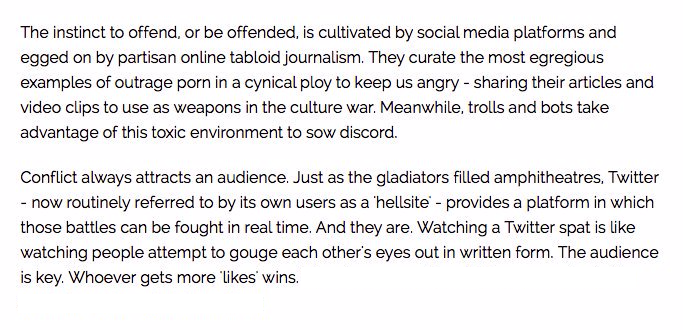

# 1. Preface

This class is under near constant development.  It's backlog is here https://github.com/nemonik/hands-on-DevOps/projects/1  

# 2. DevOps

A hands-on DevOps course covering the culture, methods and repeated practices of modern software development involving Vagrant, VirtualBox, Ansible, Kubernetes, K3s, MetalLB, Traefik, Docker-Compose, Docker, Taiga, GitLab, Drone CI, SonarQube, Selenium, InSpec, Alpine 3.10, Ubuntu-bionic, CentOS 7...

A reveal.js presentation written to accompany this course can found at [https://nemonik.github.io/hands-on-DevOps/](https://nemonik.github.io/hands-on-DevOps/).

This course will

1. Discuss DevOps,
2. Have you spin up a DevOps toolchain and development environment, and then
3. Author two applications and their accompanying pipelines, the first a continuous integration (CI) and the second a continuous delivery (CD) pipeline.

After this course, you will

1. Be able to describe and have hands-on experience DevOps methods and repeated practices (e.g., use of Agile methods, configuration management, build automation, test automation and deployment automation orchestrated under a CICD orchestrator), and why it matters;
2. Address challenges transitioning to DevOps methods and repeated practices;
3. Have had hands-on experience with Infrastructure as Code( Vagrant and Ansible ) to provision and configure an entire DevOps Factory (i.e. a toolchain and development environment) on VirtualBox including Docker Registry, Taiga, GitLab, Drone CI, and SonarQube;
4. Have had hands-on experience authoring code to include authoring and running automated tests in a CICD pipeline all under Configuration Management to ensure an application follows style, adheres to good coding practices, builds, identify security issues, and functions as expected;
5. Have had hands-on experience with 
    1. using Infrastructure as Code (IaC) in Vagrant and Ansible; 
    2. creating and using Kanban board in Taiga; 
    3. code configuration in git and GitLab; 
    4. authoring code in Go; 
    5. using style checkers and linters; 
    6. authoring a Makefile; 
    7. various commands in Docker (e.g., building a container image, pushing a container into a registry, creating and running a container); 
    8. authoring a pipeline for Drone CI; 
    9. using Sonar Scanner CLI to perform static analysis; 
    10. authoring security test in InSpec; (k) author an automated functional test in Selenium; 
    11. authoring a dynamic security test in OWASP Zap; and 
    12. using container platform to author and scale services;
6. Have had hands-on experience authoring code to include authoring and running automated tests in a CICD pipeline all under Configuration Management to ensure an application follows style, adheres to good coding practices, builds, identify security issues, and functions as expected.

We will be spending most of the course hands-on working with the tools and in the Unix command line making methods and repeated practices of DevOps happen, so as to grow an understanding of how DevOps actually works. Although, not necessary I would encourage you to pick up a free PDF of [The Linux Command Line by William Shotts](http://linuxcommand.org/tlcl.php) if you are no familiar wit the Linux command line.

Don't fixate on the tools used, nor the apps we develop in the course of learning how and why. How and why is far more important. This course like DevOps is not about tools although we'll be using them. You'll spend far more time writing code. (Or at the very least cutting-and-pasting code.)

# 3. Author

- Michael Joseph Walsh [mjwalsh@mitre.org](mailto:mjwalsh@mitre.org), [walsh@nemonik.com](mailto:walsh@nemonik.com)

# 4. Copyright and license

See the License file at the root of this project.

# 5. Prerequisites

The following skills would be useful in following along but aren't strictly necessary.

What you should bring:

- Managing Linux or Unix-like systems would be tremendously helpful, but not necessary, as we will be living largely within the terminal.
- A basic understanding of Vagrant, Docker, and Ansible would also be helpful, but not necessary.

# 6. Table of Contents

<!-- TOC -->

- [1. Preface](#1-preface)
- [2. DevOps](#2-devops)
- [3. Author](#3-author)
- [4. Copyright and license](#4-copyright-and-license)
- [5. Prerequisites](#5-prerequisites)
- [6. Table of Contents](#6-table-of-contents)
- [7. DevOps unpacked](#7-devops-unpacked)
    - [7.1. What is DevOps?](#71-what-is-devops)
    - [7.2. What DevOps is not](#72-what-devops-is-not)
    - [7.3. To succeed at DevOps you must](#73-to-succeed-at-devops-you-must)
    - [7.4. If your effort doesn't](#74-if-your-effort-doesnt)
    - [7.5. Conway's Law states](#75-conways-law-states)
    - [7.6. DevOps is really about](#76-devops-is-really-about)
    - [7.7. What is DevOps culture?](#77-what-is-devops-culture)
        - [7.7.1. We were taught the requisite skills as children](#771-we-were-taught-the-requisite-skills-as-children)
        - [7.7.2. Maintaining relationships is your most important skill](#772-maintaining-relationships-is-your-most-important-skill)
        - [7.7.3. Be quick... Be slow to...](#773-be-quick-be-slow-to)
        - [7.7.4. The pressures of social media](#774-the-pressures-of-social-media)
    - [7.8. How is DevOps related to the Agile?](#78-how-is-devops-related-to-the-agile)
    - [7.9. How do they differ?](#79-how-do-they-differ)
    - [7.10. Why?](#710-why)
    - [7.11. What are the principles of DevOps?](#711-what-are-the-principles-of-devops)
    - [7.12. Much of this is achieved](#712-much-of-this-is-achieved)
    - [7.13. What is Continuous Integration (CI)?](#713-what-is-continuous-integration-ci)
    - [7.14. How?](#714-how)
    - [7.15. CI best practices](#715-ci-best-practices)
        - [7.15.1. Utilize a Configuration Management System](#7151-utilize-a-configuration-management-system)
        - [7.15.2. Automate the build](#7152-automate-the-build)
        - [7.15.3. Employ one or more CI services/orchestrators](#7153-employ-one-or-more-ci-servicesorchestrators)
        - [7.15.4. Make builds self-testing](#7154-make-builds-self-testing)
        - [7.15.5. Never commit broken](#7155-never-commit-broken)
        - [7.15.6. Stakeholders are expected to pre-flight new code](#7156-stakeholders-are-expected-to-pre-flight-new-code)
        - [7.15.7. The CI service/orchestrator provides feedback](#7157-the-ci-serviceorchestrator-provides-feedback)
    - [7.16. What is Continuous Delivery?](#716-what-is-continuous-delivery)
        - [7.16.1. Extending Continuous Integration (CI)](#7161-extending-continuous-integration-ci)
        - [7.16.2. Consistency](#7162-consistency)
    - [7.17. But wait. What's a pipeline?](#717-but-wait-whats-a-pipeline)
    - [7.18. How is a pipeline manifested?](#718-how-is-a-pipeline-manifested)
    - [7.19. What underlines all of this?](#719-what-underlines-all-of-this)
    - [7.20. But really why do we automate err. code?](#720-but-really-why-do-we-automate-err-code)
        - [7.20.1. Why do I mention Larry Wall?](#7201-why-do-i-mention-larry-wall)
        - [7.20.2. Laziness](#7202-laziness)
        - [7.20.3. Impatience](#7203-impatience)
        - [7.20.4. Hubris](#7204-hubris)
        - [7.20.5. We automate for](#7205-we-automate-for)
    - [7.21. Monitoring](#721-monitoring)
        - [7.21.1. The _primary_ metric](#7211-the-_primary_-metric)
        - [7.21.2. An understanding of performance](#7212-an-understanding-of-performance)
        - [7.21.3. Establish a baseline performance](#7213-establish-a-baseline-performance)
        - [7.21.4. Set reaction thresholds](#7214-set-reaction-thresholds)
        - [7.21.5. Reacting](#7215-reacting)
        - [7.21.6. Gaps in CICD](#7216-gaps-in-cicd)
        - [7.21.7. Eliminating waste](#7217-eliminating-waste)
    - [7.22. Crawl, walk, run](#722-crawl-walk-run)
        - [7.22.1. Ultimately, DevOps is Goal](#7221-ultimately-devops-is-goal)
- [8. Reading list](#8-reading-list)
- [9. Now the hands-on part](#9-now-the-hands-on-part)
    - [9.1. Configuring environmental variables](#91-configuring-environmental-variables)
    - [9.2. VirtualBox](#92-virtualbox)
        - [9.2.1. Installing VirtualBox](#921-installing-virtualbox)
    - [9.3. Git Bash](#93-git-bash)
        - [9.3.1. Installing Git Bash](#931-installing-git-bash)
    - [9.4. Retrieve the course material](#94-retrieve-the-course-material)
    - [9.5. Infrastructure as code (IaC)](#95-infrastructure-as-code-iac)
        - [9.5.1. Hashicorp Packer](#951-hashicorp-packer)
            - [9.5.1.1. Packer document and source](#9511-packer-document-and-source)
            - [9.5.1.2. Installing Packer](#9512-installing-packer)
            - [9.5.1.3. Packer project explained](#9513-packer-project-explained)
            - [9.5.1.4. Packer execution](#9514-packer-execution)
        - [9.5.2. Vagrant](#952-vagrant)
            - [9.5.2.1. Vagrant documentation and source](#9521-vagrant-documentation-and-source)
            - [9.5.2.2. Installing Vagrant](#9522-installing-vagrant)
            - [9.5.2.3. The Vagrantfile explained](#9523-the-vagrantfile-explained)
                - [9.5.2.3.1. Modelines](#95231-modelines)
                - [9.5.2.3.2. Setting extra variables for Ansible roles](#95232-setting-extra-variables-for-ansible-roles)
                - [9.5.2.3.3. Automatically installing and removing the necessary Vagrant plugins](#95233-automatically-installing-and-removing-the-necessary-vagrant-plugins)
                - [9.5.2.3.4. Inserting Proxy setting via host environmental variables](#95234-inserting-proxy-setting-via-host-environmental-variables)
                - [9.5.2.3.5. Inserting enterprise CA certificates](#95235-inserting-enterprise-ca-certificates)
                - [9.5.2.3.6. Auto-generate the Ansible inventory file](#95236-auto-generate-the-ansible-inventory-file)
                - [9.5.2.3.7. Mounting the project folder into each vagrant](#95237-mounting-the-project-folder-into-each-vagrant)
                - [9.5.2.3.8. Build a Vagrant Box](#95238-build-a-vagrant-box)
                - [9.5.2.3.9. Configuring the Kubernetes cluster vagrant(s)](#95239-configuring-the-kubernetes-cluster-vagrants)
                - [9.5.2.3.10. Provisioning and configuring the *development* vagrant](#952310-provisioning-and-configuring-the-development-vagrant)
        - [9.5.3. Ansible](#953-ansible)
            - [9.5.3.1. Playbooks](#9531-playbooks)
                - [9.5.3.1.1. The `master` vagrant's playbook](#95311-the-master-vagrants-playbook)
                - [9.5.3.1.2. The `worker` vagrant's playbook](#95312-the-worker-vagrants-playbook)
                - [9.5.3.1.3. The `development` playbooks](#95313-the-development-playbooks)
            - [9.5.3.2. Roles](#9532-roles)
            - [9.5.3.3. Bringing all the vagrants up](#9533-bringing-all-the-vagrants-up)
    - [9.6. The cloud-native technologies underlying the tools](#96-the-cloud-native-technologies-underlying-the-tools)
        - [9.6.1. Docker image and containers](#961-docker-image-and-containers)
        - [9.6.2. Docker-compose](#962-docker-compose)
        - [9.6.3. Kubernetes](#963-kubernetes)
            - [9.6.3.1. K3S, light-weight Kubernetes](#9631-k3s-light-weight-kubernetes)
            - [9.6.3.2. Kubectl, the Kubernetes command-line tool](#9632-kubectl-the-kubernetes-command-line-tool)
            - [9.6.3.3. Kubernetes-Dashboard](#9633-kubernetes-dashboard)
    - [9.7. The long-running tools](#97-the-long-running-tools)
        - [9.7.1. Taiga, an example of Agile project management software](#971-taiga-an-example-of-agile-project-management-software)
            - [9.7.1.1. Documentation, source, container image](#9711-documentation-source-container-image)
            - [9.7.1.2. URL, Username and password](#9712-url-username-and-password)
        - [9.7.2. GitLab CE, an example of configuration management software](#972-gitlab-ce-an-example-of-configuration-management-software)
            - [9.7.2.1. Documentation, source, container image](#9721-documentation-source-container-image)
            - [9.7.2.2. URL, Username and password](#9722-url-username-and-password)
            - [9.7.2.3. Notes in regards to the class GitLab](#9723-notes-in-regards-to-the-class-gitlab)
        - [9.7.3. Drone CI, an example of CICD orchestrator](#973-drone-ci-an-example-of-cicd-orchestrator)
            - [9.7.3.1. Documentation, source, container image](#9731-documentation-source-container-image)
            - [9.7.3.2. URL, Username and password](#9732-url-username-and-password)
        - [9.7.4. SonarQube, an example of a platform for the inspection of code quality](#974-sonarqube-an-example-of-a-platform-for-the-inspection-of-code-quality)
            - [9.7.4.1. Documentation, source, container image](#9741-documentation-source-container-image)
            - [9.7.4.2. URL, Username and password](#9742-url-username-and-password)
        - [9.7.5. PlantUML Server, an example of light-weight documentation](#975-plantuml-server-an-example-of-light-weight-documentation)
            - [9.7.5.1. Documentation, source, container image](#9751-documentation-source-container-image)
            - [9.7.5.2. URL](#9752-url)
            - [9.7.5.3. Optionally, add the *hands-on-DevOps* repository to GitLab](#9753-optionally-add-the-hands-on-devops-repository-to-gitlab)
    - [9.8. Golang _helloworld_ project](#98-golang-_helloworld_-project)
        - [9.8.1. Create the project's backlog](#981-create-the-projects-backlog)
        - [9.8.2. Create the project in GitLab](#982-create-the-project-in-gitlab)
        - [9.8.3. Setup the project on the _development_ Vagrant](#983-setup-the-project-on-the-_development_-vagrant)
        - [9.8.4. Author the application](#984-author-the-application)
        - [9.8.5. Align source code with Go coding standards](#985-align-source-code-with-go-coding-standards)
        - [9.8.6. Lint your code](#986-lint-your-code)
        - [9.8.7. Build the application](#987-build-the-application)
        - [9.8.8. Run your application](#988-run-your-application)
        - [9.8.9. Author the unit tests](#989-author-the-unit-tests)
        - [9.8.10. Automated the build (i.e., write the Makefile)](#9810-automated-the-build-ie-write-the-makefile)
        - [9.8.11. Author Drone-based Continuous Integration](#9811-author-drone-based-continuous-integration)
            - [9.8.11.1. Configure Drone to execute your pipeline](#98111-configure-drone-to-execute-your-pipeline)
            - [9.8.11.2. Trigger the build](#98112-trigger-the-build)
        - [9.8.12. The completed source for *helloworld*](#9812-the-completed-source-for-helloworld)
    - [9.9. Golang *helloworld-web* project](#99-golang-helloworld-web-project)
        - [9.9.1. Create the project's backlog](#991-create-the-projects-backlog)
        - [9.9.2. Create the project in GitLab](#992-create-the-project-in-gitlab)
        - [9.9.3. Setup the project on the _development_ Vagrant](#993-setup-the-project-on-the-_development_-vagrant)
        - [9.9.4. Author the application](#994-author-the-application)
        - [9.9.5. Build and run the application](#995-build-and-run-the-application)
        - [9.9.6. Run gometalinter.v2 on application](#996-run-gometalinterv2-on-application)
        - [9.9.7. Fix the application](#997-fix-the-application)
        - [9.9.8. Author unit tests](#998-author-unit-tests)
        - [9.9.9. Perform static analysis (i.e., sonar-scanner) on the command line](#999-perform-static-analysis-ie-sonar-scanner-on-the-command-line)
            - [9.9.9.1. Optionally, register your app in SonarQube](#9991-optionally-register-your-app-in-sonarqube)
            - [9.9.9.2. Install the SonarGo plugin](#9992-install-the-sonargo-plugin)
            - [9.9.9.3. Perform static analysis (run *sonar-scanner*) on the command line](#9993-perform-static-analysis-run-sonar-scanner-on-the-command-line)
        - [9.9.10. Automated the build (i.e., write the Makefile)](#9910-automated-the-build-ie-write-the-makefile)
        - [9.9.11. Dockerize the application](#9911-dockerize-the-application)
        - [9.9.12. Run the Docker container](#9912-run-the-docker-container)
            - [9.9.12.1. Option 1](#99121-option-1)
            - [9.9.12.2. Option 2](#99122-option-2)
        - [9.9.13. Push the container image to the private Docker registry](#9913-push-the-container-image-to-the-private-docker-registry)
        - [9.9.14. Configure Drone to execute your CICD pipeline](#9914-configure-drone-to-execute-your-cicd-pipeline)
        - [9.9.15. Add Static Analysis (*SonarQube*) step to pipeline](#9915-add-static-analysis-sonarqube-step-to-pipeline)
        - [9.9.16. Add the build step to the pipeline](#9916-add-the-build-step-to-the-pipeline)
        - [9.9.17. Add container image publish step to pipeline](#9917-add-container-image-publish-step-to-pipeline)
        - [9.9.18. Add container deploy step to pipeline](#9918-add-container-deploy-step-to-pipeline)
        - [9.9.19. Add compliance and policy automation (InSpec) test to the pipeline](#9919-add-compliance-and-policy-automation-inspec-test-to-the-pipeline)
            - [9.9.19.1. First author an InSpec test](#99191-first-author-an-inspec-test)
            - [9.9.19.2. Execute your test](#99192-execute-your-test)
            - [9.9.19.3. Add InSpec to the pipeline](#99193-add-inspec-to-the-pipeline)
            - [9.9.19.4. Viewing the results in Heimdall-lite](#99194-viewing-the-results-in-heimdall-lite)
        - [9.9.20. Add automated functional test to pipeline](#9920-add-automated-functional-test-to-pipeline)
            - [9.9.20.1. Run the *helloworld-web* application](#99201-run-the-helloworld-web-application)
            - [9.9.20.2. Pull and run Selenium Firefox Standalone](#99202-pull-and-run-selenium-firefox-standalone)
            - [9.9.20.3. Create our test automation](#99203-create-our-test-automation)
            - [9.9.20.4. Enable `Trusted` for the repository in Drone](#99204-enable-trusted-for-the-repository-in-drone)
            - [9.9.20.5. Add a *selenium* step to the pipeline](#99205-add-a-selenium-step-to-the-pipeline)
        - [9.9.21. Add DAST step (*OWASP ZAP*) to pipeline](#9921-add-dast-step-owasp-zap-to-pipeline)
        - [9.9.22. All the source for *helloworld-web*](#9922-all-the-source-for-helloworld-web)
    - [9.10. Additional best practices to consider around securing containerized applications](#910-additional-best-practices-to-consider-around-securing-containerized-applications)
    - [9.11. Microservices](#911-microservices)
        - [9.11.1. What's cloud-native?](#9111-whats-cloud-native)
        - [9.11.2. Let's create a microservice](#9112-lets-create-a-microservice)
            - [9.11.2.1. Modify the helloworld-web application](#91121-modify-the-helloworld-web-application)
            - [9.11.2.2. Create a Kubernetes manifest for the microservice](#91122-create-a-kubernetes-manifest-for-the-microservice)
            - [9.11.2.3. Deploy your application](#91123-deploy-your-application)
            - [9.11.2.4. Test your microservice](#91124-test-your-microservice)
            - [9.11.2.5. Scale your microservice](#91125-scale-your-microservice)
    - [9.12. Using what you've learned](#912-using-what-youve-learned)
    - [9.13. Shoo away your vagrants](#913-shoo-away-your-vagrants)
    - [9.14. That's it](#914-thats-it)

<!-- /TOC -->

# 7. DevOps unpacked

## 7.1. What is DevOps?

DevOps (a clipped compound of the words *development* and *operations*) is a software development methodology with an emphasis on a reliable release pipeline, automation, and stronger collaboration across all stakeholders with the goal of delivery of value in close alignment with business objectives into the hands of users (i.e., production) more efficiently and effectively.

*Ops* in DevOps gathers up every IT operation stakeholders (i.e., cybersecurity, testing, DB admin, infrastructure and operations practitioners -- essentially, any stakeholder not commonly thought of as directly part of the development team in the system development life cycle).

Yeah, that's the formal definition.  

In the opening sentences of _Security Engineering: : A Guide to Building Dependable Distributed Systems — Third Edition_, author Ross Anderson defines what a security engineer is

> Security engineering is about building systems to remain dependable in the face of malice, error, or mischance. As a discipline, it focuses on the tools, processes, and methods needed to design, implement, and test complete systems, and to adapt existing systems as their environment evolve. 

The words _security engineering_ could be replaced in the opening sentence with each one of the various stakeholders (e.g., development, quality assurance, technology operations).

The point I'm after is everyone is in it to collectively deliver dependable software.

Also, there is no need to overload the _DevOps_ term -- To _Dev wildcard (i.e., *) Ops_ to include your pet interest(s), such as, _security_, _test_, _whatever_... to form _DevSecOps_, _DevTestOps_, _DevWhateverOps_...  _DevOps_ has you covered.

## 7.2. What DevOps is not

About the tools.


<sub>There are countless vendors out there, who want to sell you their crummy tool.</sub>

## 7.3. To succeed at DevOps you must

__Combine software development and information technology operations in the systems development life cycle__ with __a focus on collaboration across the life cycle to deliver features, fixes, and updates frequently in close alignment with business objectives__. 

If the effort cannot combine both Dev and Ops in collaboration with this focus the effort will most certainly fail.
 
## 7.4. If your effort doesn't

__grok (i.e, Understand intuitively) what DevOps is in practice__ and have performed the __necessary analysis of the existing culture and a strategy for how to affect a change__ the effort again will likely fail.  

I say this because the culture is the largest influencer over the success of both Agile and DevOps and ultimately the path taken (i.e., plans made.)

## 7.5. Conway's Law states

> Any organization that designs a system (defined broadly) will produce a design whose structure is a copy of the organization's communication structure.

From ["How Do Committees Invent?"](http://www.melconway.com/Home/Conways_Law.html)

Followed with

> Ways must be found to reward design managers for keeping their organizations lean and flexible. 

This was written over 50 years ago.

If your communication structure is broke, so shall your systems be.

## 7.6. DevOps is really about

Providing the culture, methods and repeated practices to permit stakeholders to collaborate.

## 7.7. What is DevOps culture?

> **culture** noun  \ *ˈkəl-chər* \
> the set of shared attitudes, values, goals, and practices that characterizes an institution or organization

I love when a word means precisely what you need it to mean.

With the stakeholders sharing the same attitudes, values, goals, using the same tools, methods and repeated practices for their particular discipline you have ***DevOps Culture***.

### 7.7.1. We were taught the requisite skills as children


### 7.7.2. Maintaining relationships is your most important skill


### 7.7.3. Be quick... Be slow to... 


### 7.7.4. The pressures of social media



## 7.8. How is DevOps related to the Agile?

Agile Software Development is an umbrella term for a set of methods and practices based on the [values](http://www.agilealliance.org/agile101/the-agile-manifesto/) and [principles](http://www.agilealliance.org/agile101/12-principles-behind-the-agile-manifesto/) expressed in the Agile Manifesto.

For Agile, solutions evolve through collaboration between self-organizing, cross-functional teams utilizing the appropriate practices for their context.

DevOps builds on this.

## 7.9. How do they differ?

While DevOps extends Agile methods and practices by adding communication and collaboration between

- development,
- security,
- quality assurance, and
- technology operations

functionaries as stakeholders into the broader effort to ensure software systems are delivered in a reliable, low-risk manner.

## 7.10. Why?

In Agile Software Development, there is rarely an integration of these individuals outside the immediate application development team with members of technology operations (e.g., network engineers, administrators, testers, security engineers.)

## 7.11. What are the principles of DevOps?

As DevOps matures, several principles have emerged, namely the necessity for product teams to:

- Apply holistic thinking to solve problems,
- Develop and test against production-like environments,
- Deploy with repeatable and reliable processes,
- Remove the drudgery and uncertainty through automation,
- Validate and monitor operational quality, and
- Provide rapid, automated feedback to the stakeholders

## 7.12. Much of this is achieved

Through the repeated practices of Continuous Integration (CI) and Continuous Delivery (CD) often conflated into simply "CI/CD" or "CICD".

WARNING: After tools, CICD is the next (**albeit mistakenly**) thing thought to be the totality of DevOps.

## 7.13. What is Continuous Integration (CI)?

It is a repeated Agile software development practice lifted specifically from Extreme programming, where members of a development team frequently integrate their work to detect integration issues as quickly as possible thereby shifting discovery of issues "left" (i.e., early) in the software release.

## 7.14. How?

Each integration is orchestrated through a CI service/orchestrator (e.g., Jenkins CI, Drone CI, GitLab Runners, Concourse CI) that essentially assembles a build, runs unit and integration tests every time a predetermined trigger has been met; and then reports with immediate feedback.

## 7.15. CI best practices

### 7.15.1. Utilize a Configuration Management System

For the software's source code, where the mainline (i.e., master branch) is the most recent working version, past releases held in branches, and new features not yet merged into the mainline branch worked in their own branches.

### 7.15.2. Automate the build

By accompanying build automation (e.g., Gradle, Apache Maven, Make) alongside the source code.

### 7.15.3. Employ one or more CI services/orchestrators

To perform source code analysis via automating formal code inspection and assessment.

### 7.15.4. Make builds self-testing

In other words, ingrain testing by including unit and integration tests (e.g., Spock, JUnit, Mockito, SOAPUI, go package *Testing*) with the source code to be executed by the build automation to be executed by the CI service.

### 7.15.5. Never commit broken

Or untested source code to the CMS mainline or otherwise risk breaking a build.

### 7.15.6. Stakeholders are expected to pre-flight new code

Prior to committing source code in their own workspace.

### 7.15.7. The CI service/orchestrator provides feedback

On the success or fail of a build integration to all its stakeholders.

## 7.16. What is Continuous Delivery?

It is a repeated software development practice of providing a rapid, reliable, low-risk product delivery achieved through automating all facets of building, testing, and deploying software.

### 7.16.1. Extending Continuous Integration (CI)

With additional stages/steps aimed to provide ongoing validation that a newly assembled software build meets all desired requirements and thereby is releasable.

### 7.16.2. Consistency

Is achieved through delivering applications into production via individual repeatable pipelines of ingrained system configuration management and testing

## 7.17. But wait. What's a pipeline?

A pipeline automates the various stages/steps (e.g., Static Application Security Testing (SAST), build, unit testing, Dynamic Application Security Testing (DAST), secure configuration acceptance compliance, integration, function and non-functional testing, delivery, and deployment) to enforce quality conformance.

## 7.18. How is a pipeline manifested?

Each delivery pipeline is manifested as **Pipeline as Code** (i.e., software automation) accompanying the application's source code in its version control repository.

## 7.19. What underlines all of this?

I and the community of practice argue DevOps will struggle without ubiquitous access to shared pools of software configurable system resources and higher-level services that can be rapidly provisioned (i.e., cloud).

Although, it is actually possible to [DevOps on mainframes](https://www.youtube.com/watch?v=eMS97X5ZTGc) The video is in the contect of continuous delivery, but read between the lines.

## 7.20. But really why do we automate err. code?

In 2001, I think Larry Wall in his 1st edition of *Programming Perl* book put it best with "We will encourage you to develop the three great virtues of a programmer:

laziness,

impatience, and

hubris."

The second edition of the same book provided definitions for these terms

### 7.20.1. Why do I mention Larry Wall?

Well...

> _Once you have established yourself as an icon in your field 
> it is important that you pay tribute  to some of the great legends that came before you. 
> This kind of gesture will create the illusion that you’re still humble 
> and serve as a preemptive strike against anyone who has noticed 
> what a callus and delusional ass you have become._
>
> The opening monologue to the Blue Man Group’s _I Feel Love_
> https://www.youtube.com/watch?v=8vBKI3ya-l0

I kid, but in all serious the sentiment of this seminal book still holds true.

Let me explain.

### 7.20.2. Laziness

> The quality that makes you go to great effort to reduce overall energy expenditure. 
> It makes you write labor-saving programs that other people will find useful, and 
> document what you wrote so you don't have to answer so many questions about it. 
> Hence, the first great virtue of a programmer._ (p.609)

### 7.20.3. Impatience

> The anger you feel when the computer is being lazy. This makes you write programs 
> that don't just react to your needs, but actually anticipate them. Or at least 
> pretend to. Hence, the second great virtue of a programmer._ (p.608)

### 7.20.4. Hubris

> Excessive pride, the sort of thing Zeus zaps you for. Also, the quality that makes 
> you write (and maintain) programs that other people won't want to say bad things 
> about. Hence, the third great virtue of a programmer._ (p.607)

### 7.20.5. We automate for

- Faster, coordinated, repeatable, and therefore more reliable deployments.
- Discover bugs sooner. Shifting their discovery left in the process.
- To accelerates the feedback loop between Dev and Ops (Again, Ops is everyone not typically considered part of the development team.)
- Reduce tribal knowledge, where one group or person holds the keys to how things get done. Yep, this is about making us all replaceable.
- Reduce shadow IT (i.e., hardware or software within an enterprise that is not supported by IT. Just waiting for its day to explode.)

## 7.21. Monitoring

Once deployed, the work is done, right?

So, that improvements can be gauged and anomalies detected.A development team's work is not complete once a product leaves CICD and enters production; especially, under DevOps where the development team includes members of ops (e.g., security and technology operations).

### 7.21.1. The _primary_ metric

Is working software, but this is not the only, measurement.  The key to successful DevOps is knowing how well the methodology and the software it produces are performing.  Is the software truely dependable?

### 7.21.2. An understanding of performance

Is achieved by collecting and analyzing data produced by environments used for CICD and production.

### 7.21.3. Establish a baseline performance

So, that improvements can be gauged and anomalies detected.

### 7.21.4. Set reaction thresholds

To formulate and prioritize reactions weighting factors, such as, the frequency at which an anomaly arises and who is impacted.

### 7.21.5. Reacting

Could be as simple as operations instructing users through training to not do something that triggers the anomaly, or more ideally, result in an issue being entered into the product's backlog culminating in the development team delivering a fix into production.

### 7.21.6. Gaps in CICD

Are surfaces through monitoring resulting in for example additional testing for an issue discovered in prodcuction.

Yep. News flash. DevOps will not entirely stop all bugs or vulnerabilities from making it into production, but this was never the point.

### 7.21.7. Eliminating waste

Through re-scoping of requirements, re-prioritizing of a backlog, or the deprecation of unused features.  Again, all surfaced through monitoring.

## 7.22. Crawl, walk, run

### 7.22.1. Ultimately, DevOps is Goal

- With DevOps one does not simply hit the ground running.
- One must first crawl, walk and then ultimately run as you embrace the necessary culture change, methods, and repeated practices.
- Collaboration and automation are expected to continually improve so to achieve more frequent and more reliable releases.

# 8. Reading list

**AntiPatterns: Refactoring Software, Architectures, and Projects in Crisis**  
William J. Brown, Raphael C. Malveau, Hays W. "Skip" McCormick,  and Thomas J. Mowbray  
ISBN: 978-0-471-19713-3  
Apr 1998

**Continuous Delivery: Reliable Software Releases through Build, Test, and Deployment Automation (Addison-Wesley Signature Series (Fowler))**  
David Farley and Jez Humble  
ISBN-13: 978-0321601919  
August 2010

**The DevOps Handbook: How to Create World-Class Agility, Reliability, and Security in Technology Organizations**  
Gene Kim Jez Humble,  Patrick Debois, and John Willis  
ISBN-13: 978-1942788003  
October 2016

**Accelerate: The Science of Lean Software and DevOps: Building and Scaling High Performing Technology Organizations**  
Nicole Forsgren PhD, Jez Humble, and Gene Kim  
ISBN-13: 978-1942788331  
March 27, 2018

**Site Reliability Engineering: How Google Runs Production Systems 1st Edition**  
Betsy Beyer, Chris Jones, Jennifer Petoff, and Niall Richard Murphy  
ISBN-13: 978-1491929124  
April 16, 2016  
Also, available online at https://landing.google.com/sre/book/index.html

**Release It!: Design and Deploy Production-Ready Software 2nd Edition**  
Michael T. Nygard  
ISBN-13: 978-1680502398  
January 18, 2018

**The SPEED of TRUST: The One Thing That Changes Everything**  
Stephen M .R. Covey  
ISBN-13: 978-1416549000  
February 5, 2008  
The gist of the book can be found at SlideShare https://www.slideshare.net/nileshchamoli/the-speed-of-trust-13205957

**RELATIONSHIP TRUST: The 13 Behaviors of High-Trust Leaders Mini Session**  
Franklin Covey Co.  
https://archive.franklincovey.com/facilitator/minisessions/handouts/13_Behaviors_MiniSession_Handout.pdf

**How to Deal With Difficult People**  
Ujjwal Sinha  
Oct 25, 2014  
The SlideShare can be found here https://www.slideshare.net/abhiujjwal/how-2-deal-wid-diiclt-ppl

**Leadership Secrets of the Rouge Warrior: A Commando's Guide to Success**
Richard Marcinko w/ John Weisman
ISBN-13: 978-0671545154
June 1, 1996

**Security Engineering: A Guide To Building Dependable Distributed Systems**
Ross Anderson
ISBN-13: 978-0470068526
April 14, 2008
The second edition of this book can be downloaded in whole from https://www.cl.cam.ac.uk/~rja14/book.html and Mr Anderson has released chapters from his 3rd edition under development.

**How Do Committees Invent?**
Melvin E. Conway
Copyright 1968, F. D. Thompson Publications, Inc.
http://www.melconway.com/Home/Conways_Law.html

**The Pragmatic Programmer: Your Journey To Mastery, 20th Anniversary Edition (2nd Edition)**
David Thomas and Andrew Hunt
ISBN-13: 978-0135957059
September 23, 2019

# 9. Now the hands-on part

In this class, you will spin up the following development and toolchain environment.

**NOTE**

- This class makes use of **NOTE** sections to call out things that are important to know or to drop a few tidbits. Reading these notes may save you some aggravation.
- If your web-based Git-repository manager is paired with a PlantUML server you will see a diagram rendered below otherwise you will only the PlantUML source code for the diagram. Don't worry the course's Ansible automation will spin up both a GitLab and PlantUML, and  instructions are provided below how create a repository in GitLab for this project and push the course repository into it, so you can view the diagrams.


## 9.1. Configuring environmental variables

If your environment makes use of an HTTP proxy or SSL inspection, you will need to configure environment variables for this class. 

**On Mac OS X or \*NIX environments**

The following `set_env.sh` BASH script is included in the root of the project and can be used to configure the UNIX environment variables, but must be adjusted for your specific environment. 

```bash
#!/usr/bin/env bash

# Copyright (C) 2019 Michael Joseph Walsh - All Rights Reserved
# You may use, distribute and modify this code under the
# terms of the the license.
#
# You should have received a copy of the license with
# this file. If not, please email <mjwalsh@nemonik.com>

# run in shell via
#
# ```
# . ./set_env.sh
# ```
#
# will set proxy setting to the the hard-cded value on line 36.
# Modify for your environment.
#
# ```
# . ./set_env.sh no_proxy
# ```
#
# will unset all proxy related environmental variables.

set_proxy=true

if [ $# -ne 0 ]; then
  args=("$@")
  if [[ $args[1] = "no_proxy" ]]; then
    set_proxy=false
  fi
fi

if [[ $set_proxy = true ]]; then
  export PROXY=http://gatekeeper.mitre.org:80
  echo "Setting proxy environment varaibles to $PROXY"
  export proxy=$PROXY
  export HTTP_PROXY=$PROXY
  export http_proxy=$PROXY
  export HTTPS_PROXT=$PROXY
  export https_proxy=$PROXY
  export ALL_PROXY=$PROXY
  export NO_PROXY="127.0.0.1,localhost,.mitre.org,.local,192.168.0.9,192.168.0.10,192.168.0.11,192.168.0.206,192.168.0.10,192.168.0.202,192.168.0.203,192.168.0.204,192.168.0.205"
 export no_proxy=$NO_PROXY
else
  echo "Unsetting proxy environment varaibles"
  unset PROXY
  unset proxy
  unset HTTP_PROXY
  unset http_proxy
  unset HTTPS_PROXY
  unset https_proxy
  unset NO_PROXY
  unset no_proxy
  unset ALL_PROXY
fi

export CA_CERTIFICATES=http://employeeshare.mitre.org/m/mjwalsh/transfer/MITRE%20BA%20ROOT.crt,http://employeeshare.mitre.org/m/mjwalsh/transfer/MITRE%20BA%20NPE%20CA-3%281%29.crt
echo "Setting CA_CERTIFICATES environment variable to $CA_CERTIFICATES"

export VAGRANT_ALLOW_PLUGIN_SOURCE_ERRORS=0
echo "Setting VAGRANT_ALLOW_PLUGIN_SOURCE_ERRORS to $VAGRANT_ALLOW_PLUGIN_SOURCE_ERRORS"

# Force the use of the vagrant cacert.pem file
echo "unsetting CURL_CA_BUNDLE and SSL_CERT_FILE environment variables"
unset CURL_CA_BUNDLE
unset SSL_CERT_FILE
```

When in the root of the project, the script can be executed in the terminal session via

```bash
. ./set_env.sh
```

If you're doing this class on your MITRE Life cycle running OS X while on the MITRE network you will **NOT** want to set any proxy related environmental variable. So, you will want to execute this script in this manner

```bash
. ./set_env.sh no_proxy
```

If you have no HTTP proxy and no SSL inspection to be concerned about (such as running the class off of MITRE's corporate network), the alternative is to execute `unset.sh` BASH script to unset all these values:

```bash
#!/usr/bin/env bash

# Copyright (C) 2019 Michael Joseph Walsh - All Rights Reserved
# You may use, distribute and modify this code under the
# terms of the the license.
#
# You should have received a copy of the license with
# this file. If not, please email <mjwalsh@nemonik.com>

# run in shell via
#
# ```
# . ./unset.sh
# ```

unset no_proxy
unset NO_PROXY
unset ALL_PROXY
unset PROXY
unset proxy
unset https_proxy
unset http_proxy
unset HTTP_PROXY
unset HTTPS_PROXY
unset ftp_proxy
unset FTP_PROXY
unset ca_certificates
unset CA_CERTIFICATES
```

Execute in terminal session via

```bash
. ./unset.sh
``` 

**On Windows**

If you are on Windows perform the following to set environmental variable adjusting for your environment:

1. In the Windows taskbar, enter `edit the system environment variables` into `Search Windows` and select the icon with the corresponding name. 
3. The `Systems Property` window will likely open in the background, so you will likely need to go find it and bring it forward.
4. In the `Systems Property`'s `Advanced` tab select `Environment Variables...` button.
5. In `Environment Variables` windows that opens, under `User variables for...` press `New ...` to open a `New User Variable` window, enter each `Variable Name` and and its respective `Value` for each pair in the table below

| Variable Name                      | Value                                                                                                                                                           |
|------------------------------------|-----------------------------------------------------------------------------------------------------------------------------------------------------------------|
| proxy                              | http://gatekeeper.mitre.org:80                                                                                                                                  |
| http_proxy                         | http://gatekeeper.mitre.org:80                                                                                                                                  |
| https_proxy                        | http://gatekeeper.mitre.org:80                                                                                                                                  |
| no_proxy                           | 127.0.0.1,localhost,.mitre.org,.local,192.168.0.9,192.168.0.10,192.168.0.11,192.168.0.206,192.168.0.10,192.168.0.202,192.168.0.203,192.168.0.204,192.168.0.205 |
| CA_CERTIFICATES                    | http://pki.mitre.org/MITRE%20BA%20Root.crt,http://pki.mitre.org/MITRE%20BA%20NPE%20CA-3%281%29.crt                                                              |
| VAGRANT_ALLOW_PLUGIN_SOURCE_ERRORS | 0                                                                                                                                                               |

If you're on MITRE Institute Lab PC you will want to set all of these variables.

If you're doing this class on your MITRE Life cycle running Windows (I have yet to verify a Windows MITRE Life cycle.) you will likely **NOT** want to set the `proxy`, `http_proxy`, `https_proxy`, `no_proxy` or any proxy related environmental variables. You will only need to set the `CA_CERTIFICATES` and `VAGRANT_ALLOW_PLUGIN_SOURCE_ERRORS` environment variables. 

**NOTE**

- The certificate URLs need to be encoded for parentheses to work.
- On Windows, you may inadvertently cut-and-paste blank space characters (e.g., tabs, spaces) and the subsequent Ansible automation may fail.

## 9.2. VirtualBox

You will need to install VirtualBox, a general-purpose full virtualizer for x86 hardware.

The class has been verified to work with VirtualBox 6.1.12.  Newer version may or may not work.

### 9.2.1. Installing VirtualBox

For the MITRE Institute class when I teach it, it is assumed VirtualBox is installed, but below are the instructions for installing it on Windows 10.

1. Open your browser to <https://www.virtualbox.org/wiki/Downloads>
2. Click `Windows hosts` link under `VirtualBox 6.1.12 platform packages`.
3. Find and click the installer to install.

You will also need to turn off `Hyper-V`, `Windows Sandbox` and `Windows Subsystem for Linux` if installed.

1. Click Windows `Start` and then type `turn Windows features on or off` into the search bar.
2. Select the icon with the corresponding name. 
3. This will open the `Windows Features` page and then unselect the `Hyper-V`, `Virtual Machine Platform`, `Windows Hypervisor Platform`, `Windows Sandbox` and `Windows Subsystem for Linux` checkboxes if enabled and then click `Okay`.

The same site has the Mac OS X download. The installation is less involved.  

If you're using Linux use your package manager.  For example, to install on Arch Linux one would use `sudo pacman -Syu virtualbox`.

## 9.3. Git Bash

Git Bash is `git` packaged for Windows with bash (a command-line shell) and a collection of other, separate *NIX utilities, such as, `ssh`, `scp`, `cat`, `find` and others compiled for Windows.

### 9.3.1. Installing Git Bash

If you are on Windows, you'll need to install `git`.

1. Download from https://git-scm.com/download/win
2. Click the installer.
3. Click `next` until you reach the `Configuring the line ending conversions` page select `Checkout as, commit Unix-style line endings`.
4. Then `next`, `next`, `next`...
5. Don't open git-bash from the final window as it will not have the environmental variables set.  Go onto step-6.
6. On the Windows task bar, enter `git` into `Search Windows` then select `Git Bash`.  Use `Git Bash` instead of `Command` or `Powershell`.

On OS X, `git` can be installed via [Homebrew](https://brew.sh/) or you can install the Git client directly <https://git-scm.com/download/mac>.

## 9.4. Retrieve the course material

If you are reading this on paper and have nothing else, you only have a small portion of the class material. You will need to download the class project containing all the automation to spin up a DevOps toolchain and development virtual machines, etc.

In a shell, for the purposes of the MITRE Institute class, this means in `Git Bash`, clone the project from [https://github.com/nemonik/hands-on-DevOps.git](https://github.com/nemonik/hands-on-DevOps.git) via git like so:

```
git -c http.sslVerify=false clone https://github.com/nemonik/hands-on-DevOps.git
```

Output will resemble (i.e., will not be precisely the same):

```
Cloning into 'hands-on-DevOps'...
remote: Enumerating objects: 52, done.
remote: Counting objects: 100% (52/52), done.
remote: Compressing objects: 100% (39/39), done.
remote: Total 5236 (delta 21), reused 28 (delta 11), pack-reused 5184
Receiving objects: 100% (5236/5236), 75.60 MiB | 13.40 MiB/s, done.
Resolving deltas: 100% (1578/1578), done.
```

## 9.5. Infrastructure as code (IaC)

This class uses Infrastructure as code (IaC) to set up the class environment (i.e., two or more virtual machines that will later be referred to as "vagrants".) IaC is the process of provisioning, and configuring (i.e., managing) computer systems through code, rather than directly manipulating the systems by hand (i.e., through manual processes).

Th
