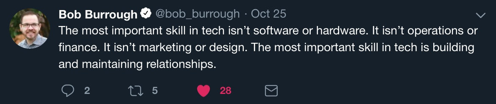

# DevOps

### A hands-on DevOps course

<small>Created by Michael Joseph Walsh [mjwalsh@mitre.org](mailto:mjwalsh@mitre.org) /[walsh@nemonik.com](mailto:walsh@nemonik.com) / [@nemonik](http://twitter.com/nemonikl)</small>

---

## This course will

- Discuss DevOps,
- Have you spin up a DevOps Factory (i.e., a toolchain) and development environment, and then
- Author two applications and their accompanying pipelines, the first a continuous integration (CI) and the second a continuous delivery (CD) pipeline.

--

We will be spending most of the course hands-on working in the Unix command-line making us of the methods and repeated practices of DevOps, so as to grow an understanding of how DevOps actually works.

--

Don't fixate on the tools used, nor the apps we develop in the course of learning how and why.  How and why is far more important.  This course like DevOps is not about tools although we'll be using them. You'll spend far more time writing code.  (Or at least cutting-and-pasting code.) 

---

## Copyright and License

This course is Licensed under the "New BSD License" or "Modified BSD License".

---

## What you should bring:

- Managing Linux or Unix-like systems as we will living largely within the terminal.
- A basic understanding of Vagrant, Docker, and Ansible would be helpful.
- But mostly being a software engineer.

---

## What is DevOps?

--

DevOps (a clipped compound of the words `development` and `operations`) is [a software development methodology](https://en.wikipedia.org/wiki/Software_development_process).

--

With an emphasis on a more reliable release pipeline, automation, and stronger collaboration across all stakeholders 

--

With the goal of deploying working functionality into the hands of users (i.e., production) faster.

--

Yeah, that's the formal definition.

--

In the opening sentences of _Security Engineering: A Guide to Building Dependable Distributed Systems — Third Edition_, author Ross Anderson defines what a **security engineer** is

--

> Security engineering is about **building systems to remain dependable in the face of malice, error, or mischance**. As a discipline, it focuses on the tools, processes, and methods needed to design, implement, and test complete systems, and to adapt existing systems as their environment evolve. 

--

The words _security engineering_ could be replaced in the opening sentence with each one of the various stakeholders (e.g., development, quality assurance , technology operations).

--

The point I'm after is everyone is in it to collectively deliver dependable software.

---

## What DevOps is not

--

Its not about the tools.

--

<small>There are countless vendors out there, who want to sell you their crummy tool.</small>

--

## Fixate on tools and your effort will fail

--

To succeed at DevOps you must 

--

__combine software development and information technology operations in the systems development life cycle__ with __a focus on shorting its life cycle while delivering features, fixes, and updates frequently in close alignment with business objectives__. 

--

If the effort cannot combine both Dev and Ops with this focus the effort will most certainly fail.

--

If your effort doesn't 

--

__grok (i.e, understand intuitively) what DevOps is in practice__ and have performed the __necessary analysis of the existing culture and a strategy for how to affect a change__ 

--

the effort again will likely fail.  

--

I say this because the culture is the largest influencer over the success of both Agile and DevOps and ultimately the path taken (i.e., plans made.)

---

Also, DevOps will **not** entirely stop all bugs nor all vulnerabilities from making it into production, but that's not really the point.

---

## DevOps is really about

Providing the culture and delivery/release pipeline that once a bug or vulnerability is discovered, the concern can to be quickly remediated and functionality returned back to the user.

---

## How is it related to the Agile?

--

Agile Software Development is an umbrella term for a set of methods and practices based on the [values](http://www.agilealliance.org/agile101/the-agile-manifesto/) and [principles](http://www.agilealliance.org/agile101/12-principles-behind-the-agile-manifesto/) expressed in the Agile Manifesto.

--

Agile Software Development shares the same goal, but DevOps extends Agile methods and practices by adding communication and collaboration between

--

development,

--

quality assurance, and

--

technology operations

--

to ensure software systems are delivered in a rapid, reliable, low-risk manner.

--

For Agile, solutions evolve through collaboration between self-organizing, cross-functional teams utilizing the appropriate practices for their context.

--

Again, in DevOps everyone is developing software, so it is my view DevOps builds on Agile.

---

## How do they differ?

--

While Agile Software Development encourages collaboration between cross-functional teams, the focus in DevOps is on the

--

inclusion of analysis,

--

design,

--

development, and

--

quality assurance functionaries as stakeholders into the development effort.

---

## Why?

In Agile Software Development, there is rarely an integration of these individuals outside the immediate application development team with members of technology operations (e.g., network engineers administrators, testers, cybersecurity engineers.)

---

## What are the principles of DevOps?

--

As DevOps matures, several principles have emerged, namely the necessity for product teams to:

--

Apply holistic thinking to solve problems,

--

Develop and test against production-like environments,

--

Deploy with repeatable, and reliable processes,

--

Remove the drudgery and uncertainty through automation,

--

Validate and monitor operational quality, and

--

Provide rapid, automated feedback to the stakeholders

---

## How is this achieved?

--

Achieved through the repeated practices of Continuous Integration (CI) and Continuous Delivery (CD) often conflated into simply *CI/CD* or *CICD*.

--

After tools, this is what is commonly (albeit mistakenly) thought to be the totality of DevOps.

---

## What is Continuous Integration (CI)?

It is a repeated Agile software development practice, lifted specifically from Extreme programming, where members of a development team frequently integrate their work in order to detect integration issues as quickly as possible thereby shifting discovery of issues "left" (i.e., early) in the software release.

--

## How?

Each integration is orchestrated through a CI service/orchestrator (e.g., Jenkins CI, Drone CI, GitLab Runners, Concourse CI) that essentially assembles a build, runs unit and integration tests every time a predetermined trigger has been met; and then reports with immediate feedback.

--

## CI best practices

--

### Utilize a Configuration Management System

For the software's source code, where the mainline (i.e., master branch) is the most the most recent working version, past releases held in branches, and new features not yet merged into the mainline branch being worked on their own branches.

--

### Automate the build

By accompanying build automation (e.g., Gradle, Apache Maven, Make) alongside the source code.

--

### Employ one or more CI services/orchestrators

Perform source code analysis via automate formal code inspection and assessment.

--

### Make builds self-testing

In other words, ingrain testing by including unit and integration tests (e.g., Spock, JUnit, Mockito, SOAPUI, go package *Testing*) with the source code so as to be executed by the build automation to be execute by the CI service.

--

### Never commit broken

Or untested source code to the CMS mainline or otherwise risk breaking a build.

--
Stakeholders are expected to pre-flight new code

Prior to committing source code in their own workspace.

--

### The CI service/orchestrator provides feedback

On the success or fail of a build integration to all its stakeholders.

---

## What is Continuous Delivery?

--

It is a repeated software development practice of providing a rapid, reliable, low-risk product delivery achieved through automating all facets of building, testing, and deploying software.

--

### Extending Continuous Integration (CI)

With additional stages/steps aimed to provide ongoing validation that a newly assembled software build meets all desired requirements and thereby is releasable.

--

### Consistency

Is achieved through delivering applications into production via individual repeatable pipelines of ingrained system configuration management and testing

---

## But wait. What's a pipeline?

--

A pipeline automates the various stages/steps (e.g., Static Application Security Testing (SAST), build, unit testing, Dynamic Application Security Testing (DAST), secure configuration acceptance compliance, integration, function and non-functional testing, delivery, and deployment) to enforce quality conformance.

---

## How is a pipeline manifested?

--

Each delivery pipeline is manifested as **Pipeline as Code** (i.e., software automation) accompanying software's source code in its version control repository.

---

## What underlines all of this?

--

I'd argue, _a ubiquitous access to shared pools of configurable system resources and higher-level services that can be rapidly provisioned with minimal management effort_ without the repeated practices of DevOps will struggle.  Although, it is possible to DevOps on mainframes.

---

## But really why do we automate err. code?

--

In 2001, I think Larry Wall in his 1st edition of *Programming Perl* book put it best with "We will encourage you to develop the three great virtues of a programmer:

--

laziness,

--

impatience, and

--

hubris."

--

### Why do I mention Larry Wall?

--

Well...

--

<small>
> _Once you have established yourself as an icon in your field
> it is important that you pay tribute  to some of the great legends that came before you.
> This kind of gesture will create the illusion that you’re still humble
> and serve as a preemptive strike against anyone who has noticed
> what a callus and delusional ass you have become._

The opening monologue to the Blue Man Group’s _I Feel Love_
https://www.youtube.com/watch?v=8vBKI3ya-l0
</small>

--

I kid, but in all serious the sentiment of this seminal book still holds true.

--

Let me explain.

--

### Laziness

_The quality that makes you go to great effort to reduce overall energy expenditure. It makes you write labor-saving programs that other people will find useful, and document what you wrote so you don't have to answer so many questions about it. Hence, the first great virtue of a programmer._ (p.609)

--

### Impatience

_The anger you feel when the computer is being lazy. This makes you write programs that don't just react to your needs, but actually anticipate them. Or at least pretend to. Hence, the second great virtue of a programmer._ (p.608)

--

### Hubris

_Excessive pride, the sort of thing Zeus zaps you for. Also, the quality that makes you write (and maintain) programs that other people won't want to say bad things about. Hence, the third great virtue of a programmer._ (p.607)

--

### We automate for

--

Faster, coordinated, repeatable, and therefore more reliable deployments.

--

Discover bugs sooner. Shifting their discovery left in the process.

--

To accelerates the feedback loop between Dev and Ops.

--

Reduce tribal knowledge, where one group or person holds the keys to how things get done. Yep, this is about making us all replaceable.

--

Reduce shadow IT (i.e., hardware or software within an enterprise that is not supported by IT. Just waiting for its day to explode.)

---

## Monitoring

--

Once deployed, the work is done, right?

--

A development team's work is not complete once a product leaves CI/CD and enters production; especially, under DevOps where the development teams include members of operations.

--

### The most important metric

Is working software is the _primary_, but not the only, measure of progress.  The key to successful DevOps is knowing how well the methodology and the software it produces are performing.

--

### An Understanding of Performance

Is achieved by collecting and analyzing data produced by environments used for CI/CD and production.

--

### Establish a baseline Performance

So, that improvements can be gauged and anomalies detected.

--

### Set Reaction Thresholds

To formulate and prioritize reactions weighting factors, such as, the frequency at which an anomaly arises and who is impacted.

--

### Reacting

A reaction could be as simple as operations instructing users through training to not do something that triggers the anomaly, or more ideally, result in an issue being entered into the product's backlog culminating in the development team delivering a fix into production.

--

### Gaps in CI/CD

Monitoring will also inform development teams of gaps in CI/CD resulting in additional testing for the issue that triggered the necessity for the improvement.

--

### Eliminating Waste

Further, monitoring may result in the re-scoping of requirements, re-prioritizing of a backlog, or the deprecation of un-used features.

---

## What is DevOps Culture?

--

> **culture** noun  \ *ˈkəl-chər* \
> the set of shared attitudes, values, goals, and practices that characterizes an institution or
> organization

--

Now that everyone is a coder using the same tools, methods and repeated practices for their particular discipline you have the foundations of a ***culture***.

--

## Let's unpack the ramifications of this.

--

### We were taught the requisite skills as children

--

--

### Maintaining relationships is your most important skill

--

--

### Be

--

--

### The pressures of social media

<small>
> The instinct to offend, or be offended, is cultivated by social media platforms and egged on by partisan online tabloid journalism. They curate the most egregious examples of outrage porn in a cynical ploy to keep us angry - sharing their articles and video clips to use as weapons in the culture war. Meanwhile, trolls and bots take advantage of this toxic environment to sow discord.
</small>

<small>
["Being nice is the new punk"* By Bex Coates](http://www.politics.co.uk/comment-analysis/2018/11/21/being-nice-is-the-new-punk)
</small>

<small>* - This article is loaded with curse words.</small>

--

### The pressures of social media

<small>
> Conflict always attracts an audience. Just as the gladiators filled amphitheaters, Twitter - now routinely referred to by its own users as a 'hellsite' - provides a platform in which those battles can be fought in real time. And they are. Watching a Twitter spat is like watching people attempt to gouge each other's eyes out in written form. The audience is key. Whoever gets more 'likes' wins. 
</small>

<small>
["Being nice is the new punk"* By Bex Coates](http://www.politics.co.uk/comment-analysis/2018/11/21/being-nice-is-the-new-punk)
</small>

<small>* - This article is loaded with curse words.</small>

--

### Don't fall for the trap

<small>
> People will try to goad you. They rely on it. When you lose your patience, you let them win. So engage in good faith. Don't allow yourself to be baited. Reject the establishment vitriol. Ad-hom is so mainstream it's boring. Decide to engage with the idea, rather than the personality.
>
> Decide to be considerate, respectful, principled, kind and generous.
</small>

<small>
["Being nice is the new punk"* By Bex Coates](http://www.politics.co.uk/comment-analysis/2018/11/21/being-nice-is-the-new-punk)
</small>

<small>* - This article is loaded with curse words.</small>

---

## Fueled by trust

["The Speed Of Trust" By Stephen MR Covey summarized in a SlideShare by Nilesh Chamoli](https://www.slideshare.net/nileshchamoli/the-speed-of-trust-13205957)

--

> Build projects around motivated individuals.
> Give them the environment and support they need,
> and trust them to get the job done

The 5th principle behind the Agile Manifesto

--

A key word here is ***trust***

--

> Trust means confidence

--

> When we trust people, we have confidence in them - in there integrity and their abilities

--

> When we distrust people, we are suspicious of them.

--

> In a high-trust relationship, we can say the wrong thing, and people will understand us.

--

> In a low-trust relationship, despite precise communication, people will misinterpret us.

--

### Huh? How is this relative to DevOps?

--

Essentially, both Agile and DevOps are built on ***trust***.

--

I'd encourage you spend time with the *The Speed Of Trust* Slideshare.

--

As it unpacks behaviors to building trust: `Talk Straight`, `Demonstrate Respect`, `Create Transparency`, `Right Wrongs`, `Show Loyalty`, `Deliver Results`, `Get Better`, `Confront Reality`, `Clarify Expectation`, `Practice Accountability`, `Listen First`, `Keep Commitments`, and `Extend Trust`. 

--

Both the book and the Slideshare cover the [13 Behavior](https://archive.franklincovey.com/facilitator/minisessions/handouts/13_Behaviors_MiniSession_Handout.pdf) you should embolden in your DevOps teams.

---

## Learn personality types

["How to Deal With Difficult People" By Ujjwal Sinha](https://www.slideshare.net/abhiujjwal/how-2-deal-wid-diiclt-ppl)

--

### Covering just a few...

--

### Tanks

> Aggressive, in your face verbal and physical behavior... 
>
> Their goal is control at all costs... 
> 
> I win/you lose! 

--

### Handle by

> By standing your ground, but not getting into a fight with them...
> 
> Maintain self control.

--

### Or just keep in mind these immortal words

> <small>The haters gonna hate, hate, hate, hate, hate</small>
> <small>Baby, I'm just gonna shake, shake, shake, shake, shake</small>
> <small>I shake it off, I shake it off</small>

https://www.youtube.com/watch?v=6-sYTAHtzXM

--

### Think-They-Know-It-All

> Do **not** know what they are talking about, but they have a knack for conversation and act like a professional.

--

### Handle by

> State the correct facts or give alternative opinions in as much detail as you can.
>
> Move on to the next topic as soon as you correct a balloon.
>
> This gives the balloon enough time to deflate with as little embarrassment as possible.

--

### Pessimists

> Tear down morale
> 
> Feel that those with power can’t be trusted... suspicious and paranoid
>
> Feel like they have no control over anything

--

### Handle by

> Ask what’s the worst that could happen?
> 
> Don’t argue with them!
>
> Distance yourself from them or limit your time with them to maintain a positive outlook

---

## Crawl, Walk, Run

<small>Like with almost everything.</small>

--

### Ultimately, DevOps is Goal

--

With DevOps one does not simply hit the ground running.

--

Keep in mind, one must first `crawl`, `walk` and then ultimately `run` as you embrace the necessary culture change, methods and repeated practices...

---

This ends my deck

---

Michael Joseph Walsh
github.com/nemonik/hands-on-DevOps
mjwalsh@mitre.org / walsh@nemonik.com

---
