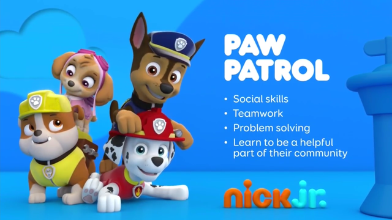
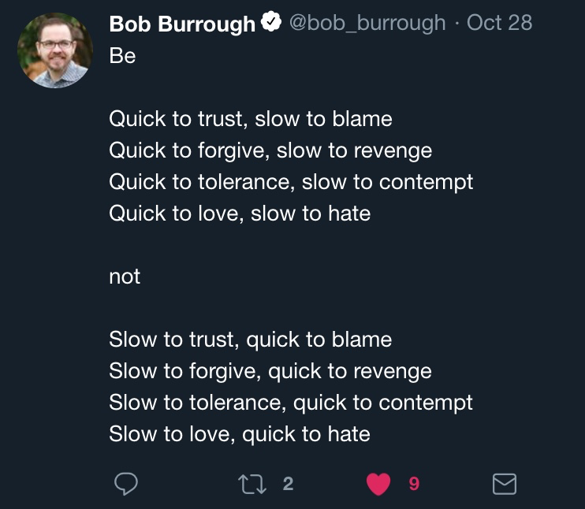

# 1. DevOps

A hands-on DevOps course covering the culture, methods and repeated practices of modern software development involving Vagrant, VirtualBox, Ansible, Kubernetes, K3s, Docker, Docker-Compose, Taiga, GitLab, Drone CI, SonarQube, Selenium, InSpec...

A reveal.js presentation written to accompany this course can found at [https://nemonik.github.io/hands-on-DevOps/](https://nemonik.github.io/hands-on-DevOps/).

This course will
1. Discuss DevOps,
2. Have you spin up a DevOps toolchain and development environment, and then
3. Author two applications and their accompanying pipelines, the first a continuous integration (CI) and the second a continuous delivery (CD) pipeline.

After this course you will
1. Be able to describe and have hands on experience the DevOps methods and repeated practices (e.g., use of Agile methods, configuration management, build automations, test automation and deployment automation orchestrated under continuous integration and delivery orchestrator), and why it matters;
2. Identify what diverse tools and resources that exist in the DevOps ecosystem;
3. Address challenges transitioning to DevOps methods and repeated practices;
4. Have had hands-on experience with Infrastructure as Code( Vagrant and Ansible ) to provision and configure an entire DevOps toolchain and development environment on VirtualBox including Docker Registry, Taiga, GitLab, Drone CI, and SonarQube;
5. Have had hands-on experience authoring code to include authoring and running automated tests in a CI/CD pipeline all under Configuration Management to insure an application follows style, adheres to good coding practices, builds, identify security issues, and functions as expected;
6. Have had hands-on experience with (a) using Infrastructure as Code (IaC) in Vagrant and Ansible; (b) creating and using Kanban board in Taiga; (c) code configuration in git and GitLab; (d) authoring code in Go; (e) using style checkers and linters; (f) authoring a Makefile; (g) various commands in Docker (e.g., building a container image, pushing a container into a registry, creating and running a container); (h) authoring a pipeline for Drone CI; (i) using Sonar Scanner CLI to perform static analysis; (j) authoring security test in InSpec; (k) author an automated functional test in Selenium; (l) authoring a dynamic security test in OWASP Zap; an (m) using container platform to author and scale services;
7. Have had hands-on experience authoring code to include authoring and running automated tests in a CI/CD pipeline all under Configuration Management to insure an application follows style, adheres to good coding practices, builds, identify security issues, and functions as expected.

We will be spending most of the course hands-on working with the tools and in the Unix command line making methods and repeated practices of DevOps happen, so as to grow an understanding of how DevOps actually works.

Don't fixate on the tools used, nor the apps we develop in the course of learning how and why.  How and why is far more important.  This course like DevOps is not about tools although we'll be using them. You'll spend far more time writing code.  (Or at the very least cutting-and-pasting code.) 

# 2. Author

- Michael Joseph Walsh [mjwalsh@mitre.org](mailto:mjwalsh@mitre.org), [walsh@nemonik.com](mailto:walsh@nemonik.com)

# 3. Copyright and license

See the License file at the root of this project.

# 4. Prerequisites

The following skills would be useful in following along, but aren't strictly necessary.

What you should bring:

- Managing Linux or Unix-like systems would be tremendously helpful, but not necessary, as we will living largely within the terminal.
- A basic understanding of Vagrant, Docker, and Ansible would also be helpful, but not necessary.
- Mostly being a software engineer, but not necessary.

# 5. Table of contents

<!-- TOC -->

- [1. DevOps](#1-devops)
- [2. Author](#2-author)
- [3. Copyright and license](#3-copyright-and-license)
- [4. Prerequisites](#4-prerequisites)
- [5. Table of contents](#5-table-of-contents)
- [6. DevOps unpacked](#6-devops-unpacked)
    - [6.1. What is DevOps?](#61-what-is-devops)
    - [6.2. What DevOps is not](#62-what-devops-is-not)
    - [6.3. Fixate on tools and your effort will fail](#63-fixate-on-tools-and-your-effort-will-fail)
    - [6.4. DevOps is really about](#64-devops-is-really-about)
    - [6.5. How is it related to the Agile?](#65-how-is-it-related-to-the-agile)
    - [6.6. How do they differ?](#66-how-do-they-differ)
    - [6.7. Why?](#67-why)
    - [6.8. What are the principles of DevOps?](#68-what-are-the-principles-of-devops)
    - [6.9. How is this achieved?](#69-how-is-this-achieved)
    - [6.10. What is Continuous Integration (CI)?](#610-what-is-continuous-integration-ci)
    - [6.11. How?](#611-how)
    - [6.12. CI best practices](#612-ci-best-practices)
        - [6.12.1. Utilize a Configuration Management System](#6121-utilize-a-configuration-management-system)
        - [6.12.2. Automate the build](#6122-automate-the-build)
        - [6.12.3. Employ one or more CI services/orchestrators](#6123-employ-one-or-more-ci-servicesorchestrators)
        - [6.12.4. Make builds self-testing](#6124-make-builds-self-testing)
        - [6.12.5. Never commit broken](#6125-never-commit-broken)
        - [6.12.6. Developers are expected to pre-flight new code](#6126-developers-are-expected-to-pre-flight-new-code)
        - [6.12.7. The CI service/orchestrator provides feedback](#6127-the-ci-serviceorchestrator-provides-feedback)
    - [6.13. What is Continuous Delivery?](#613-what-is-continuous-delivery)
        - [6.13.1. Extending Continuous Integration (CI)](#6131-extending-continuous-integration-ci)
        - [6.13.2. Consistency](#6132-consistency)
    - [6.14. But wait. What's a pipeline?](#614-but-wait-whats-a-pipeline)
    - [6.15. How is a pipeline manifested?](#615-how-is-a-pipeline-manifested)
    - [6.16. What underlines all of this?](#616-what-underlines-all-of-this)
    - [6.17. But really why do we automate err. code?](#617-but-really-why-do-we-automate-err-code)
        - [6.17.1. Why do I mention Larry Wall?](#6171-why-do-i-mention-larry-wall)
        - [6.17.2. Laziness](#6172-laziness)
        - [6.17.3. Impatience](#6173-impatience)
        - [6.17.4. Hubris](#6174-hubris)
        - [6.17.5. We automate for](#6175-we-automate-for)
    - [6.18. Monitoring](#618-monitoring)
        - [6.18.1. The most important metric](#6181-the-most-important-metric)
        - [6.18.2. An understanding of performance](#6182-an-understanding-of-performance)
        - [6.18.3. Establish a baseline performance](#6183-establish-a-baseline-performance)
        - [6.18.4. Set reaction thresholds](#6184-set-reaction-thresholds)
        - [6.18.5. Reacting](#6185-reacting)
        - [6.18.6. Gaps in CI/CD](#6186-gaps-in-cicd)
        - [6.18.7. Eliminating waste](#6187-eliminating-waste)
    - [6.19. What is DevOps culture?](#619-what-is-devops-culture)
        - [6.19.1. We were taught the requisite skills as children](#6191-we-were-taught-the-requisite-skills-as-children)
        - [6.19.2. Maintaining relationships is your most important skill](#6192-maintaining-relationships-is-your-most-important-skill)
        - [6.19.3. Be quick... Be slow to...](#6193-be-quick-be-slow-to)
        - [6.19.4. The pressures of social media](#6194-the-pressures-of-social-media)
    - [6.20. Crawl, walk, run](#620-crawl-walk-run)
        - [6.20.1. Ultimately, DevOps is Goal](#6201-ultimately-devops-is-goal)
- [7. Reading list](#7-reading-list)
- [8. Now the hands-on part](#8-now-the-hands-on-part)
    - [8.1. Configuring environmental variables](#81-configuring-environmental-variables)
    - [8.2. VirtualBox](#82-virtualbox)
        - [8.2.1. Installing VirtualBox](#821-installing-virtualbox)
    - [8.3. Git Bash](#83-git-bash)
        - [8.3.1. Installing Git Bash](#831-installing-git-bash)
    - [8.4. Retrieve the course material](#84-retrieve-the-course-material)
    - [8.5. Infrastructure as code (IaC)](#85-infrastructure-as-code-iac)
        - [8.5.1. Vagrant](#851-vagrant)
            - [8.5.1.1. Vagrant documentation and source](#8511-vagrant-documentation-and-source)
            - [8.5.1.2. Installing Vagrant](#8512-installing-vagrant)
            - [8.5.1.3. Installing Vagrant plugins](#8513-installing-vagrant-plugins)
            - [8.5.1.4. The Vagrantfile explained](#8514-the-vagrantfile-explained)
                - [8.5.1.4.1. Modelines](#85141-modelines)
                - [8.5.1.4.2. Setting extra varaiables for Ansible roles](#85142-setting-extra-varaiables-for-ansible-roles)
                - [8.5.1.4.3. Inserting Proxy setting via host environmental variables](#85143-inserting-proxy-setting-via-host-environmental-variables)
                - [8.5.1.4.4. Inserting enterprise CA certificates](#85144-inserting-enterprise-ca-certificates)
                - [8.5.1.4.5. Configuring the cache plugin to speed things along](#85145-configuring-the-cache-plugin-to-speed-things-along)
                - [8.5.1.4.6. Configuring the disksize plugin to increase the disk size](#85146-configuring-the-disksize-plugin-to-increase-the-disk-size)
                - [8.5.1.4.7. Build a Vagrant Box](#85147-build-a-vagrant-box)
                - [8.5.1.4.8. Requiring _vagrant-vbquest_ for Windows](#85148-requiring-_vagrant-vbquest_-for-windows)
                - [8.5.1.4.9. Configuring the *development* vagrant](#85149-configuring-the-development-vagrant)
                - [8.5.1.4.10. Configuring the *toolchain* vagrant](#851410-configuring-the-toolchain-vagrant)
        - [8.5.2. Ansible](#852-ansible)
            - [8.5.2.1. Inventory file](#8521-inventory-file)
            - [8.5.2.2. Playbooks](#8522-playbooks)
            - [8.5.2.3. Roles](#8523-roles)
    - [8.6. Docker image and containers](#86-docker-image-and-containers)
    - [8.7. Docker-compose](#87-docker-compose)
    - [8.8. Kubernetes](#88-kubernetes)
    - [8.9. Spinning up the _toolchain_ vagrant](#89-spinning-up-the-_toolchain_-vagrant)
        - [8.9.1. Taiga, an example of Agile project management software](#891-taiga-an-example-of-agile-project-management-software)
            - [8.9.1.1. Documentation, source, container image](#8911-documentation-source-container-image)
            - [8.9.1.2. URL, Username and password](#8912-url-username-and-password)
        - [8.9.2. GitLab CE, an example of configuration management software](#892-gitlab-ce-an-example-of-configuration-management-software)
            - [8.9.2.1. Documentation, source, container image](#8921-documentation-source-container-image)
            - [8.9.2.2. URL, Username and password](#8922-url-username-and-password)
        - [8.9.3. Drone CI, an example of CI/CD orchestrator](#893-drone-ci-an-example-of-cicd-orchestrator)
            - [8.9.3.1. Documentation, source, container image](#8931-documentation-source-container-image)
            - [8.9.3.2. URL, Username and password](#8932-url-username-and-password)
            - [8.9.3.3. Optionally, add the *hands-on-DevOps* repository to the `toolchain`'s GitLab](#8933-optionally-add-the-hands-on-devops-repository-to-the-toolchains-gitlab)
        - [8.9.4. SonarQube, an example of a platform for the inspection of code quality](#894-sonarqube-an-example-of-a-platform-for-the-inspection-of-code-quality)
            - [8.9.4.1. Documentation, source, container image](#8941-documentation-source-container-image)
            - [8.9.4.2. URL, Username and password](#8942-url-username-and-password)
    - [8.10. Spin up the _development_ vagrant](#810-spin-up-the-_development_-vagrant)
    - [8.11. Golang _helloworld_ project](#811-golang-_helloworld_-project)
        - [8.11.1. Create the project's backlog](#8111-create-the-projects-backlog)
        - [8.11.2. Create the project in GitLab](#8112-create-the-project-in-gitlab)
        - [8.11.3. Setup the project on the _development_ Vagrant](#8113-setup-the-project-on-the-_development_-vagrant)
        - [8.11.4. Author the application](#8114-author-the-application)
        - [8.11.5. Align source code with Go coding standards](#8115-align-source-code-with-go-coding-standards)
        - [8.11.6. Lint your code](#8116-lint-your-code)
        - [8.11.7. Build the application](#8117-build-the-application)
        - [8.11.8. Run your application](#8118-run-your-application)
        - [8.11.9. Author the unit tests](#8119-author-the-unit-tests)
        - [8.11.10. Automated the build (i.e., write the Makefile)](#81110-automated-the-build-ie-write-the-makefile)
        - [8.11.11. Author Drone-based Continuous Integration](#81111-author-drone-based-continuous-integration)
            - [8.11.11.1. Configure Drone to execute your pipeline](#811111-configure-drone-to-execute-your-pipeline)
            - [8.11.11.2. Trigger the build](#811112-trigger-the-build)
        - [8.11.12. The completed source for *helloworld*](#81112-the-completed-source-for-helloworld)
    - [8.12. Golang *helloworld-web* project](#812-golang-helloworld-web-project)
        - [8.12.1. Create the project's backlog](#8121-create-the-projects-backlog)
        - [8.12.2. Create the project in GitLab](#8122-create-the-project-in-gitlab)
        - [8.12.3. Setup the project on the _development_ Vagrant](#8123-setup-the-project-on-the-_development_-vagrant)
        - [8.12.4. Author the application](#8124-author-the-application)
        - [8.12.5. Build and run the application](#8125-build-and-run-the-application)
        - [8.12.6. Run gometalinter.v2 on application](#8126-run-gometalinterv2-on-application)
        - [8.12.7. Fix the application](#8127-fix-the-application)
        - [8.12.8. Author unit tests](#8128-author-unit-tests)
        - [8.12.9. Perform static analysis (i.e., sonar-scanner) on the command line](#8129-perform-static-analysis-ie-sonar-scanner-on-the-command-line)
            - [8.12.9.1. Optionally, register your app in SonarQube](#81291-optionally-register-your-app-in-sonarqube)
            - [8.12.9.2. Install the SonarGo plugin](#81292-install-the-sonargo-plugin)
            - [8.12.9.3. Perform static analysis (run *sonar-scanner*) on the command line](#81293-perform-static-analysis-run-sonar-scanner-on-the-command-line)
        - [8.12.10. Automated the build (i.e., write the Makefile)](#81210-automated-the-build-ie-write-the-makefile)
        - [8.12.11. Dockerize the application](#81211-dockerize-the-application)
        - [8.12.16. Add the build step to the pipeline](#81216-add-the-build-step-to-the-pipeline)
        - [8.12.17. Add container image publish step to pipeline](#81217-add-container-image-publish-step-to-pipeline)
        - [8.12.18. Add container deploy step to pipeline](#81218-add-container-deploy-step-to-pipeline)
        - [8.12.19. Add complaince and policy automation (InSpec) test to the pipeline](#81219-add-complaince-and-policy-automation-inspec-test-to-the-pipeline)
            - [8.12.19.1. First author an InSpec test](#812191-first-author-an-inspec-test)
            - [8.12.19.2. Execute your test](#812192-execute-your-test)
            - [8.12.19.3. The results](#812193-the-results)
            - [8.12.19.4. Add InSpec to the pipeline](#812194-add-inspec-to-the-pipeline)
            - [8.12.19.5. Viewing the results in Heimdall-lite](#812195-viewing-the-results-in-heimdall-lite)
        - [8.12.20. Add automated functional test to pipeline](#81220-add-automated-functional-test-to-pipeline)
            - [8.12.20.1. Run the *helloworld-web* application](#812201-run-the-helloworld-web-application)
            - [8.12.20.2. Pull and run Selenium Firefox Standalone](#812202-pull-and-run-selenium-firefox-standalone)
            - [8.12.20.3. Create our test automation](#812203-create-our-test-automation)
            - [8.12.20.4. Add a *selenium* step to the pipeline](#812204-add-a-selenium-step-to-the-pipeline)
        - [8.12.21. Add DAST step (*OWASP ZAP*) to pipeline](#81221-add-dast-step-owasp-zap-to-pipeline)
        - [8.12.22. All the source for *helloworld-web*](#81222-all-the-source-for-helloworld-web)
    - [8.13. Microservices](#813-microservices)
        - [8.13.1. What's cloud-native?](#8131-whats-cloud-native)
            - [8.13.1.1. So, let's experiment with our little "microservice"](#81311-so-lets-experiment-with-our-little-microservice)
            - [8.13.1.1.1. Modify the helloworld-web application](#813111-modify-the-helloworld-web-application)
            - [8.13.1.1.2. Create a Kubernetes manifest for the application](#813112-create-a-kubernetes-manifest-for-the-application)
            - [8.13.1.1.3. Deploy your application](#813113-deploy-your-application)
            - [8.13.1.1.4. Test your application](#813114-test-your-application)
    - [8.14. Using what you've learned](#814-using-what-youve-learned)
    - [8.15. Shoo away your vagrants](#815-shoo-away-your-vagrants)
    - [8.16. That's it](#816-thats-it)

<!-- /TOC -->

# 6. DevOps unpacked

## 6.1. What is DevOps?

DevOps (a clipped compound of the words "development" and "operations") is a software development methodology with an emphasis on a reliable release pipeline, automation, and stronger collaboration across all stakeholders with the goal of delivery of value in close alignment with business objectives into the hands of users (i.e., production) more efficiently and effectively.  

The `Ops` in DevOps sweeps up security, testing, DB admin, infrastructure and operations practitioners -- essentially, any stakeholder not commonly thought of as directly part of the development team in the system development lifecycle.

Yeah, that's the formal definition.  I've grown to prefer the axiom:

*In this collaboration, you bring what you **code**.

For example,

1.  If you're a developer or software engineer, you're at least **coding** the application, its build automation, unit tests, and CI/CD (the combined practices of Continuous Integration and Continuous Delivery) automation.
2.  If a tester, you're ***coding*** typically the functional test automation.
3.  If a security engineer, you're ***coding*** the compliance and policy test automation.
4.  If ops, you're ***coding*** the deployment and infrastructure configuration management automation.

And since all these disciplines are ***coding***, they're essentially using the same methods and repeated practices to ensure they're producing good code.  

And collectively all this coding is occurring left in the delivery pipeline, with everyone collaborating and from this springs forth culture.

## 6.2. What DevOps is not

DevOps is not entirely about tools.

Or as I like to put it, "Its not about the tools."

DevOps will also not entirely stop all bugs or vulnerabilities from making it into production, but that's not really the point.


<sub>There are countless vendors out there, who want to sell you their crummy tool.</sub>

## 6.3. Fixate on tools and your effort will fail

The tools and an organization's tailored processes around them come __after__ performing these two efforts:

1. To succeed at DevOps you must __combine software development and information technology operations in the systems development life cycle__ with __a focus on shorting its life cycle while delivering features, fixes, and updates frequently in close alignment with business objectives__. If the effort cannot combine both Dev and Ops with this focus the effort will most certainly fail.
 
2. If your effort doesn't __grok (i.e, understand intuitively) what DevOps actually is in practice__ and have performed the __necessary analysis of the existing culture and a strategy for how to affect a change__ the effort again will likely fail.  I say this because culture is largest influencer over the success of both Agile and DevOps and ultimately the path taken (i.e., plans made.)

## 6.4. DevOps is really about

Providing the culture, methods and repeated practices that once a bug or vulnerability is discovered, the concern can to be quickly remediated and functionality returned back to the user.

## 6.5. How is it related to the Agile?

Agile Software Development is an umbrella term for a set of methods and practices based on the [values](http://www.agilealliance.org/agile101/the-agile-manifesto/) and [principles](http://www.agilealliance.org/agile101/12-principles-behind-the-agile-manifesto/) expressed in the Agile Manifesto.

Agile Software Development shares the same goal, but DevOps extends Agile methods and practices by adding communication and collaboration between

  - development,
  - quality assurance, and
  - technology operations
  - to ensure software systems are delivered in a rapid, reliable, low-risk manner.

For Agile, solutions evolve through collaboration between self-organizing, cross-functional teams utilizing the appropriate practices for their context.

Again, in DevOps everyone is developing software, so it is my view DevOps builds on Agile.

## 6.6. How do they differ?

While Agile Software Development encourages collaboration between cross-functional teams, the focus in DevOps is on, but not limited to, the inclusion of

- analysis,
- design,
- development,
- network and infrastructure,
- security, and
- quality assurance

functionaries as stakeholders into the development effort.

## 6.7. Why?

In Agile Software Development, there is rarely an integration of these individuals outside the immediate application development team with members of technology operations (e.g., network engineers administrators, testers, cyber security engineers.)

## 6.8. What are the principles of DevOps?

As DevOps matures, several principles have emerged, namely the necessity for product teams to:

- Apply holistic thinking to solve problems,
- Develop and test against production-like environments,
- Deploy with repeatable, and reliable processes,
- Remove the drudgery through automation,
- Validate and monitor operational quality, and
- Provide rapid, automated feedback to the stakeholders

## 6.9. How is this achieved?

Achieved through the repeated practices of Continuous Integration (CI) and Continuous Delivery (CD) often conflated into simply "CI/CD".

After tools, this is what is commonly (albeit mistakenly) thought to be the totality of DevOps.

## 6.10. What is Continuous Integration (CI)?

It is a repeated Agile software development practice lifted specifically from Extreme programming, where members of a development team frequently integrate their work in order to detect integration issues as quickly as possible thereby shifting discovery of issues "left" (i.e., early) in the software release.

## 6.11. How?

Each integration is orchestrated through a CI service/orchestrator (e.g., Jenkins CI, Drone CI, GitLab Runners, Concourse CI) that essentially assembles a build, runs unit and integration tests every time a predetermined trigger has been met; and then reports with immediate feedback.

## 6.12. CI best practices

### 6.12.1. Utilize a Configuration Management System

For the software's source code, where the mainline (i.e., master branch) is the most the most recent working version, past releases held in branches, and new features not yet merged into the mainline branch being worked on their own branches.

### 6.12.2. Automate the build

By accompanying build automation (e.g., Gradle, Apache Maven, Make) alongside the source code.

### 6.12.3. Employ one or more CI services/orchestrators

Perform source code analysis via automate formal code inspection and assessment.

### 6.12.4. Make builds self-testing

In other words, ingrain testing by including unit and integration tests (e.g., Spock, JUnit, Mockito, SOAPUI, go package *Testing*) with the source code so as to be executed by the build automation to be execute by the CI service.

### 6.12.5. Never commit broken

Or untested source code to the CMS mainline or otherwise risk breaking a build.

### 6.12.6. Developers are expected to pre-flight new code

Prior to committing source code in their own workspace.

### 6.12.7. The CI service/orchestrator provides feedback

On the success or fail of a build integration to all its stakeholders.

## 6.13. What is Continuous Delivery?

It is a repeated software development practice of providing a rapid, reliable, low-risk product delivery achieved through automating all facets of building, testing, and deploying software.

### 6.13.1. Extending Continuous Integration (CI)

With additional stages/steps aimed to provide ongoing validation that a newly assembled software build meets all desired requirements and thereby is releasable.

### 6.13.2. Consistency

Is achieved through delivering applications into production via individual repeatable pipelines of ingrained system configuration management and testing

## 6.14. But wait. What's a pipeline?

A pipeline automates the various stages/steps (e.g., Static Application Security Testing (SAST), build, unit testing, Dynamic Application Security Testing (DAST), secure configuration acceptance compliance, integration, function and non-functional testing, delivery, and deployment) to enforce quality conformance.

## 6.15. How is a pipeline manifested?

Each delivery pipeline is manifested as **Pipeline as Code** (i.e., software automation) accompanying software's source code in its version control repository.

## 6.16. What underlines all of this?

I and the community of practice argues DevOps will strugge without ubiquitous access to shared pools of software configurable system resources and higher-level services that can be rapidly provisioned (i.e., cloud).

Although, it is actually possible to DevOps on mainframes.

## 6.17. But really why do we automate err. code?

In 2001, I think Larry Wall in his 1st edition of *Programming Perl* book put it best with "We will encourage you to develop the three great virtues of a programmer:

laziness,

impatience, and

hubris."

The second edition of the same book provided definitions for these terms

### 6.17.1. Why do I mention Larry Wall?

Well...

> _Once you have established yourself as an icon in your field 
> it is important that you pay tribute  to some of the great legends that came before you. 
> This kind of gesture will create the illusion that you’re still humble 
> and serve as a preemptive strike against anyone who has noticed 
> what a callus and delusional ass you have become._
>
> The opening monolog to the Blue Man Group’s _I Feel Love_
> https://www.youtube.com/watch?v=8vBKI3ya-l0

I kid, but in all serious the sentimanet of this seminal book still holds true.

Let me explain.

### 6.17.2. Laziness

> The quality that makes you go to great effort to reduce overall energy expenditure. 
> It makes you write labor-saving programs that other people will find useful, and 
> document what you wrote so you don't have to answer so many questions about it. 
> Hence, the first great virtue of a programmer._ (p.609)

### 6.17.3. Impatience

> The anger you feel when the computer is being lazy. This makes you write programs 
> that don't just react to your needs, but actually anticipate them. Or at least 
> pretend to. Hence, the second great virtue of a programmer._ (p.608)

### 6.17.4. Hubris

> Excessive pride, the sort of thing Zeus zaps you for. Also, the quality that makes 
> you write (and maintain) programs that other people won't want to say bad things 
> about. Hence, the third great virtue of a programmer._ (p.607)

### 6.17.5. We automate for

- Faster, coordinated, repeatable, and therefore more reliable deployments.
- Discover bugs sooner. Shifting their discovery left in the process.
- To accelerates the feedback loop between Dev and Ops.
- Reduce tribal knowledge, where one group or person holds the keys to how things get done. Yep, this is about making us all replaceable.
- Reduce shadow IT (i.e., hardware or software within an enterprise that is not supported by IT. Just waiting for its day to explode.)

## 6.18. Monitoring

Once deployed, the work is done, right?

A development team's work is not complete once a product leaves CI/CD and enters production; especially, under DevOps where the development teams include members of operations.

### 6.18.1. The most important metric

Is working software is the _primary_, but not the only, measure of progress.  The key to successful DevOps is knowing how well the methodology and the software it produces are performing.

### 6.18.2. An understanding of performance

Is achieved by collecting and analyzing data produced by environments used for CI/CD and production.

### 6.18.3. Establish a baseline performance

So, that improvements can be gauged and anomalies detected.

### 6.18.4. Set reaction thresholds

To formulate and prioritize reactions weighting factors, such as, the frequency at which an anomaly arises and who is impacted.

### 6.18.5. Reacting

A reaction could be as simple as operations instructing users through training to not do something that triggers the anomaly, or more ideally, result in an issue being entered into the product's backlog culminating in the development team delivering a fix into production.

### 6.18.6. Gaps in CI/CD

Monitoring will also inform development teams of gaps in CI/CD resulting in additional testing for the issue that triggered the necessity for the improvement.

### 6.18.7. Eliminating waste

Further, monitoring may result in the re-scoping of requirements, re-prioritizing of a backlog, or the deprecation of un-used features.

## 6.19. What is DevOps culture?

> **culture** noun  \ *ˈkəl-chər* \
> the set of shared attitudes, values, goals, and practices that characterizes an institution or
> organization

Now that everyone is a coder using the same tools, methods and repeated practices for their particular discipline you have the foundations of a ***culture***.

### 6.19.1. We were taught the requisite skills as children



### 6.19.2. Maintaining relationships is your most important skill


### 6.19.3. Be quick... Be slow to... 



### 6.19.4. The pressures of social media


## 6.20. Crawl, walk, run

### 6.20.1. Ultimately, DevOps is Goal

- With DevOps one does not simply hit the ground running.
- One must first crawl, walk and then ultimately run as you embrace the necessary culture change, methods and repeated practices.
- Collaboration and automation are expected continually improve so to achieve more frequent and more reliable releases.

# 7. Reading list

**AntiPatterns: Refactoring Software, Architectures, and Projects in Crisis**
William J. Brown, Raphael C. Malveau, Hays W. "Skip" McCormick,  and Thomas J. Mowbray
ISBN: 978-0-471-19713-3
Apr 1998

**Continuous Delivery: Reliable Software Releases through Build, Test, and Deployment Automation (Addison-Wesley Signature Series (Fowler))**
David Farley and Jez Humble
ISBN-13: 978-0321601919
August 2010

**The DevOps Handbook: How to Create World-Class Agility, Reliability, and Security in Technology Organizations**
Gene Kim Jez Humble,  Patrick Debois, and John Willis
ISBN-13: 978-1942788003
October 2016

**Accelerate: The Science of Lean Software and DevOps: Building and Scaling High Performing Technology Organizations**
Nicole Forsgren PhD, Jez Humble, and Gene Kim
ISBN-13: 978-1942788331
March 27, 2018

**Site Reliability Engineering: How Google Runs Production Systems 1st Edition**
Betsy Beyer, Chris Jones, Jennifer Petoff, and Niall Richard Murphy
ISBN-13: 978-1491929124
April 16, 2016
Also, available online at https://landing.google.com/sre/book/index.html

**Release It!: Design and Deploy Production-Ready Software 2nd Edition**
Michael T. Nygard
ISBN-13: 978-1680502398
January 18, 2018

**The SPEED of TRUST: The One Thing That Changes Everything**
Stephen M .R. Covey
ISBN-13: 978-1416549000
February 5, 2008
The gist of the book can be found at SlideShare https://www.slideshare.net/nileshchamoli/the-speed-of-trust-13205957

**How to Deal With Difficult People**
Ujjwal Sinha
Oct 25, 2014
The SlideShare can be found here https://www.slideshare.net/abhiujjwal/how-2-deal-wid-diiclt-ppl

# 8. Now the hands-on part

In this class you will spin up the following developent and toolchain environment.

**NOTE**
- If your web-based Git-repository manager is paired with a PlantUML server you will see a diagram rendered below otherwise you will only the PlantUML source code for the diagram. Don't worry the course's Ansible automation will spin up both a GitLab and PlantUML.
- This class makes use of **NOTE** sections to call out things that are important to know or will drop a few tidbits.  Reading these notes may save you some aggrevation.

```plantuml
@startuml
skinparam shadowing false

skinparam actor {
        BorderColor #0B5C92
        BackgroundColor none
        FontName "Yanone Kaffeesatz"
        FontStyle "Thin"
        FontSize 18
}

skinparam node {
        BorderColor #0B5C92
        BackgroundColor #ffffff
        FontName "Yanone Kaffeesatz"
        FontStyle "Thin"
        FontSize 15
}

skinparam rectangle {
        roundCorner 25
        BorderColor #0B5C92
        BackgroundColor #ffffff
        FontName "Yanone Kaffeesatz"
        FontStyle "Thin"
        FontSize 15
}

skinparam component {
        BorderColor #0B5C92
        BackgroundColor #e0e59a
        FontName "Yanone Kaffeesatz"
        FontStyle "Thin"
        FontSize 15
}


skinparam note {
        BorderColor #0B5C92
        BackgroundColor #FEFECE
        FontName "Yanone Kaffeesatz"
        FontStyle "Thin"
        FontSize 15
}

skinparam database {
        BorderColor #0B5C92
        BackgroundColor #e0e59a
        FontName "Yanone Kaffeesatz"
        FontStyle "Thin"
        FontSize 15
}

actor "You" as you

rectangle "Host" {
    
	rectangle "Toolchain Vagrant" {

		rectangle "Docker CE" as docker1 {

			rectangle "Taiga" {
				component "nemonik/taiga:latest" as taiga
        component "sameersbn/postgresql:10-2" as taiga_postgresql
			}

			rectangle "GitLab" {
				component "nemonik/gitlab:12.1.6"" as gitlab
        component "sameersbn/postgresql:10-2" as gitlab_postgresql
        component "redis:4.0.9-1" as gitlab_redis
			}

			rectangle "Drone CI" {
        component "drone/server:1.3.1" as drone_server
        component "drone/agent:1.3.1" as drone_agent
        component "sameersbn/postgresql:10-2" as drone_postgresql
			}

			rectangle "SonarQube" {
				component "sonarqube:7.9.1-community" as sonarqube
			}
        
			rectangle "PlantUML Server" {
				component "plantuml/plantuml-server:latest" as plantuml_server
			}

			rectangle "Registry" {
				component "registry:2.7.1" as registry
			}
    }
	}

	rectangle "Development Vagrant" {
    rectangle "Docker CE" as docker2 {
      component "helloworld" as helloworld
      component "helloworld-web" as helloworld_web
    }
	}
}

taiga -[#0B5C92]-> taiga_postgresql

gitlab -[#0B5C92]-> gitlab_postgresql
gitlab -[#0B5C92]-> gitlab_redis

drone_server -[#0B5C92]-> drone_agent
drone_server -[#0B5C92]-> drone_postgresql

you .[#0B5C92].> sonarqube
you .[#0B5C92].> gitlab
you .[#0B5C92].> taiga
you .[#0B5C92].> plantuml_server
you .[#0B5C92].> drone_server
you .[#0B5C92].> registry

you .[#0B5C92].> helloworld
you .[#0B5C92].> helloworld_web
@enduml
```



## 8.1. Configuring environmental variables

If your environment makes use of an HTTP proxy or SSL inspection, you will need to configure environment variables for this class. 

**On Mac OS X or \*NIX environments**

The following `set_env.sh` BASH script is included in the root of the project and can be used to configure these variable for UNIX environments, but must be adjusted for your specific environment. 

```bash
#!/usr/bin/env bash

# Copyright (C) 2019 Michael Joseph Walsh - All Rights Reserved
# You may use, distribute and modify this code under the
# terms of the the license.
#
# You should have received a copy of the license with
# this file. If not, please email <mjwalsh@nemonik.com>

# run in shell via
#
# ```
# . ./set_env.sh
# ```

# Example values chage for your environment...

export PROXY=http://gatekeeper.mitre.org:80
export proxy=$PROXY
export https_proxy=$PROXY
export http_proxy=$PROXY
export HTTP_PROXY=$PROXY
export ALL_PROXY=$PROXY
export NO_PROXY="127.0.0.1,localhost,.mitre.org,.local,$(echo 192.168.0.{1..255} | sed 's/ /,/g')"
export no_proxy=$NO_PROXY
export CA_CERTIFICATES=http://employeeshare.mitre.org/m/mjwalsh/transfer/MITRE%20BA%20ROOT.crt,http://employeeshare.mitre.org/m/mjwalsh/transfer/MITRE%20BA%20NPE%20CA-3%281%29.crt
export VAGRANT_ALLOW_PLUGIN_SOURCE_ERRORS=0
```

When in the root of the project, the script can be execute in terminal session via

```
. ./set_env.sh
```

If you have no HTTP proxy and no SSL inspection to be concerned about, the alternative is to execute `unset.sh` BASH script to unset all these values:

```
#!/usr/bin/env bash

# Copyright (C) 2019 Michael Joseph Walsh - All Rights Reserved
# You may use, distribute and modify this code under the
# terms of the the license.
#
# You should have received a copy of the license with
# this file. If not, please email <mjwalsh@nemonik.com>

# run in shell via
#
# ```
# . ./unset.sh
# ```

unset no_proxy
unset NO_PROXY
unset ALL_PROXY
unset PROXY
unset proxy
unset https_proxy
unset http_proxy
unset HTTP_PROXY
unset HTTPS_PROXY
unset ftp_proxy
unset FTP_PROXY
unset ca_certificates
unset CA_CERTIFICATES
```

Execute in terminal session via

```
. ./unset.sh
``` 

**On Windows**

Now if, if you are on Windows you cam perform the following to set the same  environmental variable adjusting for your environment:

1. In the Windows taskbar, enter `edit the system environment variables` into `Search Windows` and select the icon with the corresponding name. 
3. The `Systems Property` window will likely open in the background, so you will likely need to go find it and bring it forward.
4. In the `Systems Property`'s `Advanced` tab select `Environment Variables...` button.
5. In `Environment Variables` windows that opens, under `User variables for...`press `New ...` to  open a `New User Variable` window, enter each `Variable Name` and and its respective `Value` for each pair in the table below

| Variable Name                      | Value                                                            |
| ---------------------------------- | ---------------------------------------------------------------- |
| proxy                              | http://gatekeeper.mitre.org:80                                   |
| http_proxy                         | http://gatekeeper.mitre.org:80                                   |
| https_proxy                        | http://gatekeeper.mitre.org:80                                   |
| no_proxy                           | 127.0.0.1,localhost,.mitre.org,.local,192.168.0.10,192.168.0.11  |
| CA_CERTIFICATES                    | http://employeeshare.mitre.org/m/mjwalsh/transfer/MITRE%20BA%20ROOT.crt,http://employeeshare.mitre.org/m/mjwalsh/transfer/MITRE%20BA%20NPE%20CA-3%281%29.crt |
| VAGRANT_ALLOW_PLUGIN_SOURCE_ERRORS | 0                                                                |

**NOTE**

- The certificate URLs need to be encoded for parentheses to work.
- On Windows, you may inadvertently cut-and-paste blank space characters (e.g., tabs, spaces) and the subsequent Ansible automation may fail.

## 8.2. VirtualBox

You will need to install VirtualBox, a general-purpose full virtualizer for x86 hardware.

### 8.2.1. Installing VirtualBox

For the class when I teach it, it is assumed VirtualBox is installed, but below are the instructions for installing it on Windows 10.

1. Open your browser to <https://www.virtualbox.org/wiki/Downloads>
2. Click `Windows hosts` link under `VirtualBox 6.0.12 platform packages`.
3. Find and click the installer to install.

Then turn for Windows 10 turn off Hyper-V

1. Click Windows `Start` and then type `turn Windows features on or off` into the search bar.
2. Select the icon with the corresponding name. 
3. This will open the `Windows Features` page and then unselect the `Hyper-V` checkbox if it is enabled and then click `Okay`.

The same site has the Mac OS X download. The install is less involved.

## 8.3. Git Bash

Git Bash is `git` packaged for Windows with bash (a command-line shell) and a collection of other, separate *NIX utilities, such as, `ssh`, `scp`, `cat`, `find` and others compiled for Windows.

### 8.3.1. Installing Git Bash

If you are on Windows, you'll need to install `git`.

1. Download from https://git-scm.com/download/win

2. Click the installer.

3. Click `next` until you reach the `Configuring the line ending conversions` page select `Checkout as, commit Unix-style line endings`.

4. Then `next`, `next`, `next`...

5. Don't open git-bash from the final window as it will not have the environmental variables set.  Go onto step-6.

6. On the Windows task bar, enter `git` into `Search Windows` then select `Git Bash`.  Use `Git Bash` instead of `Command` or `Powershell`.

## 8.4. Retrieve the course material

If you are reading this on paper and have nothing else, you only have a small portion of the class material. You will need to download the class project containing all the automation to spin up a DevOps toolchain and development, etc.

In a shell, for the purposes of the class, this means in `Git Bash`, clone the project from [https://github.com/nemonik/hands-on-DevOps.git](https://github.com/nemonik/hands-on-DevOps.git) via git like so:

```
git -c http.sslVerify=false clone https://github.com/nemonik/hands-on-DevOps.git
```

Output will resemble (i.e., will not be precisely the same):

```
$ git -c http.sslVerify=false clone https://github.com/nemonik/hands-on-DevOps.git
Cloning into 'hands-on-DevOps'...
remote: Counting objects: 1184, done.
remote: Compressing objects: 100% (203/203), done.
remote: Total 1184 (delta 207), reused 411 (delta 178)
Receiving objects: 100% (1184/1184), 235.51 MiB | 21.53 MiB/s, done.
Resolving deltas: 100% (480/480), done.
```

## 8.5. Infrastructure as code (IaC)

This class uses Infrastructure as code (IaC) to set up the class environment (i.e., two virtual machines that will later be referred to as "vagrants".) IaC is the process of provisioning, and configuring (i.e., managing) computr systems through code, rather than directly manipulating the systems by hand (i.e., through a manual processes). 

This class uses Vagrant and Ansible IaC frameworks and the following sections will unpack each.

### 8.5.1. Vagrant

This class uses Vagrant, a command line utility for managing the lifecycle of virtual machines as a vagrant in that the VMs are not meant to hang around in the same place for long.

Unless you want to pollute your machine with every imaginable programming language, framework and library version you'll find yourself often creating a virtual machine (VM) for each software project. Sometimes more than one. And if you're like me of the past you'll end up with a VirtualBox full of VMs. If you haven't gone about this the right way, you'll end up wondering what VM went with which project and now how did I create it? The anti-pattern around this problem is to write documentation. A better way that aligns with a DevOps repeatable practices is to create automation to provision and configure your development VMs. This is where Vagrant comes in as it is "a command line utility for managing the lifecycle of virtual machines."

#### 8.5.1.1. Vagrant documentation and source

Vagrant's documentation can be found at

<https://www.vagrantup.com/docs/index.html>

It's canonical (i.e., authoritative) source can be found at

<https://github.com/hashicorp/vagrant/>

Vagrant is written in Ruby. In fact, a Vagrantfile is written in a Ruby DSL.

#### 8.5.1.2. Installing Vagrant

1. Download Vagrant  

   <https://releases.hashicorp.com/vagrant/2.2.5/>  

   Version 2.2.5 was tested.  Newer version may or may not work.

2. Click on the installer once downloaded and follow along. On Windows, the installer may stall calculating for a bit and may bury modals you'll need to respond to in the Windows Task bar, so keep an eye out for that. The installer will automatically add the `vagrant` command to your system path so that it is available on the command line. If it is not found, the documentation advises to try logging out and logging back into your system. This is particularly necessary sometimes for Windows. Windows will require a reboot, so remember to **come back and complete step-3**.

3. **If you're not on the MITRE corporate network skip this step.**  On Windows, use the File Explorer to replace the existing `C:\Hashicorp\vagrant\embedded\cacert.pem` file with the project's `vagrant_files/cacert.pem` by using the File Explorer.

   Or when on Mac OS X copy it to `/opt/vagrant/embedded` as root using:
   
   ```bash
   sudo cp vagrant_files/cacert.pem /opt/vagrant/embedded/.
   ```

#### 8.5.1.3. Installing Vagrant plugins

Vagrant plugins extend the functionality of Vagrant, and you'll need a few of them for this course.

In the command line (in `Git Bash`, if on Windows) on the host

```
vagrant plugin install vagrant-certificates
vagrant plugin install vagrant-cachier
vagrant plugin install vagrant-disksize
vagrant plugin install vagrant-proxyconf
vagrant plugin install vagrant-vbguest
```

Verify the version installed with

```
vagrant plugin list
```

Whose output resembles this

```
vagrant-cachier (1.2.1, global)
vagrant-certificates (2.0.0, global)
vagrant-disksize (0.1.3, global)
vagrant-proxyconf (2.0.6, global)
vagrant-vbguest (0.19.0, global)
```

**NOTE**
- The versions should be these or newer.  
- Note difference in version numbers in the event there are problems later, because these versions have been verified to work.

#### 8.5.1.4. The Vagrantfile explained

The `Vagrantfile` found at the root of the project describes how to provision and configure one or more virtual machines.

Vagrant's own documentation puts it best:

> Vagrant is meant to run with one Vagrantfile per project, and the Vagrantfile is 
> supposed to be committed to version control. This allows other developers involved
> in the project to check out the code, run vagrant up, and be on their way. 
> Vagrantfiles are portable across every platform Vagrant supports.

If we were instead provisioning Amazon EC2 instances, we'd alternatively use [Terraform](https://www.terraform.io/), a tool for building, changing, and versioning infrastructure

The following sub sections enumerate the various sections of the  `Vagrantfile` broken apart in order to discuss.

##### 8.5.1.4.1. Modelines

```ruby
# -*- mode: ruby -*-
# vi: set ft=ruby :
```

When authoring, tells your text editor (e.g. emacs or vim) to choose a specific editing mode for the Vagrantfile. Line one is a [modeline for emacs](http://www.gnu.org/software/emacs/manual/html_node/emacs/Choosing-Modes.html) and line two is a [modeline for vim](http://vim.wikia.com/wiki/Modeline_magic).

##### 8.5.1.4.2. Setting extra varaiables for Ansible roles

```ruby
# Used to hold all the ANSIBLE_EXTRA_VARS and provide convienance methods
require File.join(vagrantfilePath, 'ansible_extra_vars.rb')
```

Which includes the Anible extra_vars defined in the `ansible_extra_vars.rb` Ruby module:

```ruby
# -*- mode: ruby -*-
# vi: set ft=ruby :

# Copyright (C) 2019 Michael Joseph Walsh - All Rights Reserved
# You may use, distribute and modify this code under the
# terms of the the license.
#
# You should have received a copy of the license with
# this file. If not, please email <mjwalsh@nemonik.com>

module AnsibleExtraVars

  @@alreadyShowedDNSWarning = false

  # Define extra_vars for Ansible
  ANSIBLE_EXTRA_VARS = {

      kompose_version: '1.18.0',

      docker_compose_version: '1.24.1',

      registry_deploy_via: 'kubectl',
      registry_version: '2.7.1',
      registry_port: '5000',

      taiga_deploy_via: 'kubectl',
      taiga_version: 'latest',
      taiga_port: '8080',

      gitlab_deploy_via: 'kubectl',
      gitlab_version: '12.2.1-1',
      gitlab_port: '10080',
      gitlab_ssh_port: '10022',
      gitlab_user: 'root',

      drone_deploy_via: 'docker-compose',
      drone_version: '1.3.1',
      drone_port: '80',

      drone_cli_version: '1.1.0',

      plantuml_deploy_via: 'kubectl',
      plantuml_server_version: 'latest',
      plantuml_port: '8081',

      sonarqube_deploy_via: 'kubectl',
      sonarqube_version: '7.9.1-community',
      sonarqube_port: '9000',

      sonar_scanner_cli_version: '4.0.0.1744',

      inspec_version: '4.16.0',

      python_version: '2.7.16',

      golang_version: '1.13',

#      selenium_standalone_chrome_version: '3.14.0',
      selenium_standalone_chrome_version: '3.141',
#      selenium_standalone_firefox_version: '3.14.0',
      selenium_standalone_firefox_version: '3.141',

      zap2docker_stable_version: '2.8.0',
    }

  def AnsibleExtraVars.as_string( http_proxy, https_proxy, ftp_proxy, no_proxy, certs )

    ansible_extra_vars = ANSIBLE_EXTRA_VARS

    ansible_extra_vars[:http_proxy] = (!http_proxy ? "" : http_proxy)
    ansible_extra_vars[:https_proxy] = (!https_proxy ? "" : https_proxy)
    ansible_extra_vars[:ftp_proxy] = (!ftp_proxy ? "" : ftp_proxy)
    ansible_extra_vars[:no_proxy] = (!no_proxy ? "" : no_proxy)

    ansible_extra_vars[:CA_CERTIFICATES] = ''

    unless certs.nil? || certs == ''
      ansible_extra_vars[:CA_CERTIFICATES] = certs
    end

    ansible_extra_vars_string = ''

    ansible_extra_vars.each do |key, value|
      if ( ( key == :CA_CERTIFICATES ) && ( !value.nil? ) && value != '' )
        ansible_extra_vars_string = ansible_extra_vars_string + "\\\"#{key}\\\":\\\["
        value.each { |item|
          ansible_extra_vars_string = ansible_extra_vars_string + "\\\"#{item}\\\","
        }
        ansible_extra_vars_string = ansible_extra_vars_string.chop + '\\],'
      else
        ansible_extra_vars_string = ansible_extra_vars_string + "\\\"#{key}\\\":\\\"#{value}\\\","
      end
    end

    return '\\{' + ansible_extra_vars_string.chop + '\\}'
  end
end
```

Containing all the extra variable used by Ansible roles found in `ansible/roles` path of the project.

##### 8.5.1.4.3. Inserting Proxy setting via host environmental variables

Later in the Vagrantfile, a bit of code makes use of the `vagrant-proxyconf` plugin configure the HTTP proxy setitngs for the vagrants (i.e., the transient VMs).

```ruby
  # Set proxy settings for all vagrants
  #
  # Depends on install of vagrant-proxyconf plugin.
  #
  # To use:
  #
  # 1.  Install `vagrant plugin install vagrant-proxyconf`
  # 2.  Set environmental variables for `http_proxy`, `https_proxy`, `ftp_proxy`, and `no_proxy`
  #
  #     For example:
  #
  #     ```
  #     export http_proxy=
  #     export https_proxy=
  #     export ftp_proxy=
  #     export no_proxy=
  #     ```
  if (ENV['http_proxy'] || ENV['https_proxy'])
    if Vagrant.has_plugin?('vagrant-proxyconf')
      config.proxy.http = ENV['http_proxy']
      config.proxy.https = ENV['https_proxy']
      config.proxy.ftp = ENV['ftp_proxy']
      config.proxy.no_proxy = ENV['no_proxy']
      config.proxy.enabled = { docker: false }
      puts "INFO: HTTP Proxy variables set.".green
      puts "INFO: http_proxy = #{ config.proxy.http }".green
      puts "INFO: https_proxy = #{ config.proxy.https }".green
      puts "INFO: ftp_proxy = #{ config.proxy.ftp }".green
      puts "INFO: no_proxy = #{ config.proxy.no_proxy }".green
    else
      raise "Missing vagrant-proxyconf plugin.  Install via: vagrant plugin install vagrant-proxyconf"
    end
  else
    puts "INFO: No http_proxy or https_proxy environment variables are set.".green
    config.proxy.http = nil
    config.proxy.https = nil
    config.proxy.ftp = nil
    config.proxy.no_proxy = nil
    config.proxy.enabled = false
  end

```

##### 8.5.1.4.4. Inserting enterprise CA certificates

```ruby
  # To add Enterprise CA Certificates to all vagrants
  #
  # Depends on the install of the vagrant-certificates plugin
  #
  # To use:
  #
  # 1.  Install `vagrant plugin install vagrant-certificates`.
  # 2.  Set environement variable for `CA_CERTIFICATES` containing a comma separated list of certificate URLs.
  #
  #     For example:
  #
  #     ```
  #     export CA_CERTIFICATES=http://employeeshare.mitre.org/m/mjwalsh/transfer/MITRE%20BA%20ROOT.crt,http://employeeshare.mitre.org/m/mjwalsh/transfer/MITRE%20BA%20NPE%20CA-3%281%29.crt
  #     ```
  #
  #     The Root certificate *must* be denotes as the root certificat like so:
  #
  #     http://employeeshare.mitre.org/m/mjwalsh/transfer/MITRE%20BA%20ROOT.crt
  #

  if ENV['CA_CERTIFICATES']
    # Because @williambailey's vagrant-ca-certificates has an issue  https://github.com/williambailey/vagrant-ca-certificates/issues/34 I am using @Toilal fork, vagrant-certificates
    if Vagrant.has_plugin?('vagrant-certificates')
      puts "INFO: CA Certificates set to #{ ENV['CA_CERTIFICATES'] }".green

      config.certificates.enabled = true
      config.certificates.certs = ENV['CA_CERTIFICATES'].split(',')
    else
      raise "Missing vagrant-certificates plugin.  Install via: vagrant plugin install vagrant-certificates"
    end
  else
    puts "INFO: No CA_CERTIFICATES environment variable set.".green
    config.certificates.certs = nil
    config.certificates.enabled = false
  end
```

This section of code uses the `vagrant-ca-certificates` plugin's to inject the specified certificates into the vagrants. This is useful, for example, if your enterprise network has a firewall (or appliance) which utilizes SSL interception. So, the existence of this plugin tell us more broadly others have to deal with the havoc SSL interception brings to development.

##### 8.5.1.4.5. Configuring the cache plugin to speed things along

```ruby
  if Vagrant.has_plugin?('vagrant-cachier')
    # Configure cached packages to be shared between instances of the same base box.
    # More info on http://fgrehm.viewdocs.io/vagrant-cachier/usage
    config.cache.scope = :box
  else
    raise "Missing vagrant-cachier plugin.  Install via: vagrant plugin install vagrant-cachier"
  end
```

Allows you to leverage the `vagrant-cachier` plugin to cache packages in order to spead Vagrant builds.

##### 8.5.1.4.6. Configuring the disksize plugin to increase the disk size

```ruby
  if !Vagrant.has_plugin?('vagrant-disksize')
    raise "Missing vagrant-disksize plugin.  Install via: vagrant plugin install vagrant-disksize"
  end
```

This section uses the `vagrant-disksize` plugin to to resize disks in VirtualBox.

##### 8.5.1.4.7. Build a Vagrant Box

```ruby
  if ( ARGV.include? 'up' )
    if (`vagrant box list | grep nemonik/devops`.empty? )
      puts "INFO: Creating nemonik/devops box...".green
      require 'open3'
      Open3.popen2e('bash', '-c', 'cd box && ./build_box.sh') do |stdin, stdout, stderr|
        puts stdout.each { |line| puts line }
      end
    else
      puts "INFO: Using existing nemonik/devops box...".green
    end
  end
```

Calls a Bash script to build a Vagrant box on which each Vagrant is based for the same reaons one 
can build a Amazon Machine Image (AMI) or VMWare Image.

##### 8.5.1.4.8. Requiring _vagrant-vbquest_ for Windows

```ruby
  if Vagrant::Util::Platform.windows? and !Vagrant.has_plugin?('vagrant-vbguest')
    raise "Missing vagrant-vbguest plugin.  Install via: vagrant plugin install vagrant-vbguest"
  end
```

`vagrant-vbguest` automatically installs the host's VirtualBox Guest Additions on the guest system. Not needed on Mac OS X, but needed on Windows.

##### 8.5.1.4.9. Configuring the *development* vagrant

```ruby
  ## Provision development vagrant
  config.vm.define "development" do |development|
    development.vm.box = 'nemonik/devops'
    development.vm.network :private_network, ip: '192.168.0.10'
#    development.vm.network :forwarded_port, guest: 22, host: 2222, id: 'ssh'
    development.vm.hostname = 'development'
    development.vm.synced_folder '.', '/vagrant', type: 'virtualbox'
    development.vm.provider :virtualbox do |virtualbox|
      virtualbox.name = 'DevOps Class - development'
      virtualbox.customize ['guestproperty', 'set', :id, '/VirtualBox/GuestAdd/VBoxService/--timesync-set-threshold', 10]
      virtualbox.memory = 2048
      virtualbox.cpus = 2
      virtualbox.gui = false

      development_docker_disk = File.join(vagrantfilePath, 'development_docker.vdi')

      unless File.exist?(development_docker_disk)
        virtualbox.customize ['createmedium', '--filename', development_docker_disk, '--size', 40 * 1024]
      end

      # the value of storage_system_bus depends on your platform
      storage_system_bus = "IDE"

      # Provisions a drive for Docker storage
      virtualbox.customize ['storageattach', :id, '--storagectl', storage_system_bus, '--port', 1, '--device', 0, '--type', 'hdd', '--medium', development_docker_disk]
    end

    ansible_extra_vars_string = AnsibleExtraVars::as_string( config.proxy.http, config.proxy.https, config.proxy.ftp, config.proxy.no_proxy, config.certificates.certs )

    $script = <<-SCRIPT
      echo Configuring...
      echo "cd /vagrant && PYTHONUNBUFFERED=1 ANSIBLE_FORCE_COLOR=true ansible-playbook --limit="developments" --inventory-file=hosts --extra-vars=#{ansible_extra_vars_string} -vvvv --vault-password-file=/vagrant/vault_pass ansible/development-playbook.yml"
      cd /vagrant && PYTHONUNBUFFERED=1 ANSIBLE_FORCE_COLOR=true ansible-playbook --limit="developments" --inventory-file=hosts --extra-vars=#{ansible_extra_vars_string} -vvvv --vault-password-file=/vagrant/vault_pass ansible/development-playbook.yml
    SCRIPT

    development.vm.provision "shell", inline: $script, privileged: false, reset: true
  end
```

This section provisions and configures a `development` vagrant used for development

- The `config.vm.provision` block uses `ansible_local` to configure the `development` vagrant. I've written Ansible roles under `ansible/roles` to automate the configuration of the vagrants.

  - `development.vm.box` loads the vagrant with this `centos/7` vagrant base box.  Vagrant curates a listing of base boxes here https://app.vagrantup.com/boxes/search
  - `development.vm.synced_folder` mounts the class's project folder to `/vagrant` path in the vagrant
  - The `development.vm.provider` section tells the hypervisor how to configure the vagrant (i.e., how much memory, how many procesors)
  - `development.vm.provision` handles configuring the vagrant by executing the `ansible/development-playbook.yml` playbook
  - `-vvvv` conifigures the `ansible-playbook` command to output the highest level of logging.

##### 8.5.1.4.10. Configuring the *toolchain* vagrant

```ruby
  ## Provision the toolchain vagrant
  config.vm.define 'toolchain' do |toolchain|
    toolchain.vm.box = 'nemonik/devops'
    toolchain.vm.network :private_network, ip: '192.168.0.11'
#    toolchain.vm.network :forwarded_port, guest: 22, host: 2223, id: 'ssh'
    toolchain.vm.hostname = 'toolchain'
    toolchain.vm.synced_folder '.', '/vagrant', type: 'virtualbox'
    toolchain.vm.provider :virtualbox do |virtualbox|
      virtualbox.name = 'DevOps Class - toolchain'
      virtualbox.customize ['guestproperty', 'set', :id, '/VirtualBox/GuestAdd/VBoxService/--timesync-set-threshold', 10]
      virtualbox.memory = 6144 #4096
      virtualbox.cpus = 4
      virtualbox.gui = false

      toolchain_docker_disk = File.join(vagrantfilePath, 'toolchain_docker.vdi')

      unless File.exist?(toolchain_docker_disk)
        virtualbox.customize ['createmedium', '--filename', toolchain_docker_disk, '--size', 40 * 1024]
      end

      # the value of storage_system_bus depends on your platform
      storage_system_bus = "IDE"

      # Provisions a drive for Docker storage
      virtualbox.customize ['storageattach', :id, '--storagectl', storage_system_bus, '--port', 1, '--device', 0, '--type', 'hdd', '--medium', toolchain_docker_disk]
    end

    ansible_extra_vars_string = AnsibleExtraVars::as_string( config.proxy.http, config.proxy.https, config.proxy.ftp, config.proxy.no_proxy, config.certificates.certs )

    $script = <<-SCRIPT
      echo Installing the base...
      echo "cd /vagrant && PYTHONUNBUFFERED=1 ANSIBLE_FORCE_COLOR=true ansible-playbook --limit="toolchains" --inventory-file=hosts --extra-vars=#{ansible_extra_vars_string} -vvvv --vault-password-file=/vagrant/vault_pass ansible/toolchain-base-playbook.yml"
      cd /vagrant && PYTHONUNBUFFERED=1 ANSIBLE_FORCE_COLOR=true ansible-playbook --limit="toolchains" --inventory-file=hosts --extra-vars=#{ansible_extra_vars_string} -vvvv --vault-password-file=/vagrant/vault_pass ansible/toolchain-base-playbook.yml
    SCRIPT

    toolchain.vm.provision "shell", inline: $script, privileged: false, reset: true

    $script = <<-SCRIPT
      echo Installing the tools...
      echo "cd /vagrant && PYTHONUNBUFFERED=1 ANSIBLE_FORCE_COLOR=true ansible-playbook --limit="toolchains" --inventory-file=hosts --extra-vars=#{ansible_extra_vars_string} -vvvv --vault-password-file=/vagrant/vault_pass ansible/toolchain-tools-playbook.yml"
      cd /vagrant && PYTHONUNBUFFERED=1 ANSIBLE_FORCE_COLOR=true ansible-playbook --limit="toolchains" --inventory-file=hosts --extra-vars=#{ansible_extra_vars_string} -vvvv --vault-password-file=/vagrant/vault_pass ansible/toolchain-tools-playbook.yml
    SCRIPT

    toolchain.vm.provision "shell", inline: $script, privileged: false, reset: true
  end
```

This section provisions and configures the `toolchain` vagrant. This is the beefy vagrant running Kubernetes, GitLab. Drone CI, a private Docker registry, SonarQube, Selenium, Taiga... Two `toolchain.vm.provision` calls a made to execute two ssh sessions thereby permitting the effect of adding `vagrant` to the `docker` group to take effect.

### 8.5.2. Ansible

Ansible is a "configuration management" tool that automates software provisioning, configuration management and application deployment, two core repeated practices in DevOps, so for the purposes of the class Ansible addresses this concern in its configuration of two vagrants.

Ansible was open-sourced and then subsumed by Red Hat.

There are other notable open-source "configuration management" tools, such as Chef and Puppet. Further still there are others, such as BOSH and Salt, but they hold little or no community of practice or market share.

In his seminal essay, ["The Cathedral and the Bazaar"](http://www.catb.org/~esr/writings/cathedral-bazaar/cathedral-bazaar/), Eric S. Raymond states

> while coding remains an essentially solitary activity, the really great hacks
> come from harnessing the attention and brainpower of entire communities

You want to leverage the work of vibrate community and not some back water effort.

#### 8.5.2.1. Inventory file

Since, Ansible will work against multiple systems in the infrastructure at the same time it does this via what it refers to as an inventory.

The project's inventory, `hosts` is located at the root of the project and contains:

```python
controller  ansible_connection=local ansible_python_interpreter=/usr/bin/python2
development ansible_connection=local ansible_python_interpreter=/usr/bin/python2
toolchain   ansible_connection=local ansible_python_interpreter=/usr/bin/python2

[boxes]
box

[boxes:vars]
sonarqube_host=192.168.0.11

[nodes]
development ansible_host=192.168.0.10
toolchain ansible_host=192.168.0.11

[nodes:vars]
ansible_python_interpreter=/usr/bin/python2

[developments]
development

[developments:vars]
ansible_host=192.168.0.10
ansible_python_interpreter=/usr/bin/python2

[toolchains]
toolchain

[toolchains:vars]
ansible_host=192.168.0.11
ansible_python_interpreter=/usr/bin/python2

# Used by Ansible roles to configure Docker DNS server settings
[dns]
# My home network DNS
#ns1 ansible_host=10.0.1.1

# MITRE DNS
ns1 ansible_host=10.20.100.53
ns2 ansible_host=10.20.200.53

# Google / Starbux DNS
#ns1 ansible_host=8.8.8.8
#ns2 ansible_host=8.8.4.4

# HAMP LAB DNS
#ns1 ansible_host=192.168.1.1

# OuterNET
#ns1 ansible_host=192.52.194.138
#ns2 ansible_host=198.49.146.138
```

The inventory collects all the vagrants under a `[nodes]` group, and then defines each vagrant under their respective group either `[developments]` or `[toolchains]`.  

**NOTE**

- The inventory also defines a `[dns]` group to define DNS (domain name service) server hosts for your vagrants, whose value will vary between environment.  These values are esspecially important. 

  For example if during configuring the `toolchain` vagrant, the Ansible playbook was to error out with some thing like

  > toolchain:     "msg": "Error building nemonik/taiga - code: 100, message: The command '/bin/sh -c cd /tmp &&         apt-get update &&         apt-get install -y --no-install-recommends  build-essential binutils-doc autoconf flex bison libjpeg-dev libfreetype6-dev zlib1g-dev libzmq3-dev libgdbm-dev libncurses5-dev automake libtool libffi-dev libssl-dev curl git tmux gettext &&         apt-get install -y --no-install-recommends nginx curl wget gettext nano postgresql-client locales &&         curl -sL https://deb.nodesource.com/setup_8.x | bash - &&         apt-get install -y --no-install-recommends nodejs &&         curl -L https://npmjs.org/install.sh | sh &&         rm -rf /var/lib/apt/lists/* &&         apt-get clean' returned a non-zero code: 100, logs: [u'Step 1/28 : FROM python:3.6', u'\\n', u' ---> a08c6226131a\\n', u'Step 2/28 : MAINTAINER Michael Joseph Walsh <github.com@nemonik.com>', u'\\n', u' ---> Using cache\\n', u' ---> 2893c9d792c9\\n', u'Step 3/28 : ENV DEBIAN_FRONTEND noninteractive', u'\\n', u' ---> Using cache\\n', u' ---> 7f03ac7af6d3\\n', u'Step 4/28 : ENV APT_KEY_DONT_WARN_ON_DANGEROUS_USAGE true', u'\\n', u' ---> Using cache\\n', u' ---> 25921060cd9c\\n', u'Step 5/28 : RUN useradd -g 0 taiga', u'\\n', u' ---> Using cache\\n', u' ---> 0ec4ad953b60\\n', u'Step 6/28 : RUN  cd /tmp &&         apt-get update &&         apt-get install -y --no-install-recommends  build-essential binutils-doc autoconf flex bison libjpeg-dev libfreetype6-dev zlib1g-dev libzmq3-dev libgdbm-dev libncurses5-dev automake libtool libffi-dev libssl-dev curl git tmux gettext &&         apt-get install -y --no-install-recommends nginx curl wget gettext nano postgresql-client locales &&         curl -sL https://deb.nodesource.com/setup_8.x | bash - &&         apt-get install -y --no-install-recommends nodejs &&         curl -L https://npmjs.org/install.sh | sh &&         rm -rf /var/lib/apt/lists/* &&         apt-get clean', u'\\n', u' ---> Running in 4af093bb0eab\\n', u\"Err:1 http://deb.debian.org/debian buster InRelease\\n  Temporary failure resolving 'deb.debian.org'\\n\", u\"Err:2 http://security.debian.org/debian-security buster/updates InRelease\\n  Temporary failure resolving 'security.debian.org'\\n\", u\"Err:3 http://deb.debian.org/debian buster-updates InRelease\\n  Temporary failure resolving 'deb.debian.org'\\n\", u'Reading package lists...', u'\\n', u\"\\x1b[91mW: Failed to fetch http://deb.debian.org/debian/dists/buster/InRelease  Temporary failure resolving 'deb.debian.org'\\nW: Failed to fetch http://security.debian.org/debian-security/dists/buster/updates/InRelease  Temporary failure resolving 'security.debian.org'\\nW: Failed to fetch http://deb.debian.org/debian/dists/buster-updates/InRelease  Temporary failure resolving 'deb.debian.org'\\nW: Some index files failed to download. They have been ignored, or old ones used instead.\\n\\x1b[0m\", u'Reading package lists...', u'\\n', u'Building dependency tree...', u'\\nReading state information...', u'\\n', u'Package gettext is not available, but is referred to by another package.\\nThis may mean that the package is missing, has been obsoleted, or\\nis only available from another source\\n\\nPackage binutils-doc is not available, but is referred to by another package.\\nThis may mean that the package is missing, has been obsoleted, or\\nis only available from another source\\n\\nPackage build-essential is not available, but is referred to by another package.\\nThis may mean that the package is missing, has been obsoleted, or\\nis only available from another source\\n\\nPackage flex is not available, but is referred to by another package.\\nThis may mean that the package is missing, has been obsoleted, or\\nis only available from another source\\n\\nPackage bison is not available, but is referred to by another package.\\nThis may mean that the package is missing, has been obsoleted, or\\nis only available from another source\\n\\n', u\"\\x1b[91mE: Package 'build-essential' has no installation candidate\\nE: Package 'binutils-doc' has no installation candidate\\nE: Package 'flex' has no installation candidate\\nE: Package 'bison' has no installation candidate\\nE: Unable to locate package libzmq3-dev\\nE: Unable to locate package tmux\\nE: Package 'gettext' has no installation candidate\\n\\x1b[0m\"]"
    toolchain: }

  The operative portion of this error message is

  > Temporary failure resolving 'deb.debian.org'

  This means the vagrant cannot DNS resolve `deb.debian.org` and most likely you need to edit the project's inventory file, `hosts`, to properly reflect the DNS server(s) for your environment.

#### 8.5.2.2. Playbooks

In Ansible one defines playbooks to manage configurations of and deployments to remote machines. The playbooks I'm using to configure the vagrants exist in `ansible/`.

The `development` vagrant Ansible playbook (`ansible/development-playbook.yml`) contains:

```yaml
---
# Development Ansible playbook

# Copyright (C) 2019 Michael Joseph Walsh - All Rights Reserved
# You may use, distribute and modify this code under the
# terms of the the license.
#
# You should have received a copy of the license with
# this file. If not, please email <mjwalsh@nemonik.com>

- hosts: [developments]
  remote_user: vagrant
  roles:
    - docker-storage
    - golang
    - golint
    - k3s-agent
```

The file is written in a YAML-based DSL (domain specific language.)

#### 8.5.2.3. Roles

The roles exist in `ansible/roles` and permit the sharing of bits of configuration content with other users. Roles can also be found in the [Ansible Galaxy](https://galaxy.ansible.com/), retrieved and placed into the `ansible/roles` folder to be used, but I wrote all the roles for the class.

A role, such as a Taiga role is comprised of many components (e.g., files, templates, tasks) with the core being the main task. For example, the main task for the `taiga` roles contains

```yaml
---
# tasks file for taiga

# Copyright (C) 2019 Michael Joseph Walsh - All Rights Reserved
# You may use, distribute and modify this code under the
# terms of the the license.
#
# You should have received a copy of the license with
# this file. If not, please email <mjwalsh@nemonik.com>

- name: "copy to taiga files to /home/{{ ansible_user_id }}/taiga"
  copy:
    src: files/
    dest: "/home/{{ ansible_user_id }}/taiga"
  tags:
    - taiga

- name: "template files into /home/{{ ansible_user_id }}/taiga"
  template:
    src: "{{ item.src }}"
    dest: "{{ item.dest }}"
    force: yes
  with_items:
    - { src: "templates/README.MD.j2", dest: "/home/{{ ansible_user_id }}/taiga/README.MD" }
    - { src: "templates/Dockerfile.j2", dest: "/home/{{ ansible_user_id }}/taiga/Dockerfile" }
    - { src: "templates/dockerfile_build.sh.j2", dest: "/home/{{ ansible_user_id }}/taiga/dockerfile_build.sh" }
    - { src: "templates/docker-compose.yml.j2", dest: "/home/{{ ansible_user_id }}/taiga/docker-compose.yml" }
    - { src: "templates/taiga.yml.j2", dest: "/home/{{ ansible_user_id }}/taiga/taiga.yml" }
  tags:
    - taiga

- name: "make /home/{{ ansible_user_id }}/taiga/dockerfile_build.sh executable"
  file:
    path: "/home/{{ ansible_user_id }}/taiga/dockerfile_build.sh"
    mode: "u=rwx,g=r,o=r"
  tags:
    - taiga

- name: ensure user 'default' with a 1001 uid and a primary group of 'ROOT' exists
  become: yes
  user:
    name: default
    uid: 1001
    group: root
  tags:
    - taiga

- name: ensure ./volumes exist
  become: yes
  file:
    path: "{{ item.path }}"
    state: directory
    owner: "{{ item.owner }}"
    group: "{{ item.group }}"
  with_items:
    - { path: "/home/{{ ansible_user_id }}/taiga/volumes/static/" , owner: root, group: root }
    - { path: "/home/{{ ansible_user_id }}/taiga/volumes/static/admin", owner: default, group: root }
    - { path: "/home/{{ ansible_user_id }}/taiga/volumes/media/", owner: root, group: root }
    - { path: "/home/{{ ansible_user_id }}/taiga/volumes/media/user", owner: default, group: root }
  tags:
    - taiga

- name: "build nemonik/taiga:{{ taiga_version }} docker image"
  docker_image:
    path: "/home/{{ ansible_user_id }}/taiga"
    name: "nemonik/taiga:{{ taiga_version }}"
    build:
      args:
        http_proxy: "{{ http_proxy|default('') }}"
        HTTP_PROXY: "{{ http_proxy|default('') }}"
        https_proxy: "{{ https_proxy|default('') }}"
        HTTPS_PROXY: "{{ https_proxy|default('') }}"
        NO_PROXY: "{{ no_proxy|default('') }}"
        no_proxy: "{{ no_proxy|default('') }}"
  tags:
   - taiga

- name: fail if taiga_deploy_via is not set to either 'docker-compose' or 'kubectl'
  fail:
    msg: taiga_deploy_via must be set to either 'kubectl' or 'docker-compose'.
  when: taiga_deploy_via is undefined or ( taiga_deploy_via != "docker-compose" and taiga_deploy_via != "kubectl" )
  tags:
    - taiga

- name: spin up taiga via docker-compose
  docker_compose:
    build: no
    debug: yes
    project_src: "/home/{{ ansible_user_id }}/taiga"
  when: gitlab_deploy_via == "docker-compose"
  tags:
    - taiga

- name: spin up Taiga via Kubernetes
  shell: kubectl --kubeconfig=/home/{{ ansible_user_id }}/kubeconfig.yml apply -f taiga.yml
  args:
    chdir: "/home/{{ ansible_user_id }}/taiga"
  when: gitlab_deploy_via == "kubectl"
  tags:
    - taigab
```

The `Taiga` role dependes on `docker-compose`, `docker`, and `common` all roles used to configure the `nemonik/devops` Vagrant Box.

## 8.6. Docker image and containers

*So, what is Docker?*

Docker is a platform to develop, deploy, and run Linux containers.  

*What are Containers?*

- Containers are a form of lightweight virtualization first existing in 1979’s Version 7 UNIX operating system when the chroot command was developed.
- Since chroot, containers have continued to evolve within the Linux kernel to decouple applications from the operating system and run them in an isolated manner. 
- A container is essentially an isolated processes running in user space.  
- The benefit over Virtual Machines in that multiple containers can run on the same machine (in case of this class, a vagrant) sharing the OS kernel with other containers.  Whereas a VM would require a full copy of an operating system in order to run the application.  This makes containers insanely light-weight.
- Container support has thrived and seen popular adoption across various operating systems outside of the Linux including Windows Containers and Window’s direct ability to run Linux containers from the Hyper-V isolation work done by Microsoft.
- The Open Container Initiative (OCI), formed in 2015 maintains open industry standards for containers that focus on Runtime Specification (runtime-spec) and its partner project, the Image Specification (image-spec).

What are container images?

A container image is a lightweight, self-contained, executable package that includes everything needed to run your application including runtime, system tools, system libraries, and settings.

More can be read on the topic at

<https://www.docker.com/what-container>

You will build a couple Docker images and spin up a containers in this class.

## 8.7. Docker-compose

*What is docker-compose?*

Docker-compose is a tool and domain specific language based on YAML used to define and run multi-container Docker applications.

What is YAML?  YAML bills itself as _a human-friendly data serialization standard for all programming languages._ YAML also follows in in the computing tradition of being a recursive acronym, _YAML Ain't Markup Language._  Many of the tools used in this course make use of YAML, so you will see plenty examples of it.

## 8.8. Kubernetes

*What is Kubernetes?*

Kubernetes is an open-source system for automating deployment, scaling, and management of containerized applications. Essentially, it serves as an operating system for a cluster of computing resources and manages the lifecycle  and discovery of the applications running upon it.  In the case of this course, the computing resourses I'm speaking of are your two vagrants: `toolchain` and `development`.  When vagrant executes the ansible playbook `ansible/toolchain-tools-playbook.yml` on the `toolchain` vagrant it uses the `k3s-server` role to configures the vagrant as a Kubernetes master node.  On the `development` vagrant, the `ansible/devellopment-playbook.yml` playbook uses the `k3s-agent` role to configure the vagrant as a Kubernetes worker node. 

Once, both `toolchain` and `development` vagrant are proivsioned and configured, if you ssh into the `toolchain` vagrant via typing

```bash
vagrant ssh toolchain
```

at the root of project and enter into the bash command line:

```bash
kubectl get nodes
```

Kuberetes will tell you the nodes that comprise the cluster.  The output will look similar to 

```
NAME          STATUS   ROLES    AGE     VERSION
development   Ready    worker   9m22s   v1.14.6-k3s.1
toolchain     Ready    master   114m    v1.14.6-k3s.1
```

If you enter

```bash
kubectl --all-namespaces=true get pods
```

It will return all the pods, where a pod is container or group of containers that are deployed together.  

In our case the the command will return something resembling:

```
NAMESPACE            NAME                                    READY   STATUS             RESTARTS   AGE
gitlab               gitlab-549cf5fc94-nbxm2                 1/1     Running            0          71m
gitlab               postgresql-77b6c7876b-x2x2r             1/1     Running            0          71m
gitlab               redis-f4c654dc6-d5jx8                   1/1     Running            0          71m
gitlab               svclb-gitlab-pt9pt                      2/2     Running            0          71m
gitlab               svclb-gitlab-vp77f                      2/2     Running            0          10m
kube-system          coredns-b7464766c-7vh9v                 1/1     Running            0          116m
kube-system          kubernetes-dashboard-5f7b999d65-rtgdp   1/1     Running            0          116m
kube-system          svclb-traefik-fkvcr                     1/1     Running            0          116m
kube-system          svclb-traefik-jkb89                     1/1     Running            0          10m
kube-system          svclb-traefik-web-ui-hbrxx              1/1     Running            0          10m
kube-system          svclb-traefik-web-ui-jfxqz              1/1     Running            0          116m
kube-system          traefik-d8df46f8f-wsfk4                 1/1     Running            0          116m
local-path-storage   local-path-provisioner-848fdcff-m8fcm   1/1     Running            0          116m
plantuml-server      plantuml-server-7c846b64f5-d6hz8        1/1     Running            0          61m
plantuml-server      svclb-plantuml-server-7glg9             1/1     Running            0          10m
plantuml-server      svclb-plantuml-server-mv77x             1/1     Running            0          61m
registry             registry-7f589d847-kbtbv                1/1     Running            0          116m
registry             svclb-registry-l5zz4                    1/1     Running            0          116m
registry             svclb-registry-v64kf                    1/1     Running            0          10m
sonarqube            postgresql-695b96d59f-kmlhx             1/1     Running            0          52m
sonarqube            sonarqube-5c4f4457dd-hp5l8              1/1     Running            0          52m
sonarqube            svclb-sonarqube-nb22t                   1/1     Running            0          52m
sonarqube            svclb-sonarqube-tdrg9                   1/1     Running            0          10m
taiga                postgresql-6bb74d5bd4-cbwcb             1/1     Running            0          99m
taiga                svclb-taiga-57vxt                       1/1     Running            0          10m
taiga                svclb-taiga-k47p5                       1/1     Running            0          99m
taiga                taiga-75c89d796-zwf74                   1/1     Running            2          99m
```

## 8.9. Spinning up the _toolchain_ vagrant

In the command line of the host in the root of the class project, open `ansible/toolchain-tools-playbook.yml` playbook and make sure the roles are like so:

```yaml
---
# Toolchain Ansible playbook

# Copyright (C) 2019 Michael Joseph Walsh - All Rights Reserved
# You may use, distribute and modify this code under the
# terms of the the license.
#
# You should have received a copy of the license with
# this file. If not, please email <mjwalsh@nemonik.com>

- hosts: toolchains
  remote_user: vagrant
  roles:
    - golang
    - golint
    - k3s-server
##    - microK8s
    - docker-registry
    - taiga
    - gitlab
    - plantuml-server
    - drone
    - sonarqube
    - golang-container-image
    - python-container-image
    - golang-sonarqube-scanner-image
    - standalone-firefox-container-image
    - owasp-zap2docker-stable-image
```

Then enter into the command-line of the host at the root of the class project and enter into shell (I'll drop from time to time stating "into the shell" as it should understood.)

```bash
vagrant up toolchain
```

You will see a good deal of output and on the Windows OS, it will pester you to approve certain things.  As a trust exercise blindly approve everything.

Once complete, open a secure shell (ssh) to the `toolchain` vagrant

```bash
vagrant ssh toolchain
```

The command line will open a prompt a bash shell on the vagrant

```bash
[vagrant@toolchain ~]$
```

On this vagrant a number of DevOps tools will be running.  This will take a while, so let's discuss what is being installed.  
TODO: Insert the tail end of succesful output here.

**NOTE**

- It is very possible a network anomaly may result in Ansible failing, if you can determine the role the automation failed in, you can comment out the roles that proceeded and re-run the automation with:
  ```
  vagrant up toolchain --provision
  ```
- Caution, it is easy to forget DevOps is as much about culture as it is about a methodology and repeated practices (often further mistakenly thought as "tools and automation"), so keep this in mind.  
- The tools, methodology and repeated practices exist to support the culture.
- Again, I'll drop from time to time stating "into the shell" when instruction you to enter things in the CLI as it should understood.

### 8.9.1. Taiga, an example of Agile project management software

Taiga is an Open Source project management platform for agile development.

There are many project management platforms for Agile.

Typically, Agile teams work using a visual task management tool such as a project board, task board or Kanban or Scrum visual management board. These boards can be implemented using a whiteboard or open space on a wall or in software. The board is at a minimum segmented into a few columns _To do_, _In process_, and _Done_, but the board can be tailored. I've personally seen boards for very large projects consume every bit of wallspace of a very large cavernous room, but as Lean-Agile has matured, teams have grown larger and more disparate, tools have emerged to provide a clear view into a project's management to all levels of concern (e.g., developers, managers, product owner, and the customer) answering:

- Are deadlines being achieved?
- Are team members overloaded?
- How much is complete?
- What's next?

Further, the Lean-Agile Software tools should provide the following capabilities:

- Dividing integration and development effort into multiple projects.
- Defining, allocating, and viewing resources and their workload across each product.
- Defining, maintaining, and prioritizing the accumulation of an individual product's requirements, features or technical tasks which, at a given moment, are known to be necessary and sufficient to complete a project's release.
- Facilitating the selection and assignment of individual requirements to resources, and the tracking of progress for a release.
- Permit collaboration with external third parties.

The 800lb Gorilla in this market segment is JIRA Software. Some of my co-workers hate it. It is part of the Atlassian suite providing provides collaboration software for teams with products including JIRA Software, Confluence, Bitbucket, and Stash.

**NOTE**

- Lean-Agile Project Management software's primary purpose is to integrare people and really not much else.

#### 8.9.1.1. Documentation, source, container image

Taiga's documentation can be found at

It's canonical source can be found at

<https://github.com/taigaio/taiga-front-dist/>

dedicated to the front-end, and

<https://github.com/taigaio/taiga-back/>

dedicated to the back-end.

Taiga doesn't directly offer a Docker container image for, but I've authored a container image that collapses both taiga-front-dist and -back behind an NGINX reverse proxy onto single container. 

#### 8.9.1.2. URL, Username and password

Once, stood up your instance of Taiga will reachable at

<http://192.168.0.11:8080/>

The default admin accont username and password are

**admin**  
**123123**

### 8.9.2. GitLab CE, an example of configuration management software

GitLab is installed on the `toolchain` vagrant, where it will be accessible at <http://192.168.0.11:10080/>.

GitLab Community Edition (CE) is an open source end-to-end software development platform with built-in version control, issue tracking, code review, and CI/CD.

For Agile teams to collaborate, a Configuration management (CM) is necessary to coordinate the development of new feature, changes, and experimentation. Also, a CM system (CMS) provides a history of changes, and thereby, the ability to roll back to a version known to be acceptable.

At a minimum, the following items will be placed under revision control in CM:

- Source code,
- If a database is needed, schema initialization and the migration between versions,
- Text documentation containing

  - a synopsis (i.e., project name, overview, etc.),
  - version description,
  - guidance covering

    - build,
    - unit testing, and
    - installation

  - a contributor enumeration,

  - license and/or ownership declaration with contacts, etc.,

A single CMS and the associated workflow (e.g., GitHub Workflow) can serve as the focal point for the entire enterprise thereby provide centralized version control if all documentation is authored in a lightweight markup language with plain text formatting syntax (e.g., Markdown, PlantUML).

A CMS must facilitate best practices, not limited to:

- A means for developers to copy and work off a complete repository thereby permitting

  - Private individual work to later be synchronized via exchanging sets of changes (i.e., patches) through a means described as "distributed version control", and
  - Pre-flight build and test of their source code in their own private workspace, so as to minimize the chance of committing broken or untested source code thereby encouraging
  - The committing of completed source code only.

- Granular commits that communicate the motivation for the commit (i.e., the what and why). For example, for a change these could be:

  - the inclusion of a new feature,
  - a bug fix,
  - the removal of dead code

- Reducing the risk breaking a build by

  - Utilizing branching to separate different lines of development, and
  - Standardizing on CMS workflows (e.g., GitHub Workflow),

- Make builds be self-testing (i.e., ingrain testing) by including unit and integration test with the source code so that it can be executed by

  - the build automation, and
  - the Continuous Integration service.

- Trigger follow-on activities orchestrated by the Continuous Integration Service.

#### 8.9.2.1. Documentation, source, container image

GitLab's documentation can be found at

<https://docs.gitlab.com/ce/>

It's canonical source can be found at

<https://hub.docker.com/r/sameersbn/gitlab/>

<https://gitlab.com/gitlab-org/gitlab-ce>

I'm using Sameer Naik's Docker container image for GitLab. The image can be found at

<https://hub.docker.com/r/sameersbn/gitlab/>

And its canonical source is located at

<https://github.com/sameersbn/docker-gitlab>

#### 8.9.2.2. URL, Username and password

Once, stood up your instance of GitLab will reachable at

<http://192.168.0.11:10080/>

You will be using the GitLab's **root** account to host your repositories vice creating your own, but if you want you can. There is nothing stopping you.

For the purposes of the class the **root** account's password has been set to "**password**".

### 8.9.3. Drone CI, an example of CI/CD orchestrator

Drone CI often referred to simply as "Drone" is installed on the `toolchain` vagrant, where it will be accessible at <http://192.168.0.11/> after some user configuration that will be explained later in the _Integrate Drone CI with GitLab_ section.

Drone is essentially a Continuous Delivery system built on container technology.

Drone is distributed as a set of Docker images. Drone CI can be run with an internal SQLite database, but it is advisable to run with an external database and this the configuration the class uses. It also integrates with multiple version control providers (i.e., GitHub, GitLab, BitBucket, Stash, and Gogs). Both CMS and database are configured using environment variables passed when the Drone CI container is first to run. Drone plugins (really just containers) can be used to deploy code, publish artifacts, send a notification, etc. Drone's approach to plugins is novel as plugins are really just Docker containers distributed in a typical manner. Each plugin is designed to perform pre-defined tasks and is configured as steps in your pipeline. Plugins are executed with read/write/execution access at the root of the source branch, therefore, permitting the pipeline to interact with the specific branch of source to build, test, bundle, deliver, and deploy. Developers create a Drone CI pipeline by placing a `.drone.yml` file in the root of the repository. The .drone.yml is authored in a domain specific language (DSL) that is a superset of the docker-compose DSL to describe the build with multiple named steps executed in a separate Docker container having shared disk access to the specific branch of the source repository.

Drone and its brethren (e.g., Jenkins CI, GitLab CI/CD) are used to facilitate Continuous Integration (CI), a software development practice where members of an Agile team frequently integrate their work in order to detect integration issues as soon as possible. Each integration is orchestrated through a service that essentially assembles a build and runs tests every time a predetermined trigger has been met; and then reports with immediate feedback.

I don't use Jenkins unless I have to. Why? I'm simply not a fan. Initially, because its plugin architecture is painful to manage and with prior version your pipelines existed entirely in the Jenkins CI tool itself. Later, Jenkins CI introduced Groovy-based Jenkin Pipelines that are CMed with your project's source. Every orchestrator has based their DSL on YAML and although I love the Groovy language for its power, I don't find it makes for a good orchestration language. Your opinion may differ. I'm okay with that. Really. I am.

There are also SaaS CI/CD tools, such as Travis CI and Circle CI. These are great, free CI/CD orchestrators.

My [java-stix](https://github.com/STIXProject/java-stix) project hosted on GitHub.com uses both Travis CI and Circle CI as part of its continuous integration.

The [Travis CI orchestration](https://github.com/STIXProject/java-stix/blob/master/.travis.yml) contains

```yaml
language: java
dist: precise
jdk:
  - oraclejdk7

before_install:
  - chmod +x gradlew

env: GRADLE_OPTS=-Dorg.gradle.daemon=true
env: CI_OPTS=--stacktrace

install: /bin/true
script: "./gradlew -x signArchives"
```

Whereas, the [Circle CI orchestration](https://github.com/STIXProject/java-stix/blob/master/circle.yml) contains

```yaml
machine:
  java:
    version: oraclejdk7
  environment:
    GRADLE_OPTS: -Dorg.gradle.daemon=true
    CI_OPTS: --stacktrace --debug

test:
  override:
    - ./gradlew -x signArchives
```

They are essentially similar with both requiring the Oracle JDK and use Gradle to build and unit test the code. Both of these services under the covers use containers to run the builds.

In another GitHub hosted project, the [java-stix-validator](https://github.com/STIXProject/java-stix-validator) the [Travis CI orchestration](https://github.com/STIXProject/java-stix-validator/blob/master/.travis.yml) contains

```yaml
language: java
jdk:
- oraclejdk8
before_install:
- chmod +x gradlew
env: CI_OPTS=--stacktrace
install: "/bin/true"
script: "./gradlew build -d"
deploy:
  provider: heroku
  api_key:
    secure: m9Gbt0Oyqtjwyu4Y8CVobNNnj1q5mFt+Ygi2wiDWlf/RunLOj2CE8YAYuRyEAbpCOd1lrmrhmQb8uQAfiydauYBcQE5yyOlyIhNkrLi2m1+we0VeWWr6gxIVz57VuAhfbzoMtvkhmxl/Ey0U+1vI7tYurK0thzFUyQFqZh1wNq6EldIfHxVNxDZbEVtkDzFtK5cmVnPE8HM9xaQmuV7k3NhrvRS4pzN87uvndfFVb0vDhLmg5DulF+PLkdpP9UC5jsAE1HXMBL0cTtsvSHUkIyO7qhLb0RFAzVdRMvn7kEW2Q0ekoK09sPR13VwmfjewzHSNrWIf+rjJx7EzoBzbq5/VmC9nxH1oiGpXxoAG08pJjcQYMSxsa2JZLH8dSIEaMgOFNOxkrAhcqP59xXWZ9WVLCYPSN4atmg4L6etJOzFqfz3jAp40AB4Eu2QU49c60r6BH31Xj8ymjKMKqnlL199qCoqfZtv7FYqOFG3keLeWvL/F7JhmtV+JdvuqVPEvNq2D1b3kdCKk2cw4lmRCwC9hdT2oXTCwhjQvYwSm0sHQ98aeV55FkE7DuH4B+CuzYw4N9K78j3eQtW2Oas1lLCoHSDXgA/4O79RlM8p0nLa3MjdVq5OSIjbcCqhDLBe8nc5ucSpMMjnjNvhAKvcyrc5AbXdIVaLVvE2azMuZJLo=
  app: agile-journey-9583
  on:
    repo: STIXProject/java-stix-validator
```

To deploy the web application to [Heroku](https://www.heroku.com/), one of the first PaaS (Platforms-as-Service). The code was last committed in 2015 and the code is still running free on Heroku at <http://agile-journey-9583.herokuapp.com/#/>

More details on Drone is sprinkled across the class. As you can see I favor being a polyglot when it comes to software development to include CI/CD.

#### 8.9.3.1. Documentation, source, container image

Drone's main site is at

<https://drone.io/>

Its documentation is at

<http://docs.drone.io/>

Its plugin market is at

<http://plugins.drone.io/>

Drone's canonical source can be found at

<https://github.com/drone/drone>

Drone is distributed as a container image and can be found respectfully at

<https://hub.docker.com/r/drone/drone/>

and

<https://hub.docker.com/r/drone/agent/>

#### 8.9.3.2. URL, Username and password

Once, stood up your instance of Drone CI will reachable at

<http://192.168.0.11/>

Drone will authenticate you off GitLab once integrated.

#### 8.9.3.3. Optionally, add the *hands-on-DevOps* repository to the `toolchain`'s GitLab

1. In GitLab (<http://192.168.0.11:10080/>) click on `Projects` in the upper left.
   a. Select `Create Project`.  
   b. Or click <http://192.168.0.11:10080/projects/new>  
2. Leave the `Project path` defaulted to `http://192.168.0.11:10080/root/`.
3. Enter `hands-on-DevOps` (the form field the page defaults to) for the `Project name`.
4. Provide an optional `Project description`. Something descriptive, such as, _"An awesome DevOps class"_.
5. Make the application `public` to save yourself from entering your username and password when cloning.
6. Click the green `Create Project` button on the lower left.

The UI will refresh to show you a landing page for the project that should be accessible from <http://192.168.0.11:10080/root/hands-on-DevOps>

On your host in the DevOps class project:

1. Enter into the following into the command line 
   ```
   git config --global user.name "Administrator"
   git config --global user.email "admin@example.com"
   ```
2. Then enter the following 
   ```
   git remote add toolchain http://192.168.0.11:10080/root/hands-on-DevOps.git
   git push -u toolchain --all
   git push -u toolchain --tags
   ```

You now have a clone of the project hosted in the GitLab running on the `toolchain`vagrant.  This way you can open the readme.md and follow along with rendered PlanUML diagrams.

### 8.9.4. SonarQube, an example of a platform for the inspection of code quality

SonarQube provides the capability to show the health of an application's source code, highlighting issues as they are introduced. SonarQube can be extended by language-specific extensions/plugins to report on duplicated code, coding standards, unit tests, code coverage, code complexity, comments, bugs, and security vulnerabilities.

#### 8.9.4.1. Documentation, source, container image

SonarQube's main site is at

<https://www.sonarqube.org/>

Its documentation is at

<https://docs.sonarqube.org/display/SONAR/Documentation>

SonarQube's canonical source can be found here

<https://github.com/SonarSource/sonarqube>

I'm using the container image provided at

<https://hub.docker.com/_/sonarqube/>

#### 8.9.4.2. URL, Username and password

Once, stood up your instance of SonarQube will reachable at

<http://192.168.0.11:9000/>

The default admin account username and password is

**admin**

## 8.10. Spin up the _development_ vagrant

In another command line of the host in the root of the class project

Open `ansible/development-playbook.yml` and make sure these roles are uncommented:

```yaml
---
# Development Ansible playbook

# Copyright (C) 2019 Michael Joseph Walsh - All Rights Reserved
# You may use, distribute and modify this code under the
# terms of the the license.
#
# You should have received a copy of the license with
# this file. If not, please email <mjwalsh@nemonik.com>

- hosts: [developments]
  remote_user: vagrant
  roles:
    - docker-storage
    - k3s-agent
```

Then in the command-line of the host (not while ssh'ed into the toolchain vagrant) at the root of the class project type

```bash
vagrant up development
```

You will see a good deal of output.

TODO: Insert the tail end of succesful output here.

Once complete open a secure shell to the `development` vagrant

```bash
vagrant ssh development
```

Command line will open a prompt to the vagrant

```bash
[vagrant@development ~]$
```

**NOTE**

- Again, it is very possible a network anomaly may result in Ansible failing, if you can determine the role automation failed in you can comment out the proceeding roles proceeding the role the failure occured in and re-run the automation:
  ```
  vagrant up development --provision
  ```

## 8.11. Golang _helloworld_ project

The prior `toolchain` and `development` vagrants are required to be up and running for the following sections.

In this next part, we will create a simple helloworld GoLang project to demonstrate Continuous Integration. GoLang lends itself well to DevOps and underlines almost every new tool you can think of related to DevOps and cloud (e.g., [golang / go](https://github.com/golang/go), [docker / docker-ce](https://github.com/docker/docker-ce), [kubernetes / kubernetes](https://github.com/kubernetes/kubernetes), [openshift / origin ](https://github.com/openshift/origin),[hashicorp / terraform](https://github.com/hashicorp/terraform), [coreos / etcd](https://github.com/coreos/etcd), [hashicorp / vault](https://github.com/hashicorp/vault), [hashicorp / packer](https://github.com/hashicorp/packer), [hashicorp / consul](https://github.com/hashicorp/consul), [gogits / gogs](https://github.com/gogits/gogs), [drone / drone](https://github.com/drone/drone).)

### 8.11.1. Create the project's backlog

```plantuml
skinparam shadowing false

skinparam title {
  FontName "Yanone Kaffeesatz"
  FontStyle "Thin"
  FontSize 30
}

skinparam activity {
  BorderColor #0B5C92
  BackgroundColor #e0e59a
  FontName "Yanone Kaffeesatz"
  FontStyle "Thin"
  FontSize 15
}

skinparam activityDiamond {
  BorderColor #0B5C92
  BackgroundColor #e0e59a
  FontName "Yanone Kaffeesatz"
  FontStyle "Thin"
  FontSize 15
}

skinparam activityStart {
  Color #0B5C92
}

skinparam activityEnd {
  Color #0B5C92
}

skinparam arrow {
  Color #0B5C92
}

skinparam note {
  BorderColor #0B5C92
  BackgroundColor #FEFECE
  FontName "Yanone Kaffeesatz"
  FontStyle "Thin"
  FontSize 15
}

(*) -right->“Create\nthe project’s\nbacklog” #FFFFFF
-right->“Create\nthe project\nin GitLab”
-right->“Setup\nyour project on\nthe development\nVagrant”
-right->“Author\nthe application”
-right->“Align source\ncode with Go\ncoding standards”
-right->“Lint\nthe code”
-right->“Build\nthe application”
-down->“Run\nyour application”
-left->“Author\nthe unit tests”
-left->“Write the Makefile”
-left->“Author Drone-based Continuous Integration”
-left-> (*)
```


A backlog is essentially your to-do list, a prioritized list of work derived from the roadmap (e.g., the outline for future product functionality and when new features will be released) and its requirements.

Open Taiga in your web browser

http://192.168.0.11:8080

The default admin account username and password are

**admin**   
**123123**  

Complete the follow to track your progress in completing the Golang *helloworld* project
1. Click `Create Project`.
2. Select `Kanban`.  In a Kanban board work moves from left to right with each column represents a stage within the value stream.
3. Give your project a name.  For example, `Helloworld` and a description, such as, `My Kanban board for this awesome helloworld app` and then click `CREATE PROJECT`.
4. You can skip this step and opt to chose to click `><` to fold `READY`, `USER STORY STATUS` and `ARCHIVED` only after completing step 6.  Otherwise, you can edit your Kanban board to just `NEW`, `IN PROGRESS`, and `DONE` by
   a. On the bottom left, click the `ADMIN` gear.  
   b. Click `ATTRIBUTES`.  
   c. Scroll down to `USER STORY STATUS`.  
   d. Hover over `Ready`, click the trash icon to delete and click `ACCEPT`.  
   c. Do the same for `Ready for test` and `Archived`.  
   d. Click the `KANBAN` icon on the far left. It Looks like columns.  And then reload the browser to get the changes to take.  
5. In the `NEW` column select `Add New bulk` icon that looks like a list and when the page updates cut-and-paste the lines below into the text box and click `SAVE`. 

    ```
    Create the project’s backlog
    Create the project in GitLab
    Setup your project on the development Vagrant
    Author the application
    Align source code with Go coding standards
    Lint the code
    Build the application
    Run your application
    Author the unit tests
    Write the Makefile
    Author Drone-based Continuous Integration
    ```

Track your progress in Taiga as you work through each section.

### 8.11.2. Create the project in GitLab

```plantuml
skinparam shadowing false

skinparam title {
  FontName "Yanone Kaffeesatz"
  FontStyle "Thin"
  FontSize 30
}

skinparam activity {
  BorderColor #0B5C92
  BackgroundColor #e0e59a
  FontName "Yanone Kaffeesatz"
  FontStyle "Thin"
  FontSize 15
}

skinparam activityDiamond {
  BorderColor #0B5C92
  BackgroundColor #e0e59a
  FontName "Yanone Kaffeesatz"
  FontStyle "Thin"
  FontSize 15
}

skinparam activityStart {
  Color #0B5C92
}

skinparam activityEnd {
  Color #0B5C92
}

skinparam arrow {
  Color #0B5C92
}

skinparam note {
  BorderColor #0B5C92
  BackgroundColor #FEFECE
  FontName "Yanone Kaffeesatz"
  FontStyle "Thin"
  FontSize 15
}

(*) -right->“Create\nthe project’s\nbacklog”
-right->“Create\nthe project\nin GitLab” #FFFFFF
-right->“Setup\nyour project on\nthe development\nVagrant”
-right->“Author\nthe application”
-right->“Align source\ncode with Go\ncoding standards”
-right->“Lint\nthe code”
-right->“Build\nthe application”
-down->“Run\nyour application”
-left->“Author\nthe unit tests”
-left->“Write the Makefile”
-left->“Author Drone-based\nContinuous Integration”
-left-> (*)
```

1. In GitLab (<http://192.168.0.11:10080/>) click on `Projects` in the upper left.
   a. Select `Create Project`.  
   b. Or click <http://192.168.0.11:10080/projects/new>  
2. Leave the `Project path` defaulted to `http://192.168.0.11:10080/root/`.
3. Enter `helloworld` (the form field the page defaults to) for the `Project name`.
4. Provide an optional `Project description`. Something descriptive, such as, _"GoLang helloworld application for the hands-on DevOps class."_.
5. Make the application `public` to save yourself from entering your username and password when cloning.
6. Click the green `Create Project` button on the lower left.

The UI will refresh to show you a landing page for the project that should be accessible from <http://192.168.0.11:10080/root/helloworld>

**NOTE**

- Sometimes GitLab with release `11.5.1` will throw an error on the step 6 above.  Simply click the green `Create Project` button again.

### 8.11.3. Setup the project on the _development_ Vagrant

```plantuml
skinparam shadowing false

skinparam title {
  FontName "Yanone Kaffeesatz"
  FontStyle "Thin"
  FontSize 30
}

skinparam activity {
  BorderColor #0B5C92
  BackgroundColor #e0e59a
  FontName "Yanone Kaffeesatz"
  FontStyle "Thin"
  FontSize 15
}

skinparam activityDiamond {
  BorderColor #0B5C92
  BackgroundColor #e0e59a
  FontName "Yanone Kaffeesatz"
  FontStyle "Thin"
  FontSize 15
}

skinparam activityStart {
  Color #0B5C92
}

skinparam activityEnd {
  Color #0B5C92
}

skinparam arrow {
  Color #0B5C92
}

skinparam note {
  BorderColor #0B5C92
  BackgroundColor #FEFECE
  FontName "Yanone Kaffeesatz"
  FontStyle "Thin"
  FontSize 15
}

(*) -right->“Create\nthe project’s\nbacklog”
-right->“Create\nthe project\nin GitLab”
-right->“Setup\nyour project on\nthe development\nVagrant” #FFFFFF
-right->“Author\nthe application”
-right->“Align source\ncode with Go\ncoding standards”
-right->“Lint\nthe code”
-right->“Build\nthe application”
-down->“Run\nyour application”
-left->“Author\nthe unit tests”
-left->“Write the Makefile”
-left->“Author Drone-based\nContinuous Integration”
-left-> (*)
```

On your host open a shell to `development` vagrant, and configure your user name and email:

```bash
git config --global user.name "Administrator"
git config --global user.email "admin@example.com"
```

The Ansible `golang` role (`ansible/roles/golang`) in the class project on your host will already have configured:

1. Your `$GOPATH` and `$GOBIN` environmental variable.
2. Added `$GOBIN` to your PATH environmental variable.
3. Created `go` workspace in vagrant user's home directory (i.e., `/home/vagrant/go` directory containing `bin`, `pkg`, and `src`.)

Go source code is placed in the `src` directory under a namespace (i.e., a unique base path to avoid naming collisions under which all your go code will reside.) In open source software development, it is typical to use github.com account path. Mine is `github.com/nemonik`, so I would create this base path via (You do the same., so we are all on the same page.)

```bash
mkdir -p $GOPATH/src/github.com/nemonik
```

Now lets create the GoLang `helloworld` project to demonstrate Continuous Integration via

```bash
cd $GOPATH/src/github.com/nemonik
git clone http://192.168.0.11:10080/root/helloworld.git
cd helloworld
```

**NOTE**

- Ignore the `warning: You appear to have cloned an empty repository.` warning.  This is perfectly normal.  Then move into the clone of your repository via


So that you do not commit certain files to GitLab when you push, create a `.gitignore` file with your editor with the following contents

```
# OS-specific
.DS_Store

.scannerwork
*.out
*.json

helloworld
```

**NOTE**

- Make sure you pre-pend that dot (`.`) at the start of `.gitignore`. In *NIX Dot-files are hidden files. 
- `.gitignore` will not show up if you simply list the file system via the `ls` command, but they do if you use `ls -a` or `ls --all`.  Either arguments configures `ls` to not ignore entries starting with `.`.

### 8.11.4. Author the application

```plantuml
skinparam shadowing false

skinparam title {
  FontName "Yanone Kaffeesatz"
  FontStyle "Thin"
  FontSize 30
}

skinparam activity {
  BorderColor #0B5C92
  BackgroundColor #e0e59a
  FontName "Yanone Kaffeesatz"
  FontStyle "Thin"
  FontSize 15
}

skinparam activityDiamond {
  BorderColor #0B5C92
  BackgroundColor #e0e59a
  FontName "Yanone Kaffeesatz"
  FontStyle "Thin"
  FontSize 15
}

skinparam activityStart {
  Color #0B5C92
}

skinparam activityEnd {
  Color #0B5C92
}

skinparam arrow {
  Color #0B5C92
}

skinparam note {
  BorderColor #0B5C92
  BackgroundColor #FEFECE
  FontName "Yanone Kaffeesatz"
  FontStyle "Thin"
  FontSize 15
}

(*) -right->“Create\nthe project’s\nbacklog”
-right->“Create\nthe project\nin GitLab”
-right->“Setup\nyour project on\nthe development\nVagrant”
-right->“Author\nthe application” #FFFFFF
-right->“Align source\ncode with Go\ncoding standards”
-right->“Lint\nthe code”
-right->“Build\nthe application”
-down->“Run\nyour application”
-left->“Author\nthe unit tests”
-left->“Write the Makefile”
-left->“Author Drone-based\nContinuous Integration”
-left-> (*)
```


In the project follder (i.e., `/home/vagrant/go/src/github.com/nemonik/helloworld`), create `main.go` in emacs, nano, vi, or vim with this content:

```go
package main

import "fmt"

func main() {
  fmt.Println(HelloWorld())
}

func HelloWorld() string {
  return "hello world"
}
```

### 8.11.5. Align source code with Go coding standards

```plantuml
skinparam shadowing false

skinparam title {
  FontName "Yanone Kaffeesatz"
  FontStyle "Thin"
  FontSize 30
}

skinparam activity {
  BorderColor #0B5C92
  BackgroundColor #e0e59a
  FontName "Yanone Kaffeesatz"
  FontStyle "Thin"
  FontSize 15
}

skinparam activityDiamond {
  BorderColor #0B5C92
  BackgroundColor #e0e59a
  FontName "Yanone Kaffeesatz"
  FontStyle "Thin"
  FontSize 15
}

skinparam activityStart {
  Color #0B5C92
}

skinparam activityEnd {
  Color #0B5C92
}

skinparam arrow {
  Color #0B5C92
}

skinparam note {
  BorderColor #0B5C92
  BackgroundColor #FEFECE
  FontName "Yanone Kaffeesatz"
  FontStyle "Thin"
  FontSize 15
}

(*) -right->“Create\nthe project’s\nbacklog”
-right->“Create\nthe project\nin GitLab”
-right->“Setup\nyour project on\nthe development\nVagrant”
-right->“Author\nthe application”
-right->“Align source\ncode with Go\ncoding standards” #FFFFFF
-right->“Lint\nthe code”
-right->“Build\nthe application”
-down->“Run\nyour application”
-left->“Author\nthe unit tests”
-left->“Write the Makefile”
-left->“Author Drone-based\nContinuous Integration”
-left-> (*)
```


Format source code according to Go coding standards using

```
go fmt
```

Results in the code being formatted to

```go
package main

import "fmt"

func main() {
    fmt.Println(HelloWorld())
}

func HelloWorld() string {
    return "hello world"
}
```

You'll see the difference if you `cat` your source

```bash
cat main.go
```

### 8.11.6. Lint your code

```plantuml
skinparam shadowing false

skinparam title {
  FontName "Yanone Kaffeesatz"
  FontStyle "Thin"
  FontSize 30
}

skinparam activity {
  BorderColor #0B5C92
  BackgroundColor #e0e59a
  FontName "Yanone Kaffeesatz"
  FontStyle "Thin"
  FontSize 15
}

skinparam activityDiamond {
  BorderColor #0B5C92
  BackgroundColor #e0e59a
  FontName "Yanone Kaffeesatz"
  FontStyle "Thin"
  FontSize 15
}

skinparam activityStart {
  Color #0B5C92
}

skinparam activityEnd {
  Color #0B5C92
}

skinparam arrow {
  Color #0B5C92
}

skinparam note {
  BorderColor #0B5C92
  BackgroundColor #FEFECE
  FontName "Yanone Kaffeesatz"
  FontStyle "Thin"
  FontSize 15
}

(*) -right->“Create\nthe project’s\nbacklog”
-right->“Create\nthe project\nin GitLab”
-right->“Setup\nyour project on\nthe development\nVagrant”
-right->“Author\nthe application”
-right->“Align source\ncode with Go\ncoding standards”
-right->“Lint\nthe code” #FFFFFF
-right->“Build\nthe application”
-down->“Run\nyour application”
-left->“Author\nthe unit tests”
-left->“Write the Makefile”
-left->“Author Drone-based\nContinuous Integration”
-left-> (*)
```

Already installed on your `development` vagrant is `golint`. Where `go fmt` reformatted the code to GoLang standards, `golint` prints style mistakes.

To run `golint`, in the root of the `helloworld` project execute

```bash
golint
```

Command line out will be

```bash
[vagrant@development helloworld]$ golint
hello.go:9:1: exported function HelloWorld should have comment or be unexported
```

Fix the error by editing `main.go` to

```go
package main

import "fmt"

func main() {
	fmt.Println(HelloWorld())
}

// HelloWorld returns "hello world"
func HelloWorld() string {
	return "hello world"
}
```

Run `golint` again and it should return no output indicating it sees nothing wrong.

### 8.11.7. Build the application

Build the project by executing

```bash
go build -o helloworld .
```

Success returns no command line output.  What?  Did you want a cookie?  No cookie for you.  This is GoLangs way of doing things.  Silence is golden and means things went fine. Otherwise, go back and fix the mistakes in your code.

### 8.11.8. Run your application

```plantuml
skinparam shadowing false

skinparam title {
  FontName "Yanone Kaffeesatz"
  FontStyle "Thin"
  FontSize 30
}

skinparam activity {
  BorderColor #0B5C92
  BackgroundColor #e0e59a
  FontName "Yanone Kaffeesatz"
  FontStyle "Thin"
  FontSize 15
}

skinparam activityDiamond {
  BorderColor #0B5C92
  BackgroundColor #e0e59a
  FontName "Yanone Kaffeesatz"
  FontStyle "Thin"
  FontSize 15
}

skinparam activityStart {
  Color #0B5C92
}

skinparam activityEnd {
  Color #0B5C92
}

skinparam arrow {
  Color #0B5C92
}

skinparam note {
  BorderColor #0B5C92
  BackgroundColor #FEFECE
  FontName "Yanone Kaffeesatz"
  FontStyle "Thin"
  FontSize 15
}

(*) -right->“Create\nthe project’s\nbacklog”
-right->“Create\nthe project\nin GitLab”
-right->“Setup\nyour project on\nthe development\nVagrant”
-right->“Author\nthe application”
-right->“Align source\ncode with Go\ncoding standards”
-right->“Lint\nthe code”
-right->“Build\nthe application”
-down->“Run\nyour application” #FFFFFF
-left->“Author\nthe unit tests”
-left->“Write the Makefile”
-left->“Author Drone-based\nContinuous Integration”
-left-> (*)
```

Now run your application

```bash
./helloworld
```

The command line output will be

```bash
[vagrant@development hello]$ ./helloworld
hello world
```

### 8.11.9. Author the unit tests

```plantuml
skinparam shadowing false

skinparam title {
  FontName "Yanone Kaffeesatz"
  FontStyle "Thin"
  FontSize 30
}

skinparam activity {
  BorderColor #0B5C92
  BackgroundColor #e0e59a
  FontName "Yanone Kaffeesatz"
  FontStyle "Thin"
  FontSize 15
}

skinparam activityDiamond {
  BorderColor #0B5C92
  BackgroundColor #e0e59a
  FontName "Yanone Kaffeesatz"
  FontStyle "Thin"
  FontSize 15
}

skinparam activityStart {
  Color #0B5C92
}

skinparam activityEnd {
  Color #0B5C92
}

skinparam arrow {
  Color #0B5C92
}

skinparam note {
  BorderColor #0B5C92
  BackgroundColor #FEFECE
  FontName "Yanone Kaffeesatz"
  FontStyle "Thin"
  FontSize 15
}

(*) -right->“Create\nthe project’s\nbacklog”
-right->“Create\nthe project\nin GitLab”
-right->“Setup\nyour project on\nthe development\nVagrant”
-right->“Author\nthe application”
-right->“Align source\ncode with Go\ncoding standards”
-right->“Lint\nthe code”
-right->“Build\nthe application”
-down->“Run\nyour application”
-left->“Author\nthe unit tests” #FFFFFF
-left->“Write the Makefile”
-left->“Author Drone-based\nContinuous Integration”
-left-> (*)
```

GoLang ships with a built-in `testing` package 

<https://golang.org/pkg/testing/> 

for automated unit testing of Go packages.  Unit testing is a software development process where the smallest testable components of an application are individually tested for proper operation. Unit testing offers the biggest return for dollars spent in comparison to integration and functional testing.

For more on this topic read Martin Fowler's

https://martinfowler.com/bliki/TestPyramid.html

In your editor create `main_test.go` with this content:

```go
package main

import (
  "os"
  "testing"
)

func TestMain(m *testing.M) {
  os.Exit(m.Run())
}

func TestHelloWorld(t *testing.T) {
  if HelloWorld() != "hello world" {
    t.Errorf("got %s expected %s", HelloWorld(), "hello world")
  }
}
```

Execute the unit test by entering

```bash
go test -v -cover
```

The command line returns

```
=== RUN   TestHelloWorld
--- PASS: TestHelloWorld (0.00s)
PASS
coverage: 50.0% of statements
ok  	github.com/nemonik/helloworld	0.002s
```

This step and all the proceeding follows of a DevOps tenant where "Developers are expected to pre-flight new code."

### 8.11.10. Automated the build (i.e., write the Makefile)

```plantuml
skinparam shadowing false

skinparam title {
  FontName "Yanone Kaffeesatz"
  FontStyle "Thin"
  FontSize 30
}

skinparam activity {
  BorderColor #0B5C92
  BackgroundColor #e0e59a
  FontName "Yanone Kaffeesatz"
  FontStyle "Thin"
  FontSize 15
}

skinparam activityDiamond {
  BorderColor #0B5C92
  BackgroundColor #e0e59a
  FontName "Yanone Kaffeesatz"
  FontStyle "Thin"
  FontSize 15
}

skinparam activityStart {
  Color #0B5C92
}

skinparam activityEnd {
  Color #0B5C92
}

skinparam arrow {
  Color #0B5C92
}

skinparam note {
  BorderColor #0B5C92
  BackgroundColor #FEFECE
  FontName "Yanone Kaffeesatz"
  FontStyle "Thin"
  FontSize 15
}

(*) -right->“Create\nthe project’s\nbacklog”
-right->“Create\nthe project\nin GitLab”
-right->“Setup\nyour project on\nthe development\nVagrant”
-right->“Author\nthe application”
-right->“Align source\ncode with Go\ncoding standards”
-right->“Lint\nthe code”
-right->“Build\nthe application”
-down->“Run\nyour application”
-left->“Author\nthe unit tests”
-left->“Write the Makefile” #FFFFFF
-left->“Author Drone-based\nContinuous Integration”
-left-> (*)
```

 Build automation is a key practice of CI.  So, let's make the build reproducible by automating everything we've done this far via authoring a Makefile.

In the root of the project create `Makefile` and add the following contents

```makefile
GOCMD=go
GOFMT=$(GOCMD) fmt
GOBUILD=$(GOCMD) build
GOCLEAN=$(GOCMD) clean
GOTEST=$(GOCMD) test
GOLINT=$(GOCMD)lint
GOGET=$(GOCMD) get
BINARY_NAME=helloworld

all: build
clean:
	$(GOCLEAN)
	rm -f $(BINARY_NAME)
fmt:
	$(GOFMT)
lint: fmt
	$(GOGET) golang.org/x/lint/golint
	golint
test: lint
	$(GOTEST) -v -cover ./...
build: test
	$(GOBUILD) -o $(BINARY_NAME) -v
run:
	$(GOBUILD) -o $(BINARY_NAME) -v ./...
	./$(BINARY_NAME)
```

**NOTE**

- Each line indentation is a `tab` and **not** a series of `space` characters.  `Make` will fail to execute if these tabs are converted to a series of space characters.

Save the file and exit your editor.

Okay, let's try it out in the `development` terminal

```bash
make all
```

The output will resemble

```bash
go fmt
go get golang.org/x/lint/golint
golint
go test -v -cover ./...
=== RUN   TestHelloWorld
--- PASS: TestHelloWorld (0.00s)
PASS
coverage: 50.0% of statements
ok  	github.com/nemonik/helloworld	(cached)	coverage: 50.0% of statements
go build -o helloworld -v
```

### 8.11.11. Author Drone-based Continuous Integration

```plantuml
skinparam shadowing false

skinparam title {
  FontName "Yanone Kaffeesatz"
  FontStyle "Thin"
  FontSize 30
}

skinparam activity {
  BorderColor #0B5C92
  BackgroundColor #e0e59a
  FontName "Yanone Kaffeesatz"
  FontStyle "Thin"
  FontSize 15
}

skinparam activityDiamond {
  BorderColor #0B5C92
  BackgroundColor #e0e59a
  FontName "Yanone Kaffeesatz"
  FontStyle "Thin"
  FontSize 15
}

skinparam activityStart {
  Color #0B5C92
}

skinparam activityEnd {
  Color #0B5C92
}

skinparam arrow {
  Color #0B5C92
}

skinparam note {
  BorderColor #0B5C92
  BackgroundColor #FEFECE
  FontName "Yanone Kaffeesatz"
  FontStyle "Thin"
  FontSize 15
}

(*) -right->“Create\nthe project’s\nbacklog”
-right->“Create\nthe project\nin GitLab”
-right->“Setup\nyour project on\nthe development\nVagrant”
-right->“Author\nthe application”
-right->“Align source\ncode with Go\ncoding standards”
-right->“Lint\nthe code”
-right->“Build\nthe application”
-down->“Run\nyour application”
-left->“Author\nthe unit tests”
-left->“Write the Makefile”
-left->“Author Drone-based\nContinuous Integration” #FFFFFF
-left-> (*)
```

CI integrates all of the steps we have worked to ensure a high quality build into a pipeline, so let's do that.

We're going to author a continuous integration pipeline for our application and execute it on Drone. Drone expects a `.drone.yml` to exist at the root of the project and will execute the pipeline it contains when the project is committed to GitLab.

A pipeline is broken up into multiple named steps, where each step executes in an ephemeral (i.e., does its job and then poof it is gone) Docker container with shared disk access to the project's workspace. The benefit of this approach is that it relieves you from having to create and maintain slaves to execute your pipelines.

Drone automatically clones your project's repo (Short for "repository.") into a volume (referred to as the workspace) shared by each Docker container (including plugins service containers).

In your editor create `.drone.yml` file at the root of the `helloworld` project:

```yaml
kind: pipeline
name: default

steps:
- name: build
  image: 192.168.0.11:5000/nemonik/golang:1.13
  commands:
  - make build

- name: run
  image: 192.168.0.11:5000/nemonik/golang:1.13
  commands:
  - make run
```

**NOTE**

- Make sure you pre-pend that dot (`.`) at the start of `.drone.yml`.

The pipeline is authored in YAML like almost all the CI orchestrators out there except for Jenkin's Pipelines, whose you author in Groovy-based DSL.

- `steps:` - defines a list of steps to build, test and deploy your code.
- `build` and `run` - are the names of the step. These are  yours to name. Name steps something meaningful as to what the step is orchestrating. Each step is executed serially, in the order defined.
- `image: 192.168.0.11:5000/nemonik/golang:1.13` - The build step is using the nemonik/golang container tagged `1.12.1` retrieved from private Docker registry located at `192.168.0.11:5000`. Drone uses Docker images for the build environment, plugins and service containers. Drone spins them up for the execution of the pipeline and when no longer needed they go poof.
- `commands` - Is a collection of terminal commands to be executed. These are all the same commands we executed previously in the command line. If anyone of these commands were to fail returning a non-zero exit code, the pipeline will immediately end resulting in a failed build.

#### 8.11.11.1. Configure Drone to execute your pipeline

1. Open <http://192.168.0.11/> in your browser and authenticate through GitLab on into Drone, if you need to.
2. Then select `SYNC`.  The arrows will chase each other for a bit.
3. Then click `root/helloworld` repo and `ACTIVATE REPOSITORY`, then `SAVE` under the `Main` section to enable Drone orchestration for the project.
4. Then click the Drone logo in the upper left of the page to return home.

You won't have any builds to start, but when you do the builds will increment starting from 1. Red is failed the build. Yellow-orange is a presently executing build. Green is a build that passed. When a build does start, click on its row to open and monitor it. The UI will update as the build proceeds informing you as to its progress.

#### 8.11.11.2. Trigger the build

To trigger the build, in your ssh connection to the `development` vagrant simply commit your code:

```bash
git add .
git commit -m "Added Drone pipeline"
git push origin master
```

Immediately after you enter your GitLab username/password open <http://192.168.0.11/root/hello> in your browser, if you re-use an existing tab to this page refresh the page.

The execution of this pipeline will follow as so:

1. A new build will appear. Click on it.
2. Drone will clone your project's repository in a `clone` step.
3. And then will execute a `build` and `run` steps in order each spinning up `nemonik/golang:1.13` container, whose container image was patched if proxy environmental variable are set to work behind MITRE's http proxy and SSL introspection. (Later, you may want examine the contents of ansible/roles/golang-container-image/files/Dockerfile for more details as to how this was accomplished.)
4. These steps execute the commands in the same way you executed them yourself: a. make lint b. make test c. make build d. make run

The output of the `build` (An arbitrary name. You could use "skippy".) step will resemble:

```bash
+ make lint
go fmt
go get golang.org/x/lint/golint
golint
+ make test
go fmt
go get golang.org/x/lint/golint
golint
go test -v -cover ./...
=== RUN TestHelloWorld
--- PASS: TestHelloWorld (0.00s)
PASS
coverage: 50.0% of statements
ok _/drone/src	0.004s	coverage: 50.0% of statements
+ make build
go fmt
go get golang.org/x/lint/golint
golint
go test -v -cover ./...
=== RUN TestHelloWorld
--- PASS: TestHelloWorld (0.00s)
PASS
coverage: 50.0% of statements
ok _/drone/src	(cached)	coverage: 50.0% of statements
go build -o helloworld -v
_/drone/src
```

The output of the `run` step will resemble:

```bash
+ make run
go build -o helloworld -v ./...
./helloworld
hello world
```

Our build was successful.  Drone uses a container's exit code to determine success or failure. A container's non-zero exit code will cause the pipeline to exit immediately.

That's it.  This is essentially CI. Remember, CI stands for Continuous Integration.  Scintillating isn't it?

### 8.11.12. The completed source for *helloworld*

The `helloworld` project can be viewed completed at

https://github.com/nemonik/helloworld

## 8.12. Golang *helloworld-web* project

Like `helloworld`, the `helloworld-web` project is a very simple application that we will use to explore Continuous Deliver.  Remember, Continuous Delivery builds upon Continuous Integration.  You've accomplished Continuous Integration. Wah

### 8.12.1. Create the project's backlog

```plantuml
skinparam shadowing false

skinparam title {
  FontName "Yanone Kaffeesatz"
  FontStyle "Thin"
  FontSize 30
}

skinparam activity {
  BorderColor #0B5C92
  BackgroundColor #e0e59a
  FontName "Yanone Kaffeesatz"
  FontStyle "Thin"
  FontSize 15
}

skinparam activityDiamond {
  BorderColor #0B5C92
  BackgroundColor #e0e59a
  FontName "Yanone Kaffeesatz"
  FontStyle "Thin"
  FontSize 15
}

skinparam activityStart {
  Color #0B5C92
}

skinparam activityEnd {
  Color #0B5C92
}

skinparam arrow {
  Color #0B5C92
}

skinparam note {
  BorderColor #0B5C92
  BackgroundColor #FEFECE
  FontName "Yanone Kaffeesatz"
  FontStyle "Thin"
  FontSize 15
}

(*) -right->”Create\nthe project's\nbacklog” #FFFFFF
-right->"Create\nthe project\nin GitLab"
-right->"Setup the project\nin the development\nVagrant"
-right->"Author\nthe application"
-right->"Build and run\nthe application"
-right->"Run gometalinter.v2\non application"
-down->"Fix\nthe application"
-left->"Author\nunit tests"
-left->"Perform\nstatic analysis\non the CLI"
-left->"Write\nthe Makefile"
-left->"Dockerize\nthe application"
-left->"Run the\nDocker container"
-down->"Push the container\nimage to the\nprivate registry"
-right->"Configure Drone\nto execute\nthe CI/CD pipeline"
-right->"Add\nStatic Analysis\n(SonarQube)\nstep to pipeline"
-right->"Add build step\nto pipeline" 
-right->"Add container\nimage publish\nstep to pipeline"
-right->"Add container\ndeploy step\nto pipeline"
-down->"Add\ncomplaince automation\ntest (InSpec)\nstep to pipeline"
-left->"Add automated\nfuntional test\n(Selenium)\nto pipeline"
-left->"Add DAST step\n(OWASP ZAP)\nto the pipeline"
-left-> (*)
```

Open Taiga in your web browser

http://192.168.0.11:8080

Complete the follow to track your progress in completing the _helloworld-web_ project

1. Click `Create Project`.
2. Select `Kanban`.  A Kanban board shows how work moves from left to right, each column represents a stage within the value stream.
3. Give your project a name.  For example, `Helloworld-web` and a description, such as, `My Kanban board for this awesome helloworld-web app` and then click `CREATE PROJECT`.
5. You can skip this step and opt to chose to click `><` to fold `READY`, `USER STORY STATUS` and `ARCHIVED` only after completing step 6.  Otherwise, you can edit your Kanban board to just `NEW`, `IN PROGRESS`, and `DONE` by
   a. On the bottom left, click the `ADMIN` gear.
   b. Click `ATTRIBUTES`.
   c. Scroll down to `USER STORY STATUS`.
   d. Hover over `Ready`, click the trash icon to delete and click `ACCEPT`.
   c. Do the same for `Ready for test` and `Archived`.
   d. Click the `KANBAN` icon on the far left. It Looks like columns.  And then reload the browser to get the changes to take
6. In the `NEW` column select `Add New bulk` icon that looks like a list and when the page updates cut-and-paste the lines below into the text box and click `SAVE`. 

    ```
    Create the project's backlog
    Create the project in GitLab
    Setup the project in the development Vagrant
    Author the application
    Build and run the application
    Run gometalinter.v2 on application
    Fix the application
    Author unit tests
    Perform static analysis on the CLI
    Write the Makefile
    Dockerize the application
    Run the Docker container
    Push the container image to the private registry
    Configure Drone to execute the CI/CD pipeline
    Add Static Analysis (SonarQube) step to pipeline
    Add build step to pipeline
    Add container image publish step to pipeline
    Add container deploy step to pipeline
    Add compliance automation test (InSpec) step to pipeline
    Add automated functional test (Selenium) to pipeline
    Add DAST step (OWASP ZAP) to the pipeline
    ```

Track your progress in Taiga as you work through each section.

### 8.12.2. Create the project in GitLab

```plantuml
skinparam shadowing false

skinparam title {
  FontName "Yanone Kaffeesatz"
  FontStyle "Thin"
  FontSize 30
}

skinparam activity {
  BorderColor #0B5C92
  BackgroundColor #e0e59a
  FontName "Yanone Kaffeesatz"
  FontStyle "Thin"
  FontSize 15
}

skinparam activityDiamond {
  BorderColor #0B5C92
  BackgroundColor #e0e59a
  FontName "Yanone Kaffeesatz"
  FontStyle "Thin"
  FontSize 15
}

skinparam activityStart {
  Color #0B5C92
}

skinparam activityEnd {
  Color #0B5C92
}

skinparam arrow {
  Color #0B5C92
}

skinparam note {
  BorderColor #0B5C92
  BackgroundColor #FEFECE
  FontName "Yanone Kaffeesatz"
  FontStyle "Thin"
  FontSize 15
}

(*) -right->”Create\nthe project's\nbacklog”
-right->"Create\nthe project\nin GitLab" #FFFFFF
-right->"Setup the project\nin the development\nVagrant"
-right->"Author\nthe application"
-right->"Build and run\nthe application"
-right->"Run gometalinter.v2\non application"
-down->"Fix\nthe application"
-left->"Author\nunit tests"
-left->"Perform\nstatic analysis\non the CLI"
-left->"Write\nthe Makefile"
-left->"Dockerize\nthe application"
-left->"Run the\nDocker container"
-down->"Push the container\nimage to the\nprivate registry"
-right->"Configure Drone\nto execute\nthe CI/CD pipeline"
-right->"Add\nStatic Analysis\n(SonarQube)\nstep to pipeline"
-right->"Add build step\nto pipeline" 
-right->"Add container\nimage publish\nstep to pipeline"
-right->"Add container\ndeploy step\nto pipeline"
-down->"Add\ncomplaince automation\ntest (InSpec)\nstep to pipeline"
-left->"Add automated\nfuntional test\n(Selenium)\nto pipeline"
-left->"Add DAST step\n(OWASP ZAP)\nto the pipeline"
-left-> (*)
```

1. In GitLab (<http://192.168.0.11:10080/>) click on the GitLab logo in the upper left.
   a. Click the green `New Project` on the far upper-right or
   c. Click <http://192.168.0.11:10080/projects/new>
2. Leave the `Project path` defaulted to `http://192.168.0.11:10080/root/`.
3. Enter `helloworld-web` for the `Project name`.  **Be careful with the spelling.**
4. Provide an optional `Project description`. Something descriptive, such as, _"GoLang helloworld application for the hands-on DevOps class."_.
5. Save yourself a headache, and make the application `public`.
6. Click the green `Create Project` button on the lower left.

The UI will refresh to show you landing page for the project that should be accessible from

<http://192.168.0.11:10080/root/helloworld-web>

### 8.12.3. Setup the project on the _development_ Vagrant

```plantuml
skinparam shadowing false

skinparam title {
  FontName "Yanone Kaffeesatz"
  FontStyle "Thin"
  FontSize 30
}

skinparam activity {
  BorderColor #0B5C92
  BackgroundColor #e0e59a
  FontName "Yanone Kaffeesatz"
  FontStyle "Thin"
  FontSize 15
}

skinparam activityDiamond {
  BorderColor #0B5C92
  BackgroundColor #e0e59a
  FontName "Yanone Kaffeesatz"
  FontStyle "Thin"
  FontSize 15
}

skinparam activityStart {
  Color #0B5C92
}

skinparam activityEnd {
  Color #0B5C92
}

skinparam arrow {
  Color #0B5C92
}

skinparam note {
  BorderColor #0B5C92
  BackgroundColor #FEFECE
  FontName "Yanone Kaffeesatz"
  FontStyle "Thin"
  FontSize 15
}

(*) -right->”Create\nthe project's\nbacklog”
-right->"Create\nthe project\nin GitLab"
-right->"Setup the project\nin the development\nVagrant" #FFFFFF
-right->"Author\nthe application"
-right->"Build and run\nthe application"
-right->"Run gometalinter.v2\non application"
-down->"Fix\nthe application"
-left->"Author\nunit tests"
-left->"Perform\nstatic analysis\non the CLI"
-left->"Write\nthe Makefile"
-left->"Dockerize\nthe application"
-left->"Run the\nDocker container"
-down->"Push the container\nimage to the\nprivate registry"
-right->"Configure Drone\nto execute\nthe CI/CD pipeline"
-right->"Add\nStatic Analysis\n(SonarQube)\nstep to pipeline"
-right->"Add build step\nto pipeline" 
-right->"Add container\nimage publish\nstep to pipeline"
-right->"Add container\ndeploy step\nto pipeline"
-down->"Add\ncomplaince automation\ntest (InSpec)\nstep to pipeline"
-left->"Add automated\nfuntional test\n(Selenium)\nto pipeline"
-left->"Add DAST step\n(OWASP ZAP)\nto the pipeline"
-left-> (*)
```

You'll now clone the new `helloworld-web` GitLab hosted repo as you did prior for the `helloworld` project.

If you do not already have a shell open on `development` vagrant, on your host in a shell at the root of the class project enter the following

```bash
vagrant ssh development
```

Once connected to your `development` vagrant enter

```bash
cd ~/go/src/github.com/nemonik
git clone http://192.168.0.11:10080/root/helloworld-web.git
cd helloworld-web
```

**NOTE**

- Again, ignore the "warning: You appear to have cloned an empty repository." warning, cause of course you did.
- The `git clone` will fail if you did not name your project correctly while in GitLab.

So, that you do not commit certain files to GitLab when you push, create a `.gitignore` file with your editor with this content

```
# OS-specific
.DS_Store

.scannerwork
coverage.out
golint-report.out
gometalinter-report.out
report.json

helloworld-web
```

### 8.12.4. Author the application

```plantuml
skinparam shadowing false

skinparam title {
  FontName "Yanone Kaffeesatz"
  FontStyle "Thin"
  FontSize 30
}

skinparam activity {
  BorderColor #0B5C92
  BackgroundColor #e0e59a
  FontName "Yanone Kaffeesatz"
  FontStyle "Thin"
  FontSize 15
}

skinparam activityDiamond {
  BorderColor #0B5C92
  BackgroundColor #e0e59a
  FontName "Yanone Kaffeesatz"
  FontStyle "Thin"
  FontSize 15
}

skinparam activityStart {
  Color #0B5C92
}

skinparam activityEnd {
  Color #0B5C92
}

skinparam arrow {
  Color #0B5C92
}

skinparam note {
  BorderColor #0B5C92
  BackgroundColor #FEFECE
  FontName "Yanone Kaffeesatz"
  FontStyle "Thin"
  FontSize 15
}

(*) -right->”Create\nthe project's\nbacklog”
-right->"Create\nthe project\nin GitLab"
-right->"Setup the project\nin the development\nVagrant"
-right->"Author\nthe application" #FFFFFF
-right->"Build and run\nthe application"
-right->"Run gometalinter.v2\non application"
-down->"Fix\nthe application"
-left->"Author\nunit tests"
-left->"Perform\nstatic analysis\non the CLI"
-left->"Write\nthe Makefile"
-left->"Dockerize\nthe application"
-left->"Run the\nDocker container"
-down->"Push the container\nimage to the\nprivate registry"
-right->"Configure Drone\nto execute\nthe CI/CD pipeline"
-right->"Add\nStatic Analysis\n(SonarQube)\nstep to pipeline"
-right->"Add build step\nto pipeline" 
-right->"Add container\nimage publish\nstep to pipeline"
-right->"Add container\ndeploy step\nto pipeline"
-down->"Add\ncomplaince automation\ntest (InSpec)\nstep to pipeline"
-left->"Add automated\nfuntional test\n(Selenium)\nto pipeline"
-left->"Add DAST step\n(OWASP ZAP)\nto the pipeline"
-left-> (*)
```

Create `main.go` in emacs, nano, vi, or vim with this content:

```Go
package main

import (
	"fmt"
	"net/http"
)

func main() {
	http.HandleFunc("/", handler)
	fmt.Print("listening on :3000\n")
	http.ListenAndServe(":3000", logRequest(http.DefaultServeMux))
}

func handler(w http.ResponseWriter, r *http.Request) {
	fmt.Fprintf(w, "Hello world!\n")
}

func logRequest(handler http.Handler) http.Handler {
	return http.HandlerFunc(func(w http.ResponseWriter, r *http.Request) {
		fmt.Printf("%s  %s  %s\n", r.RemoteAddr, r.Method, r.URL)
		handler.ServeHTTP(w, r)
	})
}
````

Format and lint the code like you did previously.

```bash
go fmt
golint
```

### 8.12.5. Build and run the application

```plantuml
skinparam shadowing false

skinparam title {
  FontName "Yanone Kaffeesatz"
  FontStyle "Thin"
  FontSize 30
}

skinparam activity {
  BorderColor #0B5C92
  BackgroundColor #e0e59a
  FontName "Yanone Kaffeesatz"
  FontStyle "Thin"
  FontSize 15
}

skinparam activityDiamond {
  BorderColor #0B5C92
  BackgroundColor #e0e59a
  FontName "Yanone Kaffeesatz"
  FontStyle "Thin"
  FontSize 15
}

skinparam activityStart {
  Color #0B5C92
}

skinparam activityEnd {
  Color #0B5C92
}

skinparam arrow {
  Color #0B5C92
}

skinparam note {
  BorderColor #0B5C92
  BackgroundColor #FEFECE
  FontName "Yanone Kaffeesatz"
  FontStyle "Thin"
  FontSize 15
}

(*) -right->”Create\nthe project's\nbacklog”
-right->"Create\nthe project\nin GitLab"
-right->"Setup the project\nin the development\nVagrant"
-right->"Author\nthe application"
-right->"Build and run\nthe application" #FFFFFF
-right->"Run gometalinter.v2\non application"
-down->"Fix\nthe application"
-left->"Author\nunit tests"
-left->"Perform\nstatic analysis\non the CLI"
-left->"Write\nthe Makefile"
-left->"Dockerize\nthe application"
-left->"Run the\nDocker container"
-down->"Push the container\nimage to the\nprivate registry"
-right->"Configure Drone\nto execute\nthe CI/CD pipeline"
-right->"Add\nStatic Analysis\n(SonarQube)\nstep to pipeline"
-right->"Add build step\nto pipeline" 
-right->"Add container\nimage publish\nstep to pipeline"
-right->"Add container\ndeploy step\nto pipeline"
-down->"Add\ncomplaince automation\ntest (InSpec)\nstep to pipeline"
-left->"Add automated\nfuntional test\n(Selenium)\nto pipeline"
-left->"Add DAST step\n(OWASP ZAP)\nto the pipeline"
-left-> (*)
```

Build the application

```bash
go build -o helloworld-web .
```

No output means things are peachy. Otherwise fix your mistakes.

Now run

```bash
./helloworld-web
```

Command line output will be

```bash
[vagrant@development helloworld-web]$ ./helloworld-web
listening on :3000
```

To run the application, either

- Open <http://192.168.0.10:3000> in a web browser, or
- Enter ```curl http://192.168.0.10:3000``` into the command-line.

Both will return:

```
Hello world!
```

The command line will output

```
192.168.0.1:63201  GET  /
192.168.0.1:63201  GET  /favicon.ico
```

Your browser is looking for a `favicon.ico`, but we don't serve that up of course.

`crl-c` will stop your application.

### 8.12.6. Run gometalinter.v2 on application

```plantuml
skinparam shadowing false

skinparam title {
  FontName "Yanone Kaffeesatz"
  FontStyle "Thin"
  FontSize 30
}

skinparam activity {
  BorderColor #0B5C92
  BackgroundColor #e0e59a
  FontName "Yanone Kaffeesatz"
  FontStyle "Thin"
  FontSize 15
}

skinparam activityDiamond {
  BorderColor #0B5C92
  BackgroundColor #e0e59a
  FontName "Yanone Kaffeesatz"
  FontStyle "Thin"
  FontSize 15
}

skinparam activityStart {
  Color #0B5C92
}

skinparam activityEnd {
  Color #0B5C92
}

skinparam arrow {
  Color #0B5C92
}

skinparam note {
  BorderColor #0B5C92
  BackgroundColor #FEFECE
  FontName "Yanone Kaffeesatz"
  FontStyle "Thin"
  FontSize 15
}

(*) -right->”Create\nthe project's\nbacklog”
-right->"Create\nthe project\nin GitLab"
-right->"Setup the project\nin the development\nVagrant"
-right->"Author\nthe application"
-right->"Build and run\nthe application"
-right->"Run gometalinter.v2\non application" #FFFFFF
-down->"Fix\nthe application"
-left->"Author\nunit tests"
-left->"Perform\nstatic analysis\non the CLI"
-left->"Write\nthe Makefile"
-left->"Dockerize\nthe application"
-left->"Run the\nDocker container"
-down->"Push the container\nimage to the\nprivate registry"
-right->"Configure Drone\nto execute\nthe CI/CD pipeline"
-right->"Add\nStatic Analysis\n(SonarQube)\nstep to pipeline"
-right->"Add build step\nto pipeline" 
-right->"Add container\nimage publish\nstep to pipeline"
-right->"Add container\ndeploy step\nto pipeline"
-down->"Add\ncomplaince automation\ntest (InSpec)\nstep to pipeline"
-left->"Add automated\nfuntional test\n(Selenium)\nto pipeline"
-left->"Add DAST step\n(OWASP ZAP)\nto the pipeline"
-left-> (*)
```

The following command line steps are optional as you have installed these dependencies for the `helloworld` application

```bash
go get -u gopkg.in/alecthomas/gometalinter.v2
gometalinter.v2 --install
```

Output will resemble

```
Installing:
  deadcode
  dupl
  errcheck
  gochecknoglobals
  gochecknoinits
  goconst
  gocyclo
  goimports
  golint
  gosec
  gosimple
  gotype
  gotypex
  ineffassign
  interfacer
  lll
  maligned
  megacheck
  misspell
  nakedret
  safesql
  staticcheck
  structcheck
  unconvert
  unparam
  unused
  varcheck
```

Run our linters

```bash
gometalinter.v2 
```

`Gometalinter` then runs all these Go linters:

* `go vet` - Reports potential errors that otherwise compile.
* `go tool vet --shadow` - Reports variables that may have been unintentionally shadowed.
* `gotype` - Syntactic and semantic analysis similar to the Go compiler.
* `gotype -x` - Syntactic and semantic analysis in external test packages (similar to the Go compiler).
* `deadcode` - Finds unused code.
* `gocyclo` - Computes the cyclomatic complexity of functions.
* `golint` - Google's (mostly stylistic) linter.
* `varcheck` - Find unused global variables and constants.
* `structcheck` - Find unused struct fields.
* `maligned` - Detect structs that would take less memory if their fields were sorted.
* `errcheck` - Check that error return values are used.
* `megacheck` - Run staticcheck, gosimple and unused, sharing work.
* `dupl` - Reports potentially duplicated code.
* `ineffassign` - Detect when assignments to existing variables are not used.
* `interfacer` - Suggest narrower interfaces that can be used.
* `unconvert` - Detect redundant type conversions.
* `goconst` - Finds repeated strings that could be replaced by a constant.
* `gosec` - Inspects source code for security problems by scanning the Go AST.

And after some time, it will output something like the follwing

```
main.go:11::warning: Errors unhandled.,LOW,HIGH (gosec)
main.go:11:21:warning: error return value not checked (http.ListenAndServe(":3000", logRequest(http.DefaultServeMux))) (errcheck)
main.go:15:13:warning: error return value not checked (fmt.Fprintf(w, "Hello world!\n")) (errcheck)
```

Oops. Line 11 and line 15 have problems:

- `http.ListenAndServe(":3000", logRequest(http.DefaultServeMux))` on line  11 returns an `err` if it runs into problems.  We need to handle the problem by logging the `err` and exit.

- `fmt.Fprintf` on line 17 returns the number of bytes written and any write error encountered. We need to handle that too. We can swallow the number of bytes return via `_`, collect the `err`, log it, and exit.

### 8.12.7. Fix the application

```plantuml
skinparam shadowing false

skinparam title {
  FontName "Yanone Kaffeesatz"
  FontStyle "Thin"
  FontSize 30
}

skinparam activity {
  BorderColor #0B5C92
  BackgroundColor #e0e59a
  FontName "Yanone Kaffeesatz"
  FontStyle "Thin"
  FontSize 15
}

skinparam activityDiamond {
  BorderColor #0B5C92
  BackgroundColor #e0e59a
  FontName "Yanone Kaffeesatz"
  FontStyle "Thin"
  FontSize 15
}

skinparam activityStart {
  Color #0B5C92
}

skinparam activityEnd {
  Color #0B5C92
}

skinparam arrow {
  Color #0B5C92
}

skinparam note {
  BorderColor #0B5C92
  BackgroundColor #FEFECE
  FontName "Yanone Kaffeesatz"
  FontStyle "Thin"
  FontSize 15
}

(*) -right->”Create\nthe project's\nbacklog”
-right->"Create\nthe project\nin GitLab"
-right->"Setup the project\nin the development\nVagrant"
-right->"Author\nthe application"
-right->"Build and run\nthe application"
-right->"Run gometalinter.v2\non application"
-down->"Fix\nthe application" #FFFFFF
-left->"Author\nunit tests"
-left->"Perform\nstatic analysis\non the CLI"
-left->"Write\nthe Makefile"
-left->"Dockerize\nthe application"
-left->"Run the\nDocker container"
-down->"Push the container\nimage to the\nprivate registry"
-right->"Configure Drone\nto execute\nthe CI/CD pipeline"
-right->"Add\nStatic Analysis\n(SonarQube)\nstep to pipeline"
-right->"Add build step\nto pipeline" 
-right->"Add container\nimage publish\nstep to pipeline"
-right->"Add container\ndeploy step\nto pipeline"
-down->"Add\ncomplaince automation\ntest (InSpec)\nstep to pipeline"
-left->"Add automated\nfuntional test\n(Selenium)\nto pipeline"
-left->"Add DAST step\n(OWASP ZAP)\nto the pipeline"
-left-> (*)
```

Let's fix the problems by opening `main.go` in our editor, make the following changes to address the concerns and save

```go
package main

import (
	"log"
	"fmt"
	"net/http"
)

func main() {
	http.HandleFunc("/", handler)
	fmt.Print("listening on :3000\n")
	log.Fatal(http.ListenAndServe(":3000", logRequest(http.DefaultServeMux)))
}

func handler(w http.ResponseWriter, r *http.Request) {
	_, err := fmt.Fprintf(w, "Hello world!\n")
	if err != nil {
       		log.Fatal(err)
	}
}

func logRequest(handler http.Handler) http.Handler {
	return http.HandlerFunc(func(w http.ResponseWriter, r *http.Request) {
		fmt.Printf("%s  %s  %s\n", r.RemoteAddr, r.Method, r.URL)
		handler.ServeHTTP(w, r)
	})
}
```

Run our linters again

```bash
gometalinter.v2 
```

And after some time, nothing is returned.  Problem solved.  If they could all be this easy.

### 8.12.8. Author unit tests

```plantuml
skinparam shadowing false

skinparam title {
  FontName "Yanone Kaffeesatz"
  FontStyle "Thin"
  FontSize 30
}

skinparam activity {
  BorderColor #0B5C92
  BackgroundColor #e0e59a
  FontName "Yanone Kaffeesatz"
  FontStyle "Thin"
  FontSize 15
}

skinparam activityDiamond {
  BorderColor #0B5C92
  BackgroundColor #e0e59a
  FontName "Yanone Kaffeesatz"
  FontStyle "Thin"
  FontSize 15
}

skinparam activityStart {
  Color #0B5C92
}

skinparam activityEnd {
  Color #0B5C92
}

skinparam arrow {
  Color #0B5C92
}

skinparam note {
  BorderColor #0B5C92
  BackgroundColor #FEFECE
  FontName "Yanone Kaffeesatz"
  FontStyle "Thin"
  FontSize 15
}

(*) -right->”Create\nthe project's\nbacklog”
-right->"Create\nthe project\nin GitLab"
-right->"Setup the project\nin the development\nVagrant"
-right->"Author\nthe application"
-right->"Build and run\nthe application"
-right->"Run gometalinter.v2\non application"
-down->"Fix\nthe application"
-left->"Author\nunit tests" #FFFFFF
-left->"Perform\nstatic analysis\non the CLI"
-left->"Write\nthe Makefile"
-left->"Dockerize\nthe application"
-left->"Run the\nDocker container"
-down->"Push the container\nimage to the\nprivate registry"
-right->"Configure Drone\nto execute\nthe CI/CD pipeline"
-right->"Add\nStatic Analysis\n(SonarQube)\nstep to pipeline"
-right->"Add build step\nto pipeline" 
-right->"Add container\nimage publish\nstep to pipeline"
-right->"Add container\ndeploy step\nto pipeline"
-down->"Add\ncomplaince automation\ntest (InSpec)\nstep to pipeline"
-left->"Add automated\nfuntional test\n(Selenium)\nto pipeline"
-left->"Add DAST step\n(OWASP ZAP)\nto the pipeline"
-left-> (*)
```

We don't have any unit tests, so let's fix that.

Create the text file `main_test.go` in emacs, nano, vi, or vim with this content:

```Go
package main

import (
	"io/ioutil"
	"net/http"
	"net/http/httptest"
	"os"
	"testing"
)

func TestLogRequest(t *testing.T) {

	mux := http.NewServeMux()
	mux.Handle("/", http.HandlerFunc(handler))

	l := logRequest(mux)

	// Create an http request
	req, _ := http.NewRequest("GET", "/", nil)

	// Create  http.ResponseWriter for test inspection
	recorder := httptest.NewRecorder()

	// Capture Stdout
	rescueStdout := os.Stdout
	r, w, _ := os.Pipe()
	os.Stdout = w

	l.ServeHTTP(recorder, req)

	// Stop capturing Stdout
	w.Close()
	out, _ := ioutil.ReadAll(r)
	os.Stdout = rescueStdout

	// Compare

	if string(out) != "  GET  /\n" {
		t.Errorf("logRequest didn't log the expected \"GET  /\"")
	}
}

func TestHandler(t *testing.T) {
	// Create an http request
	req, _ := http.NewRequest("GET", "/", nil)

	// Create  http.ResponseWriter for test inspection
	recorder := httptest.NewRecorder()

	// Call the handler
	handler(recorder, req)

	// Inspect the http.ResponseWriter
	if recorder.Code != http.StatusOK {
		t.Errorf("Server did not return %v", http.StatusOK)
	}

	if recorder.Body.String() != "Hello world!\n" {
		t.Errorf("Body contain \"%v\" instead of expected \"Hello world!\"", recorder.Body.String())
	}
}

func TestMain(m *testing.M) {
	os.Exit(m.Run())
}
```

A lot more code than the application itself, huh.

Execute the unit test by entering

```bash
go test -v -cover
```

The command line will return something like

```
=== RUN   TestLogRequest
--- PASS: TestLogRequest (0.00s)
=== RUN   TestHandler
--- PASS: TestHandler (0.00s)
PASS
coverage: 55.6% of statements
ok  	github.com/nemonik/helloworld-web	0.004s
```

Notice we only scored 55.6% coverage, but had unit tests for all our methods?  This where dicernment comes in.  Do you battle for a 100% or call this a win.  Up to you or really your team.

### 8.12.9. Perform static analysis (i.e., sonar-scanner) on the command line
```plantuml
skinparam shadowing false

skinparam title {
  FontName "Yanone Kaffeesatz"
  FontStyle "Thin"
  FontSize 30
}

skinparam activity {
  BorderColor #0B5C92
  BackgroundColor #e0e59a
  FontName "Yanone Kaffeesatz"
  FontStyle "Thin"
  FontSize 15
}

skinparam activityDiamond {
  BorderColor #0B5C92
  BackgroundColor #e0e59a
  FontName "Yanone Kaffeesatz"
  FontStyle "Thin"
  FontSize 15
}

skinparam activityStart {
  Color #0B5C92
}

skinparam activityEnd {
  Color #0B5C92
}

skinparam arrow {
  Color #0B5C92
}

skinparam note {
  BorderColor #0B5C92
  BackgroundColor #FEFECE
  FontName "Yanone Kaffeesatz"
  FontStyle "Thin"
  FontSize 15
}

(*) -right->”Create\nthe project's\nbacklog”
-right->"Create\nthe project\nin GitLab"
-right->"Setup the project\nin the development\nVagrant"
-right->"Author\nthe application"
-right->"Build and run\nthe application"
-right->"Run gometalinter.v2\non application"
-down->"Fix\nthe application"
-left->"Author\nunit tests"
-left->"Perform\nstatic analysis\non the CLI" #FFFFFF
-left->"Write\nthe Makefile"
-left->"Dockerize\nthe application"
-left->"Run the\nDocker container"
-down->"Push the container\nimage to the\nprivate registry"
-right->"Configure Drone\nto execute\nthe CI/CD pipeline"
-right->"Add\nStatic Analysis\n(SonarQube)\nstep to pipeline"
-right->"Add build step\nto pipeline"
-right->"Add container\nimage publish\nstep to pipeline"
-right->"Add container\ndeploy step\nto pipeline"
-down->"Add\ncomplaince automation\ntest (InSpec)\nstep to pipeline"
-left->"Add automated\nfuntional test\n(Selenium)\nto pipeline"
-left->"Add DAST step\n(OWASP ZAP)\nto the pipeline"
-left-> (*)
```

SonarQube provides the capability to show the health of an application's source code, highlighting issues as they are introduced. 

#### 8.12.9.1. Optionally, register your app in SonarQube

This section is optional as the `sonar-scanner`command line tool will do all this automagically for you.  

Open in your browser

<http://192.168.0.11:9000/admin/projects_management>

If you have to authenticate, your username and password is

**admin**  

Click `Create project`.  

Provide the `name` of  

**helloworld-web**  

Provide the `key` of  

**helloworld-web**  

#### 8.12.9.2. Install the SonarGo plugin

The SonarGo plugin was an optional install now it comes installed by default, but lets update it if need be.

1. Open you browser to <http://192.168.0.11:9000/admin/marketplace>
2. If you need to login as `admin` with the pasword `admin`.
3. Search for `SonarGo` in the search box with `Search by features, tags, or categories...` in it.
3. Click a box if it exists update.
4. Click `Restart Server`.
5. Yes, your sure.  Click `Restart` in the modal.

After some time the server will update the plugin.

#### 8.12.9.3. Perform static analysis (run *sonar-scanner*) on the command line

Before you run sonar-scanner you have to commit your code so Sonar knows who to blame, so first 

```bash
git add main.go main_test.go
git commit -m "added application code and unit test"
```

Then generate the reports and submit to SonarQube

```bash
gometalinter.v2 > gometalinter-report.out
golint > golint-report.out
go test -v ./... -coverprofile=coverage.out
go test -v ./... -json > report.json
sonar-scanner -D sonar.host.url=http://192.168.0.11:9000 -D sonar.projectKey=helloworld-web -D sonar.projectName=helloworld-web -D sonar.projectVersion=1.0 -D sonar.sources=. -D sonar.go.gometalinter.reportPaths=gometalinter-report.out -D sonar.go.golint.reportPaths=golint-report.out -D sonar.go.coverage.reportPaths=coverage.out -D sonar.go.tests.reportPaths=report.json -D sonar.exclusions=**/*test.go
```

After some time, the output will look like

```
=== RUN   TestLogRequest
--- PASS: TestLogRequest (0.00s)
=== RUN   TestHandler
--- PASS: TestHandler (0.00s)
PASS
coverage: 55.6% of statements
ok  	github.com/nemonik/helloworld-web	0.004s	coverage: 55.6% of statements
[vagrant@development helloworld-web]$ go test -v ./... -json > report.json
[vagrant@development helloworld-web]$ sonar-scanner -D sonar.host.url=http://192.168.0.11:9000 -D sonar.projectKey=helloworld-web -D sonar.projectName=helloworld-web -D sonar.projectVersion=1.0 -D sonar.sources=. -D sonar.go.gometalinter.reportPaths=gometalinter-report.out -D sonar.go.golint.reportPaths=golint-report.out -D sonar.go.coverage.reportPaths=coverage.out -D sonar.go.tests.reportPaths=report.json -D sonar.exclusions=**/*test.go
INFO: Scanner configuration file: /usr/local/sonar-scanner-4.0.0.1744-linux/conf/sonar-scanner.properties
INFO: Project root configuration file: NONE
INFO: SonarQube Scanner 4.0.0.1744
INFO: Java 11.0.3 AdoptOpenJDK (64-bit)
INFO: Linux 3.10.0-1062.1.1.el7.x86_64 amd64
INFO: User cache: /home/vagrant/.sonar/cache
INFO: SonarQube server 7.9.1
INFO: Default locale: "en_US", source code encoding: "UTF-8" (analysis is platform dependent)
INFO: Load global settings
INFO: Load global settings (done) | time=73ms
INFO: Server id: 138C7C5C-AW1CXi30rwf2z2MCjI4E
INFO: User cache: /home/vagrant/.sonar/cache
INFO: Load/download plugins
INFO: Load plugins index
INFO: Load plugins index (done) | time=74ms
INFO: Load/download plugins (done) | time=192ms
INFO: Process project properties
INFO: Execute project builders
INFO: Execute project builders (done) | time=7ms
INFO: Project key: helloworld-web
INFO: Base dir: /home/vagrant/go/src/github.com/nemonik/helloworld-web
INFO: Working dir: /home/vagrant/go/src/github.com/nemonik/helloworld-web/.scannerwork
INFO: Load project settings for component key: 'helloworld-web'
INFO: Load project settings for component key: 'helloworld-web' (done) | time=72ms
INFO: Load quality profiles
INFO: Load quality profiles (done) | time=52ms
INFO: Load active rules
INFO: Load active rules (done) | time=674ms
INFO: Indexing files...
INFO: Project configuration:
INFO:   Excluded sources: **/*test.go
INFO: 1 file indexed
INFO: 0 files ignored because of inclusion/exclusion patterns
INFO: 0 files ignored because of scm ignore settings
INFO: Quality profile for go: Sonar way
INFO: ------------- Run sensors on module helloworld-web
INFO: Load metrics repository
INFO: Load metrics repository (done) | time=33ms
WARNING: An illegal reflective access operation has occurred
WARNING: Illegal reflective access by net.sf.cglib.core.ReflectUtils$1 (file:/home/vagrant/.sonar/cache/866bb1adbf016ea515620f1aaa15ec53/sonar-javascript-plugin.jar) to method java.lang.ClassLoader.defineClass(java.lang.String,byte[],int,int,java.security.ProtectionDomain)
WARNING: Please consider reporting this to the maintainers of net.sf.cglib.core.ReflectUtils$1
WARNING: Use --illegal-access=warn to enable warnings of further illegal reflective access operations
WARNING: All illegal access operations will be denied in a future release
INFO: Sensor JaCoCo XML Report Importer [jacoco]
INFO: Sensor JaCoCo XML Report Importer [jacoco] (done) | time=2ms
INFO: Sensor SonarGo [go]
INFO: 1 source files to be analyzed
INFO: Load project repositories
INFO: Load project repositories (done) | time=46ms
INFO: Sensor SonarGo [go] (done) | time=373ms
INFO: Sensor Go Unit Test Report [go]
INFO: 1/1 source files have been analyzed
WARN: Failed to find test file for package github.com/nemonik/helloworld-web and test TestLogRequest
WARN: Failed to find test file for package github.com/nemonik/helloworld-web and test TestHandler
INFO: Sensor Go Unit Test Report [go] (done) | time=15ms
INFO: Sensor Go Cover sensor for Go coverage [go]
INFO: Load coverage report from '/home/vagrant/go/src/github.com/nemonik/helloworld-web/coverage.out'
INFO: Sensor Go Cover sensor for Go coverage [go] (done) | time=12ms
INFO: Sensor Import of Golint issues [go]
INFO: GoLintReportSensor: Importing /home/vagrant/go/src/github.com/nemonik/helloworld-web/golint-report.out
INFO: Sensor Import of Golint issues [go] (done) | time=0ms
INFO: Sensor Import of GoMetaLinter issues [go]
INFO: GoMetaLinterReportSensor: Importing /home/vagrant/go/src/github.com/nemonik/helloworld-web/gometalinter-report.out
INFO: Sensor Import of GoMetaLinter issues [go] (done) | time=0ms
INFO: Sensor JavaXmlSensor [java]
INFO: Sensor JavaXmlSensor [java] (done) | time=9ms
INFO: Sensor HTML [web]
INFO: Sensor HTML [web] (done) | time=26ms
INFO: ------------- Run sensors on project
INFO: Sensor Zero Coverage Sensor
INFO: Sensor Zero Coverage Sensor (done) | time=1ms
INFO: SCM provider for this project is: git
INFO: 1 files to be analyzed
INFO: 1/1 files analyzed
INFO: Calculating CPD for 1 file
INFO: CPD calculation finished
INFO: Analysis report generated in 92ms, dir size=73 KB
INFO: Analysis report compressed in 27ms, zip size=11 KB
INFO: Analysis report uploaded in 28ms
INFO: ANALYSIS SUCCESSFUL, you can browse http://192.168.0.11:9000/dashboard?id=helloworld-web
INFO: Note that you will be able to access the updated dashboard once the server has processed the submitted analysis report
INFO: More about the report processing at http://192.168.0.11:9000/api/ce/task?id=AW1Ck5zIMAzmbi818O_0
INFO: Analysis total time: 4.881 s
INFO: ------------------------------------------------------------------------
INFO: EXECUTION SUCCESS
INFO: ------------------------------------------------------------------------
INFO: Total time: 6.452s
INFO: Final Memory: 12M/44M
INFO: ------------------------------------------------------------------------
```


**NOTE**

- If you see an error concerned about blame files not being found you didn't commit your code.  Go back commit your code.  You don't need to push it.  Just commit it.

- If you see this outputed

  ```
  ERROR: Error during SonarQube Scanner execution
  ERROR: No quality profiles have been found, you probably don't have any language plugin installed.
  ```

  you didn't enable the SonarGo plugin in SonarQube.

Let me unpack what the above commands are doing

The first line `go get github.com/alecthomas/gometalinter` installs the `gometalinter` dependency for concurrently run Go lint tools and normalise their output

`gometalinter.v2 > gometalinter-report.out` executes all the above linters and consolidates their results into a single `gometalinter-report.out` report.  Go is a very quiet language. As you may have noticed.  So, when `gometalinter.v2` runs and everything passes the output of report will contain nothing if there are no problems.  If you want to be assured it called the linters it claims to call, you run `gometalinter.v2` if debug like so `gometalinter.v2 --debug`.

`go test -coverprofile=coverage.out` executes your unit tests and generate the `coverage.out` report.

`go test -json > report.json` executes your unit tests and generate a unit tests execution report, `report.json`

`sonar-scanner` through `-D` parameters is configured to submit the reports.  If you skipped the prior section, SonarQube will automatically create the project for you.

Open in your host's web browser

<http://192.168.0.11:9000/dashboard?id=helloworld-web>

to view your SonarQube report.

### 8.12.10. Automated the build (i.e., write the Makefile)

```plantuml
skinparam shadowing false

skinparam title {
  FontName "Yanone Kaffeesatz"
  FontStyle "Thin"
  FontSize 30
}

skinparam activity {
  BorderColor #0B5C92
  BackgroundColor #e0e59a
  FontName "Yanone Kaffeesatz"
  FontStyle "Thin"
  FontSize 15
}

skinparam activityDiamond {
  BorderColor #0B5C92
  BackgroundColor #e0e59a
  FontName "Yanone Kaffeesatz"
  FontStyle "Thin"
  FontSize 15
}

skinparam activityStart {
  Color #0B5C92
}

skinparam activityEnd {
  Color #0B5C92
}

skinparam arrow {
  Color #0B5C92
}

skinparam note {
  BorderColor #0B5C92
  BackgroundColor #FEFECE
  FontName "Yanone Kaffeesatz"
  FontStyle "Thin"
  FontSize 15
}

(*) -right->”Create\nthe project's\nbacklog”
-right->"Create\nthe project\nin GitLab"
-right->"Setup the project\nin the development\nVagrant"
-right->"Author\nthe application"
-right->"Build and run\nthe application"
-right->"Run gometalinter.v2\non application"
-down->"Fix\nthe application"
-left->"Author\nunit tests"
-left->"Perform\nstatic analysis\non the CLI"
-left->"Write\nthe Makefile" #FFFFFF
-left->"Dockerize\nthe application"
-left->"Run the\nDocker container"
-down->"Push the container\nimage to the\nprivate registry"
-right->"Configure Drone\nto execute\nthe CI/CD pipeline"
-right->"Add\nStatic Analysis\n(SonarQube)\nstep to pipeline"
-right->"Add build step\nto pipeline" 
-right->"Add container\nimage publish\nstep to pipeline"
-right->"Add container\ndeploy step\nto pipeline"
-down->"Add\ncomplaince automation\ntest (InSpec)\nstep to pipeline"
-left->"Add automated\nfuntional test\n(Selenium)\nto pipeline"
-left->"Add DAST step\n(OWASP ZAP)\nto the pipeline"
-left-> (*)
```

In your editor create a `Makefile` to ensure the build and the steps leading to are repeatable.

```makefile
GOCMD=go
GOFMT=$(GOCMD) fmt
GOBUILD=$(GOCMD) build
GOCLEAN=$(GOCMD) clean
GOTEST=$(GOCMD) test
GOLINT=$(GOCMD)lint
GOGET=$(GOCMD) get
BINARY_NAME=helloworld-web

SONAR_DEPENDENCIES := \
	gopkg.in/alecthomas/gometalinter.v2

all: sonar build
clean:
	$(GOCLEAN)
	rm -f $(BINARY_NAME)
fmt:
	$(GOFMT)
lint: fmt
	$(GOGET) golang.org/x/lint/golint
	golint
test: lint
	$(GOTEST) -v -cover ./...
sonar: test
	$(GOGET) -u $(SONAR_DEPENDENCIES)
	-gometalinter.v2 --install
	-gometalinter.v2 > gometalinter-report.out
	-$(GOLINT) > golint-report.out
	-$(GOTEST) -v ./... -coverprofile=coverage.out
	-$(GOTEST) -v ./... -json > report.json
	-sonar-scanner -D sonar.host.url=http://192.168.0.11:9000 -D sonar.projectKey=helloworld-web -D sonar.projectName=helloworld-web -D sonar.projectVersion=1.0 -D sonar.sources=. -D sonar.go.gometalinter.reportPaths=gometalinter-report.out -D sonar.go.golint.reportPaths=golint-report.out -D sonar.go.coverage.reportPaths=coverage.out -D sonar.go.tests.reportPaths=report.json -D sonar.exclusions=**/*test.go
build:
	$(GOBUILD) -o $(BINARY_NAME) -v
run:
	./$(BINARY_NAME)
```

**NOTE**

- The indents are `tab` characters and not `spaces` characters. otherwise you `make` will fail to execute.  
- And cut-and-paste may split the single line beginning with `sonar-scanner` into multiple lines.  You want this to be single line of text.

Test out your `Makefile`

```bash
make all
```

And so, you have build and test automation whose output resembles

```bash
[vagrant@development helloworld-web]$ make all
go fmt
main.go
main_test.go
go get golang.org/x/lint/golint
golint
go test -v -cover ./...
=== RUN   TestLogRequest
--- PASS: TestLogRequest (0.00s)
=== RUN   TestHandler
--- PASS: TestHandler (0.00s)
PASS
coverage: 55.6% of statements
ok  	github.com/nemonik/helloworld-web	0.011s	coverage: 55.6% of statements
go get -u gopkg.in/alecthomas/gometalinter.v2
gometalinter.v2 --install
Installing:
  deadcode
  dupl
  errcheck
  gochecknoglobals
  gochecknoinits
  goconst
  gocyclo
  goimports
  golint
  gosec
  gosimple
  gotype
  gotypex
  ineffassign
  interfacer
  lll
  maligned
  megacheck
  misspell
  nakedret
  safesql
  staticcheck
  structcheck
  unconvert
  unparam
  unused
  varcheck
gometalinter.v2 > gometalinter-report.out
golint > golint-report.out
go test -v ./... -coverprofile=coverage.out
=== RUN   TestLogRequest
--- PASS: TestLogRequest (0.00s)
=== RUN   TestHandler
--- PASS: TestHandler (0.00s)
PASS
coverage: 55.6% of statements
ok  	github.com/nemonik/helloworld-web	0.004s	coverage: 55.6% of statements
go test -v ./... -json > report.json
sonar-scanner -D sonar.host.url=http://192.168.0.11:9000 -D sonar.projectKey=helloworld-web -D sonar.projectName=helloworld-web -D sonar.projectVersion=1.0 -D sonar.sources=. -D sonar.go.gometalinter.reportPaths=gometalinter-report.out -D sonar.go.golint.reportPaths=golint-report.out -D sonar.go.coverage.reportPaths=coverage.out -D sonar.go.tests.reportPaths=report.json -D sonar.exclusions=**/*test.go
INFO: Scanner configuration file: /usr/local/sonar-scanner-4.0.0.1744-linux/conf/sonar-scanner.properties
INFO: Project root configuration file: NONE
INFO: SonarQube Scanner 4.0.0.1744
INFO: Java 11.0.3 AdoptOpenJDK (64-bit)
INFO: Linux 3.10.0-1062.1.1.el7.x86_64 amd64
INFO: User cache: /home/vagrant/.sonar/cache
INFO: SonarQube server 7.9.1
INFO: Default locale: "en_US", source code encoding: "UTF-8" (analysis is platform dependent)
INFO: Load global settings
INFO: Load global settings (done) | time=94ms
INFO: Server id: 138C7C5C-AW1CXi30rwf2z2MCjI4E
INFO: User cache: /home/vagrant/.sonar/cache
INFO: Load/download plugins
INFO: Load plugins index
INFO: Load plugins index (done) | time=57ms
INFO: Load/download plugins (done) | time=122ms
INFO: Process project properties
INFO: Execute project builders
INFO: Execute project builders (done) | time=4ms
INFO: Project key: helloworld-web
INFO: Base dir: /home/vagrant/go/src/github.com/nemonik/helloworld-web
INFO: Working dir: /home/vagrant/go/src/github.com/nemonik/helloworld-web/.scannerwork
INFO: Load project settings for component key: 'helloworld-web'
INFO: Load project settings for component key: 'helloworld-web' (done) | time=49ms
INFO: Load quality profiles
INFO: Load quality profiles (done) | time=66ms
INFO: Load active rules
INFO: Load active rules (done) | time=745ms
INFO: Indexing files...
INFO: Project configuration:
INFO:   Excluded sources: **/*test.go
INFO: 2 files indexed
INFO: 0 files ignored because of inclusion/exclusion patterns
INFO: 0 files ignored because of scm ignore settings
INFO: Quality profile for go: Sonar way
INFO: ------------- Run sensors on module helloworld-web
INFO: Load metrics repository
INFO: Load metrics repository (done) | time=36ms
WARNING: An illegal reflective access operation has occurred
WARNING: Illegal reflective access by net.sf.cglib.core.ReflectUtils$1 (file:/home/vagrant/.sonar/cache/866bb1adbf016ea515620f1aaa15ec53/sonar-javascript-plugin.jar) to method java.lang.ClassLoader.defineClass(java.lang.String,byte[],int,int,java.security.ProtectionDomain)
WARNING: Please consider reporting this to the maintainers of net.sf.cglib.core.ReflectUtils$1
WARNING: Use --illegal-access=warn to enable warnings of further illegal reflective access operations
WARNING: All illegal access operations will be denied in a future release
INFO: Sensor JaCoCo XML Report Importer [jacoco]
INFO: Sensor JaCoCo XML Report Importer [jacoco] (done) | time=7ms
INFO: Sensor SonarGo [go]
INFO: 1 source files to be analyzed
INFO: Load project repositories
INFO: Load project repositories (done) | time=21ms
INFO: Sensor SonarGo [go] (done) | time=349ms
INFO: Sensor Go Unit Test Report [go]
WARN: Failed to find test file for package github.com/nemonik/helloworld-web and test TestLogRequest
WARN: Failed to find test file for package github.com/nemonik/helloworld-web and test TestHandler
INFO: Sensor Go Unit Test Report [go] (done) | time=14ms
INFO: Sensor Go Cover sensor for Go coverage [go]
INFO: 1/1 source files have been analyzed
INFO: Load coverage report from '/home/vagrant/go/src/github.com/nemonik/helloworld-web/coverage.out'
INFO: Sensor Go Cover sensor for Go coverage [go] (done) | time=23ms
INFO: Sensor Import of Golint issues [go]
INFO: GoLintReportSensor: Importing /home/vagrant/go/src/github.com/nemonik/helloworld-web/golint-report.out
INFO: Sensor Import of Golint issues [go] (done) | time=2ms
INFO: Sensor Import of GoMetaLinter issues [go]
INFO: GoMetaLinterReportSensor: Importing /home/vagrant/go/src/github.com/nemonik/helloworld-web/gometalinter-report.out
INFO: Sensor Import of GoMetaLinter issues [go] (done) | time=0ms
INFO: Sensor JavaXmlSensor [java]
INFO: Sensor JavaXmlSensor [java] (done) | time=1ms
INFO: Sensor HTML [web]
INFO: Sensor HTML [web] (done) | time=17ms
INFO: ------------- Run sensors on project
INFO: Sensor Zero Coverage Sensor
INFO: Sensor Zero Coverage Sensor (done) | time=1ms
INFO: SCM provider for this project is: git
INFO: 1 files to be analyzed
INFO: 0/1 files analyzed
WARN: Missing blame information for the following files:
WARN:   * main.go
WARN: This may lead to missing/broken features in SonarQube
INFO: Calculating CPD for 1 file
INFO: CPD calculation finished
INFO: Analysis report generated in 130ms, dir size=73 KB
INFO: Analysis report compressed in 18ms, zip size=11 KB
INFO: Analysis report uploaded in 38ms
INFO: ANALYSIS SUCCESSFUL, you can browse http://192.168.0.11:9000/dashboard?id=helloworld-web
INFO: Note that you will be able to access the updated dashboard once the server has processed the submitted analysis report
INFO: More about the report processing at http://192.168.0.11:9000/api/ce/task?id=AW1Cl_SIMAzmbi818O_1
INFO: Analysis total time: 5.037 s
INFO: ------------------------------------------------------------------------
INFO: EXECUTION SUCCESS
INFO: ------------------------------------------------------------------------
INFO: Total time: 6.648s
INFO: Final Memory: 12M/47M
INFO: ------------------------------------------------------------------------
go build -o helloworld-web -v
github.com/nemonik/helloworld-web
```

### 8.12.11. Dockerize the application

```plantuml
skinparam shadowing false

skinparam title {
  FontName "Yanone Kaffeesatz"
  FontStyle "Thin"
  FontSize 30
}

skinparam activity {
  BorderColor #0B5C92
  BackgroundColor #e0e59a
  FontName "Yanone Kaffeesatz"
  FontStyle "Thin"
  FontSize 15
}

skinparam activityDiamond {
  BorderColor #0B5C92
  BackgroundColor #e0e59a
  FontName "Yanone Kaffeesatz"
  FontStyle "Thin"
  FontSize 15
}

skinparam activityStart {
  Color #0B5C92
}

skinparam activityEnd {
  Color #0B5C92
}

skinparam arrow {
  Color #0B5C92
}

skinparam note {
  BorderColor #0B5C92
  BackgroundColor #FEFECE
  FontName "Yanone Kaffeesatz"
  FontStyle "Thin"
  FontSize 15
}

(*) -right->”Create\nthe project's\nbacklog”
-right->"Create\nthe project\nin GitLab"
-right->"Setup the project\nin the development\nVagrant"
-right->"Author\nthe application"
-right->"Build and run\nthe application"
-right->"Run gometalinter.v2\non application"
-down->"Fix\nthe application"
-left->"Author\nunit tests"
-left->"Perform\nstatic analysis\non the CLI"
-left->"Write\nthe Makefile"
-left->"Dockerize\nthe application" #FFFFFF
-left->"Run the\nDocker container"
-down->"Push the container\nimage to the\nprivate registry"
-right->"Configure Drone\nto execute\nthe CI/CD pipeline"
-right->"Add\nStatic Analysis\n(SonarQube)\nstep to pipeline"
-right->"Add build step\nto pipeline" 
-right->"Add container\nimage publish\nstep to pipeline"
-right->"Add container\ndeploy step\nto pipeline"
-down->"Add\ncomplaince automation\ntest (InSpec)\nstep to pipeline"
-left->"Add automated\nfuntional test\n(Selenium)\nto pipeline"
-left->"Add DAST step\n(OWASP ZAP)\nto the pipeline"
-left-> (*)
```

Build a Docker image named `nemonik/helloworld-web` for the application and all its dependencies to ensure a repeatable deployment on Docker by opening the file `Dockerfile` in an editor at the root of the project and copy the is content into it

```docker
FROM 192.168.0.11:5000/nemonik/golang:1.13
MAINTAINER Michael Joseph Walsh <nemonik@gmail.com>

RUN mkdir /app
ADD main.go /app/

WORKDIR /app

RUN go build -o helloworld-web .

CMD ["/app/helloworld-web"]

EXPOSE 3000
```

Then create the Docker image

```bash
docker build -t nemonik/helloworld-web .
```  

**NOTE**

- Don't miss that last period (`.`) at the end the line above. 

After some time, the command line output will resemble

```
[vagrant@development helloworld-web]$ docker build -t nemonik/helloworld-web .
Sending build context to Docker daemon  10.78MB
Step 1/8 : FROM 192.168.0.11:5000/nemonik/golang:1.13
1.13: Pulling from nemonik/golang
4a56a430b2ba: Pull complete
4b5cacb629f5: Pull complete
14408c8d4f9a: Pull complete
ea67eaa7dd42: Pull complete
a2a2197e145e: Pull complete
36ac8c11a11f: Pull complete
ecd7d9a67e26: Pull complete
91a9d478aec5: Pull complete
b4aade77e38c: Pull complete
11c76aa51625: Pull complete
1a8bb82e7ec3: Pull complete
Digest: sha256:7806ab474366f198d34d6190a025a7f3da34bb2bb0d13ebb5d358c519cd4258e
Status: Downloaded newer image for 192.168.0.11:5000/nemonik/golang:1.13
 ---> d47187ceffb2
Step 2/8 : MAINTAINER Michael Joseph Walsh <nemonik@gmail.com>
 ---> Running in 9d27e7cb4ade
Removing intermediate container 9d27e7cb4ade
 ---> e47c8ee37e3a
Step 3/8 : RUN mkdir /app
 ---> Running in 567dd3bf1218
Removing intermediate container 567dd3bf1218
 ---> b88c87f023a4
Step 4/8 : ADD main.go /app/
 ---> 9e98639eddcc
Step 5/8 : WORKDIR /app
 ---> Running in 4e22f613cbf0
Removing intermediate container 4e22f613cbf0
 ---> fb98230d7e40
Step 6/8 : RUN go build -o helloworld-web .
 ---> Running in de045d6b8e02
Removing intermediate container de045d6b8e02
 ---> 71776ff9b9b4
Step 7/8 : CMD ["/app/helloworld-web"]
 ---> Running in 3cd4f7e977a1
Removing intermediate container 3cd4f7e977a1
 ---> 8789090b289c
Step 8/8 : EXPOSE 3000
 ---> Running in 14d1dcbbf075
Removing intermediate container 14d1dcbbf075
 ---> d39ae8428d0c
Successfully built d39ae8428d0c
Successfully tagged nemonik/helloworld-web:latest
```

What just happened?

- The `FROM` line instructs Docker to retreive the `nemonik/golang:1.12.6` from the private Docker registry running on our Toolchain vagrant, which it did.
- Then the rest of the commands in the `Dockerfile` are executed building a new docker image.
- `docker build` then places the image with the name `nemonik/helloworld-web` in the `Development`'s local Docker registry so that containers can be created off this image locally. 

Check the local Docker registry via

```bash
docker images
```

The command line output will resemble

```
[vagrant@development helloworld-web]$ docker images
REPOSITORY                         TAG                 IMAGE ID            CREATED             SIZE
nemonik/helloworld-web             latest              d39ae8428d0c        45 seconds ago      1.06GB
192.168.0.11:5000/nemonik/golang   1.13                d47187ceffb2        About an hour ago   1.05GB
rancher/klipper-lb                 v0.1.1              4a065d8dfa58        7 months ago        6.1MB
k8s.gcr.io/pause                   3.1                 da86e6ba6ca1        21 months ago       742kB```

**NOTE:**

- The registy will also contain the `192.168.0.11:5000/nemonik/golang:1.13` on which `nemonik/helloworld-web:latest` is based, so the next time re-build image you won't have to wait for `192.168.0.11:5000/nemonik/golang:1.12.6` to be retrieved.   

We can update the project's Makefile adding a `docker-build` target

```makefile
docker-build: build
	docker build --no-cache -t nemonik/helloworld-web .
```

Also, replace `build` with `docker-build` in the `all` target line like so:

```makefile
all: sonar docker-build
```

Remember to us tab characters vice space characters.

And then run in the command lin

```bash
make all
```

Whose output will be 

```
[vagrant@development helloworld-web]$ make all
go fmt
go get golang.org/x/lint/golint
golint
go test -v -cover ./...
=== RUN   TestLogRequest
--- PASS: TestLogRequest (0.00s)
=== RUN   TestHandler
--- PASS: TestHandler (0.00s)
PASS
coverage: 55.6% of statements
ok  	github.com/nemonik/helloworld-web	(cached)	coverage: 55.6% of statements
go get -u gopkg.in/alecthomas/gometalinter.v2
gometalinter.v2 --install
Installing:
  deadcode
  dupl
  errcheck
  gochecknoglobals
  gochecknoinits
  goconst
  gocyclo
  goimports
  golint
  gosec
  gosimple
  gotype
  gotypex
  ineffassign
  interfacer
  lll
  maligned
  megacheck
  misspell
  nakedret
  safesql
  staticcheck
  structcheck
  unconvert
  unparam
  unused
  varcheck
gometalinter.v2 > gometalinter-report.out
golint > golint-report.out
go test -v ./... -coverprofile=coverage.out
=== RUN   TestLogRequest
--- PASS: TestLogRequest (0.00s)
=== RUN   TestHandler
--- PASS: TestHandler (0.00s)
PASS
coverage: 55.6% of statements
ok  	github.com/nemonik/helloworld-web	0.007s	coverage: 55.6% of statements
go test -v ./... -json > report.json
sonar-scanner -D sonar.host.url=http://192.168.0.11:9000 -D sonar.projectKey=helloworld-web -D sonar.projectName=helloworld-web -D sonar.projectVersion=1.0 -D sonar.sources=. -D sonar.go.gometalinter.reportPaths=gometalinter-report.out -D sonar.go.golint.reportPaths=golint-report.out -D sonar.go.coverage.reportPaths=coverage.out -D sonar.go.tests.reportPaths=report.json -D sonar.exclusions=**/*test.go
INFO: Scanner configuration file: /usr/local/sonar-scanner-4.0.0.1744-linux/conf/sonar-scanner.properties
INFO: Project root configuration file: NONE
INFO: SonarQube Scanner 4.0.0.1744
INFO: Java 11.0.3 AdoptOpenJDK (64-bit)
INFO: Linux 3.10.0-1062.1.1.el7.x86_64 amd64
INFO: User cache: /home/vagrant/.sonar/cache
INFO: SonarQube server 7.9.1
INFO: Default locale: "en_US", source code encoding: "UTF-8" (analysis is platform dependent)
INFO: Load global settings
INFO: Load global settings (done) | time=75ms
INFO: Server id: 138C7C5C-AW1CXi30rwf2z2MCjI4E
INFO: User cache: /home/vagrant/.sonar/cache
INFO: Load/download plugins
INFO: Load plugins index
INFO: Load plugins index (done) | time=60ms
INFO: Load/download plugins (done) | time=186ms
INFO: Process project properties
INFO: Execute project builders
INFO: Execute project builders (done) | time=11ms
INFO: Project key: helloworld-web
INFO: Base dir: /home/vagrant/go/src/github.com/nemonik/helloworld-web
INFO: Working dir: /home/vagrant/go/src/github.com/nemonik/helloworld-web/.scannerwork
INFO: Load project settings for component key: 'helloworld-web'
INFO: Load project settings for component key: 'helloworld-web' (done) | time=21ms
INFO: Load quality profiles
INFO: Load quality profiles (done) | time=50ms
INFO: Load active rules
INFO: Load active rules (done) | time=627ms
INFO: Indexing files...
INFO: Project configuration:
INFO:   Excluded sources: **/*test.go
INFO: 3 files indexed
INFO: 0 files ignored because of inclusion/exclusion patterns
INFO: 0 files ignored because of scm ignore settings
INFO: Quality profile for go: Sonar way
INFO: ------------- Run sensors on module helloworld-web
INFO: Load metrics repository
INFO: Load metrics repository (done) | time=26ms
WARNING: An illegal reflective access operation has occurred
WARNING: Illegal reflective access by net.sf.cglib.core.ReflectUtils$1 (file:/home/vagrant/.sonar/cache/866bb1adbf016ea515620f1aaa15ec53/sonar-javascript-plugin.jar) to method java.lang.ClassLoader.defineClass(java.lang.String,byte[],int,int,java.security.ProtectionDomain)
WARNING: Please consider reporting this to the maintainers of net.sf.cglib.core.ReflectUtils$1
WARNING: Use --illegal-access=warn to enable warnings of further illegal reflective access operations
WARNING: All illegal access operations will be denied in a future release
INFO: Sensor JaCoCo XML Report Importer [jacoco]
INFO: Sensor JaCoCo XML Report Importer [jacoco] (done) | time=4ms
INFO: Sensor SonarGo [go]
INFO: 1 source files to be analyzed
INFO: Load project repositories
INFO: Load project repositories (done) | time=22ms
INFO: Sensor SonarGo [go] (done) | time=362ms
INFO: Sensor Go Unit Test Report [go]
INFO: 1/1 source files have been analyzed
WARN: Failed to find test file for package github.com/nemonik/helloworld-web and test TestLogRequest
WARN: Failed to find test file for package github.com/nemonik/helloworld-web and test TestHandler
INFO: Sensor Go Unit Test Report [go] (done) | time=9ms
INFO: Sensor Go Cover sensor for Go coverage [go]
INFO: Load coverage report from '/home/vagrant/go/src/github.com/nemonik/helloworld-web/coverage.out'
INFO: Sensor Go Cover sensor for Go coverage [go] (done) | time=16ms
INFO: Sensor Import of Golint issues [go]
INFO: GoLintReportSensor: Importing /home/vagrant/go/src/github.com/nemonik/helloworld-web/golint-report.out
INFO: Sensor Import of Golint issues [go] (done) | time=0ms
INFO: Sensor Import of GoMetaLinter issues [go]
INFO: GoMetaLinterReportSensor: Importing /home/vagrant/go/src/github.com/nemonik/helloworld-web/gometalinter-report.out
INFO: Sensor Import of GoMetaLinter issues [go] (done) | time=2ms
INFO: Sensor JavaXmlSensor [java]
INFO: Sensor JavaXmlSensor [java] (done) | time=1ms
INFO: Sensor HTML [web]
INFO: Sensor HTML [web] (done) | time=22ms
INFO: ------------- Run sensors on project
INFO: Sensor Zero Coverage Sensor
INFO: Sensor Zero Coverage Sensor (done) | time=1ms
INFO: SCM provider for this project is: git
INFO: 1 files to be analyzed
INFO: 0/1 files analyzed
WARN: Missing blame information for the following files:
WARN:   * main.go
WARN: This may lead to missing/broken features in SonarQube
INFO: Calculating CPD for 1 file
INFO: CPD calculation finished
INFO: Analysis report generated in 111ms, dir size=73 KB
INFO: Analysis report compressed in 15ms, zip size=11 KB
INFO: Analysis report uploaded in 35ms
INFO: ANALYSIS SUCCESSFUL, you can browse http://192.168.0.11:9000/dashboard?id=helloworld-web
INFO: Note that you will be able to access the updated dashboard once the server has processed the submitted analysis report
INFO: More about the report processing at http://192.168.0.11:9000/api/ce/task?id=AW1CnQb1MAzmbi818O_2
INFO: Analysis total time: 4.814 s
INFO: ------------------------------------------------------------------------
INFO: EXECUTION SUCCESS
INFO: ------------------------------------------------------------------------
INFO: Total time: 6.488s
INFO: Final Memory: 12M/44M
INFO: ------------------------------------------------------------------------
go build -o helloworld-web -v
docker build --no-cache -t nemonik/helloworld-web .
Sending build context to Docker daemon  10.78MB
Step 1/8 : FROM 192.168.0.11:5000/nemonik/golang:1.13
 ---> d47187ceffb2
Step 2/8 : MAINTAINER Michael Joseph Walsh <nemonik@gmail.com>
 ---> Running in 2a842229b009
Removing intermediate container 2a842229b009
 ---> faa83281a209
Step 3/8 : RUN mkdir /app
 ---> Running in 720b56e774a2
Removing intermediate container 720b56e774a2
 ---> 7171ec75e982
Step 4/8 : ADD main.go /app/
 ---> 00c3fd97902e
Step 5/8 : WORKDIR /app
 ---> Running in f4bb8d37c15d
Removing intermediate container f4bb8d37c15d
 ---> 5a70dd4e560e
Step 6/8 : RUN go build -o helloworld-web .
 ---> Running in 88a264a6f9a8
Removing intermediate container 88a264a6f9a8
 ---> 5d02587b2198
Step 7/8 : CMD ["/app/helloworld-web"]
 ---> Running in 87362672b4b5
Removing intermediate container 87362672b4b5
 ---> 8cefea540aee
Step 8/8 : EXPOSE 3000
 ---> Running in 52cb745b107d
Removing intermediate container 52cb745b107d
 ---> 9d1a1995d373
Successfully built 9d1a1995d373
Successfully tagged nemonik/helloworld-web:latest
```

**NOTE**

- As noted before the base image already existed in the local Docker registry thereby saving us time.

### 8.12.12. Run the Docker container

```plantuml
skinparam shadowing false

skinparam title {
  FontName "Yanone Kaffeesatz"
  FontStyle "Thin"
  FontSize 30
}

skinparam activity {
  BorderColor #0B5C92
  BackgroundColor #e0e59a
  FontName "Yanone Kaffeesatz"
  FontStyle "Thin"
  FontSize 15
}

skinparam activityDiamond {
  BorderColor #0B5C92
  BackgroundColor #e0e59a
  FontName "Yanone Kaffeesatz"
  FontStyle "Thin"
  FontSize 15
}

skinparam activityStart {
  Color #0B5C92
}

skinparam activityEnd {
  Color #0B5C92
}

skinparam arrow {
  Color #0B5C92
}

skinparam note {
  BorderColor #0B5C92
  BackgroundColor #FEFECE
  FontName "Yanone Kaffeesatz"
  FontStyle "Thin"
  FontSize 15
}

(*) -right->”Create\nthe project's\nbacklog”
-right->"Create\nthe project\nin GitLab"
-right->"Setup the project\nin the development\nVagrant"
-right->"Author\nthe application"
-right->"Build and run\nthe application"
-right->"Run gometalinter.v2\non application"
-down->"Fix\nthe application"
-left->"Author\nunit tests"
-left->"Perform\nstatic analysis\non the CLI"
-left->"Write\nthe Makefile"
-left->"Dockerize\nthe application"
-left->"Run the\nDocker container" #FFFFFF
-down->"Push the container\nimage to the\nprivate registry"
-right->"Configure Drone\nto execute\nthe CI/CD pipeline"
-right->"Add\nStatic Analysis\n(SonarQube)\nstep to pipeline"
-right->"Add build step\nto pipeline" 
-right->"Add container\nimage publish\nstep to pipeline"
-right->"Add container\ndeploy step\nto pipeline"
-down->"Add\ncomplaince automation\ntest (InSpec)\nstep to pipeline"
-left->"Add automated\nfuntional test\n(Selenium)\nto pipeline"
-left->"Add DAST step\n(OWASP ZAP)\nto the pipeline"
-left-> (*)
```

Spin up a new `nemonik/helloworld-web` container by either entering

- ``` docker run -p 3000:3000 --name helloworld-web  nemonik/helloworld-web``` and hitting <http://192.168.0.10:3000> in your web browser, or
- ``` docker run -d -p 3000:3000 --name helloworld-web nemonik/helloworld-web``` and hitting the same URL via ```curl http://192.168.0.10:3000```.

Where

- `run` messages Docker you are running a new container
- `-d` in the second option, runs the container in background and prints container ID.
- `-p 3000:3000` published the container's port as 3000 to the host.
- `--name helloworld-web` names the running container
- `nemonik/helloworld-web` states what container image to use.

#### 8.12.12.1. Option 1

The command line output for the first option will be

```
[vagrant@development helloworld-web]$ docker run -p 3000:3000 --name helloworld-web nemonik/helloworld-web
listening on :3000
192.168.0.1:54740  GET  /
192.168.0.1:54740  GET  /favicon.ico
^C
```

#### 8.12.12.2. Option 2

For the second option there will be no output written to the screen, but you can see the same output if you run 

```bash
docker logs <the container id output when started the container> -f
```

or 

```bash
docker logs helloworld-web  -f
```

returning

```
[vagrant@development helloworld-web]$ docker logs 31257f287d26bdb8ae02d9d444f8ebb1478da183f7d6f908767e006c212fcbd8 -f
listening on :3000
192.168.0.1:55159  GET  /
192.168.0.1:55159  GET  /favicon.ico
```

`ctrl-c` (i.e., press and hold the `ctrl` key while pressing `c`) to exit the logs.

To kill the container

```bash
docker rm -f <the container id output when started the container>
```

and the container id returned when you ran the container.

### 8.12.13. Push the container image to the private Docker registry

```plantuml
skinparam shadowing false

skinparam title {
  FontName "Yanone Kaffeesatz"
  FontStyle "Thin"
  FontSize 30
}

skinparam activity {
  BorderColor #0B5C92
  BackgroundColor #e0e59a
  FontName "Yanone Kaffeesatz"
  FontStyle "Thin"
  FontSize 15
}

skinparam activityDiamond {
  BorderColor #0B5C92
  BackgroundColor #e0e59a
  FontName "Yanone Kaffeesatz"
  FontStyle "Thin"
  FontSize 15
}

skinparam activityStart {
  Color #0B5C92
}

skinparam activityEnd {
  Color #0B5C92
}

skinparam arrow {
  Color #0B5C92
}

skinparam note {
  BorderColor #0B5C92
  BackgroundColor #FEFECE
  FontName "Yanone Kaffeesatz"
  FontStyle "Thin"
  FontSize 15
}

(*) -right->”Create\nthe project's\nbacklog”
-right->"Create\nthe project\nin GitLab"
-right->"Setup the project\nin the development\nVagrant"
-right->"Author\nthe application"
-right->"Build and run\nthe application"
-right->"Run gometalinter.v2\non application"
-down->"Fix\nthe application"
-left->"Author\nunit tests"
-left->"Perform\nstatic analysis\non the CLI"
-left->"Write\nthe Makefile"
-left->"Dockerize\nthe application"
-left->"Run the\nDocker container"
-down->"Push the container\nimage to the\nprivate registry" #FFFFFF
-right->"Configure Drone\nto execute\nthe CI/CD pipeline"
-right->"Add\nStatic Analysis\n(SonarQube)\nstep to pipeline"
-right->"Add build step\nto pipeline" 
-right->"Add container\nimage publish\nstep to pipeline"
-right->"Add container\ndeploy step\nto pipeline"
-down->"Add\ncomplaince automation\ntest (InSpec)\nstep to pipeline"
-left->"Add automated\nfuntional test\n(Selenium)\nto pipeline"
-left->"Add DAST step\n(OWASP ZAP)\nto the pipeline"
-left-> (*)
```

In the development vagrant, push the `nemonik/hellowrold-web` container image into the private Docker registry running on the `Toolchain` vagrant, so that both vagrants can create containers from the image with the commands

```bash
docker tag nemonik/helloworld-web 192.168.0.11:5000/nemonik/helloworld-web
docker push 192.168.0.11:5000/nemonik/helloworld-web
```

Command line output will be

```
^C[vagrant@development helloworld-web]$ docker tag nemonik/helloworld-web 192.168.0.11:5000/nemonik/helloworld-web
[vagrant@development helloworld-web]$ docker push 192.168.0.11:5000/nemonik/helloworld-web
The push refers to repository [192.168.0.11:5000/nemonik/helloworld-web]
aebae46b215a: Pushed
4e358a4a039d: Pushed
f1a1565b9c67: Pushed
bb6851ddd240: Mounted from nemonik/golang
2dd011af2eaa: Mounted from nemonik/golang
5f3ecc84a705: Mounted from nemonik/golang
f84f88fc080a: Mounted from nemonik/golang
9a8bce4a31a0: Mounted from nemonik/golang
1961865da0f3: Mounted from nemonik/golang
5e28718a7d23: Mounted from nemonik/golang
ea1227feeccb: Mounted from nemonik/golang
9cae1895156d: Mounted from nemonik/golang
52dba9daa22c: Mounted from nemonik/golang
78c1b9419976: Mounted from nemonik/golang
latest: digest: sha256:353478942c89575b27c2f3d7dda183c6b82e222d3f56426870b866202288ed05 size: 3266
```

We can update the project's Makefile adding a `docker-push` target

```makefile
docker-push: docker-build
	docker tag nemonik/helloworld-web 192.168.0.11:5000/nemonik/helloworld-web
	docker push 192.168.0.11:5000/nemonik/helloworld-web
```

Also, add replace `docker-build` with `docker-push` in the `all` target  line like so:

```makefile
all: sonar docker-push
```

And then run in the command line

```bash
make all
```

The output will be something like

```
[vagrant@development helloworld-web]$ make all
go fmt
go get golang.org/x/lint/golint
golint
go test -v -cover ./...
=== RUN   TestLogRequest
--- PASS: TestLogRequest (0.00s)
=== RUN   TestHandler
--- PASS: TestHandler (0.00s)
PASS
coverage: 55.6% of statements
ok  	github.com/nemonik/helloworld-web	(cached)	coverage: 55.6% of statements
go get -u gopkg.in/alecthomas/gometalinter.v2
gometalinter.v2 --install
Installing:
  deadcode
  dupl
  errcheck
  gochecknoglobals
  gochecknoinits
  goconst
  gocyclo
  goimports
  golint
  gosec
  gosimple
  gotype
  gotypex
  ineffassign
  interfacer
  lll
  maligned
  megacheck
  misspell
  nakedret
  safesql
  staticcheck
  structcheck
  unconvert
  unparam
  unused
  varcheck
gometalinter.v2 > gometalinter-report.out
golint > golint-report.out
go test -v ./... -coverprofile=coverage.out
=== RUN   TestLogRequest
--- PASS: TestLogRequest (0.00s)
=== RUN   TestHandler
--- PASS: TestHandler (0.00s)
PASS
coverage: 55.6% of statements
ok  	github.com/nemonik/helloworld-web	0.008s	coverage: 55.6% of statements
go test -v ./... -json > report.json
sonar-scanner -D sonar.host.url=http://192.168.0.11:9000 -D sonar.projectKey=helloworld-web -D sonar.projectName=helloworld-web -D sonar.projectVersion=1.0 -D sonar.sources=. -D sonar.go.gometalinter.reportPaths=gometalinter-report.out -D sonar.go.golint.reportPaths=golint-report.out -D sonar.go.coverage.reportPaths=coverage.out -D sonar.go.tests.reportPaths=report.json -D sonar.exclusions=**/*test.go
INFO: Scanner configuration file: /usr/local/sonar-scanner-4.0.0.1744-linux/conf/sonar-scanner.properties
INFO: Project root configuration file: NONE
INFO: SonarQube Scanner 4.0.0.1744
INFO: Java 11.0.3 AdoptOpenJDK (64-bit)
INFO: Linux 3.10.0-1062.1.1.el7.x86_64 amd64
INFO: User cache: /home/vagrant/.sonar/cache
INFO: SonarQube server 7.9.1
INFO: Default locale: "en_US", source code encoding: "UTF-8" (analysis is platform dependent)
INFO: Load global settings
INFO: Load global settings (done) | time=108ms
INFO: Server id: 138C7C5C-AW1CXi30rwf2z2MCjI4E
INFO: User cache: /home/vagrant/.sonar/cache
INFO: Load/download plugins
INFO: Load plugins index
INFO: Load plugins index (done) | time=99ms
INFO: Load/download plugins (done) | time=219ms
INFO: Process project properties
INFO: Execute project builders
INFO: Execute project builders (done) | time=17ms
INFO: Project key: helloworld-web
INFO: Base dir: /home/vagrant/go/src/github.com/nemonik/helloworld-web
INFO: Working dir: /home/vagrant/go/src/github.com/nemonik/helloworld-web/.scannerwork
INFO: Load project settings for component key: 'helloworld-web'
INFO: Load project settings for component key: 'helloworld-web' (done) | time=33ms
INFO: Load quality profiles
INFO: Load quality profiles (done) | time=55ms
INFO: Load active rules
INFO: Load active rules (done) | time=1034ms
INFO: Indexing files...
INFO: Project configuration:
INFO:   Excluded sources: **/*test.go
INFO: 3 files indexed
INFO: 0 files ignored because of inclusion/exclusion patterns
INFO: 0 files ignored because of scm ignore settings
INFO: Quality profile for go: Sonar way
INFO: ------------- Run sensors on module helloworld-web
INFO: Load metrics repository
INFO: Load metrics repository (done) | time=35ms
WARNING: An illegal reflective access operation has occurred
WARNING: Illegal reflective access by net.sf.cglib.core.ReflectUtils$1 (file:/home/vagrant/.sonar/cache/866bb1adbf016ea515620f1aaa15ec53/sonar-javascript-plugin.jar) to method java.lang.ClassLoader.defineClass(java.lang.String,byte[],int,int,java.security.ProtectionDomain)
WARNING: Please consider reporting this to the maintainers of net.sf.cglib.core.ReflectUtils$1
WARNING: Use --illegal-access=warn to enable warnings of further illegal reflective access operations
WARNING: All illegal access operations will be denied in a future release
INFO: Sensor JaCoCo XML Report Importer [jacoco]
INFO: Sensor JaCoCo XML Report Importer [jacoco] (done) | time=7ms
INFO: Sensor SonarGo [go]
INFO: 1 source files to be analyzed
INFO: Load project repositories
INFO: Load project repositories (done) | time=34ms
INFO: Sensor SonarGo [go] (done) | time=452ms
INFO: Sensor Go Unit Test Report [go]
INFO: 1/1 source files have been analyzed
WARN: Failed to find test file for package github.com/nemonik/helloworld-web and test TestLogRequest
WARN: Failed to find test file for package github.com/nemonik/helloworld-web and test TestHandler
INFO: Sensor Go Unit Test Report [go] (done) | time=11ms
INFO: Sensor Go Cover sensor for Go coverage [go]
INFO: Load coverage report from '/home/vagrant/go/src/github.com/nemonik/helloworld-web/coverage.out'
INFO: Sensor Go Cover sensor for Go coverage [go] (done) | time=34ms
INFO: Sensor Import of Golint issues [go]
INFO: GoLintReportSensor: Importing /home/vagrant/go/src/github.com/nemonik/helloworld-web/golint-report.out
INFO: Sensor Import of Golint issues [go] (done) | time=2ms
INFO: Sensor Import of GoMetaLinter issues [go]
INFO: GoMetaLinterReportSensor: Importing /home/vagrant/go/src/github.com/nemonik/helloworld-web/gometalinter-report.out
INFO: Sensor Import of GoMetaLinter issues [go] (done) | time=0ms
INFO: Sensor JavaXmlSensor [java]
INFO: Sensor JavaXmlSensor [java] (done) | time=3ms
INFO: Sensor HTML [web]
INFO: Sensor HTML [web] (done) | time=37ms
INFO: ------------- Run sensors on project
INFO: Sensor Zero Coverage Sensor
INFO: Sensor Zero Coverage Sensor (done) | time=1ms
INFO: SCM provider for this project is: git
INFO: 1 files to be analyzed
INFO: 0/1 files analyzed
WARN: Missing blame information for the following files:
WARN:   * main.go
WARN: This may lead to missing/broken features in SonarQube
INFO: Calculating CPD for 1 file
INFO: CPD calculation finished
INFO: Analysis report generated in 188ms, dir size=73 KB
INFO: Analysis report compressed in 14ms, zip size=11 KB
INFO: Analysis report uploaded in 51ms
INFO: ANALYSIS SUCCESSFUL, you can browse http://192.168.0.11:9000/dashboard?id=helloworld-web
INFO: Note that you will be able to access the updated dashboard once the server has processed the submitted analysis report
INFO: More about the report processing at http://192.168.0.11:9000/api/ce/task?id=AW1CodqCMAzmbi818O_3
INFO: Analysis total time: 6.617 s
INFO: ------------------------------------------------------------------------
INFO: EXECUTION SUCCESS
INFO: ------------------------------------------------------------------------
INFO: Total time: 8.784s
INFO: Final Memory: 12M/44M
INFO: ------------------------------------------------------------------------
go build -o helloworld-web -v
docker build --no-cache -t nemonik/helloworld-web .
Sending build context to Docker daemon  10.78MB
Step 1/8 : FROM 192.168.0.11:5000/nemonik/golang:1.13
 ---> d47187ceffb2
Step 2/8 : MAINTAINER Michael Joseph Walsh <nemonik@gmail.com>
 ---> Running in 793e3aef15af
Removing intermediate container 793e3aef15af
 ---> bb6d8a959e3b
Step 3/8 : RUN mkdir /app
 ---> Running in 59c0e6686142
Removing intermediate container 59c0e6686142
 ---> d523e837e3e8
Step 4/8 : ADD main.go /app/
 ---> 5cc050aae1fc
Step 5/8 : WORKDIR /app
 ---> Running in e023becf84c0
Removing intermediate container e023becf84c0
 ---> 839c854c617e
Step 6/8 : RUN go build -o helloworld-web .
 ---> Running in 265ae29a1b69
Removing intermediate container 265ae29a1b69
 ---> 4be7aa09a8b7
Step 7/8 : CMD ["/app/helloworld-web"]
 ---> Running in 08e814da731d
Removing intermediate container 08e814da731d
 ---> bc49c25c505a
Step 8/8 : EXPOSE 3000
 ---> Running in f2501fa978ef
Removing intermediate container f2501fa978ef
 ---> a7d62a7693aa
Successfully built a7d62a7693aa
Successfully tagged nemonik/helloworld-web:latest
docker tag nemonik/helloworld-web 192.168.0.11:5000/nemonik/helloworld-web
docker push 192.168.0.11:5000/nemonik/helloworld-web
The push refers to repository [192.168.0.11:5000/nemonik/helloworld-web]
02ba6f9be7fb: Pushed
4f7abdcb1d34: Pushed
b00f25c3e5bf: Pushed
bb6851ddd240: Layer already exists
2dd011af2eaa: Layer already exists
5f3ecc84a705: Layer already exists
f84f88fc080a: Layer already exists
9a8bce4a31a0: Layer already exists
1961865da0f3: Layer already exists
5e28718a7d23: Layer already exists
ea1227feeccb: Layer already exists
9cae1895156d: Layer already exists
52dba9daa22c: Layer already exists
78c1b9419976: Layer already exists
latest: digest: sha256:5990d2b022dd138a6f6169ae335a0203f2194b1926271406534f27f74c2827a9 size: 3266
```

The Docker registry container image shipped by Docker does not provide a GUI, but we can verify by querying the catalog of the private registry through a web browser or Unix command line tool `curl` by entering into the command line

```bash
curl -X GET http://192.168.0.11:5000/v2/_catalog
```

Returns in the command line

```
[vagrant@development helloworld-web]$ curl -X GET http://192.168.0.11:5000/v2/_catalog
{"repositories":["nemonik/golang","nemonik/golang-sonarqube-scanner","nemonik/helloworld-web","nemonik/python","nemonik/standalone-firefox","nemonik/zap2docker-stable"]}
```

The Docker registry on our `Toolchain` vagrant doesn't have a human readable web UI, but you can query for the container you pushed and read the JSON:

```bash
curl -X GET http://192.168.0.11:5000/v2/nemonik/helloworld-web/tags/list
```

Returns in the command line

```
[vagrant@development helloworld-web]$ curl -X GET http://192.168.0.11:5000/v2/nemonik/helloworld-web/tags/list
{"name":"nemonik/helloworld-web","tags":["latest"]}
```

### 8.12.14. Configure Drone to execute your CI/CD pipeline

```plantuml
skinparam shadowing false

skinparam title {
  FontName "Yanone Kaffeesatz"
  FontStyle "Thin"
  FontSize 30
}

skinparam activity {
  BorderColor #0B5C92
  BackgroundColor #e0e59a
  FontName "Yanone Kaffeesatz"
  FontStyle "Thin"
  FontSize 15
}

skinparam activityDiamond {
  BorderColor #0B5C92
  BackgroundColor #e0e59a
  FontName "Yanone Kaffeesatz"
  FontStyle "Thin"
  FontSize 15
}

skinparam activityStart {
  Color #0B5C92
}

skinparam activityEnd {
  Color #0B5C92
}

skinparam arrow {
  Color #0B5C92
}

skinparam note {
  BorderColor #0B5C92
  BackgroundColor #FEFECE
  FontName "Yanone Kaffeesatz"
  FontStyle "Thin"
  FontSize 15
}

(*) -right->”Create\nthe project's\nbacklog”
-right->"Create\nthe project\nin GitLab"
-right->"Setup the project\nin the development\nVagrant"
-right->"Author\nthe application"
-right->"Build and run\nthe application"
-right->"Run gometalinter.v2\non application"
-down->"Fix\nthe application"
-left->"Author\nunit tests"
-left->"Perform\nstatic analysis\non the CLI"
-left->"Write\nthe Makefile"
-left->"Dockerize\nthe application"
-left->"Run the\nDocker container"
-down->"Push the container\nimage to the\nprivate registry"
-right->"Configure Drone\nto execute\nthe CI/CD pipeline" #FFFFFF
-right->"Add\nStatic Analysis\n(SonarQube)\nstep to pipeline"
-right->"Add build step\nto pipeline" 
-right->"Add container\nimage publish\nstep to pipeline"
-right->"Add container\ndeploy step\nto pipeline"
-down->"Add\ncomplaince automation\ntest (InSpec)\nstep to pipeline"
-left->"Add automated\nfuntional test\n(Selenium)\nto pipeline"

-left->"Add DAST step\n(OWASP ZAP)\nto the pipeline"
-left-> (*)
```

As you did for the purpose of CI (Continuous Integration) of the prior application, you will need to configure Drone to perform CI/CD (a combination of Continuous Integration and Continuous Delivery) on the `helloworld-web` application.

Complete the following:

1. Open <http://192.168.0.11/> in your browser and authenticate through GitLab on into Drone, if you need to.
2. Then select `SYNC`.  The arrows will chase each other for a bit.
3. Then click `root/helloworld-web` repo and `ACTIVATE REPOSITORY`, then `SAVE` under the `Main` section to enable Drone orchestration for the project.
4. Then click the Drone logo in the upper left of the page to return home.

### 8.12.15. Add Static Analysis (*SonarQube*) step to pipeline

```plantuml
skinparam shadowing false

skinparam title {
  FontName "Yanone Kaffeesatz"
  FontStyle "Thin"
  FontSize 30
}

skinparam activity {
  BorderColor #0B5C92
  BackgroundColor #e0e59a
  FontName "Yanone Kaffeesatz"
  FontStyle "Thin"
  FontSize 15
}

skinparam activityDiamond {
  BorderColor #0B5C92
  BackgroundColor #e0e59a
  FontName "Yanone Kaffeesatz"
  FontStyle "Thin"
  FontSize 15
}

skinparam activityStart {
  Color #0B5C92
}

skinparam activityEnd {
  Color #0B5C92
}

skinparam arrow {
  Color #0B5C92
}

skinparam note {
  BorderColor #0B5C92
  BackgroundColor #FEFECE
  FontName "Yanone Kaffeesatz"
  FontStyle "Thin"
  FontSize 15
}

(*) -right->”Create\nthe project's\nbacklog”
-right->"Create\nthe project\nin GitLab"
-right->"Setup the project\nin the development\nVagrant"
-right->"Author\nthe application"
-right->"Build and run\nthe application"
-right->"Run gometalinter.v2\non application"
-down->"Fix\nthe application"
-left->"Author\nunit tests"
-left->"Perform\nstatic analysis\non the CLI"
-left->"Write\nthe Makefile"
-left->"Dockerize\nthe application"
-left->"Run the\nDocker container"
-down->"Push the container\nimage to the\nprivate registry"
-right->"Configure Drone\nto execute\nthe CI/CD pipeline"
-right->"Add\nStatic Analysis\n(SonarQube)\nstep to pipeline" #FFFFFF
-right->"Add build step\nto pipeline" 
-right->"Add container\nimage publish\nstep to pipeline"
-right->"Add container\ndeploy step\nto pipeline"
-down->"Add\ncomplaince automation\ntest (InSpec)\nstep to pipeline"
-left->"Add automated\nfuntional test\n(Selenium)\nto pipeline"

-left->"Add DAST step\n(OWASP ZAP)\nto the pipeline"
-left-> (*)
```

So, lets create our pipeline starting with a `sonar-scan` step to update SonarQube with code quality scans automatically by opening `.drone.yml` in our text editor and adding the following step right after our `build` step, so that we run the step prior to a deploy. 

```yaml
kind: pipeline
name: default

steps:
- name: sonarqube
  image: 192.168.0.11:5000/nemonik/golang-sonarqube-scanner:4.0.0.1744
  commands:
  - export DRONESRC=`pwd`
  - export GOBIN=$GOPATH/bin
  - mkdir -p $GOPATH/src/github.com/nemonik
  - cd $GOPATH/src/github.com/nemonik
  - ln -s $DRONESRC helloworld-web
  - cd helloworld-web
  - go get -u golang.org/x/lint/golint
  - go get -u gopkg.in/alecthomas/gometalinter.v2
  - gometalinter.v2 --install
  - gometalinter.v2 --deadline=120s --checkstyle > gometalinter-report.out || true
  - go lint > golint-report.out || true
  - go test -v ./... -coverprofile=coverage.out || true
  - go test -v ./... -json > report.json || true
  - sonar-scanner -D sonar.host.url=http://192.168.0.11:9000 -D sonar.projectKey=helloworld-web -D sonar.projectName=helloworld-web -D sonar.projectVersion=1.0 -D sonar.sources=. -D sonar.go.gometalinter.reportPaths=gometalinter-report.out -D sonar.go.golint.reportPaths=golint-report.out -D sonar.go.coverage.reportPaths=coverage.out -D sonar.go.tests.reportPaths=report.json -D sonar.exclusions=**/*test.go || true
```

Things to note in the above

- This step uses an image, `nemonik/golang-sonarqube-scanner:4.0.0.1744`, built ontop of the `nemonik/golang:1.13` image to speed builds along. 
- Cut-and-pasting may split the last `-sonar-scanner` line into multiple line resulting in your build failing.  Correct in the editor. 

```yaml
  - export DRONESRC=`pwd`
  - export GOBIN=$GOPATH/bin
  - mkdir -p $GOPATH/src/github.com/nemonik
  - cd $GOPATH/src/github.com/nemonik
  - ln -s $DRONESRC helloworld-web
``` 

What follows handles running the scan absorbing errors as they arise, so as to not break the build.

```yaml
  - gometalinter.v2 --install
  - gometalinter.v2 --deadline=120s --checkstyle > gometalinter-report.out || true
  - go lint > golint-report.out || true
  - go test -v ./... -coverprofile=coverage.out || true
  - go test -v ./... -json > report.json || true
  - sonar-scanner -D sonar.host.url=http://192.168.0.11:9000 -D sonar.projectKey=helloworld-web -D sonar.projectName=helloworld-web -D sonar.projectVersion=1.0 -D sonar.sources=. -D sonar.go.gometalinter.reportPaths=gometalinter-report.out -D sonar.go.golint.reportPaths=golint-report.out -D sonar.go.coverage.reportPaths=coverage.out -D sonar.go.tests.reportPaths=report.json -D sonar.exclusions=**/*test.go || true
```

Commit the code to GitLab hosted remote repo

```bash
git add .drone.yml
git commit -m "added sonar step to pipeline"
git push origin master
```

Open on your host

<http://192.168.0.11/root/helloworld-web>

And monitor the progress of the build. The pipeline should execute in a few minutes.  

Typical success resembles

```
+ export DRONESRC=/drone/src
+ export GOBIN=$GOPATH/bin
+ mkdir -p $GOPATH/src/github.com/nemonik
+ cd $GOPATH/src/github.com/nemonik
+ ln -s $DRONESRC helloworld-web
+ cd helloworld-web
+ go get -u golang.org/x/lint/golint
+ go get -u gopkg.in/alecthomas/gometalinter.v2
+ gometalinter.v2 --install
Installing:
  deadcode
  dupl
  errcheck
  gochecknoglobals
  gochecknoinits
  goconst
  gocyclo
  goimports
  golint
  gosec
  gosimple
  gotype
  gotypex
  ineffassign
  interfacer
  lll
  maligned
  megacheck
  misspell
  nakedret
  safesql
  staticcheck
  structcheck
  unconvert
  unparam
  unused
  varcheck
+ gometalinter.v2 --deadline=120s --checkstyle > gometalinter-report.out || true
+ go lint > golint-report.out || true
go lint: unknown command
Run 'go help' for usage.
+ go test -v ./... -coverprofile=coverage.out || true
=== RUN   TestLogRequest
--- PASS: TestLogRequest (0.00s)
=== RUN   TestHandler
--- PASS: TestHandler (0.00s)
PASS
coverage: 55.6% of statements
ok  	github.com/nemonik/helloworld-web	0.008s	coverage: 55.6% of statements
+ go test -v ./... -json > report.json || true
+ sonar-scanner -D sonar.host.url=http://192.168.0.11:9000 -D sonar.projectKey=helloworld-web -D sonar.projectName=helloworld-web -D sonar.projectVersion=1.0 -D sonar.sources=. -D sonar.go.gometalinter.reportPaths=gometalinter-report.out -D sonar.go.golint.reportPaths=golint-report.out -D sonar.go.coverage.reportPaths=coverage.out -D sonar.go.tests.reportPaths=report.json -D sonar.exclusions=**/*test.go || true
INFO: Scanner configuration file: /usr/local/sonar-scanner-4.0.0.1744-linux/conf/sonar-scanner.properties
INFO: Project root configuration file: NONE
INFO: SonarQube Scanner 4.0.0.1744
INFO: Java 11.0.3 AdoptOpenJDK (64-bit)
INFO: Linux 3.10.0-1062.1.1.el7.x86_64 amd64
INFO: User cache: /root/.sonar/cache
INFO: SonarQube server 7.9.1
INFO: Default locale: "en_US", source code encoding: "US-ASCII" (analysis is platform dependent)
INFO: Load global settings
INFO: Load global settings (done) | time=90ms
INFO: Server id: 138C7C5C-AW1CXi30rwf2z2MCjI4E
INFO: User cache: /root/.sonar/cache
INFO: Load/download plugins
INFO: Load plugins index
INFO: Load plugins index (done) | time=58ms
INFO: Load/download plugins (done) | time=1605ms
INFO: Process project properties
INFO: Execute project builders
INFO: Execute project builders (done) | time=8ms
INFO: Project key: helloworld-web
INFO: Base dir: /go/src/github.com/nemonik/helloworld-web
INFO: Working dir: /go/src/github.com/nemonik/helloworld-web/.scannerwork
INFO: Load project settings for component key: 'helloworld-web'
INFO: Load project settings for component key: 'helloworld-web' (done) | time=19ms
INFO: Load quality profiles
INFO: Load quality profiles (done) | time=70ms
INFO: Detected DroneCI
INFO: Load active rules
INFO: Load active rules (done) | time=880ms
INFO: Indexing files...
INFO: Project configuration:
INFO:   Excluded sources: **/*test.go
INFO: 1 file indexed
INFO: 0 files ignored because of inclusion/exclusion patterns
INFO: 0 files ignored because of scm ignore settings
INFO: Quality profile for go: Sonar way
INFO: ------------- Run sensors on module helloworld-web
INFO: Load metrics repository
INFO: Load metrics repository (done) | time=27ms
WARNING: An illegal reflective access operation has occurred
WARNING: Illegal reflective access by net.sf.cglib.core.ReflectUtils$1 (file:/root/.sonar/cache/866bb1adbf016ea515620f1aaa15ec53/sonar-javascript-plugin.jar) to method java.lang.ClassLoader.defineClass(java.lang.String,byte[],int,int,java.security.ProtectionDomain)
WARNING: Please consider reporting this to the maintainers of net.sf.cglib.core.ReflectUtils$1
WARNING: Use --illegal-access=warn to enable warnings of further illegal reflective access operations
WARNING: All illegal access operations will be denied in a future release
INFO: Sensor JaCoCo XML Report Importer [jacoco]
INFO: Sensor JaCoCo XML Report Importer [jacoco] (done) | time=4ms
INFO: Sensor SonarGo [go]
INFO: 1 source files to be analyzed
INFO: Load project repositories
INFO: Load project repositories (done) | time=20ms
INFO: Sensor SonarGo [go] (done) | time=318ms
INFO: Sensor Go Unit Test Report [go]
INFO: 1/1 source files have been analyzed
WARN: Failed to find test file for package github.com/nemonik/helloworld-web and test TestLogRequest
WARN: Failed to find test file for package github.com/nemonik/helloworld-web and test TestHandler
INFO: Sensor Go Unit Test Report [go] (done) | time=11ms
INFO: Sensor Go Cover sensor for Go coverage [go]
INFO: Load coverage report from '/go/src/github.com/nemonik/helloworld-web/coverage.out'
INFO: Sensor Go Cover sensor for Go coverage [go] (done) | time=16ms
INFO: Sensor Import of Golint issues [go]
INFO: GoLintReportSensor: Importing /go/src/github.com/nemonik/helloworld-web/golint-report.out
INFO: Sensor Import of Golint issues [go] (done) | time=0ms
INFO: Sensor Import of GoMetaLinter issues [go]
INFO: GoMetaLinterReportSensor: Importing /go/src/github.com/nemonik/helloworld-web/gometalinter-report.out
INFO: Sensor Import of GoMetaLinter issues [go] (done) | time=1ms
INFO: Sensor JavaXmlSensor [java]
INFO: Sensor JavaXmlSensor [java] (done) | time=2ms
INFO: Sensor HTML [web]
INFO: Sensor HTML [web] (done) | time=21ms
INFO: ------------- Run sensors on project
INFO: Sensor Zero Coverage Sensor
INFO: Sensor Zero Coverage Sensor (done) | time=1ms
INFO: SCM provider for this project is: git
INFO: 1 files to be analyzed
INFO: 1/1 files analyzed
INFO: Calculating CPD for 1 file
INFO: CPD calculation finished
INFO: Analysis report generated in 75ms, dir size=73 KB
INFO: Analysis report compressed in 11ms, zip size=11 KB
INFO: Analysis report uploaded in 23ms
INFO: ANALYSIS SUCCESSFUL, you can browse http://192.168.0.11:9000/dashboard?id=helloworld-web
INFO: Note that you will be able to access the updated dashboard once the server has processed the submitted analysis report
INFO: More about the report processing at http://192.168.0.11:9000/api/ce/task?id=AW1Cp6GYMAzmbi818O_4
INFO: Analysis total time: 4.523 s
INFO: ------------------------------------------------------------------------
INFO: EXECUTION SUCCESS
INFO: ------------------------------------------------------------------------
INFO: Total time: 7.857s
INFO: Final Memory: 12M/44M
INFO: ------------------------------------------------------------------------```

### 8.12.16. Add the build step to the pipeline

```plantuml
skinparam shadowing false

skinparam title {
  FontName "Yanone Kaffeesatz"
  FontStyle "Thin"
  FontSize 30
}

skinparam activity {
  BorderColor #0B5C92
  BackgroundColor #e0e59a
  FontName "Yanone Kaffeesatz"
  FontStyle "Thin"
  FontSize 15
}

skinparam activityDiamond {
  BorderColor #0B5C92
  BackgroundColor #e0e59a
  FontName "Yanone Kaffeesatz"
  FontStyle "Thin"
  FontSize 15
}

skinparam activityStart {
  Color #0B5C92
}

skinparam activityEnd {
  Color #0B5C92
}

skinparam arrow {
  Color #0B5C92
}

skinparam note {
  BorderColor #0B5C92
  BackgroundColor #FEFECE
  FontName "Yanone Kaffeesatz"
  FontStyle "Thin"
  FontSize 15
}

(*) -right->”Create\nthe project's\nbacklog”
-right->"Create\nthe project\nin GitLab"
-right->"Setup the project\nin the development\nVagrant"
-right->"Author\nthe application"
-right->"Build and run\nthe application"
-right->"Run gometalinter.v2\non application"
-down->"Fix\nthe application"
-left->"Author\nunit tests"
-left->"Perform\nstatic analysis\non the CLI"
-left->"Write\nthe Makefile"
-left->"Dockerize\nthe application"
-left->"Run the\nDocker container"
-down->"Push the container\nimage to the\nprivate registry"
-right->"Configure Drone\nto execute\nthe CI/CD pipeline"
-right->"Add\nStatic Analysis\n(SonarQube)\nstep to pipeline" 
-right->"Add build step\nto pipeline" #FFFFFF
-right->"Add container\nimage publish\nstep to pipeline"
-right->"Add container\ndeploy step\nto pipeline"
-down->"Add\ncomplaince automation\ntest (InSpec)\nstep to pipeline"
-left->"Add automated\nfuntional test\n(Selenium)\nto pipeline"

-left->"Add DAST step\n(OWASP ZAP)\nto the pipeline"
-left-> (*)
```


Add a build step to our `.drone.yml`

```yaml
- name: build
  image: nemonik/golang:1.13
  commands:
  - make build
```

Then commit to GitLab

```bash
git add .
git commit -m "added build step to pipeline"
git push origin master
```

Since we have not registered an SSH key with GitLab, we will need to enter a `Username` and `Password` when prompted.

In the browser open Drone at <http://192.168.0.11/root/helloworld-web> and click on the build being executed to monitor progress.

Output for `build` resembles

```
 make build
go build -o helloworld-web -v
_/drone/src
```

Mirroring what you saw in development in your local environment.

### 8.12.17. Add container image publish step to pipeline

```plantuml
skinparam shadowing false

skinparam title {
  FontName "Yanone Kaffeesatz"
  FontStyle "Thin"
  FontSize 30
}

skinparam activity {
  BorderColor #0B5C92
  BackgroundColor #e0e59a
  FontName "Yanone Kaffeesatz"
  FontStyle "Thin"
  FontSize 15
}

skinparam activityDiamond {
  BorderColor #0B5C92
  BackgroundColor #e0e59a
  FontName "Yanone Kaffeesatz"
  FontStyle "Thin"
  FontSize 15
}

skinparam activityStart {
  Color #0B5C92
}

skinparam activityEnd {
  Color #0B5C92
}

skinparam arrow {
  Color #0B5C92
}

skinparam note {
  BorderColor #0B5C92
  BackgroundColor #FEFECE
  FontName "Yanone Kaffeesatz"
  FontStyle "Thin"
  FontSize 15
}

(*) -right->”Create\nthe project's\nbacklog”
-right->"Create\nthe project\nin GitLab"
-right->"Setup the project\nin the development\nVagrant"
-right->"Author\nthe application"
-right->"Build and run\nthe application"
-right->"Run gometalinter.v2\non application"
-down->"Fix\nthe application"
-left->"Author\nunit tests"
-left->"Perform\nstatic analysis\non the CLI"
-left->"Write\nthe Makefile"
-left->"Dockerize\nthe application"
-left->"Run the\nDocker container"
-down->"Push the container\nimage to the\nprivate registry"
-right->"Configure Drone\nto execute\nthe CI/CD pipeline"
-right->"Add\nStatic Analysis\n(SonarQube)\nstep to pipeline"
-right->"Add build step\nto pipeline" #FFFFFF
-right->"Add container\nimage publish\nstep to pipeline"
-right->"Add container\ndeploy step\nto pipeline"
-down->"Add\ncomplaince automation\ntest (InSpec)\nstep to pipeline"
-left->"Add automated\nfuntional test\n(Selenium)\nto pipeline"

-left->"Add DAST step\n(OWASP ZAP)\nto the pipeline"
-left-> (*)
```

Add the publish step to your `.drone.yml` so that the container image is publish to the private registry via the pipeline.  The `publish:` step must be indented the same as the prior `build:` step.

```yaml
- name: publish
  image: plugins/docker
  settings:
    storage_driver: overlay
    insecure: true
    registry: 192.168.0.11:5000
    repo: 192.168.0.11:5000/nemonik/helloworld-web
    force_tag: true
    tags:
    - latest
```

Push your code into GitLab

```bash
git add .
git commit -m "added publish step to pipeline"
git push origin master
```

The publish step takes quite a bit of time and resembles:

```
+ /usr/local/bin/dockerd --data-root /var/lib/docker -s overlay --insecure-registry 192.168.0.11:5000 --dns 10.20.100.53 --dns 10.20.200.53
Registry credentials not provided. Guest mode enabled.
+ /usr/local/bin/docker version
Client: Docker Engine - Community
 Version:           18.09.0
 API version:       1.39
 Go version:        go1.10.4
 Git commit:        4d60db4
 Built:             Wed Nov  7 00:46:51 2018
 OS/Arch:           linux/amd64
 Experimental:      false

Server: Docker Engine - Community
 Engine:
  Version:          18.09.0
  API version:      1.39 (minimum version 1.12)
  Go version:       go1.10.4
  Git commit:       4d60db4
  Built:            Wed Nov  7 00:52:55 2018
  OS/Arch:          linux/amd64
  Experimental:     false
+ /usr/local/bin/docker info
WARNING: bridge-nf-call-iptables is disabled
WARNING: bridge-nf-call-ip6tables is disabled
Containers: 0
 Running: 0
 Paused: 0
 Stopped: 0
Images: 0
Server Version: 18.09.0
Storage Driver: overlay
 Backing Filesystem: extfs
 Supports d_type: true
Logging Driver: json-file
Cgroup Driver: cgroupfs
Plugins:
 Volume: local
 Network: bridge host macvlan null overlay
 Log: awslogs fluentd gcplogs gelf journald json-file local logentries splunk syslog
Swarm: inactive
Runtimes: runc
Default Runtime: runc
Init Binary: docker-init
containerd version: 468a545b9edcd5932818eb9de8e72413e616e86e
runc version: 69663f0bd4b60df09991c08812a60108003fa340
init version: fec3683
Security Options:
 seccomp
  Profile: default
Kernel Version: 3.10.0-1062.1.1.el7.x86_64
Operating System: Alpine Linux v3.8 (containerized)
OSType: linux
Architecture: x86_64
CPUs: 4
Total Memory: 5.669GiB
Name: c5eeced7a9e7
ID: JRKJ:D3V6:VHZ2:ICTQ:ARDH:MKJK:KQWL:7OW4:JMDH:N2FQ:YNRN:VP2J
Docker Root Dir: /var/lib/docker
Debug Mode (client): false
Debug Mode (server): false
Registry: https://index.docker.io/v1/
Labels:
Experimental: false
Insecure Registries:
 192.168.0.11:5000
 127.0.0.0/8
Live Restore Enabled: false
Product License: Community Engine

+ /usr/local/bin/docker build --rm=true -f Dockerfile -t 5e45939bca5487bc0eeaaa4fe9ff1e709612c92b . --pull=true --label org.label-schema.schema-version=1.0 --label org.label-schema.build-date=2019-09-18T04:47:02Z --label org.label-schema.vcs-ref=5e45939bca5487bc0eeaaa4fe9ff1e709612c92b --label org.label-schema.vcs-url=http://192.168.0.11:10080/root/helloworld-web.git
Sending build context to Docker daemon  10.81MB

Step 1/12 : FROM 192.168.0.11:5000/nemonik/golang:1.13
1.13: Pulling from nemonik/golang
4a56a430b2ba: Pulling fs layer
4b5cacb629f5: Pulling fs layer
14408c8d4f9a: Pulling fs layer
ea67eaa7dd42: Pulling fs layer
a2a2197e145e: Pulling fs layer
36ac8c11a11f: Pulling fs layer
ecd7d9a67e26: Pulling fs layer
91a9d478aec5: Pulling fs layer
b4aade77e38c: Pulling fs layer
11c76aa51625: Pulling fs layer
1a8bb82e7ec3: Pulling fs layer
ea67eaa7dd42: Waiting
a2a2197e145e: Waiting
36ac8c11a11f: Waiting
ecd7d9a67e26: Waiting
91a9d478aec5: Waiting
b4aade77e38c: Waiting
11c76aa51625: Waiting
1a8bb82e7ec3: Waiting
14408c8d4f9a: Verifying Checksum
14408c8d4f9a: Download complete
4b5cacb629f5: Verifying Checksum
4b5cacb629f5: Download complete
4a56a430b2ba: Verifying Checksum
4a56a430b2ba: Download complete
ea67eaa7dd42: Verifying Checksum
ea67eaa7dd42: Download complete
ecd7d9a67e26: Verifying Checksum
ecd7d9a67e26: Download complete
91a9d478aec5: Download complete
a2a2197e145e: Verifying Checksum
a2a2197e145e: Download complete
b4aade77e38c: Verifying Checksum
b4aade77e38c: Download complete
11c76aa51625: Verifying Checksum
11c76aa51625: Download complete
36ac8c11a11f: Verifying Checksum
36ac8c11a11f: Download complete
1a8bb82e7ec3: Verifying Checksum
1a8bb82e7ec3: Download complete
4a56a430b2ba: Pull complete
4b5cacb629f5: Pull complete
14408c8d4f9a: Pull complete
ea67eaa7dd42: Pull complete
a2a2197e145e: Pull complete
36ac8c11a11f: Pull complete
ecd7d9a67e26: Pull complete
91a9d478aec5: Pull complete
b4aade77e38c: Pull complete
11c76aa51625: Pull complete
1a8bb82e7ec3: Pull complete
Digest: sha256:7806ab474366f198d34d6190a025a7f3da34bb2bb0d13ebb5d358c519cd4258e
Status: Downloaded newer image for 192.168.0.11:5000/nemonik/golang:1.13
 ---> d47187ceffb2
Step 2/12 : MAINTAINER Michael Joseph Walsh <nemonik@gmail.com>
 ---> Running in fa6c03c9d753
Removing intermediate container fa6c03c9d753
 ---> 0081e9756d1e
Step 3/12 : RUN mkdir /app
 ---> Running in 842a2a1de298
Removing intermediate container 842a2a1de298
 ---> 29e931d3c6a5
Step 4/12 : ADD main.go /app/
 ---> 796665a5c96c
Step 5/12 : WORKDIR /app
 ---> Running in 37027e1c8020
Removing intermediate container 37027e1c8020
 ---> fe644e16079b
Step 6/12 : RUN go build -o helloworld-web .
 ---> Running in 9a212d6106fc
Removing intermediate container 9a212d6106fc
 ---> 7aea36013551
Step 7/12 : CMD ["/app/helloworld-web"]
 ---> Running in e85712d44286
Removing intermediate container e85712d44286
 ---> 10602ee03f6e
Step 8/12 : EXPOSE 3000
 ---> Running in 2a0c5d488acf
Removing intermediate container 2a0c5d488acf
 ---> e5076a8e2939
Step 9/12 : LABEL org.label-schema.build-date=2019-09-18T04:47:02Z
 ---> Running in 2a96954ebc12
Removing intermediate container 2a96954ebc12
 ---> 9c113b368f03
Step 10/12 : LABEL org.label-schema.schema-version=1.0
 ---> Running in 9256cc50b344
Removing intermediate container 9256cc50b344
 ---> 31e5b5bcf0e4
Step 11/12 : LABEL org.label-schema.vcs-ref=5e45939bca5487bc0eeaaa4fe9ff1e709612c92b
 ---> Running in 7d79d731cf06
Removing intermediate container 7d79d731cf06
 ---> d3d7959b01a5
Step 12/12 : LABEL org.label-schema.vcs-url=http://192.168.0.11:10080/root/helloworld-web.git
 ---> Running in c84b89f81b31
Removing intermediate container c84b89f81b31
 ---> 16c9161b61e5
Successfully built 16c9161b61e5
Successfully tagged 5e45939bca5487bc0eeaaa4fe9ff1e709612c92b:latest
+ /usr/local/bin/docker tag 5e45939bca5487bc0eeaaa4fe9ff1e709612c92b 192.168.0.11:5000/nemonik/helloworld-web:latest
+ /usr/local/bin/docker push 192.168.0.11:5000/nemonik/helloworld-web:latest
The push refers to repository [192.168.0.11:5000/nemonik/helloworld-web]
d75a8779da87: Preparing
30d6304350f3: Preparing
5a5eb748ec11: Preparing
bb6851ddd240: Preparing
2dd011af2eaa: Preparing
5f3ecc84a705: Preparing
f84f88fc080a: Preparing
9a8bce4a31a0: Preparing
1961865da0f3: Preparing
5e28718a7d23: Preparing
ea1227feeccb: Preparing
9cae1895156d: Preparing
52dba9daa22c: Preparing
78c1b9419976: Preparing
78c1b9419976: Waiting
9a8bce4a31a0: Waiting
1961865da0f3: Waiting
5e28718a7d23: Waiting
ea1227feeccb: Waiting
9cae1895156d: Waiting
52dba9daa22c: Waiting
5f3ecc84a705: Waiting
f84f88fc080a: Waiting
2dd011af2eaa: Layer already exists
bb6851ddd240: Layer already exists
5f3ecc84a705: Layer already exists
f84f88fc080a: Layer already exists
5a5eb748ec11: Pushed
9a8bce4a31a0: Layer already exists
30d6304350f3: Pushed
1961865da0f3: Layer already exists
5e28718a7d23: Layer already exists
ea1227feeccb: Layer already exists
9cae1895156d: Layer already exists
78c1b9419976: Layer already exists
52dba9daa22c: Layer already exists
d75a8779da87: Pushed
latest: digest: sha256:d348c9e6e71caa691ad0a5fcbbc8f2b23013be5c429dedacdff31f8438fb70de size: 3265
+ /usr/local/bin/docker rmi 5e45939bca5487bc0eeaaa4fe9ff1e709612c92b
Untagged: 5e45939bca5487bc0eeaaa4fe9ff1e709612c92b:latest
+ /usr/local/bin/docker system prune -f
Total reclaimed space: 0B
```

Indicating the `publish` step executed, successfully.

### 8.12.18. Add container deploy step to pipeline

```plantuml
skinparam shadowing false

skinparam title {
  FontName "Yanone Kaffeesatz"
  FontStyle "Thin"
  FontSize 30
}

skinparam activity {
  BorderColor #0B5C92
  BackgroundColor #e0e59a
  FontName "Yanone Kaffeesatz"
  FontStyle "Thin"
  FontSize 15
}

skinparam activityDiamond {
  BorderColor #0B5C92
  BackgroundColor #e0e59a
  FontName "Yanone Kaffeesatz"
  FontStyle "Thin"
  FontSize 15
}

skinparam activityStart {
  Color #0B5C92
}

skinparam activityEnd {
  Color #0B5C92
}

skinparam arrow {
  Color #0B5C92
}

skinparam note {
  BorderColor #0B5C92
  BackgroundColor #FEFECE
  FontName "Yanone Kaffeesatz"
  FontStyle "Thin"
  FontSize 15
}

(*) -right->”Create\nthe project's\nbacklog”
-right->"Create\nthe project\nin GitLab"
-right->"Setup the project\nin the development\nVagrant"
-right->"Author\nthe application"
-right->"Build and run\nthe application"
-right->"Run gometalinter.v2\non application"
-down->"Fix\nthe application"
-left->"Author\nunit tests"
-left->"Perform\nstatic analysis\non the CLI"
-left->"Write\nthe Makefile"
-left->"Dockerize\nthe application"
-left->"Run the\nDocker container"
-down->"Push the container\nimage to the\nprivate registry"
-right->"Configure Drone\nto execute\nthe CI/CD pipeline"
-right->"Add\nStatic Analysis\n(SonarQube)\nstep to pipeline"
-right->"Add build step\nto pipeline"
-right->"Add container\nimage publish\nstep to pipeline"
-right->"Add container\ndeploy step\nto pipeline" #FFFFFF
-down->"Add\ncomplaince automation\ntest (InSpec)\nstep to pipeline"
-left->"Add automated\nfuntional test\n(Selenium)\nto pipeline"

-left->"Add DAST step\n(OWASP ZAP)\nto the pipeline"
-left-> (*)
```

Usually, one adds a Drone secret and the `appleboy/ssh` plugin, but the last I looked there appeared to be a [bug in the plugin](https://github.com/appleboy/drone-ssh/issues/51), but one can accomplish the same goal using the plugin slightly differently.

Enable the `Trusted` setting for the repository in Drone by opening

1. <http://192.168.0.11/root/helloworld-web/settings>
2. Under `Main` and then `Project Settings` check off `Trusted`.
3. Leave the others to their defaults and click `SAVE` and look for Drone to float a modal at the bottom left denoting

   ```
   Successfully saved
   ```

   indicating success.

4. Then click the Drone icon in the upper left of the page to return home.

The `toolchain` vagrant's private key used to ssh into the it used to exists at

`/vagrant/.vagrant/machines/toolchain/virtualbox/private_key`

But it appears to move, but luckily vagrant has a command to find the key as we'll need to copy the private key to the root of the project.  To find the key enter the following on your host meaning not inside a vagrant

```bash
vagrant ssh-config toolchain
```

Your output may resemble:

```
Host toolchain
  HostName 127.0.0.1
  User vagrant
  Port 2222
  UserKnownHostsFile /dev/null
  StrictHostKeyChecking no
  PasswordAuthentication no
  IdentityFile /Users/mjwalsh/.vagrant.d/insecure_private_key
  IdentitiesOnly yes
  LogLevel FATAL
```

Find the line starting with `IdentityFile` copy the private key to the root of the class project like so

```bash
cp /Users/mjwalsh/.vagrant.d/insecure_private_key .
```

We can access the private key from inside each vagrant, because we configured each vagrant to mount the class project to the path `/vagrant` with the line like

```ruby
toolchain.vm.synced_folder '.', '/vagrant', type: 'virtualbox'
```

placed inside of each vagrant's `config.vm.define` block.

For example, while on the `development` vagrant enter the following command

```
ls /vagrant
```

It will show you class project.

Open `root/helloworld-web`'s `.drone.yml` in your editor and add an additional `deploy:` step below the ones you already have with the `deploy:` being indented the same as the prior `build:` and `publish:` steps.

```yaml
- name: deploy
  image: appleboy/drone-ssh
  volumes:
  - name: private_key
    path: /root/ssh/drone_rsa
  settings:
    host: 192.168.0.11
    port: 22
    username: vagrant
    key_path: /root/ssh/drone_rsa
    command_timeout: 5m
    script:
      - docker stop helloworld-web 2>/dev/null
      - docker rm helloworld-web 2>/dev/null
      - docker rmi 192.168.0.11:5000/nemonik/helloworld-web 2>/dev/null
      - docker run -d --restart=always --name helloworld-web --publish 3000:3000 192.168.0.11:5000/nemonik/helloworld-web

volumes:
- name: private_key
  host:
    path: /vagrant/vagrant_private_key
```

**NOTE**

- The last line, `path: /vagrant/vagrant_private_key` must contain the path to the private key.

Commit the code to GitLab hosted remote repo

```bash
git add .drone.yml
git commit -m "added deploy step to pipeline"
git push origin master
```

The deploy step output resembles:

```

======CMD======
docker stop helloworld-web 2>/dev/null
docker rm helloworld-web 2>/dev/null
docker rmi 192.168.0.11:5000/nemonik/helloworld-web 2>/dev/null
docker run -d --restart=always --name helloworld-web --publish 3000:3000 192.168.0.11:5000/nemonik/helloworld-web
======END======
out: Untagged: 192.168.0.11:5000/nemonik/helloworld-web:latest
out: Untagged: 192.168.0.11:5000/nemonik/helloworld-web@sha256:f6025e23d7853eca3baf72bc70244906c712d502366200d00c7ffd83d3a2cfdd
out: Deleted: sha256:4ee27113f555f8c33132e84926206bebc5ba0efc5f966d6d77a2be8f9ea9928c
out: Deleted: sha256:98a102f45b580e520b0054c969885c3b2a27449eca653f9c28dd7feb0468482e
out: Deleted: sha256:2186afb15496042f463f971413817744a6878231c82ea7ec9efb4fb5377b684e
out: Deleted: sha256:e89ea09302b81194ed9dd110c3c91615b4c136aa1f55db03c27d68b1f8aaafd9
err: Unable to find image '192.168.0.11:5000/nemonik/helloworld-web:latest' locally
err: latest: Pulling from nemonik/helloworld-web
err: 4a56a430b2ba: Already exists
err: 4b5cacb629f5: Already exists
err: 14408c8d4f9a: Already exists
err: ea67eaa7dd42: Already exists
err: a2a2197e145e: Already exists
err: 36ac8c11a11f: Already exists
err: ecd7d9a67e26: Already exists
err: 91a9d478aec5: Already exists
err: b4aade77e38c: Already exists
err: 11c76aa51625: Already exists
err: 1a8bb82e7ec3: Already exists
err: b997bbc8531e: Pulling fs layer
err: 6e8a5d0c0ae9: Pulling fs layer
err: 1bffaacce591: Pulling fs layer
err: b997bbc8531e: Verifying Checksum
err: 6e8a5d0c0ae9: Verifying Checksum
err: 6e8a5d0c0ae9: Download complete
err: b997bbc8531e: Download complete
err: 1bffaacce591: Verifying Checksum
err: 1bffaacce591: Download complete
err: b997bbc8531e: Pull complete
err: 6e8a5d0c0ae9: Pull complete
err: 1bffaacce591: Pull complete
err: Digest: sha256:f6025e23d7853eca3baf72bc70244906c712d502366200d00c7ffd83d3a2cfdd
err: Status: Downloaded newer image for 192.168.0.11:5000/nemonik/helloworld-web:latest
out: efe6d0fb9ab616ba6a4ce761fb49b023d57b5faf7f0b7f440364d48953904c94
==========================================
Successfully executed commands to all host.
==========================================
```

Open on your host

<http://192.168.0.11/root/helloworld-web>

And monitor the progress of the build. The pipeline should execute in a few minutes.

Once completed sucessfully, on your host open secure shell to your `toolchain` vagrant via

```bash
vagrant ssh toolchain
```

Then list the running Docker containers filtering for the one the pipeline just created

```bash
docker ps --filter "name=helloworld-web"
```

Command line output will resemble

```
[vagrant@toolchain ~]$ docker ps --filter "name=helloworld-web"
CONTAINER ID        IMAGE                                      COMMAND                 CREATED             STATUS              PORTS                    NAMES
efe6d0fb9ab6        192.168.0.11:5000/nemonik/helloworld-web   "/app/helloworld-web"   14 minutes ago      Up 14 minutes       0.0.0.0:3000->3000/tcp   helloworld-web
```

Then either on your docker host in a browser open

<http://192.168.0.11:3000>

or in the command-line of your `development` vagrant enter 

```bash
curl http://192.168.0.11:3000
```

Either way the container will return

```
Hello world!
```

So, now we have beginnings of a real CI/CD pipeline. There are no strings on me err. you.

### 8.12.19. Add complaince and policy automation (InSpec) test to the pipeline

```plantuml
skinparam shadowing false

skinparam title {
  FontName "Yanone Kaffeesatz"
  FontStyle "Thin"
  FontSize 30
}

skinparam activity {
  BorderColor #0B5C92
  BackgroundColor #e0e59a
  FontName "Yanone Kaffeesatz"
  FontStyle "Thin"
  FontSize 15
}

skinparam activityDiamond {
  BorderColor #0B5C92
  BackgroundColor #e0e59a
  FontName "Yanone Kaffeesatz"
  FontStyle "Thin"
  FontSize 15
}

skinparam activityStart {
  Color #0B5C92
}

skinparam activityEnd {
  Color #0B5C92
}

skinparam arrow {
  Color #0B5C92
}

skinparam note {
  BorderColor #0B5C92
  BackgroundColor #FEFECE
  FontName "Yanone Kaffeesatz"
  FontStyle "Thin"
  FontSize 15
}

(*) -right->”Create\nthe project's\nbacklog”
-right->"Create\nthe project\nin GitLab"
-right->"Setup the project\nin the development\nVagrant"
-right->"Author\nthe application"
-right->"Build and run\nthe application"
-right->"Run gometalinter.v2\non application"
-down->"Fix\nthe application"
-left->"Author\nunit tests"
-left->"Perform\nstatic analysis\non the CLI"
-left->"Write\nthe Makefile"
-left->"Dockerize\nthe application"
-left->"Run the\nDocker container"
-down->"Push the container\nimage to the\nprivate registry"
-right->"Configure Drone\nto execute\nthe CI/CD pipeline"
-right->"Add\nStatic Analysis\n(SonarQube)\nstep to pipeline"
-right->"Add build step\nto pipeline"
-right->"Add container\nimage publish\nstep to pipeline"
-right->"Add container\ndeploy step\nto pipeline"
-down->"Add\ncomplaince automation\ntest (InSpec)\nstep to pipeline" #FFFFFF
-left->"Add automated\nfuntional test\n(Selenium)\nto pipeline"
-left->"Add DAST step\n(OWASP ZAP)\nto the pipeline"
-left-> (*)
```

InSpec tests permit you to author compliance as code thereby turing compliance, security, and other policy requirements into automated tests.

InSpec has a very robust support for both the docker container and its host, see: https://lollyrock.com/posts/inspec-for-docker/ for more information for using InSpec with Docker.

More on InSpec in general can be found here

https://www.inspec.io/docs/

And these specific sectons are relevant to Docker:

https://www.inspec.io/docs/reference/resources/docker_container/

https://www.inspec.io/docs/reference/resources/docker/

https://www.inspec.io/docs/reference/resources/docker_image/


A really good tutorial focused on InSpec can be found here:

http://www.anniehedgie.com/inspec-basics-1

#### 8.12.19.1. First author an InSpec test

Back in the `development` vagrant at the root of the `helloworld-web` project, we'll initialize an InSpec profile to verify your container's compliance to policy and configuration guidance.  Yep, you're "gonna" be a security engineer. 

```bash
inspec init profile helloworld
cd helloworld
cd controls
rm example.rb
```

Then author a simple Ruby-based tests to verify the expected state of the `nemonik/helloworld-web:latest` Docker container by creating `helloworld.rb` in an editor with this content:

```ruby
control 'docker-checks-1.1' do
  impact 0.7 # High Impact
  tag "nist": ['CM-6', 'Rev_4']
  title 'Verify Docker Container exists and is running'

  describe docker_container(name: 'helloworld-web') do
    it { should exist }
    it { should be_running }
    its('repo') { should eq '192.168.0.11:5000/nemonik/helloworld-web' }
    its('ports') { should eq '0.0.0.0:3000->3000/tcp' }
    its('command') { should eq '/app/helloworld-web' }
  end
end
```

And then go up one directory

```bash
cd ..
```

And edit the profile's metadata file, `inspec.yml` replacing it content's with  the following:

```yaml
name: helloworld-tests
title: InSpec Profile
maintainer: Michael Joseph Walsh
copyright: Michael Joseph Walsh
copyright_email: walsh@nemonik.comm
license: New BSD License
summary: A minimal InSpec Compliance Profile for helloworld-web
version: 0.0.1
supports:
  platform: os
attributes:
  - name: 'application_url'
    type: string
    value: '192.168.0.11'
  - name: 'application_port'
    type: string
    value: '3000'
```

#### 8.12.19.2. Execute your test

First, we'll execute the test against container running locally by first spinning up a `192.168.0.11:5000/nemonik/helloworld-web:latest` container via

```bash
docker run -d -p 3000:3000 --name helloworld-web 192.168.0.11:5000/nemonik/helloworld-web:latest
```

If this command fails you likely already have a instance of the container running, you can kill the previous instance via

```
docker stop helloworld-web
docker rm helloworld-web
```

And then in the root of your `helloworld-web` project

```bash
cd ..
```

run the inspec test

```bash
inspec exec helloworld
```

***Note***

- Upon leaving this section, remember to stop your `helloworld-web` docker container via

  ```
  docker rm -f helloworld-web
  ```

#### 8.12.19.3. The results

The result will be a comparsion of the expected state against the current state of the container and will look like

```
[vagrant@development helloworld-web]$ inspec exec helloworld

Profile: InSpec Profile (helloworld-tests)
Version: 0.0.1
Target:  local://

  ✔  docker-checks-1.1: Verify Docker Container exists and is running
     ✔  Docker Container helloworld-web should exist
     ✔  Docker Container helloworld-web should be running
     ✔  Docker Container helloworld-web repo should eq "192.168.0.11:5000/nemonik/helloworld-web"
     ✔  Docker Container helloworld-web ports should eq "0.0.0.0:3000->3000/tcp"
     ✔  Docker Container helloworld-web command should eq "/app/helloworld-web"


Profile Summary: 1 successful control, 0 control failures, 0 controls skipped
Test Summary: 5 successful, 0 failures, 0 skipped
```

**Note**

- Notice you had to accept a chef product license?  We cannot have that during the execution of a pipeline. To prevent that from blocking execution one can execute the `inspect` command like so

```
inspec exec --chef-license=accept-silent helloworld
```

#### 8.12.19.4. Add InSpec to the pipeline

We really should have an InSpec container to execute this step.  Maybe I'll do this in the next revision of my class, but since InSpec is already installed on the `toolchain` vagrant, we'll use `appleboy/drone-ssh` container to ssh into `toolchain` and execute our InSpec profile from the pipeline.

In the `helloworld-web` project, edit  `.drone.yml` and add the following step

```yaml
- name: inspec
  image: appleboy/drone-ssh
  volumes:
  - name: private_key
    path: /root/ssh/drone_rsa
  settings:
    host: 192.168.0.11
    port: 22
    username: vagrant
    key_path: /root/ssh/drone_rsa
    command_timeout: 5m
    script:
      - cd /tmp
      - WORK_DIR=`mktemp -d -p "$DIR"`
      - cd $WORK_DIR
      - git clone http://192.168.0.11:10080/root/helloworld-web.git
      - cd helloworld-web
      - inspec exec --chef-license=accept-silent helloworld
      - cd ..
      - rm -Rf $WORK_DIR
```

Then commit the your code

```bash
git add .
git commit -m "added inspec step to pipeline"
git push origin master
```

The output of the `inspec` step of the pipeline will resemble

```
======CMD======
cd /tmp
WORK_DIR=`mktemp -d -p "$DIR"`
cd $WORK_DIR
git clone http://192.168.0.11:10080/root/helloworld-web.git
cd helloworld-web
inspec exec --chef-license=accept-silent helloworld
cd ..
rm -Rf $WORK_DIR
======END======
err: Cloning into 'helloworld-web'...
out: 
out: Profile: InSpec Profile (helloworld-tests)
out: Version: 0.0.1
out: Target:  local://
out: 
out:   ✔  docker-checks-1.1: Verify Docker Container exists and is running
out:      ✔  Docker Container helloworld-web should exist
out:      ✔  Docker Container helloworld-web should be running
out:      ✔  Docker Container helloworld-web repo should eq "192.168.0.11:5000/nemonik/helloworld-web"
out:      ✔  Docker Container helloworld-web ports should eq "0.0.0.0:3000->3000/tcp"
out:      ✔  Docker Container helloworld-web command should eq "/app/helloworld-web"
out: 
out: 
out: Profile Summary: 1 successful control, 0 control failures, 0 controls skipped
out: Test Summary: 5 successful, 0 failures, 0 skipped
==========================================
Successfully executed commands to all host.
==========================================
```

#### 8.12.19.5. Viewing the results in Heimdall-lite

MITRE maintains two projects for viewing of InSpec profiles and evaluations in a convenient interface.

We'll use Heimdall-lite, a single page JavaScript implementation of the MITRE Heimdall InSpec results viewer, to view:

In the `helloworld-web` project's `inspec-tests` directory on the `development` vagrant, use `inspec` to report out to JSON via
  
```
inspec exec --chef-license=accept-silent helloworld --reporter json > /vagrant/inspec_hellworld.json
```

**NOTE**

- If upon exeucting `inspec` it errors out with

  > Could not fetch inspec profile in "inspec.rb"

  Then you are not in the correct folder.  You need to be in the root of the `helloworld-web` directory of your project.

Open Heimdall-lite https://mitre.github.io/heimdall-lite/, select `Load JSON`, the `Browse` to navigate to `inspec_hellworld.json` in the root of the class project and upload to view the results. 

### 8.12.20. Add automated functional test to pipeline

```plantuml
skinparam shadowing false

skinparam title {
  FontName "Yanone Kaffeesatz"
  FontStyle "Thin"
  FontSize 30
}

skinparam activity {
  BorderColor #0B5C92
  BackgroundColor #e0e59a
  FontName "Yanone Kaffeesatz"
  FontStyle "Thin"
  FontSize 15
}

skinparam activityDiamond {
  BorderColor #0B5C92
  BackgroundColor #e0e59a
  FontName "Yanone Kaffeesatz"
  FontStyle "Thin"
  FontSize 15
}

skinparam activityStart {
  Color #0B5C92
}

skinparam activityEnd {
  Color #0B5C92
}

skinparam arrow {
  Color #0B5C92
}

skinparam note {
  BorderColor #0B5C92
  BackgroundColor #FEFECE
  FontName "Yanone Kaffeesatz"
  FontStyle "Thin"
  FontSize 15
}

(*) -right->”Create\nthe project's\nbacklog”
-right->"Create\nthe project\nin GitLab"
-right->"Setup the project\nin the development\nVagrant"
-right->"Author\nthe application"
-right->"Build and run\nthe application"
-right->"Run gometalinter.v2\non application"
-down->"Fix\nthe application"
-left->"Author\nunit tests"
-left->"Perform\nstatic analysis\non the CLI"
-left->"Write\nthe Makefile"
-left->"Dockerize\nthe application"
-left->"Run the\nDocker container"
-down->"Push the container\nimage to the\nprivate registry"
-right->"Configure Drone\nto execute\nthe CI/CD pipeline"
-right->"Add\nStatic Analysis\n(SonarQube)\nstep to pipeline"
-right->"Add build step\nto pipeline"
-right->"Add container\nimage publish\nstep to pipeline"
-right->"Add container\ndeploy step\nto pipeline"
-down->"Add\ncomplaince automation\ntest (InSpec)\nstep to pipeline"
-left->"Add automated\nfuntional test\n(Selenium)\nto pipeline" #FFFFFF
-left->"Add DAST step\n(OWASP ZAP)\nto the pipeline"
-left-> (*)
```

We're going to write an automated functional test of `helloworld-web` instead of relying on a manual functional test by using Selenium, a portable software-testing framework for web applications.  Essentially, Selenium automates web browsers.

More can be found here

http://www.seleniumhq.org/

You'll need a couple of shells open to your `development` vagrant to complete this section.

#### 8.12.20.1. Run the *helloworld-web* application

In the first `vagrant ssh development` enter

```bash
docker run -d -p 3000:3000 --name helloworld-web nemonik/helloworld-web:latest
```

**NOTE**

- If you don't mind running more than a couple shells you can drop the `-d` argument and not daemonize the container, so you can watch its log.

#### 8.12.20.2. Pull and run Selenium Firefox Standalone

In another `vagrant ssh` to `development` enter

```
curl -X GET http://192.168.0.11:5000/v2/_catalog
curl -X GET http://192.168.0.11:5000/v2/nemonik/standalone-firefox/tags/list
docker pull 192.168.0.11:5000/nemonik/standalone-firefox:3.141
```

to search for and pull then pull the `nemonik/standalone-firefox:3.141` container image frome our private Docker repository running on our `toolchain` vagrant.

Then enter into the command line

```bash
docker run -p 4444:4444 192.168.0.11:5000/nemonik/standalone-firefox:3.141
```

This stands up Selenium specifically running Firefox.  The container is running in the foreground so we can watch the log output.

A good start outputs to the command line

```
[vagrant@development helloworld-web]$ docker run -p 4444:4444 192.168.0.11:5000/nemonik/standalone-firefox:3.141
2019-09-18 15:04:54,535 INFO Included extra file "/etc/supervisor/conf.d/selenium.conf" during parsing
2019-09-18 15:04:54,537 INFO supervisord started with pid 7
2019-09-18 15:04:55,540 INFO spawned: 'xvfb' with pid 10
2019-09-18 15:04:55,543 INFO spawned: 'selenium-standalone' with pid 11
15:04:55.831 INFO [GridLauncherV3.parse] - Selenium server version: 3.141.59, revision: e82be7d358
2019-09-18 15:04:55,834 INFO success: xvfb entered RUNNING state, process has stayed up for > than 0 seconds (startsecs)
2019-09-18 15:04:55,834 INFO success: selenium-standalone entered RUNNING state, process has stayed up for > than 0 seconds (startsecs)
15:04:55.914 INFO [GridLauncherV3.lambda$buildLaunchers$3] - Launching a standalone Selenium Server on port 4444
2019-09-18 15:04:55.965:INFO::main: Logging initialized @388ms to org.seleniumhq.jetty9.util.log.StdErrLog
15:04:56.203 INFO [WebDriverServlet.<init>] - Initialising WebDriverServlet
15:04:56.296 INFO [SeleniumServer.boot] - Selenium Server is up and running on port 4444
```

#### 8.12.20.3. Create our test automation

In another terminal `vagrant ssh` to `development`, so we can author and run our automated test.  

In this other termin at the root of the `helloworld-web` project (e.g., `/home/vagrant/go/src/github.com/nemonik/helloworld-web`) enter

```bash
mkdir selenium-test
cd selenium-test
```

We're going to write our test in Python.  Python is already installed on the `development` vagrant. Ansible uses it.  

We'll need to install a dependency, we can install by entering into the command line

```bash
 sudo pip install 'selenium==3.141'
```

The output of looks like

```
[vagrant@development selenium-test]$ sudo pip install 'selenium==3.141'
DEPRECATION: Python 2.7 will reach the end of its life on January 1st, 2020. Please upgrade your Python as Python 2.7 won't be maintained after that date. A future version of pip will drop support for Python 2.7. More details about Python 2 support in pip, can be found at https://pip.pypa.io/en/latest/development/release-process/#python-2-support
Collecting selenium==3.141
  Downloading https://files.pythonhosted.org/packages/80/d6/4294f0b4bce4de0abf13e17190289f9d0613b0a44e5dd6a7f5ca98459853/selenium-3.141.0-py2.py3-none-any.whl (904kB)
     |████████████████████████████████| 911kB 7.2MB/s
Requirement already satisfied: urllib3 in /usr/lib/python2.7/site-packages (from selenium==3.141) (1.24.3)
Installing collected packages: selenium
Successfully installed selenium-3.141.0
```

But let's create a `requirements.txt` file to hold our dependency with our text editor containing

```python
selenium==3.141
```

This allow the test's dependencies to be enumerated in a file including the specififc version of the dependency, so their installation can be automated.

Then test out the requirements.txt file by entering

```bash
sudo pip install -r requirements.txt
```

Then in an editor create `test_helloworld.py` Python-based unit test containing

```python
# Copyright (C) 2019 Michael Joseph Walsh - All Rights Reserved
# You may use, distribute and modify this code under the
# terms of the the license.
#
# You should have received a copy of the license with
# this file. If not, please email <mjwalsh@nemonik.com>

import unittest
from selenium import webdriver
from selenium.webdriver.common.desired_capabilities import DesiredCapabilities
import sys
import os

class HelloworldWebTest(unittest.TestCase):

    def setUp(self):

        webdriver.DesiredCapabilities.FIREFOX['proxy'] = {
            "proxyType":"DIRECT"
#                "noProxy":"os.environ['no_proxy']," + selenium_host # Selenium cannot handle no_proxy
    }

        self.driver = webdriver.Remote(command_executor="http://" + selenium_host + ":4444/wd/hub", desired_capabilities=webdriver.DesiredCapabilities.FIREFOX)

    def test_helloworld_web(self):
        driver = self.driver
        driver.get(helloworld_web_url)
        assert "Hello world!" in driver.page_source

    def tearDown(self):
        self.driver.close()

if __name__ == "__main__":
    if len(sys.argv) == 3:
        selenium_host = sys.argv[1]
        helloworld_web_url = sys.argv[2]
    else:
        print "python test_hello_world.py selenium_host helloworld_web_url"
        sys.exit()

    del sys.argv[1:]
    unittest.main()
```

Save the file and exit.

You might notice the commented out section about `Selenium cannot handle no_proxy.`  Yeah.  This will later present a problem.

For now, now let us run our test by entering into the command line

```bash
python test_helloworld.py 192.168.0.10 http://192.168.0.10:3000
```

Successful command line output in this window will be

```
[vagrant@development selenium-test]$ python test_helloworld.py 192.168.0.10 http://192.168.0.10:3000
.
----------------------------------------------------------------------
Ran 1 test in 4.905s

OK
```

The other windows will show logging.

The `standalone-firefox` container will output

```
15:05:42.774 INFO [ActiveSessionFactory.apply] - Capabilities are: {
  "acceptInsecureCerts": true,
  "browserName": "firefox",
  "marionette": true,
  "proxy": {
    "proxyType": "direct"
  }
}
15:05:42.776 INFO [ActiveSessionFactory.lambda$apply$11] - Matched factory org.openqa.selenium.grid.session.remote.ServicedSession$Factory (provider: org.openqa.selenium.firefox.GeckoDriverService)
1568819143086	mozrunner::runner	INFO	Running command: "/usr/bin/firefox" "-marionette" "-foreground" "-no-remote" "-profile" "/tmp/rust_mozprofileIfDLv0"
1568819144018	addons.webextension.screenshots@mozilla.org	WARN	Loading extension 'screenshots@mozilla.org': Reading manifest: Invalid extension permission: mozillaAddons
1568819144018	addons.webextension.screenshots@mozilla.org	WARN	Loading extension 'screenshots@mozilla.org': Reading manifest: Invalid extension permission: telemetry
1568819144019	addons.webextension.screenshots@mozilla.org	WARN	Loading extension 'screenshots@mozilla.org': Reading manifest: Invalid extension permission: resource://pdf.js/
1568819144019	addons.webextension.screenshots@mozilla.org	WARN	Loading extension 'screenshots@mozilla.org': Reading manifest: Invalid extension permission: about:reader*
1568819146428	Marionette	INFO	Listening on port 41148
1568819146447	Marionette	WARN	TLS certificate errors will be ignored for this session
1568819146455	Marionette	INFO	Proxy settings initialised: {"proxyType":"direct"}
15:05:46.542 INFO [ProtocolHandshake.createSession] - Detected dialect: W3C
15:05:46.573 INFO [RemoteSession$Factory.lambda$performHandshake$0] - Started new session 792f0b27-2761-42a3-bbfb-df6f743d9a9d (org.openqa.selenium.firefox.GeckoDriverService)
1568819146748	Marionette	INFO	Stopped listening on port 41148
```

`ctrl-c` to stop the containers in your other shells.  

**NOTE**

- If you pushed the `helloword-web` to the background, you'll have to remove it via

  ```bash
  docker rm -f helloworld-web
  ```

#### 8.12.20.4. Add a *selenium* step to the pipeline

In one of your existing `vagrant ssh` to `development` enter into the commmand line

```bash
cd /home/vagrant/go/src/github.com/nemonik/helloworld-web
```

Edit the `.drone.yml` file at the root of your `helloworld-web` project and add the following `selenium` step, the `shared_memory` volume, and a `firefox` service.

```yaml
- name: selenium
  image: 192.168.0.11:5000/nemonik/python:2.7.16
  commands:
  - export NO_PROXY=$NO_PROXY,$(python selenium-test/resolve.py firefox)
  - export no_proxy=$no_proxy,$(python selenium-test/resolve.py firefox)
  - cd selenium-test
  - pip install -r requirements.txt
  - python test_helloworld.py firefox http://192.168.0.11:3000

volumes:
- name: private_key
  host:
    path: /vagrant/vagrant_private_key
- name: shared_memory
  host:
    path: /dev/shm

services:
- name: firefox
  image: 192.168.0.11:5000/nemonik/standalone-firefox:3.141
  volumes:
  - name: shared_memory
    path: /dev/shm


```

**NOTE**

- `services` is not part of the prior steps, because it is not a step, but enumeration of services, so be careful when you edit the pipeline.

Drone uses the `services:` section to spin up a patched version of `selenium/standalone-firefox:3.141` exposed with the name `firefox`.  This is where the problem creeps in that I mentioned earlier, where the `selenium` step will hit corporate proxy to resolve `firefox`.  We don't want that to happen, so the `selenium:` step will makes use of another Python script to resolved `firefox` service to its private IP and add it the `no_proxy` and `NO_PROXY` environmental variables, so that the Python selenium test code doesn't attempt to pass the request on to the corporate proxy and result in the test failing.  

Create in a text editor `selenium-test/resolve.py` with

```python
#!/usr/bin/env python

# Copyright (C) 2019 Michael Joseph Walsh - All Rights Reserved
# You may use, distribute and modify this code under the
# terms of the the license.
#
# You should have received a copy of the license with
# this file. If not, please email <mjwalsh@nemonik.com>

import socket, sys

if __name__ == "__main__":
    if len(sys.argv) == 2:
        print socket.gethostbyname( sys.argv[1] )
```

Commit the code to GitLab hosted remote repo  

```bash
git add .
git commit -m "added selenium step to pipeline"
git push origin master
```

Open on your host  

http://192.168.0.11/root/helloworld-web

And monitor the progress of the build. The pipeline should execute in a few minutes.

Successful output for the `selenium` stage resembles

```
+ export NO_PROXY=$NO_PROXY,$(python selenium-test/resolve.py firefox)
+ export no_proxy=$no_proxy,$(python selenium-test/resolve.py firefox)
+ cd selenium-test
+ pip install -r requirements.txt
DEPRECATION: Python 2.7 will reach the end of its life on January 1st, 2020. Please upgrade your Python as Python 2.7 won't be maintained after that date. A future version of pip will drop support for Python 2.7. More details about Python 2 support in pip, can be found at https://pip.pypa.io/en/latest/development/release-process/#python-2-support
Collecting selenium==3.141 (from -r requirements.txt (line 1))
  Downloading https://files.pythonhosted.org/packages/80/d6/4294f0b4bce4de0abf13e17190289f9d0613b0a44e5dd6a7f5ca98459853/selenium-3.141.0-py2.py3-none-any.whl (904kB)
Collecting urllib3 (from selenium==3.141->-r requirements.txt (line 1))
  Downloading https://files.pythonhosted.org/packages/e6/60/247f23a7121ae632d62811ba7f273d0e58972d75e58a94d329d51550a47d/urllib3-1.25.3-py2.py3-none-any.whl (150kB)
Installing collected packages: urllib3, selenium
Successfully installed selenium-3.141.0 urllib3-1.25.3
+ python test_helloworld.py firefox http://192.168.0.11:3000
.
----------------------------------------------------------------------
Ran 1 test in 7.656s

OK
```

If you click on the `firefox` service for this build, you will see similiar output as the pre-flight you executed on `development`

```
2019-09-18 15:15:37,460 INFO Included extra file "/etc/supervisor/conf.d/selenium.conf" during parsing
2019-09-18 15:15:37,467 INFO supervisord started with pid 7
2019-09-18 15:15:38,473 INFO spawned: 'xvfb' with pid 10
2019-09-18 15:15:38,479 INFO spawned: 'selenium-standalone' with pid 11
2019-09-18 15:15:39,480 INFO success: xvfb entered RUNNING state, process has stayed up for > than 0 seconds (startsecs)
2019-09-18 15:15:39,480 INFO success: selenium-standalone entered RUNNING state, process has stayed up for > than 0 seconds (startsecs)
15:15:40.200 INFO [GridLauncherV3.parse] - Selenium server version: 3.141.59, revision: e82be7d358
15:15:40.400 INFO [GridLauncherV3.lambda$buildLaunchers$3] - Launching a standalone Selenium Server on port 4444
2019-09-18 15:15:40.501:INFO::main: Logging initialized @1863ms to org.seleniumhq.jetty9.util.log.StdErrLog
15:15:41.068 INFO [WebDriverServlet.<init>] - Initialising WebDriverServlet
15:15:41.318 INFO [SeleniumServer.boot] - Selenium Server is up and running on port 4444
15:15:55.434 INFO [ActiveSessionFactory.apply] - Capabilities are: {
  "acceptInsecureCerts": true,
  "browserName": "firefox",
  "marionette": true,
  "proxy": {
    "proxyType": "direct"
  }
}
15:15:55.437 INFO [ActiveSessionFactory.lambda$apply$11] - Matched factory org.openqa.selenium.grid.session.remote.ServicedSession$Factory (provider: org.openqa.selenium.firefox.GeckoDriverService)
1568819755827	mozrunner::runner	INFO	Running command: "/usr/bin/firefox" "-marionette" "-foreground" "-no-remote" "-profile" "/tmp/rust_mozprofiletoEjDs"
1568819757861	addons.webextension.screenshots@mozilla.org	WARN	Loading extension 'screenshots@mozilla.org': Reading manifest: Invalid extension permission: mozillaAddons
1568819757864	addons.webextension.screenshots@mozilla.org	WARN	Loading extension 'screenshots@mozilla.org': Reading manifest: Invalid extension permission: telemetry
1568819757865	addons.webextension.screenshots@mozilla.org	WARN	Loading extension 'screenshots@mozilla.org': Reading manifest: Invalid extension permission: resource://pdf.js/
1568819757865	addons.webextension.screenshots@mozilla.org	WARN	Loading extension 'screenshots@mozilla.org': Reading manifest: Invalid extension permission: about:reader*
1568819761156	Marionette	INFO	Listening on port 46302
1568819761204	Marionette	WARN	TLS certificate errors will be ignored for this session
1568819761211	Marionette	INFO	Proxy settings initialised: {"proxyType":"direct"}
15:16:01.304 INFO [ProtocolHandshake.createSession] - Detected dialect: W3C
15:16:01.371 INFO [RemoteSession$Factory.lambda$performHandshake$0] - Started new session c66b7558-385e-4552-94ff-b5d394756a30 (org.openqa.selenium.firefox.GeckoDriverService)
1568819761779	Marionette	INFO	Stopped listening on port 46302
```

### 8.12.21. Add DAST step (*OWASP ZAP*) to pipeline

```plantuml
skinparam shadowing false

skinparam title {
  FontName "Yanone Kaffeesatz"
  FontStyle "Thin"
  FontSize 30
}

skinparam activity {
  BorderColor #0B5C92
  BackgroundColor #e0e59a
  FontName "Yanone Kaffeesatz"
  FontStyle "Thin"
  FontSize 15
}

skinparam activityDiamond {
  BorderColor #0B5C92
  BackgroundColor #e0e59a
  FontName "Yanone Kaffeesatz"
  FontStyle "Thin"
  FontSize 15
}

skinparam activityStart {
  Color #0B5C92
}

skinparam activityEnd {
  Color #0B5C92
}

skinparam arrow {
  Color #0B5C92
}

skinparam note {
  BorderColor #0B5C92
  BackgroundColor #FEFECE
  FontName "Yanone Kaffeesatz"
  FontStyle "Thin"
  FontSize 15
}

(*) -right->”Create\nthe project's\nbacklog”
-right->"Create\nthe project\nin GitLab"
-right->"Setup the project\nin the development\nVagrant"
-right->"Author\nthe application"
-right->"Build and run\nthe application"
-right->"Run gometalinter.v2\non application"
-down->"Fix\nthe application"
-left->"Author\nunit tests"
-left->"Perform\nstatic analysis\non the CLI"
-left->"Write\nthe Makefile"
-left->"Dockerize\nthe application"
-left->"Run the\nDocker container"
-down->"Push the container\nimage to the\nprivate registry"
-right->"Configure Drone\nto execute\nthe CI/CD pipeline"
-right->"Add\nStatic Analysis\n(SonarQube)\nstep to pipeline"
-right->"Add build step\nto pipeline"
-right->"Add container\nimage publish\nstep to pipeline"
-right->"Add container\ndeploy step\nto pipeline"
-down->"Add\ncomplaince automation\ntest (InSpec)\nstep to pipeline"
-left->"Add automated\nfuntional test\n(Selenium)\nto pipeline"
-left->"Add DAST step\n(OWASP ZAP)\nto the pipeline" #FFFFFF
-left-> (*)
```

Dynamic application security testing (DAST) is used to detect security vulnerabilities in an application while it is running, so as to help you remediate these concerns while in development.

The OWASP Zed Attack Proxy (ZAP) is one of the world’s most popular free DAST tools actively maintained by hundreds of international volunteers, so add a step to test the application.

First we'll exercise ZAP locally opening `vagrant ssh` to `development`.

At the root of the project, we need to query our Docker registry to detemine what `zap2docker` container is available, we'll do this using `curl`

```bash
[vagrant@development helloworld-web]$ curl -X GET http://192.168.0.11:5000/v2/_catalog
{"repositories":["nemonik/golang","nemonik/golang-sonarqube-scanner","nemonik/helloworld-web","nemonik/python","nemonik/standalone-firefox","nemonik/zap2docker-stable"]}
[vagrant@development helloworld-web]$ curl -X GET http://192.168.0.11:5000/v2/nemonik/zap2docker-stable/tags/list
{"name":"nemonik/zap2docker-stable","tags":["2.8.0"]}
```

We see have version `2.8.0` available, so will pull and run this tagged container.

```
docker pull 192.168.0.11:5000/nemonik/zap2docker-stable:2.8.0
docker run 192.168.0.11:5000/nemonik/zap2docker-stable:2.8.0 zap-baseline.py -t http://192.168.0.11:3000
```

Success in the command line resembles the following for the `docker pull`.

```
[vagrant@development helloworld-web]$ docker pull 192.168.0.11:5000/nemonik/zap2docker-stable:2.8.0
2.8.0: Pulling from nemonik/zap2docker-stable
6abc03819f3e: Pull complete
05731e63f211: Pull complete
0bd67c50d6be: Pull complete
e0e5675bc1c4: Pull complete
7610ea987458: Pull complete
89a960a66814: Pull complete
12aa7fbae3d5: Pull complete
532f36148ad4: Pull complete
27e30970ed2e: Pull complete
0764d1a946a5: Pull complete
c7a9c063fa4f: Pull complete
242f0a1c4800: Pull complete
b641c12da49c: Pull complete
f8541b98b3a1: Pull complete
c691cb4c57ee: Pull complete
b98c783eb145: Pull complete
401fc8f63b0b: Pull complete
a7cd013c61d9: Pull complete
61b9e90d3d87: Pull complete
Digest: sha256:ce001d2ef231a42e211d44b795eb8844da33fd1fba1ce8cddd1201d239754e91
Status: Downloaded newer image for 192.168.0.11:5000/nemonik/zap2docker-stable:2.8.0
192.168.0.11:5000/nemonik/zap2docker-stable:2.8.0
```

And the following for the `docker run`

```
[vagrant@development helloworld-web]$ docker run 192.168.0.11:5000/nemonik/zap2docker-stable:2.8.0 zap-baseline.py -t http://192.168.0.11:3000
2019-09-18 15:25:06,380 Params: ['zap-x.sh', '-daemon', '-port', '56868', '-host', '0.0.0.0', '-config', 'api.disablekey=true', '-config', 'api.addrs.addr.name=.*', '-config', 'api.addrs.addr.regex=true', '-config', 'spider.maxDuration=1', '-addonupdate', '-addoninstall', 'pscanrulesBeta']
Sep 18, 2019 3:25:10 PM java.util.prefs.FileSystemPreferences$1 run
INFO: Created user preferences directory.
Total of 3 URLs
PASS: Cookie No HttpOnly Flag [10010]
PASS: Cookie Without Secure Flag [10011]
PASS: Incomplete or No Cache-control and Pragma HTTP Header Set [10015]
PASS: Web Browser XSS Protection Not Enabled [10016]
PASS: Cross-Domain JavaScript Source File Inclusion [10017]
PASS: Content-Type Header Missing [10019]
PASS: X-Frame-Options Header Scanner [10020]
PASS: Information Disclosure - Debug Error Messages [10023]
PASS: Information Disclosure - Sensitive Information in URL [10024]
PASS: Information Disclosure - Sensitive Information in HTTP Referrer Header [10025]
PASS: HTTP Parameter Override [10026]
PASS: Information Disclosure - Suspicious Comments [10027]
PASS: Viewstate Scanner [10032]
PASS: Server Leaks Information via "X-Powered-By" HTTP Response Header Field(s) [10037]
PASS: Secure Pages Include Mixed Content [10040]
PASS: Cookie Without SameSite Attribute [10054]
PASS: CSP Scanner [10055]
PASS: X-Debug-Token Information Leak [10056]
PASS: Username Hash Found [10057]
PASS: X-AspNet-Version Response Header Scanner [10061]
PASS: Timestamp Disclosure [10096]
PASS: Cross-Domain Misconfiguration [10098]
PASS: Weak Authentication Method [10105]
PASS: Absence of Anti-CSRF Tokens [10202]
PASS: Private IP Disclosure [2]
PASS: Session ID in URL Rewrite [3]
PASS: Script Passive Scan Rules [50001]
PASS: Insecure JSF ViewState [90001]
PASS: Charset Mismatch [90011]
PASS: Application Error Disclosure [90022]
PASS: Loosely Scoped Cookie [90033]
WARN-NEW: X-Content-Type-Options Header Missing [10021] x 4
	http://192.168.0.11:3000/
	http://192.168.0.11:3000/robots.txt
	http://192.168.0.11:3000
	http://192.168.0.11:3000/sitemap.xml
FAIL-NEW: 0	FAIL-INPROG: 0	WARN-NEW: 1	WARN-INPROG: 0	INFO: 0	IGNORE: 0	PASS: 31
```

**NOTE**

- OWASP ZAP is working to find security vulnerabilities, so give it time.

Great, now lets add another step to our pipeline after the `selenium` step, but before `services:`.

```yaml
- name: owasp-zaproxy
  image: 192.168.0.11:5000/nemonik/zap2docker-stable:2.8.0
  commands:
  - zap-baseline.py -t http://192.168.0.11:3000 || true
```

Commit the code to GitLab hosted remote repo  

```bash
git add .
git commit -m "added owasp-zaproxy step to pipeline"
git push origin master
```

Open on your host  

http://192.168.0.11/root/helloworld-web

And monitor the progress of the build. The pipeline should execute in a few minutes.

Successful output for this stage resembles

```
+ zap-baseline.py -t http://192.168.0.11:3000 || true
2019-09-18 15:29:37,892 Params: ['zap-x.sh', '-daemon', '-port', '37892', '-host', '0.0.0.0', '-config', 'api.disablekey=true', '-config', 'api.addrs.addr.name=.*', '-config', 'api.addrs.addr.regex=true', '-config', 'spider.maxDuration=1', '-addonupdate', '-addoninstall', 'pscanrulesBeta']
Sep 18, 2019 3:29:43 PM java.util.prefs.FileSystemPreferences$1 run
INFO: Created user preferences directory.
Total of 3 URLs
PASS: Cookie No HttpOnly Flag [10010]
PASS: Cookie Without Secure Flag [10011]
PASS: Incomplete or No Cache-control and Pragma HTTP Header Set [10015]
PASS: Web Browser XSS Protection Not Enabled [10016]
PASS: Cross-Domain JavaScript Source File Inclusion [10017]
PASS: Content-Type Header Missing [10019]
PASS: X-Frame-Options Header Scanner [10020]
PASS: Information Disclosure - Debug Error Messages [10023]
PASS: Information Disclosure - Sensitive Information in URL [10024]
PASS: Information Disclosure - Sensitive Information in HTTP Referrer Header [10025]
PASS: HTTP Parameter Override [10026]
PASS: Information Disclosure - Suspicious Comments [10027]
PASS: Viewstate Scanner [10032]
PASS: Server Leaks Information via "X-Powered-By" HTTP Response Header Field(s) [10037]
PASS: Secure Pages Include Mixed Content [10040]
PASS: Cookie Without SameSite Attribute [10054]
PASS: CSP Scanner [10055]
PASS: X-Debug-Token Information Leak [10056]
PASS: Username Hash Found [10057]
PASS: X-AspNet-Version Response Header Scanner [10061]
PASS: Timestamp Disclosure [10096]
PASS: Cross-Domain Misconfiguration [10098]
PASS: Weak Authentication Method [10105]
PASS: Absence of Anti-CSRF Tokens [10202]
PASS: Private IP Disclosure [2]
PASS: Session ID in URL Rewrite [3]
PASS: Script Passive Scan Rules [50001]
PASS: Insecure JSF ViewState [90001]
PASS: Charset Mismatch [90011]
PASS: Application Error Disclosure [90022]
PASS: Loosely Scoped Cookie [90033]
WARN-NEW: X-Content-Type-Options Header Missing [10021] x 4 
	http://192.168.0.11:3000/
	http://192.168.0.11:3000/robots.txt
	http://192.168.0.11:3000
	http://192.168.0.11:3000/sitemap.xml
FAIL-NEW: 0	FAIL-INPROG: 0	WARN-NEW: 1	WARN-INPROG: 0	INFO: 0	IGNORE: 0	PASS: 31
```

Our application is relatively simple, so it was doubtful anything would be found, but there is a warning that a *X-Content-Type-Options Header* is missing that could be resolved by adding addtional handlers to the helloworld-web's main.go.

### 8.12.22. All the source for *helloworld-web*

The `helloworld-web` project can be viewed completed at

<https://github.com/nemonik/helloworld-web>

## 8.13. Microservices

So, you may not realize it, but with the `helloworld-web` application you've actually written a microservice.

What's a microservice?

- Microservices perform a single function (i.e., a single business capability or feature.)  In our case, our application's single function is to return, "Helloworld!"
- Communicate with other services via well-defined APIs.
- Can be written using different frameworks and programming languages.
- Can be deployed independently or as a group.

The benefit

- Traditional monolithic architectures don’t lend themselves to cloud deployments.
  - Nor do they scale.
  - They’re simple not “cloud-native.” (More on that word later.)
- In monolithic architecture, if a single feature experiences a demand, the entire architecture must be scaled.
- In Microservice Architecture each feature runs as a separate service within its own container.
- Thereby, permitting each service to be scaled and maintained independently.
- Providing crash Isolation, so if a single piece of your service is crashing, then the rest of your application continues to work
- Providing Isolation for Security, so a compromise of one service only gains the adversary access to the resources of that single service
- Providing independent scaling, so each microservice’s compute utilization can be independently scaled up and down 
- Increasing development velocity, lowering development risks thereby permitting teams to build faster in comparison to monolithic development.

So, with the `helloworld-web` application, you've developed a micrsoservice, packaged it into a container (i.e., containerized it), and by doing so essentially created a cloud-native application.

### 8.13.1. What's cloud-native?

Cloud-native computing deploys applications as microservices, packaging each into its own container, and by doing so have opened yourself up to the capability of being able to dynamically orchestrate the container to optimize resource utilization, elastic scaling, security issolation...  

Granted our microservice doesn't do much, but we can get a peak at the possibilities as both the `toolchain` and `develoment` vagrants are infact a Kubernetes (K8s) cluster.

#### 8.13.1.1. So, let's experiment with our little "microservice"

#### 8.13.1.1.1. Modify the helloworld-web application

In the `helloworld-web` project On the `development` vagrant edit the `go/src/github.com/nemonik/helloworld-web/main.go` 

```go
package main

import (
	"fmt"
	"log"
	"net/http"
	"os"
)

var hostname string

func main() {
	hostname, _ = os.Hostname()
	http.HandleFunc("/", handler)
	fmt.Print("listening on :3000\n")
	log.Fatal(http.ListenAndServe(":3000", logRequest(http.DefaultServeMux)))
}

func handler(w http.ResponseWriter, r *http.Request) {
	_, err := fmt.Fprintf(w, "Hello world! %s\n", hostname)
	if err != nil {
		log.Fatal(err)
	}
}

func logRequest(handler http.Handler) http.Handler {
	return http.HandlerFunc(func(w http.ResponseWriter, r *http.Request) {
		fmt.Printf("%s  %s  %s\n", r.RemoteAddr, r.Method, r.URL)
		handler.ServeHTTP(w, r)
	})
}
```

Changes made:
- Added `os` package.
- Added the `hostname` global variable.
- Set `hostname` global in `main()`.
- Append `hostname` to output of the `handler`.

Why these changes were made will become apparent.

Build the container and push to the registry

```bash
make docker-push
```

#### 8.13.1.1.2. Create a Kubernetes manifest for the application

At the root of the `hellworld-web` application create a new file named `helloworld.yml` and add to it the following content

```yaml
---

apiVersion: v1
kind: Namespace
metadata:
  name: helloworld

---

apiVersion: apps/v1
kind: Deployment
metadata:
  name: helloworld-deployment
  namespace: helloworld
  labels:
    app: helloworld
spec:
  replicas: 1
  selector:
    matchLabels:
      app: helloworld
  template:
    metadata:
      labels:
        app: helloworld
    spec:
      containers:
      - name: helloworld-container
        image: 192.168.0.11:5000/nemonik/helloworld-web:latest
        imagePullPolicy: IfNotPresent
        ports:
        - name: http
          containerPort: 3000

---

apiVersion: v1
kind: Service
metadata:
  name: helloworld-service
  namespace: helloworld
spec:
  ports:
  - name: http
    targetPort: http
    port: 80
  selector:
    app: helloworld

---

apiVersion: extensions/v1beta1
kind: Ingress
metadata:
  name: helloworld-ingress
  namespace: helloworld
  annotations:
    kubernetes.io/ingress.class: traefik
spec:
  rules:
  - http:
      paths:
      - path: /helloworld
        backend:
          serviceName: helloworld-service
          servicePort: http
```

This file is a collection of resource manifests used to deploy your `helloworld-web` container, exposed it via a service, and register the service with the Traefik reverse proxy via an ingress.

The first resource defines a `Namespace`

```yaml
---

apiVersion: v1
kind: Namespace
metadata:
  name: helloworld
```      

for our `helloworld` application.  A namespace is used to provide.

To query for the current namespaces in the cluster perform the following

```bash
kubectl get namespace
```

whose output will resemble

```
[vagrant@development helloworld-web]$ kubectl get namespace
NAME                 STATUS   AGE
default              Active   13h
gitlab               Active   13h
kube-node-lease      Active   13h
kube-public          Active   13h
kube-system          Active   13h
local-path-storage   Active   13h
plantuml-server      Active   13h
registry             Active   13h
sonarqube            Active   13h
taiga                Active   13h
```

The next resource manifest is the `Deployment`

```yaml
---

apiVersion: apps/v1
kind: Deployment
metadata:
  name: helloworld-deployment
  namespace: helloworld
  labels:
    app: helloworld
spec:
  replicas: 1
  selector:
    matchLabels:
      app: helloworld
  template:
    metadata:
      labels:
        app: helloworld
    spec:
      containers:
      - name: helloworld-container
        image: 192.168.0.11:5000/nemonik/helloworld-web:latest
        imagePullPolicy: Always
        ports:
        - name: http
          containerPort: 3000
```

A `Deployment` is used to define the desired state of our `helloworld` application.


To query the cluster for all the `Deployment`s type

```bash
kubectl get deployment --all-namespaces
```

And its output will resemble.  Almost every tool is being managed via Kubernetes with the exception of Drone CI.

```
[vagrant@development helloworld-web]$ kubectl get deployment --all-namespaces
NAMESPACE            NAME                     READY   UP-TO-DATE   AVAILABLE   AGE
gitlab               gitlab                   1/1     1            1           13h
gitlab               postgresql               1/1     1            1           13h
gitlab               redis                    1/1     1            1           13h
kube-system          coredns                  1/1     1            1           13h
kube-system          kubernetes-dashboard     1/1     1            1           13h
kube-system          traefik                  1/1     1            1           13h
local-path-storage   local-path-provisioner   1/1     1            1           13h
plantuml-server      plantuml-server          1/1     1            1           13h
registry             registry                 1/1     1            1           13h
sonarqube            postgresql               1/1     1            1           13h
sonarqube            sonarqube                1/1     1            1           13h
taiga                postgresql               1/1     1            1           13h
taiga                taiga                    1/1     1            1           13h
```

A `Deployment` results in `Pod`, a group of containers being deployed together.

To liste the `Pod`s in the cluster

```bash
kubectl get pod --all-namespaces
```

whose output will resemble

```
[vagrant@development helloworld-web]$ kubectl get pod --all-namespaces
NAMESPACE            NAME                                    READY   STATUS    RESTARTS   AGE
gitlab               gitlab-549cf5fc94-nfrx7                 1/1     Running   1          13h
gitlab               postgresql-77b6c7876b-w96ln             1/1     Running   1          13h
gitlab               redis-f4c654dc6-8dltd                   1/1     Running   1          13h
gitlab               svclb-gitlab-dspjc                      2/2     Running   2          13h
gitlab               svclb-gitlab-m9rjt                      2/2     Running   2          13h
kube-system          coredns-b7464766c-h6r6r                 1/1     Running   1          13h
kube-system          kubernetes-dashboard-5f7b999d65-79jfr   1/1     Running   2          13h
kube-system          svclb-traefik-djd9m                     1/1     Running   1          13h
kube-system          svclb-traefik-w7jgs                     1/1     Running   1          13h
kube-system          svclb-traefik-web-ui-452lc              1/1     Running   1          13h
kube-system          svclb-traefik-web-ui-6mp4h              1/1     Running   1          13h
kube-system          traefik-6b798649c9-rp6rq                1/1     Running   1          13h
local-path-storage   local-path-provisioner-848fdcff-qxxqz   1/1     Running   3          13h
plantuml-server      plantuml-server-7c846b64f5-sq4cw        1/1     Running   1          13h
plantuml-server      svclb-plantuml-server-8zvsb             1/1     Running   1          13h
plantuml-server      svclb-plantuml-server-wfdtc             1/1     Running   1          13h
registry             registry-7f589d847-4z8w2                1/1     Running   1          13h
registry             svclb-registry-fk2zk                    1/1     Running   1          13h
registry             svclb-registry-gh2sx                    1/1     Running   1          13h
sonarqube            postgresql-695b96d59f-g9d6f             1/1     Running   1          13h
sonarqube            sonarqube-5c4f4457dd-gk8pd              1/1     Running   1          13h
sonarqube            svclb-sonarqube-cpch2                   1/1     Running   1          13h
sonarqube            svclb-sonarqube-cwj7r                   1/1     Running   1          13h
taiga                postgresql-6bb74d5bd4-zsqwm             1/1     Running   1          13h
taiga                svclb-taiga-dz25l                       1/1     Running   1          13h
taiga                svclb-taiga-mpgjk                       1/1     Running   1          13h
taiga                taiga-75c89d796-k6xrh                   1/1     Running   1          13h
```

The next resurce defines a `Service` used to expose our `helloworld` application as a network service.


```yaml
---

apiVersion: v1
kind: Service
metadata:
  name: helloworld-service
  namespace: helloworld
spec:
  ports:
  - name: http
    targetPort: http
    port: 80
  selector:
    app: helloworld
```

Which we could expose externally on a port, but in this case we've exposed externally through the Traefik reverse proxy via defining an `Ingress`

```yaml
---

apiVersion: extensions/v1beta1
kind: Ingress
metadata:
  name: helloworld-ingress
  namespace: helloworld
  annotations:
    kubernetes.io/ingress.class: traefik
spec:
  rules:
  - http:
      paths:
      - path: /helloworld
        backend:
          serviceName: helloworld-service
          servicePort: http
```

An `Ingress` exposes HTTP and HTTPS routes from outside the cluster to services within the cluster.  We are exposing out service via Traefik, who in turn exposes out application at http://192.168.0.11:8082/helloworld.

Once our application is deployed to the cluster, Traefik's dashboard will permit a view into this at http://192.168.0.11:8083/dashboard/

#### 8.13.1.1.3. Deploy your application

To deploy our application to the cluster, on the `development` vagrant enter

```bash
kubectl apply -f helloworld.yml
```

Whose output will resemble

```
[vagrant@development helloworld-web]$ kubectl apply -f helloworld.yml
namespace/helloworld created
deployment.apps/helloworld-deployment created
service/helloworld-service created
ingress.extensions/helloworld-ingress created
```

To monitor porgress enter into the command-line

```bash
kubectl --namespace=helloworld get all
```

Whose output will resemble

```
[vagrant@development helloworld-web]$ kubectl --namespace=helloworld get all
NAME                                        READY   STATUS    RESTARTS   AGE
pod/helloworld-deployment-f767b5b57-4tg62   1/1     Running   0          67s


NAME                         TYPE        CLUSTER-IP      EXTERNAL-IP   PORT(S)   AGE
service/helloworld-service   ClusterIP   10.43.171.227   <none>        80/TCP    67s

NAME                                    READY   UP-TO-DATE   AVAILABLE   AGE
deployment.apps/helloworld-deployment   1/1     1            1           67s

NAME                                              DESIRED   CURRENT   READY   AGE
replicaset.apps/helloworld-deployment-f767b5b57   1         1         1       67s
```

I often prepend the command with `watch` to monitor progress

```bash
monitor kubectl --namespace=helloworld get all
```

What you see above is the cluster is managing 1 pod of the `192.168.0.11:5000/nemonik/helloworld-web:latest` container.

You can retrieve more information about this pod with 

```bash
kubectl --namespace=helloworld get pods -o wide
```

Whose output will resemble.  

```
[vagrant@development helloworld-web]$ kubectl --namespace=helloworld get pods -o wide
NAME                                    READY   STATUS    RESTARTS   AGE     IP           NODE        NOMINATED NODE   READINESS GATES
helloworld-deployment-f767b5b57-4tg62   1/1     Running   0          4m52s   10.42.0.58   toolchain   <none>           <none>
```

One service is being managage and replicatset is maintaining the speficied 1 pod at any given time.

#### 8.13.1.1.4. Test your application

Now test your service

```
curl http://192.168.0.11:8082/helloworld
```

The output will look like

```
[vagrant@development helloworld-web]$ curl http://192.168.0.11:8082/helloworld
Hello world! helloworld-deployment-cf4667475-pqhk4
```

That random hex number is the result of our code change.  It is the hostname of the container that responded to your request.

Now lets scale from 1 to 4 replicas via

```bash
kubectl scale --namespace=helloworld --replicas=4 deployment.apps/helloworld-deployment
```

whose output will resemble

```
[vagrant@development helloworld-web]$ kubectl scale --namespace=helloworld --replicas=4 deployment.apps/helloworld-deployment
deployment.apps/helloworld-deployment scaled
```

Re-running 

```bash
kubectl --namespace=helloworld get all
```

whose output will resemble

```
[vagrant@development helloworld-web]$ kubectl --namespace=helloworld get all
NAME                                        READY   STATUS    RESTARTS   AGE
pod/helloworld-deployment-cf4667475-5d77b   1/1     Running   0          16m
pod/helloworld-deployment-cf4667475-755jr   1/1     Running   0          100s
pod/helloworld-deployment-cf4667475-jh2hz   1/1     Running   0          100s
pod/helloworld-deployment-cf4667475-vvhqn   1/1     Running   0          16m

NAME                         TYPE        CLUSTER-IP      EXTERNAL-IP   PORT(S)   AGE
service/helloworld-service   ClusterIP   10.43.231.201   <none>        80/TCP    16m

NAME                                    READY   UP-TO-DATE   AVAILABLE   AGE
deployment.apps/helloworld-deployment   4/4     4            4           16m

NAME                                              DESIRED   CURRENT   READY   AGE
replicaset.apps/helloworld-deployment-cf4667475   4         4         4       16m
```

The cluster is now running 4 replicas.

Now run curl several times via

```bash
for i in {1..10}
do
curl http://192.168.0.10:8083/helloworld
done
```

The output will resemble 

```
[vagrant@development helloworld-web]$ for i in {1..10}; do curl http://192.168.0.11:8082/helloworld; done
Hello world! helloworld-deployment-cf4667475-vvhqn
Hello world! helloworld-deployment-cf4667475-5d77b
Hello world! helloworld-deployment-cf4667475-755jr
Hello world! helloworld-deployment-cf4667475-jh2hz
Hello world! helloworld-deployment-cf4667475-vvhqn
Hello world! helloworld-deployment-cf4667475-5d77b
Hello world! helloworld-deployment-cf4667475-755jr
Hello world! helloworld-deployment-cf4667475-jh2hz
Hello world! helloworld-deployment-cf4667475-vvhqn
Hello world! helloworld-deployment-cf4667475-5d77b
```

Notice how the `curl` requests are Round-robin load balanced across the replicas. 

## 8.14. Using what you've learned

Git clone the Python+Flask Magic Eight Ball web app

https://github.com/nemonik/magiceightball

and develop a pipeline for.

## 8.15. Shoo away your vagrants

If you're done with your vagrants, shoo them away from the root of the project on the host

```bash
vagrant halt
vagrant destroy -f
```

And they're gone.

## 8.16. That's it

That's a wrap.
